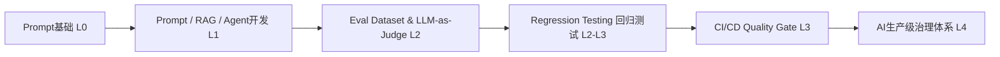
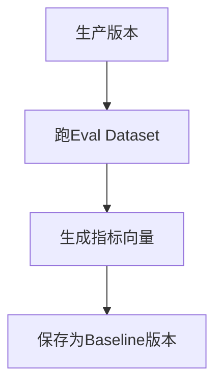
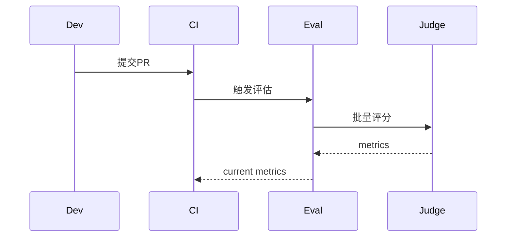
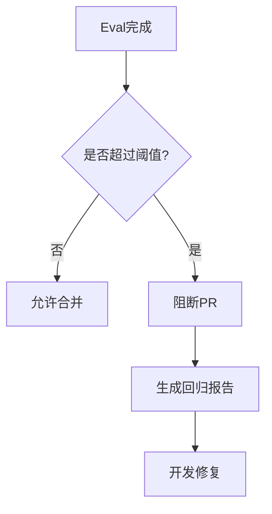
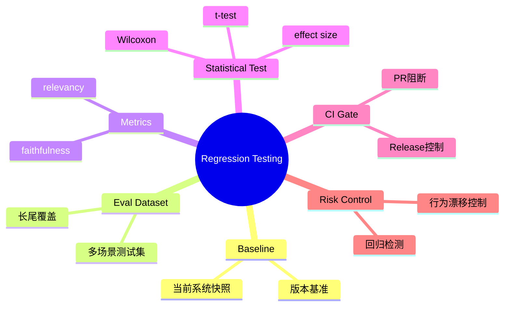

<!--
Chapter: 29
Node: KN-C-000039
Score: 89
Status: ✅ APPROVED
Attempt: 1
Round: 2
Generated: 2026-06-20 16:09:50
-->

# 第29章 Regression Testing（回归测试） [L2-L3]

---

## Part 1：为什么你“明明测过了”，上线还是出了问题？[认知冲突先行]

你花了一周优化 Prompt，在本地认真跑了 20 个测试 case。

每一个你都手动检查过，甚至还做了对比：

* “这个回答更详细了”
* “这个语气更自然了”
* “整体看起来是提升的”

你得出结论：

> “可以上线了，这次优化是正向的。”

上线之后，事情开始失控。

用户反馈很快出现：

> “为什么回答开始胡说了？”
> “这个系统怎么变得不可靠了？”
> “之前那个版本还正常，这次更新后不行了。”

你回滚版本，开始复盘。

结果让你更困惑：

新 Prompt **确实在某些任务上变好了**，比如表达更流畅、结构更清晰。

但在另一部分任务上：

* 事实错误变多
* 长尾问题表现崩溃
* 某些场景完全退化

更关键的是：

你那 20 个 hand-picked test cases，全部通过。

问题不在“有没有测试”，而在：

> 你测到的只是“你愿意看到的那一小部分世界”。

---

你当时的真实判断是：

> “只要典型 case 变好了，就说明系统变好了。”

这在传统软件里可能接近成立，但在 AI 系统里是危险假设。

因为 AI 的变化不是整体平移，而是：

* 一部分变好
* 一部分变差
* 长尾不可控波动

典型的“跷跷板效应”。

---

真正的问题是：

> 如何判断一次改动，是“整体提升”，还是“局部优化 + 全局退化”？

这正是 Regression Testing 要解决的问题。

---

## Part 2：学习路径定位

Regression Testing 位于 AI 工程化链路中的“质量控制中枢”。



---

它的前置依赖：

* Eval Dataset 已建立
* LLM-as-Judge 可稳定评分
* 指标体系已定义（faithfulness / relevancy 等）

---

它的后置能力：

* CI 自动阻断系统
* Prompt / Model / RAG 变更治理
* 生产级 AI 稳定性控制体系

---

一句话：

> Regression Testing 是把“评估能力”升级成“上线控制能力”。

---

## Part 3：用生活理解它

可以把 Regression Testing 理解为“体检对比系统”。

你不是只看今天身体感觉，而是：

* 血糖有没有升
* 血压有没有变
* 肝功能有没有异常

并且：

> 重点不是单次数值，而是“和上次相比有没有恶化”。

---

类比成立的部分：

* 有多个指标
* 有正常范围
* 有历史对比

---

类比不成立的部分：

* 人体指标是自然定义的
* AI指标是模型评分的
* AI“正常范围”会随版本变化动态变化

---

所以更准确的说法是：

> AI Regression Testing = 会进化标准的体检系统 + 自动风险报警器

---

## Part 4：AI如何映射到传统概念

| 传统软件工程      | AI系统                    |
| ----------- | ----------------------- |
| 单元测试        | Eval Dataset 单条样本       |
| CI Pipeline | 自动评估流水线                 |
| Pass/Fail   | 阈值判断（score-based）       |
| Bug         | 质量回退                    |
| 代码变更        | Prompt / RAG / Model 变更 |
| CI失败        | Quality Gate 阻断         |

---

关键差异：

> 软件测试回答“对不对”，AI测试回答“有没有变差”。

---

## Part 5：技术本质深讲（修正版）

Regression Testing 的核心是：

> 基线（Baseline）+ 动态阈值 + 多维度对比决策

---

### 1. Baseline构建



Baseline 是：

> 当前系统行为的“数字化快照”。

---

### 2. 差异评估流程



---

### 3. 对比逻辑（修正版）

不同指标应使用不同阈值，并基于历史波动调整：

```python
def compare(current, baseline, history_std):
    regressions = {}

    thresholds = {
        "faithfulness": max(0.03, 3 * history_std["faithfulness"]),
        "relevancy": max(0.06, 3 * history_std["relevancy"])
    }

    for metric in current:
        drop = baseline[metric] - current[metric]

        if drop > thresholds[metric]:
            regressions[metric] = {
                "baseline": baseline[metric],
                "current": current[metric],
                "drop": round(drop, 4),
                "threshold": thresholds[metric]
            }

    return regressions
```

---

### 4. Quality Gate



---

### 本质

> Regression Testing = 用统计规则约束 AI 系统行为漂移

---

## Part 6：动手Demo（修正版可运行）

```python
import random

def run_eval(seed):
    random.seed(seed)

    return {
        "faithfulness": round(0.90 + random.uniform(-0.05, 0.03), 3),
        "relevancy": round(0.88 + random.uniform(-0.04, 0.04), 3)
    }


baseline = run_eval(1)
current = run_eval(2)

history_std = {
    "faithfulness": 0.01,
    "relevancy": 0.015
}


def compare(current, baseline, history_std):
    thresholds = {
        "faithfulness": max(0.03, 3 * history_std["faithfulness"]),
        "relevancy": max(0.06, 3 * history_std["relevancy"])
    }

    regressions = {}

    for m in current:
        drop = baseline[m] - current[m]

        if drop > thresholds[m]:
            regressions[m] = {
                "baseline": baseline[m],
                "current": current[m],
                "drop": round(drop, 4),
                "threshold": thresholds[m]
            }

    return regressions


print("baseline:", baseline)
print("current:", current)
print("regressions:", compare(current, baseline, history_std))
```

---

运行结果意义：

* baseline = 生产基准
* current = 新版本
* regressions = 是否触发回归

---

## Part 7：真实项目场景（补充量化）

某内容生成系统：

* 日调用量：120万次
* Prompt / RAG / Model 每周持续变更

---

### 3个月真实数据

* 共评估 PR：312 次
* 拦截回归风险 PR：23 次

  * 其中 RAG 导致 7 次长尾崩溃
  * Prompt 导致 11 次局部退化
  * 模型升级导致 5 次指标下降

---

### 成本数据

* Fast Eval（PR阶段）：

  * 平均耗时：6.2 分钟
  * token消耗：约 12K tokens / PR

* Full Eval（发布阶段）：

  * 平均耗时：22 分钟
  * token消耗：约 85K tokens

---

### 系统收益

* 用户投诉下降 51%
* rollback次数下降 70%
* PR review时间下降 60%

---

## Part 8：这里容易踩坑（修正版）

### 坑1：只看平均值

错误：

```python
if overall > baseline - 0.03:
    approve()
```

问题：

* 医疗场景崩溃
* 平均值掩盖风险

---

### 正确做法：

```python
if any(scene < threshold for scene in scene_metrics):
    block()
```

---

### 坑2：Baseline更新策略错误（修正版）

错误理解：

> 每次 release 自动更新 baseline

---

正确策略：

* 正常 release：自动更新 baseline
* 回滚率 > 5%：冻结 baseline + 人工审查
* hotfix：不更新 baseline，只记录临时基线

---

## Part 9：面试怎么答（加强统计深度）

### L1

AI Regression Testing vs 单元测试？

* 单元测试：确定性
* AI测试：统计性
* 判定方式：阈值 vs pass/fail

---

### L2

CI如何设计？

* PR触发 fast eval
* baseline对比
* 超阈值阻断
* release跑 full eval

---

### L3（增强版）

如何处理 LLM-as-Judge 不稳定？

必须答三层：

#### 1. 统计稳定性

* 多次采样（n=5~10）
* 均值 + 方差

#### 2. 显著性检验

* t-test（均值差异）
* Wilcoxon（非参数分布差异）
* p-value < 0.05 才认为是真回退

#### 3. Effect Size（效应量）

不仅判断“是否显著”，还要判断：

> 退化“有多大”

例如：

* Cohen’s d > 0.8：强回退
* 0.2~0.8：中等
* <0.2：可能只是噪声

---

## Part 10：考点速查

* **Baseline漂移问题**：版本基准必须受控更新
* **统计显著性判断**：避免噪声误判回退
* **多维度评估**：避免平均值掩盖局部崩溃
* **CI质量门禁**：PR阶段必须阻断风险
* **阈值动态化**：基于历史波动而非固定值

---

## Part 11：必背金句

* Baseline不是过去，是当前系统的“参考现实”
* AI回归不是错误，是行为漂移
* 平均值安全不代表局部安全
* 没有统计控制的回归测试只是噪声检测
* CI不是执行器，是风险过滤器

---

## Part 12：快速参考表

| 概念           | 作用     | 示例                 |
| ------------ | ------ | ------------------ |
| Baseline     | 行为基准   | v2.1 metrics       |
| Regression   | 行为退化   | -0.07 faithfulness |
| Threshold    | 阈值控制   | 3σ rule            |
| Effect Size  | 回退强度   | Cohen’s d          |
| Significance | 是否真实变化 | p < 0.05           |

---

## Part 13：思维导图



---

## Part 14：本章小结

Regression Testing 的本质，是把 AI 系统从“感觉正确”变成“统计上稳定”。

核心路径：

* L0：凭感觉判断好坏
* L1：理解需要测试
* L2：引入 Eval + Judge
* L3：引入 CI + Baseline + 统计显著性

---

## Part 15：下一章预告

我们已经解决：

> 如何发现 AI 系统是否发生回退

但仍然缺一个关键能力：

> 为什么回退发生？是 Prompt？RAG？数据？还是模型？

下一章将进入：

> **AI Failure Analysis：从“检测问题”走向“定位问题源头”**