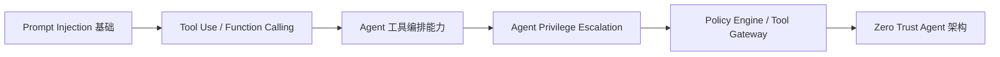
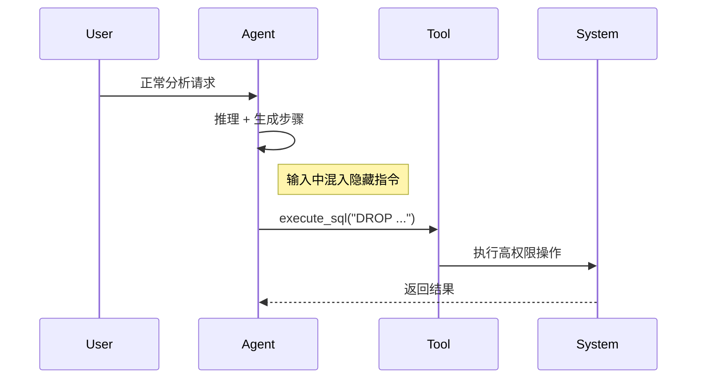
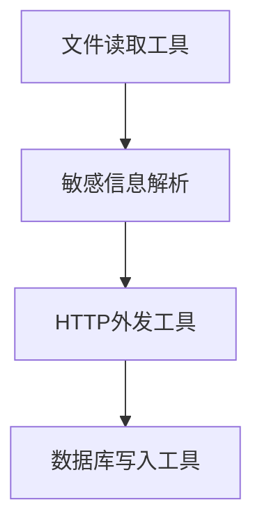
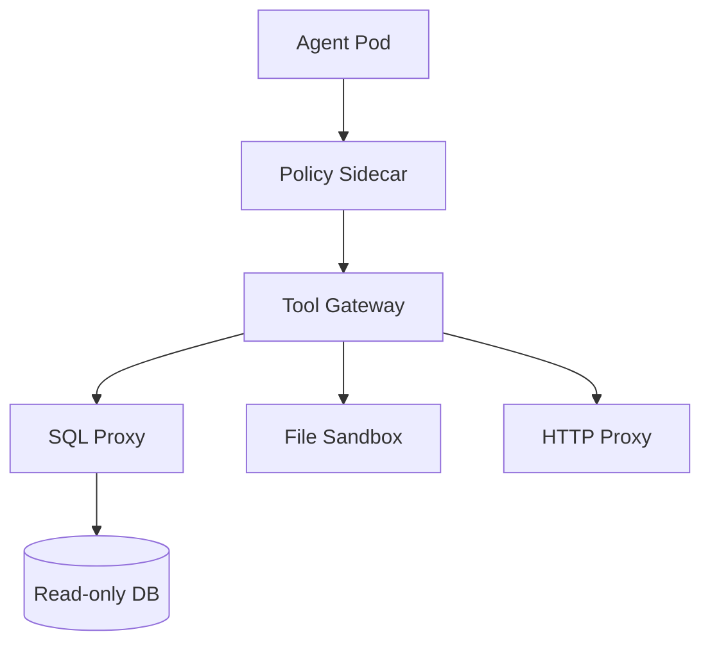
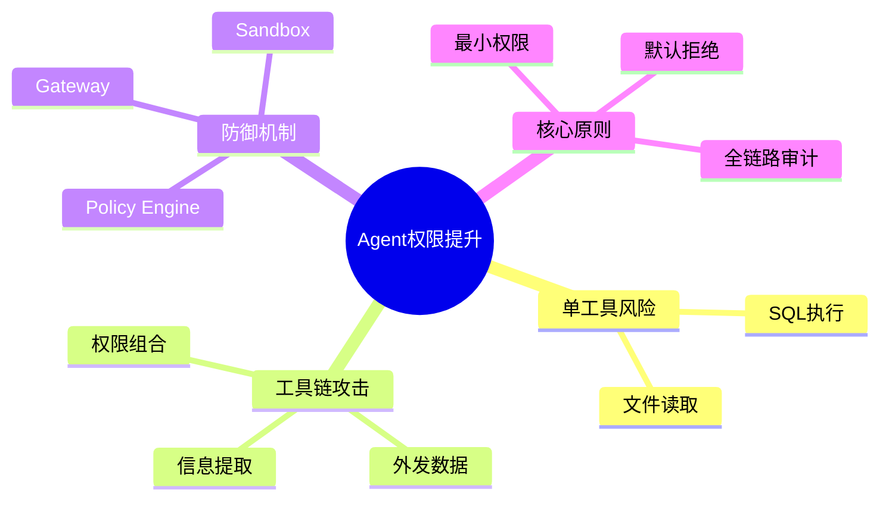

<!--
Chapter: 31
Node: KN-C-000041
Score: 88
Status: ✅ APPROVED
Attempt: 2
Round: 2
Generated: 2026-06-20 16:23:39
-->

# 第31章 Agent Privilege Escalation（Agent 权限提升） [L2-L3]

---

## Part 1：为什么要学这个？[认知冲突先行]

凌晨两点，系统告警弹出一条日志：

> Agent 执行了 DROP TABLE 操作，影响：临时分析表 sales_tmp

你第一反应是：数据库权限是不是被提升了？

但安全团队一查发现：

* 数据库账号：只读（SELECT only）
* 无 DROP 权限
* 无 DDL 权限

那这条 DROP 是怎么发生的？

进一步追踪发现真正的执行路径是：

* 用户输入：“帮我分析利润，顺便清理临时数据”
* Agent 在分析步骤中“理解”为清理需求
* 调用了 execute_sql 工具
* 工具所在服务账号拥有高权限（用于迁移任务）
* DROP 被执行

真正的冲突在这里：

数据库从来没有被攻破，
被攻破的是**“工具权限 ≠ Agent 权限”这个认知假设**。

你以为你控制的是数据库，
实际上你失控的是“Agent 可以调用什么能力”。

这一章要解决的问题只有一个：

> 当 Agent 可以调用工具时，它到底是在“执行任务”，还是在“间接拥有系统权限”？

---

## Part 2：学习路径定位

Agent 权限问题不是单点漏洞，而是“推理 + 工具 + 执行”链路的结构性问题。



### 位置说明

* L0-L1：理解 Prompt 与 LLM
* L1-L2：Tool Use（Agent 会“动手”）
* L2-L3：Agent 开始“组合工具形成权限链”
* L3+：安全架构设计

### 前置知识

* Prompt Injection 基础
* Function Calling
* 基础权限模型

### 后置知识

* Tool Gateway
* Policy-as-Code
* Agent Sandbox Runtime

---

## Part 3：用生活理解它

你雇了一个助理。

你告诉他：

> “你只能整理文件柜，不要碰财务系统。”

但你给他的不是“文件柜钥匙”，
而是：

* 文件柜钥匙
* 财务系统账号
* 门禁卡
* 服务器登录权限

问题不在助理，而在于：

他可以“合法地”组合这些权限完成任何事。

### 类比成立的部分

* Agent = 执行任务的人
* Tool = 权限入口
* Prompt Injection = 外部误导

### 类比不成立的关键点（更重要）

现实助理：

* 会犹豫
* 会怀疑
* 会拒绝明显危险请求

Agent：

* 不会“判断对错”
* 只会“完成概率最高的下一步”
* 没有安全直觉

所以安全必须外置，而不是依赖“智能”。

---

## Part 4：AI如何映射到传统概念

Agent 权限提升 = 传统权限系统 + 自动化执行器的组合风险

| 传统系统        | Agent 系统                |
| ----------- | ----------------------- |
| 用户权限控制      | Tool Permission Control |
| SQL 注入      | Prompt Injection        |
| 服务账号权限      | Tool Execution Identity |
| API Gateway | Tool Gateway            |
| 安全沙箱        | Agent Runtime Sandbox   |

关键差异：

传统系统“人控制执行”，
Agent 系统“模型参与执行路径选择”。

---

## Part 5：技术本质深讲

Agent 权限提升的本质不是“权限被突破”，而是：

> **系统错误地把“工具调用能力”等价为“权限控制能力”。**

### 三种权限提升路径

#### 1. 设计过度授权

```text
Agent 拥有：
- SQL执行
- 文件读取
- HTTP访问
- 代码执行
```

问题：

> 工具能力 > 任务需求

---

#### 2. Prompt Injection 触发执行偏移



---

#### 3. 工具链组合攻击（关键新增）

这是最容易被忽略的真实风险：

```text
Tool A：读取文件（敏感信息）
Tool B：HTTP请求（外发数据）
Tool C：SQL执行（修改数据）
```

攻击路径：

1. read_file → 获取 .env
2. parse → 提取 API key
3. http_request → 外发数据
4. execute_sql → 修改或删除记录



关键点：

> 权限提升不一定发生在单个工具，而是发生在“工具组合路径”。

---

### 核心系统错误

```text
LLM = 决策 + 执行 + 工具编排
```

正确模型：

```text
LLM = 规划器
Policy Engine = 权限判断
Executor = 安全执行器
```

---

## Part 6：动手Demo（可运行代码）

重点修复三个问题：

* SQL 多语句执行漏洞
* 前缀白名单绕过
* 缺少执行边界控制

### ❌ 错误版本（危险）

```python
import sqlite3

conn = sqlite3.connect(":memory:")
cursor = conn.cursor()

cursor.execute("CREATE TABLE users (id INT, name TEXT)")
cursor.execute("INSERT INTO users VALUES (1, 'Alice')")

def execute_sql(query):
    # ❌ 仅检查前缀（可被绕过）
    if not query.strip().upper().startswith("SELECT"):
        raise PermissionError("Blocked")

    # ❌ SQLite允许多语句执行（严重问题）
    cursor.execute(query)
    conn.commit()
    return cursor.fetchall()

# 攻击
attack = "SELECT * FROM users; DROP TABLE users"
execute_sql(attack)
```

### ❗问题总结

* `;` 多语句执行未限制
* 前缀检查可被 SQL 注释绕过
* SQLite cursor 不阻止 chain execution

---

### ✅ 正确版本（安全沙箱 + SQL解析）

```python
import sqlite3
import sqlparse

conn = sqlite3.connect(":memory:")
cursor = conn.cursor()

cursor.execute("CREATE TABLE users (id INT, name TEXT)")
cursor.execute("INSERT INTO users VALUES (1, 'Alice')")

ALLOWED_STMTS = {"SELECT"}

def is_safe_sql(query: str) -> bool:
    parsed = sqlparse.parse(query)

    for stmt in parsed:
        stmt_type = stmt.get_type().upper()

        if stmt_type not in ALLOWED_STMTS:
            return False

        # 禁止多语句
        if len(parsed) > 1:
            return False

    return True

def execute_sql(query: str):
    if not is_safe_sql(query):
        raise PermissionError("Blocked by policy engine")

    cursor.execute(query)
    return cursor.fetchall()

# 正常
print(execute_sql("SELECT * FROM users"))

# 攻击
print(execute_sql("SELECT * FROM users; DROP TABLE users"))
```

---

## Part 7：真实项目场景

企业级 Agent 系统必须拆成四层：

### 架构（Kubernetes + OPA + Gateway）



---

### Kubernetes OPA 示例（关键改进）

```rego
package agent.security

default allow = false

allow {
    input.tool == "sql"
    input.action == "SELECT"
    not contains(input.query, "DROP")
}
```

---

### Istio AuthorizationPolicy 示例

```yaml
apiVersion: security.istio.io/v1beta1
kind: AuthorizationPolicy
metadata:
  name: agent-policy
spec:
  selector:
    matchLabels:
      app: agent
  rules:
  - to:
    - operation:
        methods: ["GET"]
```

---

### 关键设计点

* Agent Pod 无数据库直连权限
* 所有工具通过 Gateway
* Policy Sidecar 强制检查
* 所有请求可审计

---

## Part 8：这里容易踩坑

### 坑1：只检查 SQL 前缀

```python
if query.startswith("SELECT"):
```

❌ 可被绕过（注释 / 多语句）

---

### 正确做法

* SQL AST 解析
* 禁止多语句
* 禁止危险关键字

---

### 坑2：认为“工具权限 = Agent权限”

错误理解：

> Agent 没有权限 → 所以安全

现实：

> Tool 有权限 → Agent 可间接拥有权限

---

### 坑3：忽略工具链攻击

单工具安全 ≠ 系统安全

攻击来自：

> 多工具组合形成权限链

---

## Part 9：面试怎么答

### L1（基础）

Agent 权限提升是什么？

完整回答：

> Agent 权限提升指的是 Agent 在执行任务过程中，通过工具调用或 Prompt Injection，间接获得超出其设计权限的能力，本质是工具权限与任务权限不一致导致的安全问题。

---

### L2（工程）

如何设计最小权限 Agent？

完整回答：

> 在项目中，我们将权限控制拆分为三层：Tool Registry 定义能力边界，Policy Engine 负责运行时校验，Tool Executor 在沙箱中执行。LLM 仅负责规划，不直接参与权限判断。所有工具调用必须经过 Gateway。

---

### L3（架构）

如何防止权限链攻击？

完整回答：

> 我们采用 Zero Trust Agent 架构，每个工具调用都经过 Policy Engine 校验，并记录上下文状态。同时禁止工具之间隐式通信，所有数据流必须显式通过 Gateway。通过这种方式阻断跨工具权限组合。

---

## Part 10：考点速查（精简版）

* **工具链攻击**：多个工具组合形成权限提升路径
* **Policy 外置化**：权限必须在 LLM 外部控制
* **SQL AST 校验**：防止多语句与注入
* **Sandbox Execution**：隔离工具执行环境
* **Zero Trust Agent**：所有输入与工具调用均不可信

---

## Part 11：必背金句

* 工具本身不是风险，工具组合才是
* 权限控制不能发生在 LLM 内部
* 没有沙箱的 Agent 等于自动化黑客
* 多工具链比单点漏洞更危险
* 默认不信任任何 Agent 输出

---

## Part 12：快速参考表（压缩版）

| 概念            | 作用    | 风险点    |
| ------------- | ----- | ------ |
| Tool Gateway  | 控制调用  | 未校验链路  |
| Policy Engine | 权限判断  | 逻辑过松   |
| SQL AST       | 防注入   | 未禁止多语句 |
| Sandbox       | 隔离执行  | 配置错误   |
| Tool Chain    | 自动化流程 | 权限叠加   |

---

## Part 13：思维导图



---

## Part 14：本章小结

Agent 权限提升的真正危险不在“单点权限”，而在“权限组合”。

当 Agent 拥有工具编排能力时，它就可能构建出超出设计预期的执行链路。

从 L0 到 L3 的理解路径是：

* L0：工具只是功能
* L1：工具有权限边界
* L2：工具可以被组合滥用
* L3：必须构建全链路安全系统

---

## Part 15：下一章预告

我们已经解决了一个问题：

> Agent 如何通过工具调用突破权限边界。

但还有一个更隐蔽的问题：

攻击者甚至不需要直接接触 Agent。

他们只需要污染：

* PDF
* 网页
* API响应
* 数据库内容

Agent 就可能“自己执行攻击”。

下一章我们将进入：

> **Indirect Prompt Injection（间接提示词注入）**

一个更危险的问题：

> 当“数据本身就是攻击者”时，你还能相信输入吗？