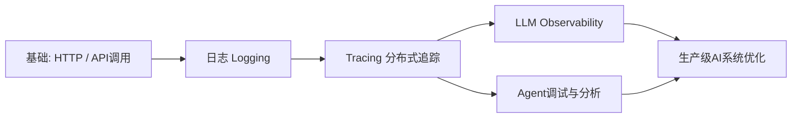
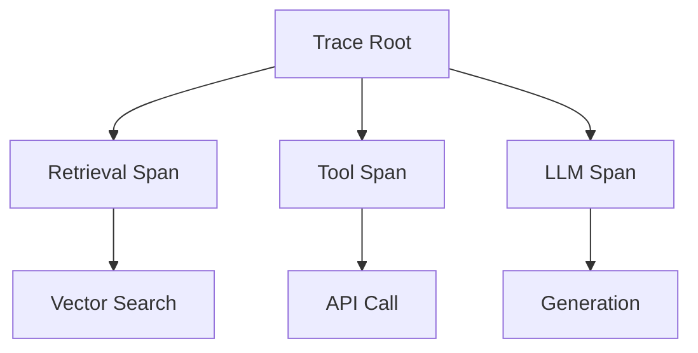
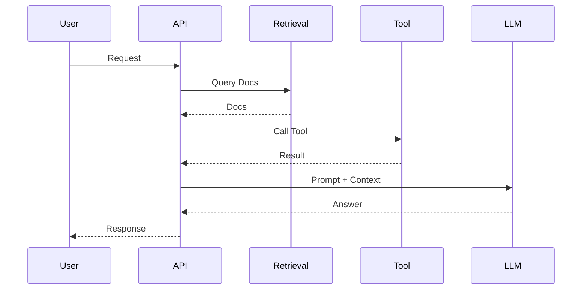
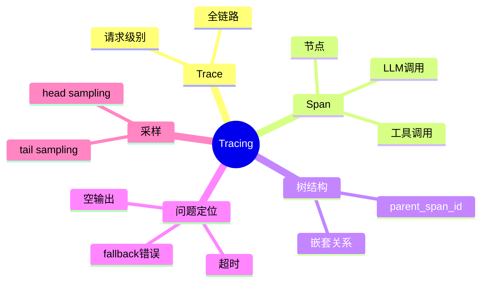

<!--
Chapter: 34
Node: KN-C-000044
Score: 88
Status: ✅ APPROVED
Attempt: 1
Round: 2
Generated: 2026-06-20 17:05:20
-->

# 第34章 Tracing（分布式追踪） [L2-L3]

## Part 1：为什么要学这个？[认知冲突先行]

你打开AI客服系统的日志页面，一排排绿色记录整齐得让人安心：

* LLM调用：成功
* 工具调用：成功
* 检索服务：成功
* 向量数据库：成功

每一条都“正常”，每一个模块都“无异常”。

但用户的反馈却很刺眼：**“回答不准确”“内容不完整”“越答越离谱”**。

于是你开始怀疑模型能力，换版本、调 Prompt、甚至重写提示词模板，但问题依然存在。

直到有一天你换了一个工具——Tracing（分布式追踪）。

你第一次看到的不是“成功”，而是一棵完整的执行树：

* 检索返回了 3 条**不相关文档**
* 其中一次工具调用返回**空结果但被当成成功处理**
* LLM 接收的 Prompt 里混入了**上一轮错误上下文**
* 最终生成结果建立在“错误输入”之上

你突然意识到一个残酷事实：

> 每一步都成功，不代表结果是对的。

真正的问题不在“失败”，而在“隐藏在成功里的错误链路”。

本章要解决的核心问题就是：

> 当 AI 系统看起来一切正常，但输出质量很差时，如何精准定位“到底是哪一步导致的错误”？

Tracing，就是这个问题的答案。

---

## Part 2：学习路径定位

Tracing 在 AI 系统中的位置，是从“黑盒调用”走向“可观测执行系统”的关键跃迁。



前置知识：

* HTTP / API 基础调用
* 日志系统概念
* 微服务基本认知

后置知识：

* LLM 可观测性体系
* Agent 调试与评估
* 生产级 AI 架构优化

---

## Part 3：用生活理解它

Tracing 就像外卖配送系统。

你看到的不只是“已送达”，而是：

* 已接单
* 商家出餐
* 骑手取餐
* 配送中
* 已送达

每一段都有时间和状态。

如果出了问题，你可以精确定位：

* 是商家出餐慢？
* 还是骑手取餐失败？
* 还是配送中丢单？

AI 系统也是一样：

* LLM调用 = 出餐环节
* 检索 = 商家备菜
* 工具调用 = 配送动作

但这个类比有边界：

* ❌ 外卖不会“生成内容”
* ❌ 外卖流程通常线性
* ❌ AI Trace 是树状结构（可并行、多分支）

因此 Tracing 本质不是记录流程，而是：

> 还原一次 AI 决策的执行树。

---

## Part 4：AI如何映射到传统概念

| 传统概念       | AI Tracing对应           |
| ---------- | ---------------------- |
| APM链路追踪    | Agent执行链路              |
| 函数调用栈      | Span                   |
| request_id | trace_id               |
| 方法调用       | LLM / Tool / Retrieval |
| 性能分析       | Token / latency / cost |
| Bug定位      | Prompt / context问题定位   |

核心差异：

传统系统关注：

> 代码是否执行成功

AI系统关注：

> 输入是否正确，以及正确输入是否导致错误输出

---

## Part 5：技术本质深讲

Tracing 的核心，是将一次 AI 请求拆解为“可回放的执行树”。

系统由两个核心结构组成：

* Trace：一次完整请求
* Span：一次具体操作

---

### Span树结构的本质（关键补充）

每个 Span 通过 `parent_span_id` 指向父节点：

* 根 Span：`parent_span_id = None`
* 子 Span：指向其直接调用者
* 所有 Span 构成一棵**有向执行树**

关键约束：

* 子 Span 时间必须嵌套在父 Span 内

  * `child.start >= parent.start`
  * `child.end <= parent.end`

这意味着：

> Tracing 不是时间线，而是“带时间约束的执行树”。



---

### 执行链路



---

### 核心字段

* trace_id：一次请求全局ID
* span_id：步骤ID
* parent_span_id：树结构关键
* input/output：输入输出
* attributes：模型、token、参数
* sampling：采样控制成本

---

## Part 6：动手Demo（可运行代码）[L2-L3]

这一版我们修复一个关键问题：**Span必须包含 trace_id / span_id / parent_span_id，并且保证错误不会被吞掉。**

同时模拟一个更真实的“树结构执行”。

```python
import time
import uuid
from contextlib import contextmanager

TRACE_STORE = {}

def new_id():
    return str(uuid.uuid4())[:8]

def start_trace(name):
    trace_id = new_id()
    TRACE_STORE[trace_id] = {
        "name": name,
        "spans": []
    }
    return trace_id

@contextmanager
def span(trace_id, name, input_data=None, parent_span_id=None):
    span_id = new_id()
    start = time.time()

    span_record = {
        "trace_id": trace_id,
        "span_id": span_id,
        "parent_span_id": parent_span_id,
        "name": name,
        "input": input_data,
        "output": None,
        "error": None,
        "start": start,
        "end": None
    }

    TRACE_STORE[trace_id]["spans"].append(span_record)

    try:
        yield span_record
    except Exception as e:
        span_record["error"] = str(e)
        raise
    finally:
        span_record["end"] = time.time()


def fake_retrieval(query):
    time.sleep(0.1)
    return ["doc1", "doc2"]

def fake_llm(prompt):
    time.sleep(0.2)
    return f"LLM: {prompt}"


trace_id = start_trace("chat")

with span(trace_id, "retrieval", "AI是什么？") as s1:
    docs = fake_retrieval("AI是什么？")
    s1["output"] = docs

with span(trace_id, "llm", "compose prompt", parent_span_id=s1["span_id"]) as s2:
    prompt = f"{docs}"
    s2["output"] = fake_llm(prompt)

print(TRACE_STORE)
```

### 你会看到：

* trace_id 串起全链路
* span_id 形成节点
* parent_span_id 形成树结构
* error 不再被吞掉

真实系统中，这一步决定：

> 你是在“调试系统”，还是“猜系统”

---

## Part 7：真实项目场景 [L2-L3]

某电商 AI 客服上线后出现问题：

* 用户投诉：回答不完整
* 监控指标：全部正常

---

### 没有 Tracing 时

工程师只能看到：

* LLM success
* Tool success
* Retrieval success

结论：

> 系统没问题

但用户持续投诉。

---

### 有 Tracing 后的定位路径

工程师在 Tracing UI 中做了如下操作：

1. 筛选 Retrieval Span：

   * 条件：`output == null`

2. 发现部分请求：

   * retrieval output 为空
   * 但 status = success

3. 回溯 parent Span：

   Retrieval → LLM Span

4. 检查 LLM 输入：

   * Prompt 中 docs = []

5. 再回溯 Retrieval：

   * Vector DB timeout
   * 但未抛异常

---

### 定位链路总结

> Trace → 空 output筛选 → 父Span回溯 → Prompt检查 → Vector DB超时

---

### 根因

* Vector DB 超时未报错
* fallback 逻辑误判 success
* 空数据进入 LLM

---

### 修复效果

* 用户投诉下降 90%
* 定位时间：7天 → 1小时

---

## Part 8：这里容易踩坑 [L2]

### 坑1：只记录 input/output

❌ 错误：

```python
{"input": "...", "output": "..."}
```

问题：

* 无 trace_id
* 无 span 层级
* 无法构建树

---

✅ 正确：

```python
{
  "trace_id": "...",
  "span_id": "...",
  "parent_span_id": "...",
  "input": "...",
  "output": "..."
}
```

---

### 坑2：错误被吞掉

❌ 错误：

```python
try:
    do_something()
except:
    pass
```

问题：

* Trace显示 success
* 实际已经失败

---

### 坑3：认为 Trace = 日志增强版

错误认知：

> Trace只是结构化日志

真实情况：

* Log：点
* Trace：树
* Span：节点

---

## Part 9：面试怎么答 [L2-L3]

### L1

Trace vs Span？

* Trace：一次请求
* Span：执行步骤
* 关系：树结构

---

### L2

如何跨服务传递 Trace？

* traceparent header
* W3C Trace Context
* OpenTelemetry inject/extract

---

### L3（修正强化版）

Tail Sampling vs Head Sampling：

* Head Sampling：

  * 请求开始时决定是否记录
  * 优点：简单省资源
  * 缺点：无法识别异常请求

* Tail Sampling：

  * 请求结束后决定是否保留
  * 可根据：

    * error
    * latency > p95
  * 优点：异常100%保留

组合策略：

* Head：1%~10%
* Tail：错误/慢请求100%

---

## Part 10：考点速查 [L2]

* Trace = 全链路
* Span = 节点
* parent_span_id = 树结构核心
* Trace不是日志，是执行树
* Tail sampling用于异常捕捉

---

## Part 11：必背金句 [L2]

* 成功不代表正确，只代表没报错
* Trace是执行树，不是调用列表
* 没有 parent_span_id，就没有结构
* 空输出比错误更危险
* AI调试是在“回放现实”

---

## Part 12：快速参考表 [L2]

| 概念             | 作用   | 示例     |
| -------------- | ---- | ------ |
| trace_id       | 请求ID | a1b2c3 |
| span_id        | 节点ID | x9y8z7 |
| parent_span_id | 树结构  | a1b2   |
| input          | 输入   | prompt |
| output         | 输出   | result |

---

## Part 13：思维导图 [L2-L3]



---

## Part 14：本章小结 [L2]

Tracing 的本质是把 AI 系统变成一棵“可回放执行树”。

它让系统从不可解释变成可追踪：

* 输入 → 中间步骤 → 输出
* 每一步都有证据链

成长路径：

* L0：看日志
* L1：看调用
* L2：看链路
* L3：定位根因

---

## Part 15：下一章预告 [L2]

Tracing 解决的是：

> “发生了什么”

但新的问题是：

> “发生的这些，算好吗？”

下一章我们进入：

> LLM Observability（可观测性）

从“看见过程”走向“评估质量”。