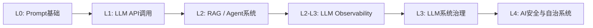
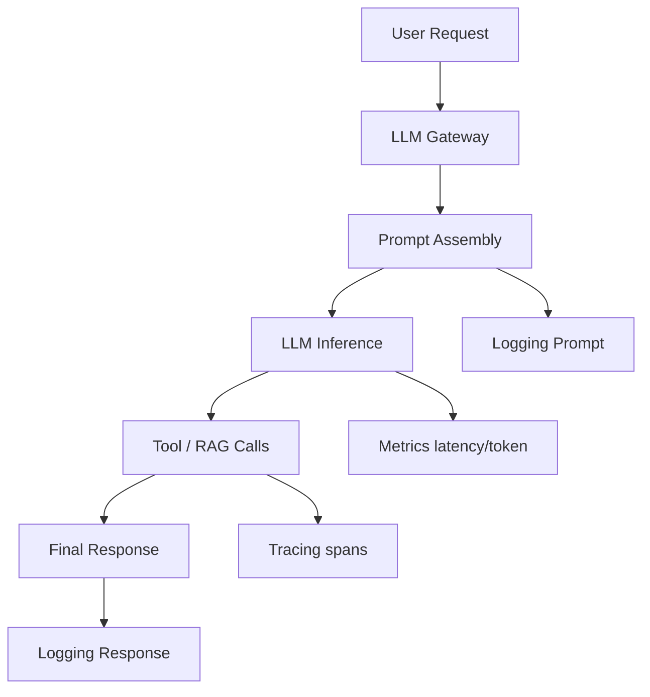
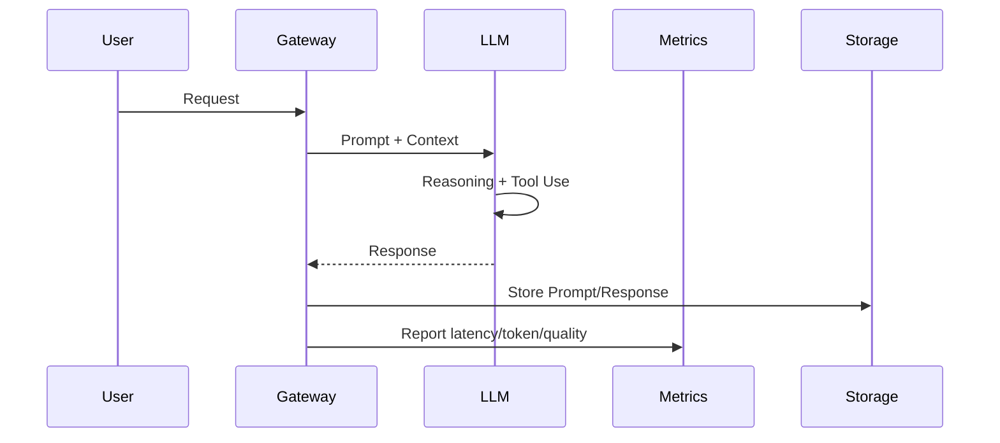
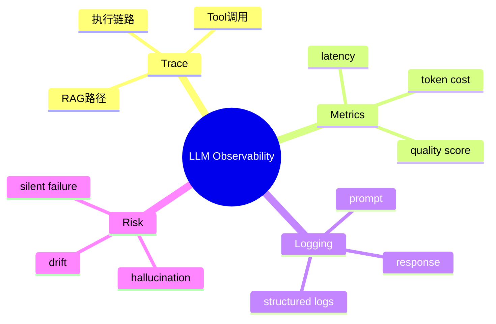

<!--
Chapter: 35
Node: KN-C-000046
Score: 91
Status: ✅ APPROVED
Attempt: 1
Round: 2
Generated: 2026-06-20 17:11:58
-->

# 第35章 LLM Observability（LLM 可观测性） [L2-L3]

---

## Part 1：为什么要学这个？[认知冲突先行]

你把 AI 客服系统上线后，盯着监控面板看了一整天。

CPU 正常、内存正常、QPS 正常、延迟稳定在 800ms，错误率 0%。

从任何传统意义上看，这都是一个“健康系统”。

直到产品经理走过来，只说了一句话：

> “用户说 AI 在胡说八道，而且越来越严重。”

你第一反应是怀疑产品反馈有误。

于是你检查 APM：

* 没有 5xx
* 没有超时
* 没有异常堆栈

日志也很干净，全是 HTTP 200。

但问题就卡在这里：

**系统没有任何“错误”，但用户体验正在崩溃。**

你突然意识到一个反直觉事实：

传统监控只回答一个问题——系统有没有活着。
但 LLM 系统真正的问题是——**它可能活着，但在持续生成错误答案。**

更隐蔽的是，这种错误不会触发报警。

它不会 crash，不会 timeout，不会 throw exception。

它只是“悄悄变笨”。

这就是 LLM 系统最危险的地方。

本章要解决的核心问题是：

> 如何让一个“看起来完全正常但实际上已经失控”的 LLM 系统，变得可观测、可追踪、可评估？

---

## Part 2：学习路径定位

LLM Observability 位于“从能用 LLM → 能管 LLM → 能治理 LLM”的关键分界点。



### L2 vs L3 的关键差异（必须理解）

* L2：能“看见系统发生了什么”（基础监控 + trace）
* L3：能“解释为什么发生，并能影响系统行为”（闭环治理）

换句话说：

* L2 = 可观测（Observe）
* L3 = 可控制（Control）

---

前置知识：

* Prompt Engineering
* LLM API 调用
* 基础日志 / APM 概念

后置知识：

* LLM Evaluation（自动评估体系）
* AI Guardrails（安全控制）
* Agent Debugging 与优化

---

## Part 3：用生活理解它

把 LLM 系统想象成一个外卖骑手网络。

传统监控像是在看：

* 有没有送达
* 有没有超时
* 有没有差评

但 LLM Observability 做的是更深一层的事情：

* 骑手有没有绕远路（Token浪费）
* 路上每一步发生了什么（Trace）
* 他是怎么决定路线的（推理过程）
* 他有没有“胡乱选择路线”（概率生成偏差）

换句话说：

**传统监控只看结果，LLM 可观测性看“决策过程”。**

### 类比边界（重要）

这个类比的关键限制在于：

外卖骑手的路径是确定的，而 LLM 的输出是概率生成的。

更准确地说：

* 骑手：路径 = 固定选择
* LLM：路径 = 从多个候选 token 路径中采样

因此 LLM 可观测性不仅要记录“发生了什么”，还必须记录：

> “当时有哪些候选路径，以及为什么选择了这个输出”

这就是传统系统没有的问题：

* 传统系统 = 单路径执行
* LLM系统 = 概率树采样执行

---

## Part 4：AI如何映射到传统概念

| 传统后端系统     | LLM系统                            |
| ---------- | -------------------------------- |
| APM        | LLM latency / token monitoring   |
| Error Rate | failure + hallucination rate     |
| Log        | Prompt / Response structured log |
| Trace      | LLM调用链 + tool chain              |
| SLA        | 输出质量SLA（quality SLA）             |
| Debug      | trace replay + prompt analysis   |

核心变化只有一个：

> 从“确定性系统监控” → “概率生成系统监控”

---

## Part 5：技术本质深讲

LLM Observability 的本质是把黑盒生成过程拆成三层信号：

* Trace：过程发生了什么
* Metrics：整体表现如何
* Logging：具体内容是什么



---

### 三大支柱解释

#### 1. Tracing（链路追踪）

记录完整执行路径：

* Prompt构建
* 多轮LLM调用
* 工具调用
* RAG检索路径

每一步都是 span。

---

#### 2. Metrics（指标）

回答三个问题：

* 快不快（latency）
* 贵不贵（token cost）
* 好不好（quality score）

典型指标：

* latency_p95
* tokens_per_request
* hallucination_rate
* faithfulness_score

---

#### 3. Logging（日志）

记录可回放数据：

* Prompt
* Completion
* Tool input/output
* 用户反馈

---

### 核心执行链路



---

### 本质总结

LLM Observability 解决的问题不是“监控系统”，而是：

> 如何让概率生成系统变得工程可解释。

---

## Part 6：动手Demo（可运行代码）

修正关键问题：

* 固定随机种子，保证测试可复现
* 避免不可控 sleep 影响稳定性

```python
import time
import json
import uuid
import random

# 固定随机种子，保证可重复测试
random.seed(42)

def fake_llm_call(prompt):
    start = time.time()

    input_tokens = len(prompt.split())

    # 模拟推理延迟（可复现）
    simulated_latency = 0.15 + random.random() * 0.05
    time.sleep(simulated_latency)

    response = "Paris" if "France" in prompt else "Unknown"

    output_tokens = len(response.split())
    latency = time.time() - start

    return {
        "response": response,
        "latency": round(latency, 4),
        "input_tokens": input_tokens,
        "output_tokens": output_tokens
    }

def trace_request(prompt):
    trace_id = str(uuid.uuid4())

    log = {
        "trace_id": trace_id,
        "prompt": prompt,
        "timestamp": time.time()
    }

    result = fake_llm_call(prompt)
    log.update(result)

    log["faithfulness_score"] = 0.9 if "France" in prompt else 0.4

    print(json.dumps(log, ensure_ascii=False, indent=2))
    return log

trace_request("What is the capital of France?")
trace_request("Tell me about Mars")
```

运行结果特征：

* trace_id 可追踪
* latency 可复现
* prompt/response 完整记录
* 质量评分可量化

---

## Part 7：真实项目场景

### 1）AI客服系统

问题：

* 没有报错，但用户投诉激增

Observability 设计：

* trace = 用户会话级
* prompt version tracking
* feedback loop（点赞/踩）

---

### 2）RAG知识系统

关键问题：

* 错误来自检索，而不是模型

trace结构：

* query
* retrieval docs
* rerank结果
* generation

---

### 3）Agent系统

问题：

* 多工具调用难复现

解决：

* tool call 全链路 trace
* replay execution graph

---

## Part 8：这里容易踩坑

### 坑1：没有Trace只有日志

错误：

```python
print(prompt)
print(response)
```

问题：

* 无法还原执行路径
* 多LLM调用无法关联

正确：

```python
log = {
    "trace_id": trace_id,
    "span": "llm_call",
    "prompt": prompt,
    "response": response
}
```

---

### 坑2：只看错误率

问题：

* LLM“变笨”不会触发 error

必须补充：

* faithfulness
* relevance
* hallucination rate

---

### 坑3：采样策略不合理（已修正）

生产建议：

* error=1（异常流量）：100%采样
* 正常流量：1%采样
* 按 trace_id 绑定采样链路
* tail-based sampling 保留异常路径

---

## Part 9：面试怎么答

### L1

LLM Observability 是什么？

答：

* trace + metric + log
* 关注质量而非错误

---

### L2（补强指标定义）

如何设计监控？

关键指标：

* latency_p95
* token_cost
* hallucination_rate

quality score 定义：

> quality = 0.4 * faithfulness + 0.3 * correctness + 0.3 * relevance

---

### L3

用户说 AI 胡说，但系统正常怎么办？

步骤：

* 检查 trace（prompt / retrieval / model）
* 对比版本差异
* 分析 quality score
* 回溯 hallucination point

---

## Part 10：考点速查

* 三大支柱（Trace/Metrics/Log）
* 质量比错误更重要
* Token = 成本指标
* Trace = 调试核心
* LLM是概率系统，不是确定系统

---

## Part 11：必背金句

* 没有 trace 的 LLM 等于黑盒
* 200 OK 不代表回答正确
* LLM的问题不是错误，而是“错误得很自信”
* 可观测性是理解生成过程，而不是结果
* 成本也是质量的一部分

---

## Part 12：快速参考表

| 概念                 | 作用    | 示例              |
| ------------------ | ----- | --------------- |
| Trace              | 执行路径  | trace_id        |
| Metrics            | 系统状态  | latency/token   |
| Logging            | 内容记录  | prompt/response |
| Quality Score      | 输出质量  | 0.85            |
| Hallucination Rate | 错误生成率 | 12%             |

---

## Part 13：思维导图



---

## Part 14：本章小结

LLM Observability 的核心是让黑盒变透明。
它通过 trace、metrics、logging 三层结构，把生成过程工程化。

成长路径：

* L0：只会调用模型
* L1：会看日志
* L2：会监控指标
* L3：能解释并控制系统行为

---

## Part 15：下一章预告

你已经能“看见 LLM 在做什么”。

但下一步问题是：

> 如何判断它“做得好不好”？

下一章将进入：

**LLM Evaluation（自动评估体系）**