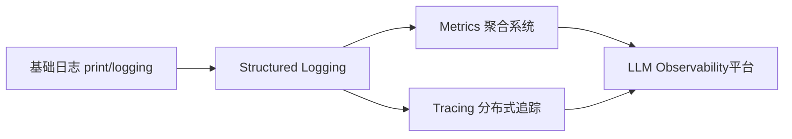
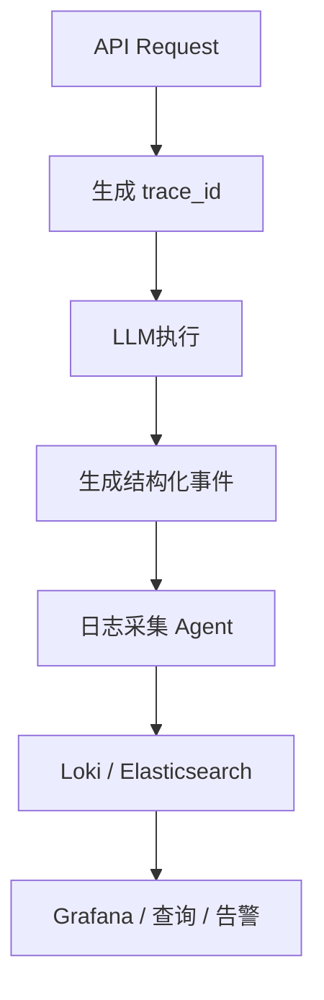
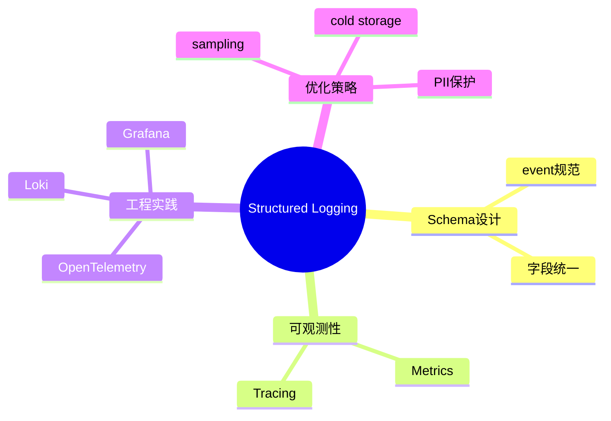

<!--
Chapter: 36
Node: KN-C-000047
Score: 91
Status: ✅ APPROVED
Attempt: 2
Round: 2
Generated: 2026-06-20 17:19:31
-->

# 第36章 Structured Logging（结构化日志） [L1-L2]

---

## Part 1：为什么要学这个？[认知冲突先行]

你被 OnCall 叫醒，因为线上出现大量 “LLM 调用超时” 告警。

你熟练地 SSH 到机器，打开日志：

> “[2026-06-19 10:23:45] INFO: GPT-4o 调用失败，超时了，重试中...”

你开始 grep，想找出“Token 输入超过 4000 的请求”。

但很快你卡住了。

因为日志长这样：

* 有的写“Token: 1234”
* 有的写“使用了 1.2k tokens”
* 有的甚至只写“调用成功”

这些日志看起来都“正确”，但拼在一起就变成灾难。

两小时后，你终于勉强拼出一部分统计结果。

这时 Leader 问了一个更关键的问题：

> “今天不同模型的成本占比是多少？哪个模型在亏钱？”

你停住了。

不是系统没记录，而是——记录方式让问题无法被回答。

---

很多工程师的默认认知是：

> 日志 = 给人看的运行信息

比如：

```python
LLM 调用成功，耗时 2.3 秒，消耗 1234 Token
```

看起来没问题，但它隐藏了一个致命假设：

> 只要人能读懂，机器也应该能分析。

现实恰好相反：

> AI 系统里，日志首先是给“机器”消费的结构化数据源，而不是文本。

---

### 核心问题

本章要解决的是：

> 如何让日志从“不可计算的文本”变成“可查询的数据资产”。

---

## Part 2：学习路径定位

Structured Logging 在 AI 可观测性体系中，是最底层的数据结构基础。

它不是“记录工具”，而是：

> Metrics 与 Tracing 的共同数据来源。

### 学习路径图



### 为什么它是“数据底座”

Metrics 的本质：

* 从日志字段聚合出来（sum / avg / p95）

Tracing 的本质：

* 用 trace_id 把日志拼成链路

如果日志不是结构化的：

* Metrics 无法聚合
* Tracing 无法关联

因此 Structured Logging 是“上层系统的原材料”。

---

### 前置与后置关系

* 前置：基础 logging（文本日志）
* 当前：结构化日志（字段化事件记录）
* 后置：Tracing / Metrics / Observability

---

## Part 3：用生活理解它

可以把日志系统想象成两种工作方式：

### 第一种：微信群语音汇报

> “这个接口今天有点慢，大概两秒左右，有点贵，大概一美金。”

听得懂，但无法统计。

---

### 第二种：Excel 标准填报

| 时间    | 模型     | Token | 成本    |
| ----- | ------ | ----- | ----- |
| 10:23 | GPT-4o | 1234  | 0.012 |

你可以直接做：

* 筛选 Token > 2000
* 统计 GPT-4o 成本
* 分析成本趋势

---

### 类比边界

这个类比容易误导的点：

* 日志不是人工填表，而是系统自动生成
* Schema 必须统一，否则 Excel 也会失效
* 不是“格式更漂亮”，而是“可计算性更强”

---

## Part 4：AI如何映射到传统概念

如果你来自传统后端，可以这样映射：

| AI 概念              | 传统系统对应                    |
| ------------------ | ------------------------- |
| Structured Logging | 事件表 / audit log 表         |
| event              | 业务事件类型                    |
| trace_id           | request_id                |
| cost_usd           | 业务成本字段                    |
| token_count        | CPU / QPS / usage metrics |
| JSON log           | 行式日志记录                    |

---

### 示例对比

传统日志：

```text
User login success at 10:23
```

结构化日志：

```json
{
  "event": "user_login",
  "user_id": "u123",
  "timestamp": "2026-06-19T10:23:00Z"
}
```

本质变化：

> 从“文本记录系统” → “事件数据系统”

---

## Part 5：技术本质深讲

Structured Logging 的核心不是 JSON，而是：

> **围绕查询设计字段结构（Query-driven Logging Schema）**

---

### 为什么必须这些字段？

一个 LLM 系统的核心问题通常是：

* 谁最贵？
* 哪个模型最慢？
* 哪个请求失败最多？
* cost 是否异常增长？

这些问题对应 SQL：

```sql
SELECT model, SUM(cost_usd)
FROM logs
WHERE timestamp > NOW() - INTERVAL 1 HOUR
GROUP BY model;
```

---

### 为什么这个查询成立？

因为日志必须包含：

* model → 分组维度
* cost_usd → 聚合指标
* timestamp → 时间窗口

---

### 标准日志结构（工程级）

```json
{
  "timestamp": "2026-06-19T10:23:45.123Z",
  "event": "llm_call",
  "trace_id": "abc123",
  "model": "gpt-4o",
  "status": "success",
  "latency_ms": 2300,
  "prompt_tokens": 800,
  "completion_tokens": 434,
  "cost_usd": 0.012
}
```

---

### 日志流转架构



---

### OpenTelemetry 对齐（关键补充）

在现代系统中，Structured Logging 通常遵循：

> OpenTelemetry Logs Semantic Conventions

例如：

* trace_id
* span_id
* service.name
* event.name

这使日志可以直接和 Tracing 对齐。

---

## Part 6：动手Demo（工程级可运行版本）

这个版本不是“打印 JSON”，而是模拟一个真实可观测日志管道：

* token 估算改为 tokenizer 模型（近似）
* 增加采样机制
* 增加日志批处理
* 输出结构符合 OpenTelemetry 风格

```python
import time
import uuid
import json
import random
import hashlib
from collections import deque

# -----------------------------
# 简单 token 估算（非字符长度）
# -----------------------------
def estimate_tokens(text: str) -> int:
    return max(1, len(text.split()) * 1.3)

# -----------------------------
# 日志缓冲区（模拟 batch export）
# -----------------------------
LOG_BUFFER = deque(maxlen=100)

# -----------------------------
# 日志采样策略
# error = 100%
# success = 30%
# -----------------------------
def should_sample(status: str) -> bool:
    if status == "error":
        return True
    return random.random() < 0.3

# -----------------------------
# Structured Logger
# -----------------------------
def log_event(event: dict):
    LOG_BUFFER.append(event)

    # 模拟批量 flush
    if len(LOG_BUFFER) >= 10:
        flush_logs()

def flush_logs():
    batch = list(LOG_BUFFER)
    LOG_BUFFER.clear()

    # 模拟写入 Loki / ES
    for item in batch:
        print(json.dumps(item, ensure_ascii=False))


# -----------------------------
# LLM 调用模拟
# -----------------------------
def llm_call(user_input: str, model: str = "gpt-4o"):
    trace_id = str(uuid.uuid4())

    latency = random.uniform(0.2, 2.5)
    time.sleep(latency)

    prompt_tokens = int(estimate_tokens(user_input))
    completion_tokens = random.randint(50, 400)

    cost_table = {
        "gpt-4o": 0.00001,
        "claude": 0.000008,
        "gemini": 0.000006
    }

    cost = (prompt_tokens + completion_tokens) * cost_table.get(model, 0.00001)

    status = "success" if random.random() > 0.1 else "error"

    log = {
        "timestamp": time.strftime("%Y-%m-%dT%H:%M:%SZ"),
        "event": "llm_call",
        "trace_id": trace_id,
        "service": "llm-router",
        "model": model,
        "latency_ms": int(latency * 1000),
        "prompt_tokens": prompt_tokens,
        "completion_tokens": completion_tokens,
        "cost_usd": round(cost, 6),
        "status": status
    }

    # 关键：统一 schema + 采样
    if should_sample(status):
        log_event(log)


# -----------------------------
# 批量模拟
# -----------------------------
for i in range(20):
    llm_call(f"query number {i}", model=random.choice(["gpt-4o", "claude", "gemini"]))
```

---

### 运行后你会看到：

* JSON logs 按 batch 输出
* 成功请求被采样
* error 请求全部保留
* cost / latency / model 可直接分析

---

## Part 7：真实项目场景

### 场景：多模型路由系统事故

系统负责选择：

* GPT-4o（高质量高成本）
* Claude（中等）
* Gemini（低成本）

---

### 故障

某天：

* GPT-4o 调用比例暴涨
* 成本增加 3 倍
* 用户延迟上升

---

### 如果没有结构化日志

只能看到：

```text
Selected model GPT-4o for request abc123
```

然后：

* grep
* Python 脚本
* CSV 分析
* 手工统计

耗时 2 小时

---

### 使用 Structured Logging + Grafana

Loki 查询：

```logql
{event="llm_call", model="gpt-4o"} | json | count_over_time(1h)
```

---

### 查低置信度路由

```logql
{event="model_routing"} | json | confidence < 0.3
```

---

### 关键发现

* 80% GPT-4o 请求 confidence < 0.4
* 路由策略异常
* fallback 失效

---

### Grafana 面板（描述）

* Panel 1：模型调用占比（pie）
* Panel 2：cost_usd 时间趋势
* Panel 3：confidence 分布直方图
* Panel 4：latency p95 曲线

---

## Part 8：这里容易踩坑

### 坑1：统一 Schema 没有治理机制

错误：

* 各团队自定义 event 名称
* 没有 registry

正确：

* event registry（枚举中心）
* OpenTelemetry semantic conventions

---

### 坑2：字段漂移

❌

* duration
* time_ms
* latency
* elapsed_time

来源：

* 不同服务历史遗留

解决：

* log schema contract（契约）

---

### 坑3：日志 = 全量记录

错误认知：

> 所有日志都必须保存

正确：

* success → sampling
* error → full retention
* high cost → full retention

---

## Part 9：面试怎么答

### L1

Structured Logging 是什么？

* JSON化日志
* 便于机器查询

---

### L2

为什么它是 observability 基础？

* Metrics = 聚合日志
* Tracing = trace_id 关联日志

---

### L3（增强版）

如何设计可扩展日志系统？

关键点：

* OpenTelemetry schema
* sampling policy：

  * error = 100%
  * success = 10–30%
* 冷热分层：

  * hot: Loki / ES
  * cold: S3
* PII：

  * prompt → hash + cold storage

---

## Part 10：考点速查

* **Structured Logging = 可查询数据日志**
* **trace_id 是链路核心**
* **event 必须枚举**
* **cost_usd 是 AI 核心指标**
* **Logs 是 Metrics 和 Tracing 的基础**

---

## Part 11：必背金句

* 日志不是记录，是数据建模
* Structured Logging 是 AI 可观测性的地基
* 没有 schema 的日志等于噪音
* trace_id 是 AI 系统的“血管”
* cost_usd 是最重要的业务指标之一

---

## Part 12：快速参考表

| 概念         | 作用   | 示例       |
| ---------- | ---- | -------- |
| trace_id   | 链路关联 | uuid     |
| event      | 事件分类 | llm_call |
| cost_usd   | 成本分析 | 0.012    |
| latency_ms | 性能分析 | 2300     |
| model      | 路由分析 | gpt-4o   |

---

## Part 13：思维导图



---

## Part 14：本章小结

Structured Logging 的本质是：

> 把日志从“文本记录”升级为“结构化事件数据”。

它让系统具备三种能力：

* 可查询（Queryable）
* 可聚合（Aggregatable）
* 可关联（Traceable）

在 LLM 系统中，它是连接 Metrics 和 Tracing 的核心底座。

---

## Part 15：下一章预告

我们已经把日志变成了“数据”。

但问题升级了：

* 单条日志是事实
* 但一次请求是“链式过程”

当一个请求跨越：

* Router
* LLM
* Tool
* Retrieval

你还能用日志看出发生了什么吗？

下一章：

> Tracing（分布式追踪）——让 AI 系统从“日志碎片”变成“可回放执行链路”。