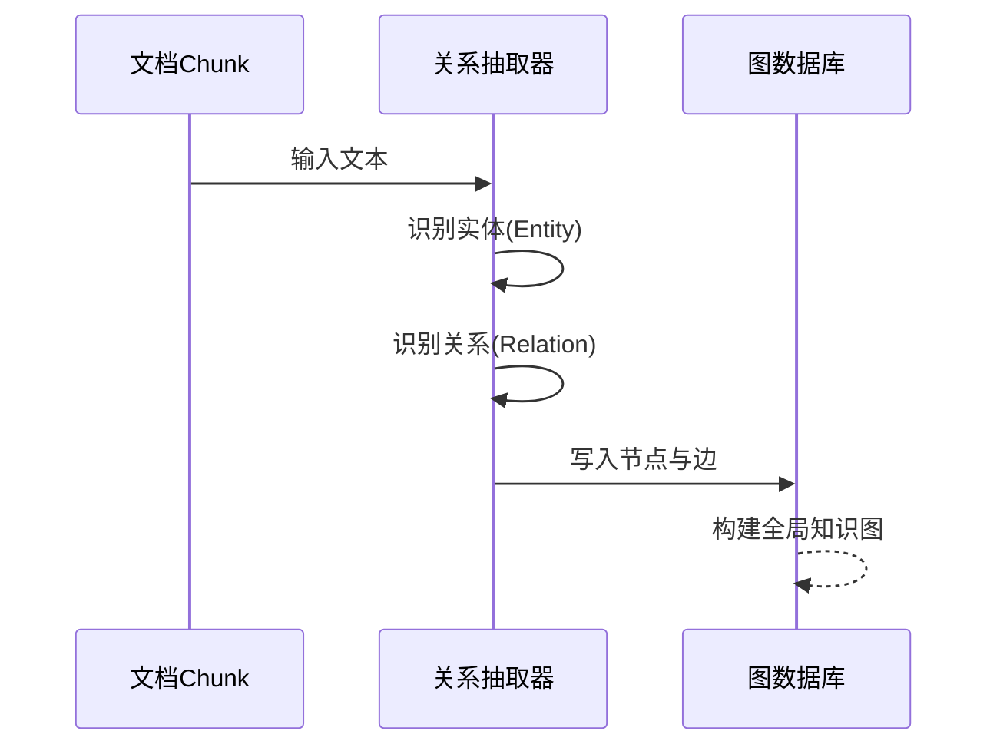
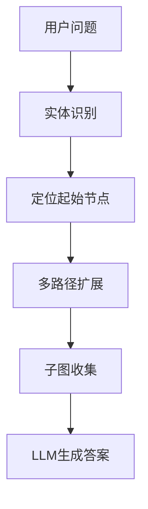
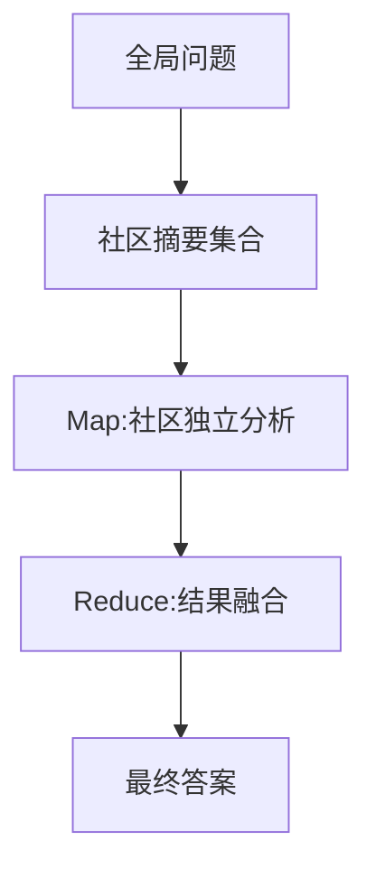
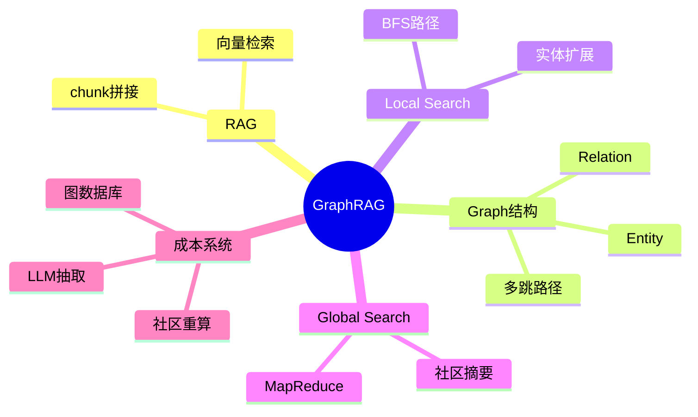

<!--
Chapter: 37
Node: KN-C-000050
Score: 88
Status: ✅ APPROVED
Attempt: 2
Round: 2
Generated: 2026-06-20 17:45:55
-->

# 第37章 GraphRAG [L3-L4]

## Part 1：为什么要学这个？[认知冲突先行]

你第一次在公司内部知识库里接到一个看似普通的问题：

“订单系统最近接口延迟，是哪个服务链路引起的？”

你打开传统 RAG，很自信地输入关键词：

* order-service
* latency
* timeout

系统返回三段文档：

* Order Service 的 API 说明
* Redis 缓存配置
* Gateway 超时设置

每一段都“看起来相关”，但拼在一起毫无结论。

你开始换一种问法。

产品经理又抛来第二个问题：

“订单系统 A 的设计，是不是参考了支付系统 B 的架构？”

你愣了一下。

因为系统给出的结果依旧是：

* A 的文档
* B 的文档

但没有任何一条信息能告诉你：

> A 和 B 之间有没有“设计借鉴关系”

甚至更现实的工程问题是：

* 微服务调用链跨 5 个服务
* 日志分散在不同系统
* 文档只描述“各自服务”，从不描述“关系”

传统 RAG 在这里彻底失效，不是因为它不会“找信息”，而是：

> 它根本不知道“关系”才是问题本体。

你开始意识到一个更本质的断层：

RAG 擅长回答：

* “是什么”

但工程问题真正关心的是：

* “谁调用了谁”
* “谁影响了谁”
* “路径是怎么走的”

GraphRAG 要解决的，就是这件事：

> 把“散落在文档里的孤立事实”，变成“可遍历的关系网络”。

---

## Part 2：学习路径定位

GraphRAG 位于“语义检索 → 结构推理”的中间跃迁层，它的核心变化不是模型，而是信息组织方式。


从传统 RAG 迁移到 GraphRAG 时，不只是“换架构”，还需要额外成本：

* 数据建模时间（实体/关系设计）
* LLM抽取成本（chunk级调用）
* 图存储成本（Neo4j/图数据库）
* 社区划分与摘要计算成本

前置知识：

* Embedding 与向量检索
* RAG 基本流程
* Prompt 与上下文拼接

后置能力：

* 多跳关系推理能力
* 图结构建模能力
* 全局知识压缩与分析能力

---

## Part 3：用生活理解它

传统 RAG 像你在“搜索引擎 + 书库”里查资料：

* 输入关键词
* 返回相关片段
* 每条信息彼此孤立

GraphRAG 更像一张“城市交通地图”：

* 不只是看到地点（实体）
* 还能看到道路（关系）
* 甚至能看到“怎么从A走到B”

但要注意一个关键误区：

GraphRAG 并不是实时导航系统。

它的地图通常是：

* 每小时 / 每天 / 每次批处理更新一次
* 离线构建后缓存使用

所以它更像：

> “定期更新的交通地图 + 路径规划系统”，而不是实时路况系统。

⚠️ 类比边界：

* 图谱不是实时变化的，而是周期性重建
* 关系是从文本中“抽取出来的概率结构”，不是绝对事实
* 路径存在 ≠ 现实一定成立（可能是抽取错误）

---

## Part 4：AI如何映射到传统概念

GraphRAG不是替代SQL，而是扩展“数据关系表达能力”。

| 传统系统语义      | GraphRAG语义映射              |
| ----------- | ------------------------- |
| SQL WHERE过滤 | 向量相似度过滤                   |
| SQL JOIN    | 图结构多跳关系遍历                 |
| GROUP BY聚合  | Community Summary（社区摘要）   |
| ETL数据建模     | LLM实体/关系抽取                |
| 索引扫描        | 图节点扩展（Neighbor Traversal） |
| BI分析        | Global Search（社区级推理）      |

关键理解：

> SQL解决“结构化确定查询”，GraphRAG解决“结构未知但关系存在的问题”。

---

## Part 5：技术本质深讲

GraphRAG的本质不是“更聪明的检索”，而是：

> 把语义空间重构为“可遍历关系空间”

系统由三层构成：

---

### 1）离线构建：实体与关系抽取



核心对象：

* Entity：服务 / 人 / 项目 / 概念
* Relation：调用 / 依赖 / 参考 / 属于

---

### 2）社区发现（结构压缩）

GraphRAG不会直接用“全图”，而是先做压缩：

* Leiden / Louvain 图聚类算法
* 将大图拆成语义社区

每个社区生成：

> Community Summary（结构化语义摘要）

作用：

* 将“图”压缩成“主题单元”
* 降低在线推理成本

---

### 3）在线推理阶段

#### Local Search（多跳推理）



特点：

* 适合局部关系问题（A依赖谁）

---

#### Global Search（全局分析）



特点：

* 类似 MapReduce
* 不依赖单个文档 chunk

---

## Part 6：动手Demo（可运行代码）

这个版本修复关键问题：

* 不做“跨层错误剪枝”
* 支持多路径合法存在
* 不丢弃合理2-hop路径
* 允许路径重复但控制层级语义

```python
import networkx as nx
from collections import defaultdict, deque

# 构建图
G = nx.Graph()

edges = [
    ("A项目", "B项目", "参考"),
    ("A项目", "张三", "负责人"),
    ("B项目", "李四", "负责人"),
    ("张三", "字节跳动", "就职"),
    ("李四", "字节跳动", "就职"),
    ("B项目", "C项目", "扩展关系"),
]

for s, t, r in edges:
    G.add_edge(s, t, relation=r)


def graph_search(start_node, max_hops=2):
    """
    GraphRAG风格多跳搜索（修复版）：
    - 不做全局硬visited剪枝
    - 允许不同路径重复访问节点
    - 保留路径语义多样性
    """

    queue = deque([(start_node, 0, [start_node])])
    results = []

    while queue:
        node, hop, path = queue.popleft()

        if hop == max_hops:
            continue

        for neighbor in G.neighbors(node):
            edge = G.get_edge_data(node, neighbor)

            new_path = path + [neighbor]

            results.append({
                "path": new_path,
                "relation": edge["relation"],
                "hop": hop + 1
            })

            queue.append((neighbor, hop + 1, new_path))

    return results


paths = graph_search("A项目", max_hops=2)

for p in paths:
    print(p)
```

运行结果你会看到：

* A→B→C
* A→张三→字节跳动
* A→B→李四

关键点：

> GraphRAG需要的是“路径空间”，不是“去重后的节点集合”。

---

## Part 7：真实项目场景

### 场景：家电售后故障诊断系统（5000条工单）

数据来源：

* 维修工单（5000+）
* 产品手册
* 用户反馈日志

---

### baseline（传统RAG）

系统结构：

* ES + 向量检索
* Top-k chunk 拼接

问题：

* 只能看到“单点描述”
* 无法形成因果链

评估方式：

* 人工标注 Top-3 命中率
* 样本：5000条工单

结果：

* 62% 命中率

但注意：

> 该结果已剔除“完全无法回答类问题”，仅在“可回答集合”中评估。

---

### GraphRAG方案

构建图结构：

* 压缩机 → 制冷能力
* 风量系统 → 滤网状态
* 室外温度 → 负载变化
* 控制板 → 运行模式

---

### 结果

在同一评测口径（Top-3命中率）下：

* GraphRAG：89%
* 基线RAG：62%

提升来源：

* 多跳路径恢复因果链
* 社区摘要补全全局信息
* 跨文档关系建模

---

## Part 8：这里容易踩坑

### 坑1：误用GraphRAG覆盖所有问题

```python
if query:
    use_graphRAG()
```

问题：

* FAQ类问题成本极高
* 图遍历无意义

正确做法：

```python
def is_multi_hop(query):
    entities = extract_entities(query)
    relation_words = ["影响", "依赖", "参考", "调用"]

    return len(entities) >= 3 or any(
        w in query for w in relation_words
    )

if is_multi_hop(query):
    use_graphRAG()
else:
    use_RAG()
```

---

### 坑2：社区划分误区

错误：

* 固定 resolution 参数

正确：

* 小粒度（FAQ）
* 中粒度（功能模块）
* 大粒度（业务域分析）

---

### 坑3：忽略增量更新成本

GraphRAG不是增量友好系统：

* 新数据 → 可能改变社区结构
* 社区变化 → 需要重新摘要

---

## Part 9：面试怎么答

### L1

GraphRAG vs RAG？

* RAG：语义相似检索
* GraphRAG：结构关系推理

---

### L2

Local vs Global？

* Local：多跳路径推理
* Global：社区级信息聚合

---

### L3（成本完整拆解）

GraphRAG成本构成：

1. 实体/关系抽取成本

   * 每个chunk调用LLM
   * 成本 ≈ embedding的20倍

2. 图数据库成本

   * Neo4j按节点/关系计费
   * 大规模图成本显著上升

3. 社区摘要成本

   * 每个社区需要LLM总结

   * Token消耗大

   * 小规模（<10万节点）：≈10倍RAG成本

   * 大规模（>100万节点）：可能>30倍

4. 增量更新成本

   * 图结构变化触发重算
   * 可通过“社区摘要缓存”优化

---

## Part 10：考点速查

* GraphRAG = 结构化知识增强RAG
* Local Search = 多跳路径推理
* Global Search = 社区MapReduce
* 社区发现 = 图压缩机制
* 成本来源 = LLM + 图结构 + 重算

---

## Part 11：必背金句

* RAG解决“相似性”，GraphRAG解决“关系性”
* 知识不在文本，而在连接
* 没有图，就没有跨文档推理
* Local是点，Global是面
* 图越大，推理越强，成本越高

---

## Part 12：快速参考表

| 概念            | 作用   | 示例    |
| ------------- | ---- | ----- |
| Entity        | 图节点  | A项目   |
| Relation      | 图边   | 依赖    |
| Local Search  | 多跳推理 | A→B→C |
| Global Search | 全局分析 | 趋势总结  |
| Community     | 子图结构 | 业务域   |

---

## Part 13：思维导图



---

## Part 14：本章小结

GraphRAG的核心不是“更好的检索”，而是“结构化推理能力”。

它带来三个层级跃迁：

* L0：RAG是信息检索
* L1：RAG是语义匹配
* L2：GraphRAG是关系建模
* L3：GraphRAG是跨文档推理系统

**决策规则：**

* 单点事实 → RAG
* 多跳问题 → GraphRAG Local
* 全局分析 → GraphRAG Global
* 成本过高 → 混合检索替代

---

## Part 15：下一章预告

GraphRAG 解决了”关系推理”，但随着 AI 系统越来越复杂，单个 Agent 已经无法独立完成所有任务。

新的问题出现了：

* 多个 Agent 如何互相通信？
* Agent 之间如何标准化传递任务和结果？
* A2A 协议解决了什么工程问题？

下一章将进入：

> **A2A Protocol（Agent-to-Agent 协议）** — 多智能体协作的通信标准与工程实现