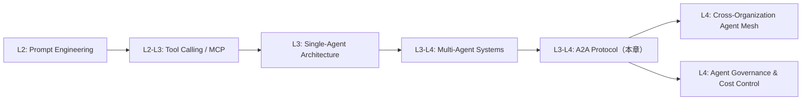
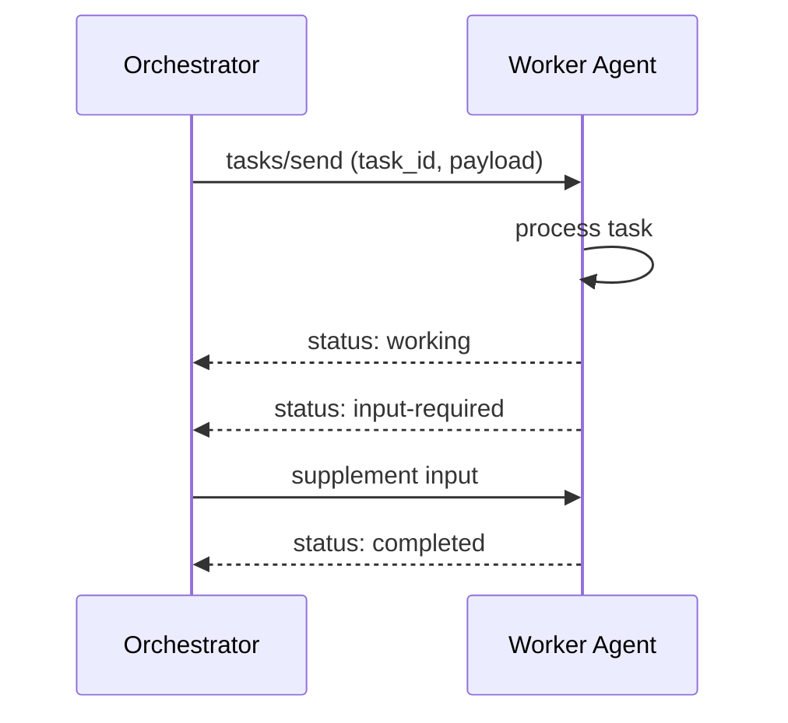
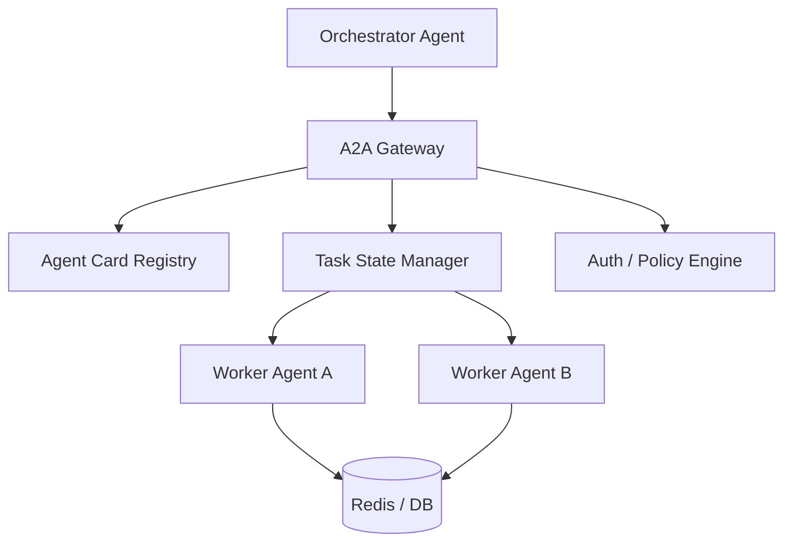
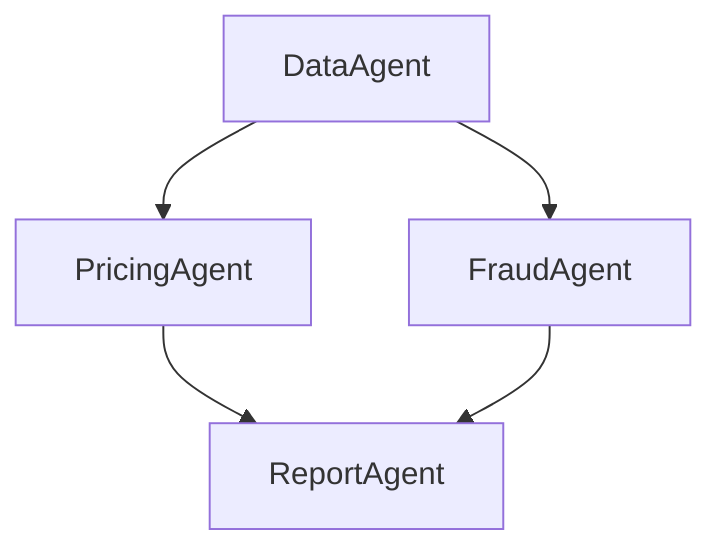
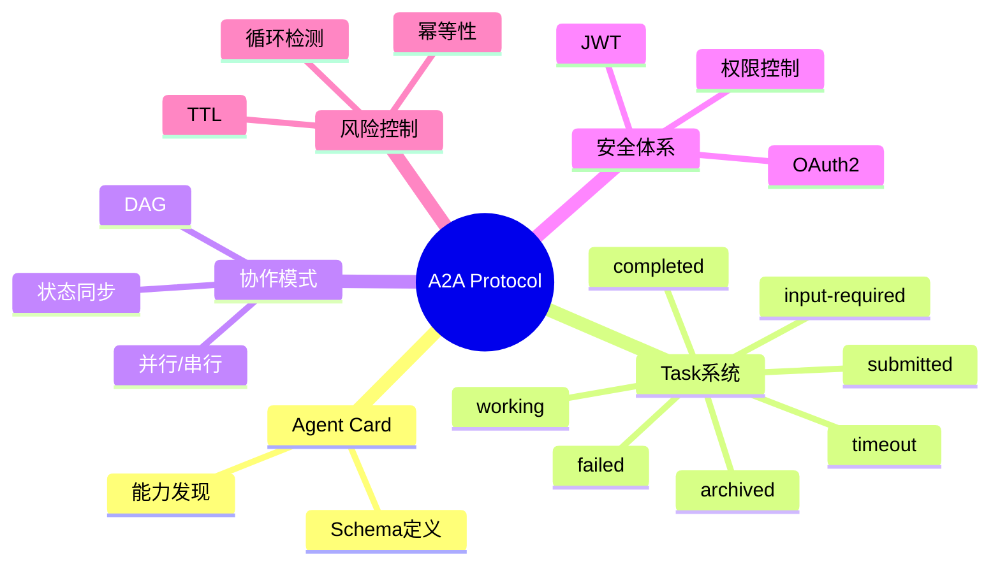

<!--
Chapter: 38
Node: KN-C-000051
Score: 88
Status: ✅ APPROVED
Attempt: 1
Round: 2
Generated: 2026-06-20 17:51:03
-->

# 第38章 A2A Protocol（Agent-to-Agent 协议） [L3-L4]

---

## Part 1：为什么要学这个？[认知冲突先行]

你负责的多智能体系统上线一个月后，AWS账单从预期的日均 $127 暴涨到 $18,400。更离谱的是，系统没有明显流量增长，也没有用户暴增。

你顺着日志往回查，发现两个 Agent 在“协作”。

一个说：“你信息不够，我没法分析。”
另一个说：“那你先补全信息我才能开始分析。”
前一个再回：“你先分析我才知道缺什么。”

它们就这样互相“礼貌地拒绝”，循环了 11 天。

更致命的是：每一轮都是一次 LLM 调用，每一次都是计费。

你原本以为 A2A Protocol 只是“Agent 之间发 HTTP 请求”，和微服务 RPC 没区别。

但现实狠狠打脸——A2A 不是 API 调用，而是一个**可能持续数小时甚至数天的有状态协作系统**。问题根本不在“能不能通信”，而在：

* 如何防止 Agent 之间陷入循环协作？
* 如何让跨组织 Agent 持续共享任务状态？
* 如何控制长任务的成本爆炸？
* 如何让不同框架的 Agent 互相理解能力边界？

本章要解决的核心问题是：

> 为什么 A2A 不是“Agent 发 HTTP 请求”，而是一套“跨组织 AI 协作操作系统”？

---

## Part 2：学习路径定位

A2A Protocol 在 AI Native 架构中的位置，本质是“Agent 社会化通信层”。



前置知识：

* LLM Tool Calling
* 多 Agent 协作基础
* HTTP / JSON-RPC 基础

后置知识：

* Agent Mesh 架构
* 跨组织 AI 协作系统
* Agent Governance（治理体系）

---

## Part 3：用生活理解它

A2A 就像多个公司一起做一个长期项目。

不是“发个消息问一下”，而是完整的项目协作体系：

* 先确认对方公司能做什么（能力发现）
* 再把任务外包出去（任务委托）
* 项目需要持续汇报进展（状态同步）
* 合同约束责任边界（认证与权限）

如果缺少这些机制，就会变成：

> 两个公司互相问需求，最后谁也不交付。

但这个类比有明显边界：

* ❌ Agent 每一步都是计费的（人类不会按句收费）
* ❌ Agent 会陷入无限循环（人类通常不会）
* ❌ 人类有社会信用兜底（Agent 必须显式设计 Audit Trail）
* ❌ 人类可能“赖账”，但会被追责（Agent 必须内建责任链与日志）

---

## Part 4：AI如何映射到传统概念

A2A 可以理解为“分布式系统 + AI 协作协议”的结合层。

| 传统系统概念            | A2A 对应概念                                 |
| ----------------- | ---------------------------------------- |
| 微服务 API Gateway   | Agent Endpoint                           |
| OpenAPI / Swagger | Agent Card                               |
| RPC 调用            | Task Delegation                          |
| Request/Response  | Stateful Task Lifecycle                  |
| Service Discovery | Capability Discovery                     |
| Circuit Breaker   | Loop Detection / Cost Control            |
| Message Queue     | Async Task State Sync                    |
| OAuth2 / JWT      | Agent Identity & Cross-Organization Auth |

关键差异：

传统系统：无状态调用
A2A 系统：有状态认知协作 + 长任务执行

---

## Part 5：技术本质深讲

A2A 的本质不是“通信协议”，而是一个三层系统：

> 能力发现 + 任务状态机 + 安全认证体系

---

### 1. Agent Card（能力发现）

```json
GET /.well-known/agent.json
{
  "name": "DataAnalysisAgent",
  "capabilities": ["analyze_dataset", "trend_detection"],
  "endpoint": "/a2a",
  "auth": "oauth2"
}
```

核心作用：

* 描述能力
* 定义输入输出
* 支持动态发现

---

### 2. Task 状态机（核心）


stateDiagram-v2
  [*] --> submitted
  submitted --> working
  working --> input_required
  input_required --> working
  working --> completed
  working --> failed
  working --> timeout
  timeout --> archived
  completed --> archived
  failed --> archived


关键设计点：

* Task 是长期对象（不是 request）
* 支持暂停与恢复
* 必须 TTL 控制生命周期
* timeout 防止资源泄漏
* archived 防止存储无限增长

---

### 3. A2A 通信协议



---

### 4. 系统架构



---

### 5. 认证与权限（关键补强）

A2A 在跨组织环境中必须解决：

* Agent 身份验证
* 跨域权限传递
* Task 级访问控制

典型方案：

* OAuth2 / JWT
* mTLS（服务间认证）
* scoped token（任务级权限）

---

### 6. 本质总结

A2A 不是 API，而是：

> “可持续运行的分布式认知任务系统”

它必须同时解决：

* 长时间执行
* 状态一致性
* 成本控制
* 权限边界
* 协作防循环

---

## Part 6：动手Demo（可运行代码）

下面是修复后的生产级思路版本（避免阻塞 + 状态不污染查询接口）。

```python
from fastapi import FastAPI
from pydantic import BaseModel
import uuid
import asyncio
import aioredis

app = FastAPI()

# 生产环境必须使用 Redis / DB（不能用内存）
redis = aioredis.from_url("redis://localhost", decode_responses=True)

class TaskRequest(BaseModel):
    text: str

@app.get("/.well-known/agent.json")
def agent_card():
    return {
        "name": "AnalysisAgent",
        "capabilities": ["analyze_text"],
        "endpoint": "/a2a"
    }

@app.post("/a2a")
async def create_task(req: TaskRequest):
    task_id = str(uuid.uuid4())

    await redis.hset(task_id, mapping={
        "status": "submitted",
        "input": req.text
    })

    # 异步调度任务（避免阻塞请求）
    asyncio.create_task(process_task(task_id))

    return {"task_id": task_id}


async def process_task(task_id: str):
    await redis.hset(task_id, "status", "working")

    # 模拟异步计算（非阻塞）
    await asyncio.sleep(1)

    data = await redis.hget(task_id, "input")
    result = f"分析结果: {data[:10]}..."

    await redis.hset(task_id, mapping={
        "status": "completed",
        "result": result
    })


@app.get("/task/{task_id}")
async def get_task(task_id: str):
    # ❗ 查询接口只读，不修改状态
    return await redis.hgetall(task_id)
```

---

## Part 7：真实项目场景

电商系统中的 A2A DAG 协作：

### Agent 分工

* DataAgent：用户行为分析
* PricingAgent：价格策略
* FraudAgent：风控检测
* ReportAgent：生成报告

---

### DAG 依赖关系



---

### 并行 vs 串行

* DataAgent → PricingAgent（串行依赖）
* DataAgent → FraudAgent（可并行）
* ReportAgent（汇总阶段）

---

### 架构原则

* DAG 优先，而不是链式调用
* 无状态 Agent
* 状态集中存储
* 所有任务可重放
* 并行优先提升吞吐

---

## Part 8：这里容易踩坑

### ❌ 坑1：查询接口修改状态

错误：

```python
if task["status"] == "working":
    task["status"] = "completed"
```

问题：

* 查询污染状态机
* 不可预测行为
* 难以调试

---

### ❌ 坑2：阻塞事件循环

错误：

```python
time.sleep(1)
```

问题：

* FastAPI 卡死
* 并发能力下降

正确：

```python
await asyncio.sleep(1)
```

---

### ❌ 坑3：忽略循环依赖

A → B → A 无限调用

解决：

* depth limit
* repeated pattern detection
* circuit breaker

---

## Part 9：面试怎么答

### L1

A2A 是 Agent-to-Agent 通信协议，用于跨 Agent 协作，核心是 Task + 状态机 + Agent Card。

---

### L2

关键点：

* Agent Card 做能力发现
* Task 管理生命周期
* 状态支持长时间执行

---

### L3

设计重点：

* DAG 调度（不是链式调用）
* Redis 状态存储
* Kafka 异步通信
* OAuth2 / JWT 做跨组织认证
* 循环检测 + TTL + timeout + archived

---

## Part 10：考点速查（增强版）

* **A2A 是跨组织 Agent 协作协议**
* **Task 是核心状态载体**
* **Agent Card 用于能力发现**
* **input-required 支持人机/Agent协同**
* **必须有循环检测机制**
* **必须支持幂等性（防重复执行）**
* **TTL + timeout + archived 防止状态爆炸**

---

## Part 11：必背金句

* A2A 不是 API，是协作系统
* Agent Card 决定能力边界
* Task 决定执行生命周期
* 没有状态机的 A2A 是伪系统
* 所有循环最终都会变成成本问题

---

## Part 12：快速参考表

| 概念             | 作用     | 示例                      |
| -------------- | ------ | ----------------------- |
| Agent Card     | 能力发现   | /.well-known/agent.json |
| Task           | 生命周期管理 | task_id                 |
| submitted      | 初始状态   | 已创建                     |
| working        | 执行中    | 处理中                     |
| input-required | 等待输入   | 人机/Agent补充              |
| completed      | 完成     | 输出结果                    |
| timeout        | 超时终止   | TTL触发                   |
| archived       | 归档状态   | 存储清理                    |
| OAuth2/JWT     | 身份认证   | 跨组织安全                   |

---

## Part 13：思维导图



---

## Part 14：本章小结

A2A 的核心是一个跨组织的任务协作系统，通过 Agent Card 实现能力发现，通过 Task 状态机管理长任务生命周期，通过 DAG 模型提升多 Agent 协作效率。

从 L0 到 L3 的演进路径是：从单 Agent 工具调用，到多 Agent 协作，再到跨组织 Agent 网络。

---

## Part 15：下一章预告

我们已经解决了 Agent 如何协作的问题，但还没有解决一个更关键的问题：

> 当 Agent 可以自由调用其他 Agent 时，如何控制它不“越权行动”或“失控扩散”？

下一章将进入：

**Agent Governance & Safety（Agent 治理与安全控制）**

你将看到：

* Agent 权限系统设计
* A2A 的安全边界控制
* AI 系统的“宪法级约束机制”