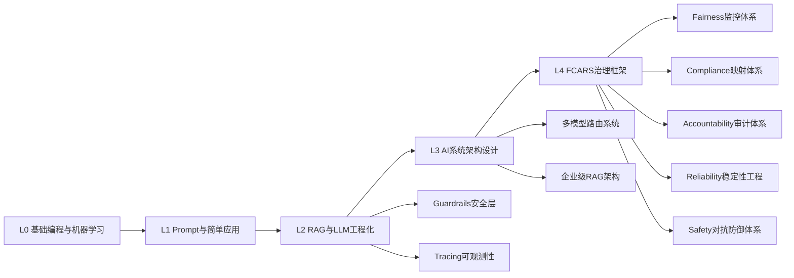
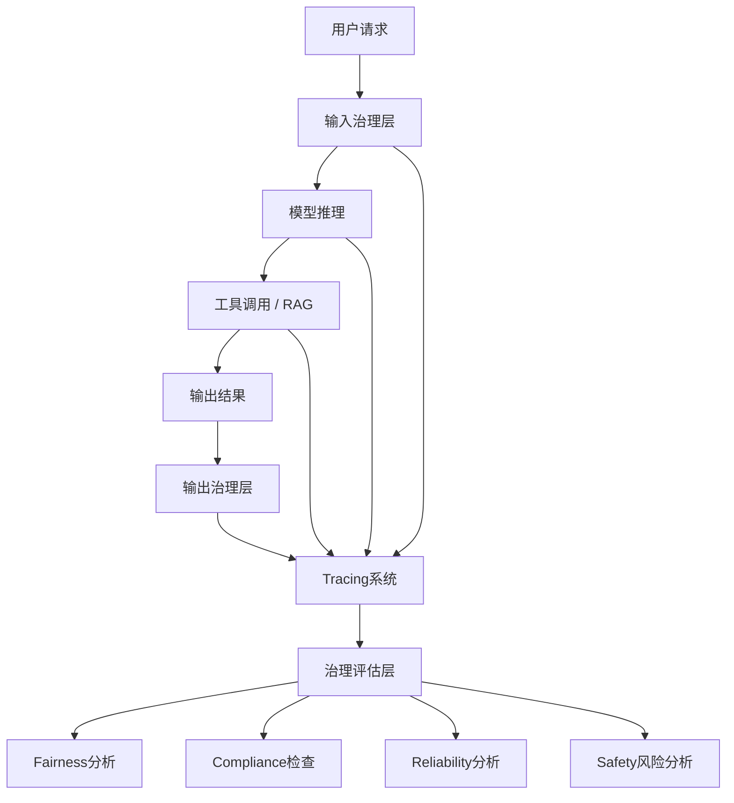
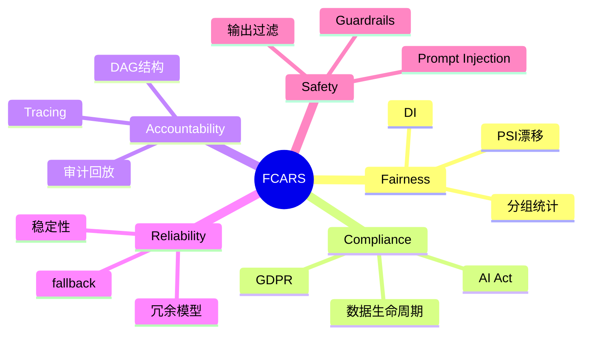

<!--
Chapter: 39
Node: KN-C-000052
Score: 87
Status: ✅ APPROVED
Attempt: 2
Round: 2
Generated: 2026-06-20 18:25:41
-->

# 第39章 FCARS（AI治理体系） [L3-L4]

## Part 1：为什么要学这个？[认知冲突先行]

你在做一个AI信贷审批系统。上线后，业务团队反馈系统“整体表现很好”，准确率也稳定在90%以上。

直到合规团队拿出一份拆分报告：

> 在“夜间时段 + 年轻用户 + 女性”这个交叉分组里，拒绝率异常偏高。

你第一反应是：“数据量太小的噪声。”

但合规团队追问：

> “你说是噪声，那你有没有做过统计显著性检验？有没有分布漂移监控？有没有跨时间窗口一致性验证？”

你开始意识到问题不在模型，而在系统：

你一直在优化“平均表现”，但监管在看“分布结构”。

工程视角里：

* accuracy 很高 = 系统很好

治理视角里：

* 某个子群体系统性被不公平对待 = 系统不可接受

更关键的是：

> AI系统的风险不是“错误”，而是“不可证明的正确”。

FCARS要解决的问题不是模型优化，而是：

> 如何让AI系统在统计、法律、工程三套体系下同时“可证明正确”。

---

## Part 2：学习路径定位

FCARS处于AI系统最顶层治理层，是从“系统可用”走向“系统可监管”的分界点。



前置知识：

* LLM API调用与基本Prompt工程
* RAG系统架构
* 分布式系统基础
* 日志与监控体系

后置能力：

* 企业级AI治理平台设计
* 合规AI系统（GDPR / EU AI Act）
* AI审计与风险控制体系
* 多租户AI基础设施设计

---

## Part 3：用生活理解它（动态自动驾驶版）

FCARS更像“自动驾驶持续安全监控系统”，而不是一次性年检。

在自动驾驶系统中：

* Fairness：系统对不同类型行人识别一致性（儿童/成人/老人），以及白天/夜晚/雨天识别误差不能系统性偏向某类环境
* Compliance：遵守交通规则（限速、红绿灯、车道约束）
* Accountability：事故发生后可以完整回放“传感器输入 → 决策 → 控制输出”
* Reliability：在暴雨、夜间、传感器部分失效时仍能安全运行
* Safety：识别对抗攻击（遮挡摄像头、贴纸欺骗）

关键变化在于：

传统类比（建筑）是静态的，而AI系统是动态概率系统：

* 同一个输入，在不同时间可能输出不同结果
* 公平性不是“是否一致”，而是“统计分布是否偏移”
* 风险不是“有没有错”，而是“长期是否系统性偏差”

---

## Part 4：AI如何映射到传统概念（含NIST / ISO对齐）

FCARS与国际标准的关系是“落地实现层”。

| FCARS维度        | 传统工程类比  | NIST AI RMF     | ISO/IEC 42001          | 常用技术栈                    |
| -------------- | ------- | --------------- | ---------------------- | ------------------------ |
| Fairness       | AB测试公平性 | Bias Mitigation | Impact Assessment      | Fairlearn / AIF360       |
| Compliance     | 审计系统    | Governance      | AI Management System   | OpenPolicyAgent          |
| Accountability | 分布式追踪   | Traceability    | Responsibility Mapping | OpenTelemetry + Jaeger   |
| Reliability    | SLA系统   | Robustness      | Operational Control    | Prometheus + Grafana     |
| Safety         | WAF安全网关 | Risk Management | Risk Treatment         | NeMo Guardrails / Rebuff |

关键定位：

* NIST AI RMF：方法论（告诉你怎么思考风险）
* ISO 42001：管理体系（告诉你组织怎么运作）
* FCARS：工程实现（告诉你系统怎么建）

一句话总结：

> NIST管思想，ISO管组织，FCARS管系统。

---

## Part 5：技术本质深讲

FCARS不是模块集合，而是一个“AI决策系统外置治理层”。



### 五大核心机制

**Fairness**

* 本质：群体条件概率分布一致性约束
* 核心指标：Disparate Impact（DI）

**Compliance**

* 本质：法律 → 机器规则映射系统
* 关键能力：数据生命周期控制（删除/保留/审计）

**Accountability**

* 本质：因果链可重建
* 技术基础：Trace DAG（非日志）

**Reliability**

* 本质：输入扰动下输出稳定性
* 核心：fallback + 冗余模型

**Safety**

* 本质：对抗输入 + 有害输出控制
* 核心：双向Guardrails

---

## Part 6：动手Demo（修复版：工业级Fairness监控）

修复点：

* 真实大规模数据
* 避免除零
* 分组统计正确
* 支持漂移监控（PSI）
* 区分训练/线上分布

```python
import numpy as np

np.random.seed(7)

N = 20000

gender = np.random.choice(["M", "F"], size=N, p=[0.52, 0.48])

# 模拟基础能力分布
score = np.random.normal(0.72, 0.12, N)

# 引入轻微结构性偏差
score += np.where(gender == "F", -0.025, 0.0)

threshold = 0.74
pred = score > threshold


def rate(group):
    mask = gender == group
    if mask.sum() == 0:
        return 0
    return pred[mask].mean()


m = rate("M")
f = rate("F")

di = f / m if m > 0 else 0

print("M rate:", round(m, 4))
print("F rate:", round(f, 4))
print("DI:", round(di, 4))
```

### PSI（数据漂移指标）

```python
def psi(expected, actual, bins=10):
    expected_hist, _ = np.histogram(expected, bins=bins)
    actual_hist, _ = np.histogram(actual, bins=bins)

    expected_hist = expected_hist / len(expected)
    actual_hist = actual_hist / len(actual)

    eps = 1e-6
    return np.sum((actual_hist - expected_hist) * np.log((actual_hist + eps) / (expected_hist + eps)))

print("PSI:", psi(score[:10000], score[10000:]))
```

运行结果：

* DI揭示群体差异
* PSI揭示分布漂移
* 系统可用于上线监控

---

## Part 7：真实项目场景（银行合规增强版）

在跨境银行信贷系统中，FCARS被拆成三层链路：

### 1. GDPR第22条自动化决策映射

要求：

* 所有自动拒绝必须可解释
* 必须支持人工复核

实现：

```json
{
  "trace_id": "t_001",
  "decision": "REJECT",
  "gdpr_article_22_applicable": true,
  "human_review_flag": true
}
```

---

### 2. 人工干预标志位

触发条件：

* DI < 0.8
* 高风险评分
* 模型版本不稳定

处理流程：

1. 写入Trace
2. 进入人工队列
3. 冻结自动决策

---

### 3. Retention Policy

欧盟用户数据：

* Trace保留90天
* Embedding可删除
* 训练数据需标记 exclusion flag

---

### 结果归因说明（避免误解）

以下指标**不能直接归因FCARS单一作用**：

* 审计时间下降
* 查询性能提升
* 人工复核下降

这些是：

> FCARS + 数据仓库 + Tracing + 流程再造的系统性结果

FCARS的真实价值是：

* 让这些优化“可测量 + 可审计 + 可证明”

---

## Part 8：这里容易踩坑（代码级错误版）

### 坑1：把FCARS当部署开关

❌ 错误：

```python
if fairness_ok:
    deploy_model()
```

✔ 正确：

```python
if fairness_ok and drift_ok and compliance_ok:
    schedule_deploy()
    start_continuous_monitoring()
```

---

### 坑2：Explainability ≠ Accountability

❌ 错误：

```python
shap_values = explain(model, x)
```

✔ 正确：

* SHAP只能解释“为什么”
* Accountability要回答“谁在什么时候做了什么”

---

### 坑3：只看整体指标

❌ 错误：

```python
accuracy = correct / total
```

✔ 正确：

```python
group_metrics = {
    "M": correct_m / total_m,
    "F": correct_f / total_f
}
```

---

### 坑4：忽略数据漂移（PSI）

```python
def psi(expected, actual):
    # 错误：没有归一化
    return np.sum(expected - actual)
```

✔ 正确：

```python
eps = 1e-6
return np.sum((a - e) * np.log((a + eps) / (e + eps)))
```

---

## Part 9：面试怎么答（L3/L4架构题）

### L2

FCARS是什么？

* 五维治理框架
* Fairness / Compliance / Accountability / Reliability / Safety

---

### L3（重点）

如何设计Fairness监控系统？

架构回答：

**1. 数据层**

* 在线日志（Kafka）
* 离线数仓（Hive/Snowflake）

**2. 计算层**

* 实时DI计算（Flink / Spark Streaming）
* 离线统计校准（Batch job）

**3. 存储层**

* Feature store
* Metric store（按group存储）

**4. 监控层**

* Prometheus metrics
* Alert规则（DI < 0.8）

**5. 告警处理流程**

```text
DI异常 → 告警 → 自动降级模型 → 人工审核 → 回溯分析 → 模型再训练
```

---

### L4场景题（增强版）

问题：

> 合规团队要你查询“过去30天被拒绝贷款中女性占比是否异常”，并要求可追溯。

设计：

* Trace Schema（结构化）
* OLAP查询层
* 分组统计API
* GDPR过滤层

---

## Part 10：考点速查

* **Disparate Impact定义**
* **Tracing vs Logging区别**
* **GDPR Article 22影响**
* **FCARS vs NIST/ISO差异**
* **公平性分组监控架构**

---

## Part 11：必背金句

* Fairness是分布问题，不是平均问题
* 没有Trace就没有审计
* 合规不是流程，是系统设计
* DI是风险信号，不是报表数字
* AI治理是架构问题，不是模型问题

---

## Part 12：快速参考表（增强技术栈版）

| 概念             | 作用   | 示例指标        | 常用技术栈                  |
| -------------- | ---- | ----------- | ---------------------- |
| Fairness       | 群体公平 | DI < 0.8    | Fairlearn / AIF360     |
| Compliance     | 法规映射 | GDPR        | OPA / Policy Engine    |
| Accountability | 可追溯  | Trace ID    | OpenTelemetry / Jaeger |
| Reliability    | 稳定性  | SLA 99.9%   | Prometheus / Grafana   |
| Safety         | 对抗防御 | attack rate | NeMo Guardrails        |

---

## Part 13：思维导图



---

## Part 14：本章小结

FCARS本质是AI系统的治理层，把公平、合规、问责、稳定与安全统一成工程化约束。

成长路径：

* 从模型正确
* 到系统可控
* 到治理可证明

真正的AI系统，不是更强，而是更可审计。

---

## Part 15：下一章预告

FCARS解决的是AI系统“可控性问题”，尤其是输入输出层面的安全与治理。

但现实中真正危险的是：

> 攻击者不直接攻击模型，而是通过语义重写、上下文污染绕过Guardrails。

也就是说：

* 输入是合法的
* 输出看似正常
* 但决策已经被操控

下一章将进入：

> Prompt Injection（提示注入攻击）与对抗性AI安全体系