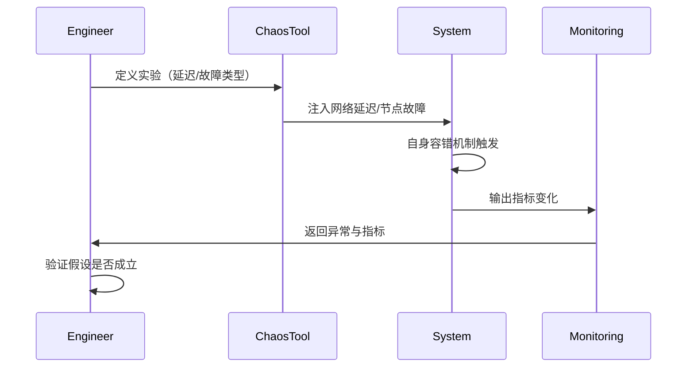
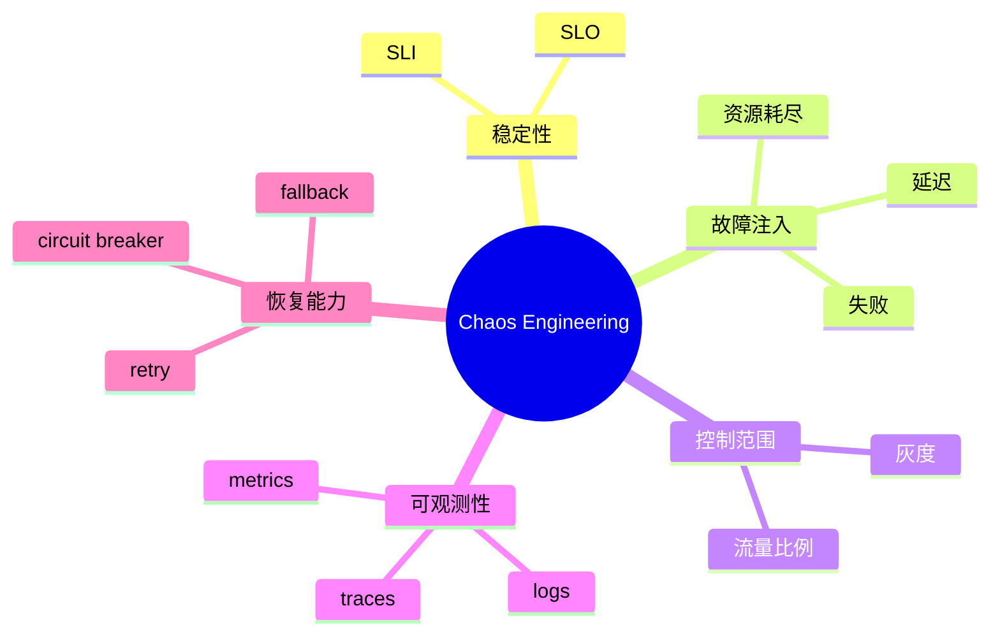

<!--
Chapter: 40
Node: KN-C-000053
Score: 86
Status: ✅ APPROVED
Attempt: 2
Round: 2
Generated: 2026-06-20 22:46:43
-->

# 第40章 Chaos Engineering（混沌工程） [L3-L4]

## Part 1：为什么要学这个？[认知冲突先行]

你可能觉得“系统稳定性”这件事，本质就是——多加几台机器、加重试、加熔断、加监控。

然后上线前做一次压测，绿了，就放心上线。

但现实里最危险的系统，从来不是压测没过的系统，而是“压测全绿，但生产环境仍然崩”的系统。

更讽刺的是：很多事故发生时，所有监控指标都“看起来正常”，直到用户开始疯狂投诉。

问题不在于你没测试，而在于你只测试了“理想世界”。

Chaos Engineering要解决的，就是这一层幻觉：

> 系统不是在“正确条件下稳定”，而是在“随机破坏条件下仍然可用”。

本章要回答的问题很直接：

当系统本身是分布式、异步、依赖复杂网络时，我们如何主动制造故障，反过来验证系统是否真的可靠？

---

## Part 2：学习路径定位

Chaos Engineering 在 L0→L4 中属于“从被动运维到主动破坏系统验证”的高级阶段。


前置能力：

* 分布式调用链理解
* 容错机制设计
* 可观测性体系

后置能力：

* 自动故障注入系统
* 自愈架构设计
* SRE体系建设

---

## Part 3：用生活理解它

想象你是飞机制造商。

传统测试是：

* 在晴天试飞
* 在平稳跑道起降
* 确认仪表正常

但混沌工程做的是：

* 模拟引擎单侧失效
* 模拟通讯中断
* 模拟雷暴气流

目的不是“让飞机正常飞”，而是验证：

> 飞机在出事的时候，能不能还活着把人带回来。

边界：

* 不等于“故意搞崩线上系统”
* 不等于“随机删库测试”
* 必须可控、可回滚、有范围限制

---

## Part 4：AI如何映射到传统概念

| 传统软件工程 | Chaos Engineering |
| ------ | ----------------- |
| 压测     | 随机故障注入            |
| QA测试   | 生产环境实验            |
| 稳定性优化  | 系统韧性验证            |
| 容错设计   | 故障恢复能力            |
| 监控告警   | 行为反馈系统            |

---

## Part 5：技术本质深讲

Chaos Engineering 的本质不是“制造故障”，而是：

> 在系统运行时，验证“故障发生后系统行为是否符合预期”。

核心三要素：

* steady state（稳定状态定义）
* hypothesis（假设系统不会崩）
* experiment（注入故障验证）



关键组件：

* 故障注入器（latency, packet loss, CPU stress）
* 控制范围（blast radius）
* 监控系统（metrics/logs/traces）
* 假设系统（SLO/SLI）

---

## Part 6：动手Demo（可运行代码）

下面模拟一个微服务调用链，在随机失败情况下验证重试机制。

```python
import random
import time

# 模拟下游服务
def unreliable_service():
    # 30%概率失败
    if random.random() < 0.3:
        raise Exception("Service failed")
    return "OK"

# 带重试的调用
def call_with_retry(retries=3):
    for attempt in range(1, retries + 1):
        try:
            result = unreliable_service()
            return result
        except Exception as e:
            print(f"Attempt {attempt} failed: {e}")
            time.sleep(0.2)
    return "FAILED"

# 混沌实验：多次调用统计成功率
def chaos_experiment(rounds=20):
    success = 0
    for i in range(rounds):
        result = call_with_retry()
        if result == "OK":
            success += 1
        print(f"Round {i+1}: {result}")
    print(f"\nSuccess rate: {success / rounds:.2f}")

if __name__ == "__main__":
    chaos_experiment()
```

运行后你会看到：

* 有失败日志
* 有重试行为
* 最终成功率稳定在某个范围

这就是混沌工程的核心：**系统行为是统计稳定的，而不是单次稳定的**

---

## Part 7：真实项目场景

在大规模电商系统中：

* 订单服务依赖支付服务
* 支付服务依赖风控服务
* 风控依赖外部API

问题是：

> 外部API偶发延迟 2 秒，会不会拖垮整个链路？

Chaos Engineering 做法：

* 在生产环境灰度用户中注入 2 秒延迟
* 观察订单成功率变化
* 检查熔断是否生效

如果系统崩了：

* 说明你“只是看起来有容错”
* 实际没有形成闭环保护

---

## Part 8：这里容易踩坑

**错误1：直接在全量生产环境注入**

```python
# 错误：无范围控制
inject_latency(global_system=True)
```

正确做法：

```python
# 正确：限制影响范围
inject_latency(service="payment", traffic_ratio=0.01)
```

---

**错误2：没有定义稳定状态**

很多团队：

* 不定义 SLO
* 不知道“正常应该是多少”

导致：

> 崩了也不知道算不算异常

---

**错误3：只测故障，不测恢复**

Chaos Engineering 的重点不是“怎么坏”，而是：

> 系统多久能恢复正常

---

## Part 9：面试怎么答

**L1：什么是混沌工程？**

* 在系统运行时主动注入故障
* 验证系统韧性

**L2：核心步骤？**

* 定义稳定状态
* 提出假设
* 注入故障
* 观察指标

**L3：如何控制风险？**

* 限流（blast radius）
* 灰度发布
* 可回滚机制
* 实验窗口控制

---

## Part 10：考点速查

* **稳定状态定义**：系统“正常”的量化标准
* **Blast Radius**：实验影响范围控制
* **故障注入**：人为制造系统异常
* **韧性（Resilience）**：系统恢复能力
* **SLO驱动实验**：用指标验证系统假设

---

## Part 11：必背金句

* 稳定不是不出错，而是出错后还能恢复
* 没有失败注入的系统，只是未经验证的假象
* 可观测性是混沌工程的眼睛
* Blast Radius 决定事故规模
* 你无法避免故障，只能控制故障影响

---

## Part 12：快速参考表

| 概念              | 作用     | 示例值      |
| --------------- | ------ | -------- |
| Steady State    | 定义正常行为 | QPS=1000 |
| Fault Injection | 制造故障   | 延迟+2s    |
| Blast Radius    | 控制影响   | 1%流量     |
| Retry           | 自动恢复   | 3次重试     |
| SLO             | 成功标准   | 99.9%    |

---

## Part 13：思维导图



---

## Part 14：本章小结

混沌工程的核心不是“破坏系统”，而是“验证系统在破坏下的行为”。

从L0到L3，你学的是如何让系统“看起来稳定”。

到了L3-L4，你开始学习让系统“在不稳定中仍然可靠”。

真正的成长是：从避免失败 → 接受失败 → 利用失败验证系统。

---

## Part 15：下一章预告

本章我们验证了系统在故障下是否能存活，但还有一个更难的问题没有解决：

如果系统已经崩了，我们如何让它自动恢复，而不需要人工介入？

下一章将进入：
**自愈系统与自动恢复架构（Self-Healing Systems）**