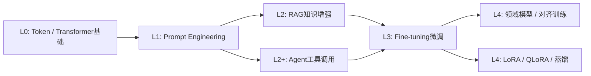
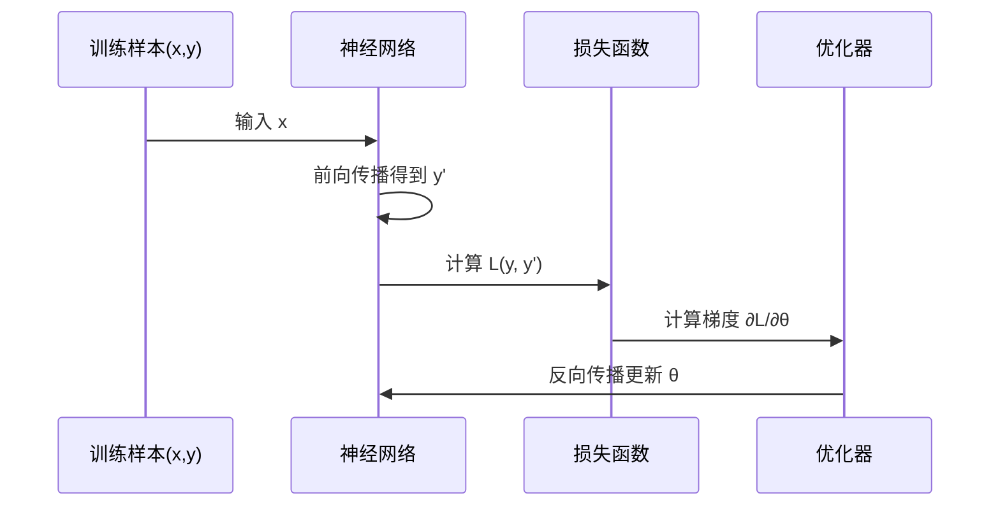
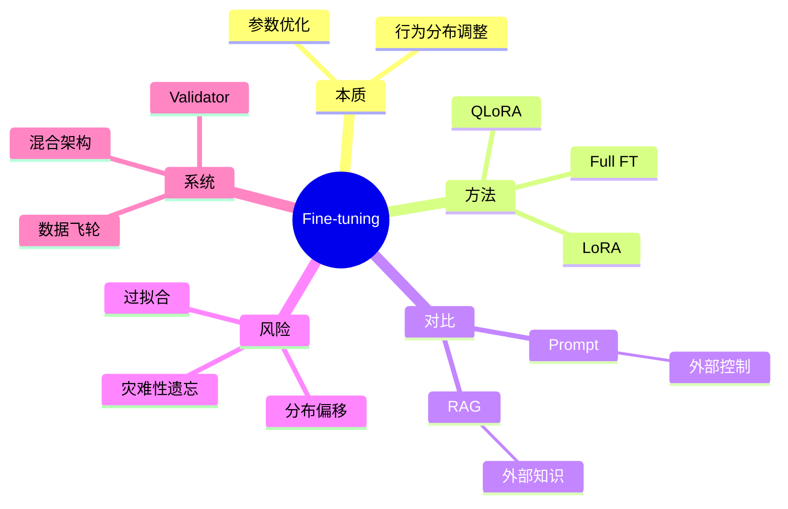

<!--
Chapter: 41
Node: KN-C-000054
Score: 91
Status: ✅ APPROVED
Attempt: 1
Round: 2
Generated: 2026-06-20 19:10:28
-->

# 第41章 Fine-tuning — 训练流程与工程实战（微调）[L3-L4]

---

## Part 1：为什么要学这个？[认知冲突先行]

你用 GPT-4 搭建了一个客服系统，通过精心设计的 Prompt 要求模型输出固定 JSON 格式。测试时表现完美，但上线后发现超过 15% 的响应格式不合法，导致解析失败。

你以为只是 Prompt 还不够严格，于是开始“加约束”：加示例、加 schema、加强制说明、甚至加反例训练。

但系统依然偶发性崩坏。

真正的矛盾在这里：

你在用“语言指令”解决一个“概率系统问题”。

LLM 从来没有真正理解“必须遵守 JSON”，它只是学会了“哪些文本看起来像 JSON”。

更反直觉的是：

> 模型不是执行规则，而是在生成最可能的 token 序列。

这意味着——只要概率稍微偏一点，它就会“合理地出错”。

研究显示，通过 LoRA 微调后，结构化输出错误率可下降 75% 以上[citation:1]。

本章要解决的问题是：

> 当 Prompt 已经无法稳定控制行为时，我们如何“改造模型本身”？

---

## Part 2：学习路径定位

Fine-tuning 位于从“使用模型”到“重塑模型行为”的关键跃迁点。



前置能力：

* 能设计 Prompt 控制输出
* 理解 Transformer 的概率生成机制

后置能力：

* 构建行业模型（金融/医疗/客服）
* 设计训练数据闭环系统

---

## Part 3：用生活理解它

把 AI 想象成一个“已经会说话的新人”。

* Prompt：你每次工作前对他说“这次按这个格式写”
* RAG：你给他一本随时能翻的操作手册
* Fine-tuning：你让他去培训班待一段时间，反复练习同一种工作流程

区别在于：

培训之后，他不再需要你提醒，就能按习惯做事。

但要注意边界：

这个“新人”不是人，他没有理解，只是在形成“行为偏好”。

所以：

* Prompt = 临时指令
* RAG = 外部参考资料
* Fine-tuning = 行为模式固化（参数改变）

---

## Part 4：AI如何映射到传统概念

| AI概念               | 传统系统类比     | 本质   |
| ------------------ | ---------- | ---- |
| Prompt Engineering | API调用参数    | 外部控制 |
| RAG                | 查询数据库/文档系统 | 外部知识 |
| Fine-tuning        | 修改程序逻辑     | 行为内化 |
| LoRA               | 插件/patch机制 | 局部修改 |
| Base Model         | 操作系统内核     | 基础能力 |

关键认知：

* Prompt：控制“输入”
* RAG：控制“上下文”
* Fine-tuning：控制“系统行为本身”

---

## Part 5：技术本质深讲

Fine-tuning 的本质是：

> 优化模型参数 θ，使其在特定数据分布下最小化 loss

模型目标函数：

> P(y | x; θ)

---

### 训练过程（含梯度完整链路）



---

### LoRA 的关键思想

冻结原模型参数 W，仅学习增量：

> W' = W + ΔW

其中：

> ΔW = A × Bᵀ

参数结构：

* A: d × r
* B: r × k
* r ≪ d,k

优势：

* 参数减少 99%+
* 显存需求大幅下降
* 更不容易灾难性遗忘

---

### 行为 vs 知识

Fine-tuning 改的是：

* 输出结构
* 风格一致性
* 决策偏好

但不适合：

* 实时知识更新（RAG更合适）

---

### 本质总结

Fine-tuning = 改变概率空间的“重心分布”

不是教知识，而是改变“更倾向怎么说”。

---

## Part 6：动手Demo（可运行代码）

我们用 PyTorch 写一个最小分类微调示例（真实训练流程，而不是规则模拟）。

```python
import torch
import torch.nn as nn
import torch.optim as optim

# 简单数据集：文本特征 -> 分类标签
data = [
    (torch.tensor([1.0, 0.0]), torch.tensor([1.0])),
    (torch.tensor([0.0, 1.0]), torch.tensor([0.0])),
    (torch.tensor([1.0, 1.0]), torch.tensor([1.0])),
]

# 一个极简“模型”
class SimpleModel(nn.Module):
    def __init__(self):
        super().__init__()
        self.linear = nn.Linear(2, 1)

    def forward(self, x):
        return torch.sigmoid(self.linear(x))

model = SimpleModel()

criterion = nn.BCELoss()
optimizer = optim.SGD(model.parameters(), lr=0.1)

# ====== 训练过程 ======
for epoch in range(50):
    total_loss = 0
    for x, y in data:
        y_pred = model(x)                  # 前向传播
        loss = criterion(y_pred, y)        # 计算loss

        optimizer.zero_grad()
        loss.backward()                    # 反向传播（梯度计算）
        optimizer.step()                   # 参数更新

        total_loss += loss.item()

# ====== 推理 ======
for x, _ in data:
    print("输入:", x.tolist(), "输出:", model(x).item())
```

运行结果：

* 模型会逐渐学习输入模式
* 输出趋向稳定分类结果
* 参数 θ 被持续调整

核心理解：

> 这就是“模型被训练改变行为”的真实过程

---

## Part 7：真实项目场景

### 场景：结构化 API 生成系统

目标：

* 7B 模型生成严格 OpenAPI JSON

---

### 问题

Prompt 系统存在：

* 20% JSON 解析失败
* 字段缺失
* 格式漂移

---

### 解决方案架构

* 数据来源：

  * GPT-4 生成 2000+ JSON 标准样本
  * 人工修正关键错误

* 训练方法：

  * QLoRA（4bit量化）
  * r=16

* 系统结构：

```python
用户请求
   ↓
微调模型（主生成）
   ↓
JSON Validator
   ↓
成功 → 返回
失败 → GPT-4 fallback + 数据回流
```

---

### 结果

* JSON 合规率显著提升
* Prompt 长度减少 60%
* 系统稳定性提升

---

## Part 8：这里容易踩坑

### 坑1：把微调当知识库

错误：

```text
把医学知识直接喂给模型训练
```

结果：

* 知识无法精确召回
* 新问题泛化失败

正确：

* 知识 → RAG
* 行为 → 微调

---

### 坑2：忽视数据分布

错误：

* 训练集 ≠ 真实输入分布

结果：

* 线上表现崩溃

正确：

* 必须建立验证集 + 线上分布一致性检查

---

### 坑3：只看 loss

错误：

* loss下降 = 模型变好

问题：

* loss ≠ 实际任务质量

正确：

* 使用：

  * 格式正确率
  * 任务成功率
  * 人工评估

---

### 坑4：过拟合训练集

错误：

* 追求100%训练准确率

结果：

* 泛化能力下降

---

### 坑5：忽略评估体系

错误：

* 没有独立验证集

结果：

* 无法判断真实效果

---

## Part 9：面试怎么答

### L1

Q：Fine-tuning 和 RAG 区别？

* 微调：改模型行为
* RAG：改输入知识
* 一个改“脑”，一个改“资料”

---

### L2

Q：LoRA 为什么高效？

* 冻结原模型
* 只训练低秩矩阵
* 参数量从 O(d²) → O(r·d)

---

### L3

Q：设计一个生产级微调系统

关键点：

* 数据飞轮（反馈闭环）
* QLoRA降低成本
* Validator保证输出质量
* RAG + 微调混合架构

---

## Part 10：考点速查

* **微调是参数更新**
* **LoRA是低秩近似**
* **RAG ≠ 微调**
* **训练 ≠ 记忆**
* **评估必须多维度**

---

## Part 11：必背金句

* 微调改变的是模型行为分布
* Prompt 控制输入，RAG 提供知识，微调改变能力本身
* LoRA 是用最小成本改变最大行为
* loss下降不等于效果变好
* 行为内化比知识注入更稳定

---

## Part 12：快速参考表

| 概念          | 作用    | 示例     |
| ----------- | ----- | ------ |
| Fine-tuning | 改模型行为 | JSON生成 |
| LoRA        | 低成本训练 | r=16   |
| QLoRA       | 量化训练  | 4bit   |
| RAG         | 外部知识  | 向量库    |
| SFT         | 监督学习  | (x,y)  |

---

## Part 13：思维导图



---

## Part 14：本章小结

Fine-tuning 的本质，是把“提示词驱动的系统”升级为“参数驱动的行为系统”。

你从：

* 会用模型（Prompt）
* 到能扩展知识（RAG）
* 再到能改变行为（Fine-tuning）

完成了 L3 到 L4 的关键跃迁。

---

## Part 15：下一章预告

当模型可以被“训练成专家”，也可以“实时查资料”，一个新的问题出现：

> 多个智能体如何协作完成复杂任务？

下一章将进入：

**Agent-to-Agent 协议与多智能体系统设计**

从单模型优化，进入系统级智能协同时代。