<!--
Chapter: 42
Node: KN-C-000060
Score: 92
Status: ✅ APPROVED
Attempt: 1
Round: 2
Generated: 2026-06-21 08:03:08
-->

# 第42章 MCP（Model Context Protocol） [L1-L2]

## Part 1：为什么要学这个？[认知冲突先行]

你花了一周时间，为 LangChain 写了一个完美的搜索引擎工具适配器。

日志正常、异常处理完善、重试机制齐全，甚至还做了缓存优化。

你觉得这件事已经结束了。

结果老板走过来一句话：

> “客户那边用的是 AutoGen，你把这个工具也接一下。”

你愣了一下。

搜索还是那个搜索。

API 还是那个 API。

为什么换个框架，就要重写一遍？

于是你开始复制代码、改 import、调整工具定义格式、重新适配调用协议……

几天后你发现：

* LangChain 一套工具定义
* AutoGen 一套工具定义
* 自研 Agent 一套工具定义
* Claude Desktop 又是一套工具定义

同一个搜索工具，被包装了四遍。

很多工程师第一次做 AI Agent 时，会默认接受这种现象：

> “工具接入本来就是框架相关的工作。”

这其实是一个巨大的误区。

因为真正的问题根本不是搜索工具怎么写，而是：

**为什么 AI 工具生态没有统一接口？**

回头看看传统计算机的发展历史。

打印机、键盘、鼠标曾经都有各自的接口。

直到 USB 出现。

USB 并没有发明打印机。

USB 也没有发明键盘。

USB 只是定义了一套统一通信规范。

于是：

* 设备厂商只管做设备
* 操作系统只管接 USB
* 双方不再互相适配

MCP 的出现，本质上做的是同样的事情。

它没有发明 Tool Calling。

它也没有发明 Agent。

它只是给 AI 工具生态定义了一个统一标准。

本章要解决的核心问题是：

> MCP 为什么会成为 AI Agent 时代的重要基础设施？
>
> 它到底解决了什么问题？
>
> Tool、Resource、Prompt 三种能力如何协同工作？
>
> MCP 和 Function Calling 又是什么关系？

理解这些问题之后，你会发现：

> MCP 并不是另一个工具框架。
>
> MCP 是 AI 工具世界里的 USB 接口标准。

---

## Part 2：学习路径定位

MCP 位于 Agent 工程体系中的中层能力。

在理解了 Tool Calling 之后，你会发现新的问题：

> 工具能调用了，但如何跨框架共享？

这正是 MCP 要解决的问题。

学习路径如下：

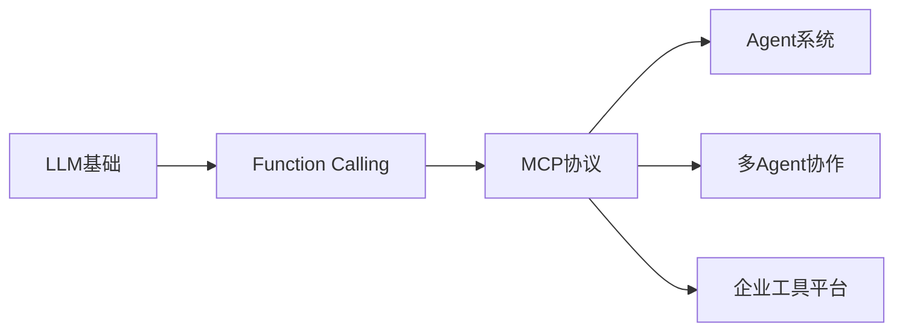

更细粒度地看：

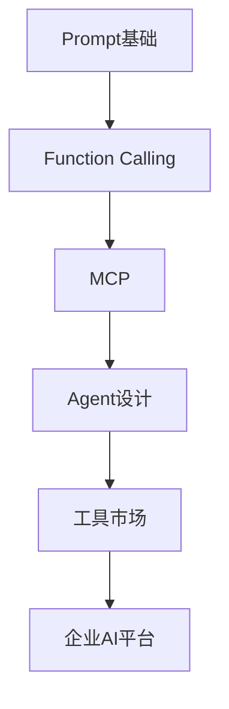

### 本章前置知识

需要理解：

* LLM 如何调用工具
* Function Calling 基本原理
* JSON Schema 基础概念
* Client / Server 架构

### 本章后置知识

学习完 MCP 后，可以继续深入：

* Agent 架构设计
* 多 Agent 协同
* 企业级工具平台
* AI Operating System

### 当前定位

| 层级 | 能力              |
| -- | --------------- |
| L0 | 会使用 ChatGPT     |
| L1 | 理解 Tool Calling |
| L2 | 理解 MCP 工具共享机制   |
| L3 | 设计企业 MCP 平台     |
| L4 | 构建 MCP 工具生态     |

本章目标：

**从 Function Calling 视角升级到协议视角。**

---

## Part 3：用生活理解它

想象你出差时带着手机、平板、耳机。

如果每个设备都需要不同充电线：

* 手机一根
* 平板一根
* 耳机一根

你的包里会塞满各种线材。

Type-C 出现之后：

一根线可以连接所有设备。

设备厂商不再关心手机品牌。

用户也不再关心接口差异。

MCP 与 Type-C 十分相似：

* MCP Server = 设备
* MCP Client = 主机
* MCP Protocol = Type-C 标准

工具开发者只需要暴露 MCP 接口。

任何支持 MCP 的 Agent 都能直接接入。

### 类比的边界

这个类比并不完全成立。

Type-C 传输的是电力和数据。

MCP 传输的是：

* 工具能力
* 数据资源
* Prompt 模板

所以 MCP 不是物理接口。

它本质上是一个应用层协议。

---

## Part 4：AI如何映射到传统概念

很多传统开发者第一次接触 MCP 时，会把它理解成：

> “是不是另一种 Function Calling？”

这会导致理解偏差。

因为两者处于不同层级。

### 映射关系

| 传统软件世界 | AI世界        |
| ------ | ----------- |
| USB协议  | MCP协议       |
| USB设备  | MCP Server  |
| 操作系统   | MCP Client  |
| RPC调用  | Tool Call   |
| 文件系统   | Resource    |
| 配置模板   | Prompt      |
| 驱动程序   | MCP SDK     |
| API网关  | MCP Gateway |

### Function Calling 与 MCP 的关系

很多人把两者混为一谈。

实际上：

| 对比项  | Function Calling | MCP       |
| ---- | ---------------- | --------- |
| 层级   | 调用机制             | 通信协议      |
| 目标   | 让模型调用函数          | 让工具跨框架共享  |
| 范围   | 单次推理             | 整个生态      |
| 关注点  | 调哪个函数            | 如何发现和连接工具 |
| 生命周期 | 一次请求             | 长期运行      |

理解一个经典例子。

Function Calling 解决的问题：

> “模型如何调用搜索工具？”

MCP 解决的问题：

> “搜索工具如何同时服务 LangChain、AutoGen、Claude Desktop 和自研 Agent？”

一个是调用。

一个是生态互通。

两者互补而非替代。

### MCP 与 Agent 的关系

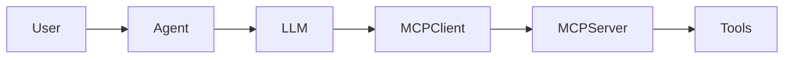

Agent 是执行任务的系统。

MCP 是 Agent 获取外部能力的标准方式。

---

## Part 5：技术本质深讲

### MCP 到底是什么

MCP（Model Context Protocol）是一套开放协议。

它定义了：

> LLM 应用如何发现、调用和管理外部能力。

MCP 不关心你使用：

* LangChain
* AutoGen
* Claude Desktop
* 自研 Agent

它只关心：

> Client 和 Server 如何通信。

### MCP 的核心角色

整个体系只有两个核心角色。

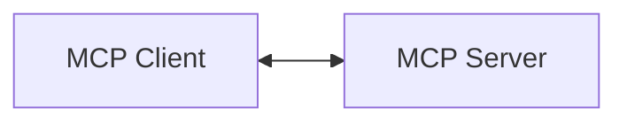

#### MCP Client

能力消费者。

通常存在于：

* Agent
* IDE插件
* AI应用
* 桌面客户端

职责：

* 连接 Server
* 获取能力列表
* 发起调用请求
* 返回执行结果

#### MCP Server

能力提供者。

职责：

* 暴露工具
* 提供资源
* 管理 Prompt 模板
* 执行实际业务逻辑

### MCP 三大 Primitive

MCP 最重要的知识点之一。

所有能力都归类为三种 Primitive。

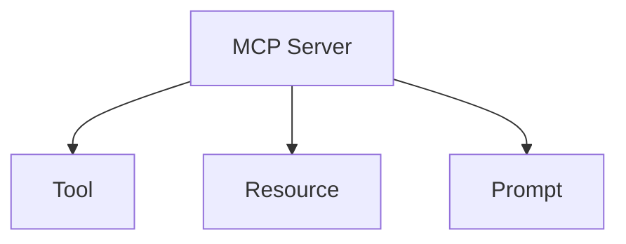

---

### Tool

Tool 用于执行动作。

典型场景：

* 搜索网页
* 查询数据库
* 调用第三方API
* 创建工单
* 写文件

例如：

```python
def search_product(keyword: str):
    ...
```

本质：

> 帮模型完成它自己做不了的事情。

---

### Resource

Resource 用于读取数据。

典型场景：

* 文件内容
* 数据库记录
* API响应
* 企业知识库

例如：

```text
inventory://product/12345
```

本质：

> 给模型提供上下文信息。

---

### Prompt

Prompt 用于复用模板。

例如：

```text
你是一名资深客服，请按照以下格式回答用户问题...
```

多个 Client 可以共享同一个 Prompt 模板。

避免复制粘贴。

---

### MCP 通信流程

整个过程可以拆成五步。

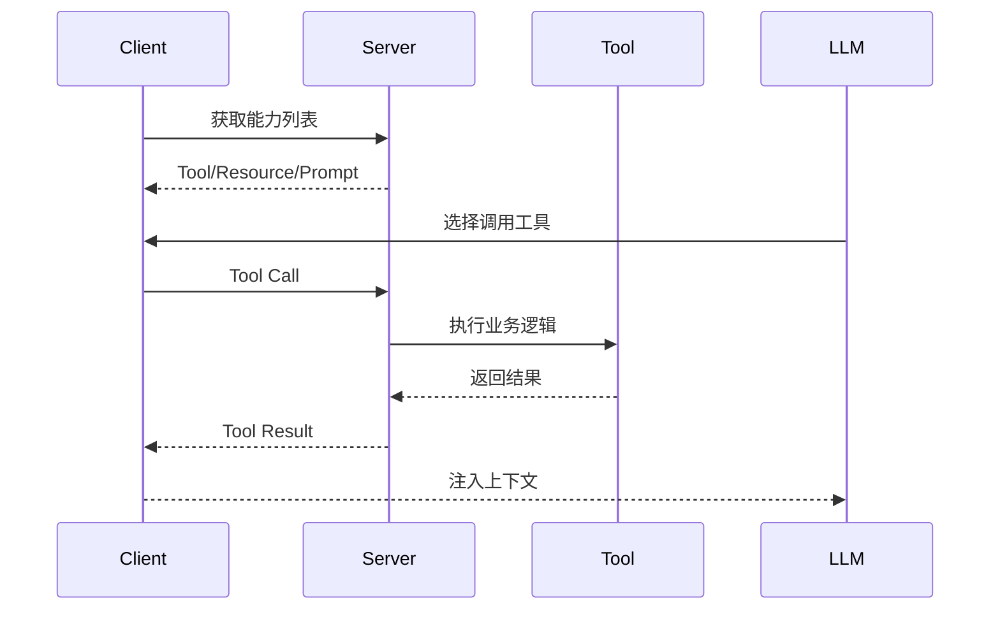

流程解释：

### 第一步：能力发现

Server 启动时注册能力。

例如：

* search_web
* query_order
* check_inventory

Client 连接后读取能力清单。

### 第二步：模型决策

用户提问：

> 查询订单 12345 状态

LLM 发现：

> query_order 更适合回答。

于是发起调用。

### 第三步：请求转发

Client 将调用请求发送给 MCP Server。

例如：

```json
{
  "tool": "query_order",
  "order_id": "12345"
}
```

### 第四步：执行工具

Server 调用真实业务代码。

例如：

```python
query_order_from_db("12345")
```

### 第五步：结果回注

执行结果返回给 Client。

Client 再注入模型上下文。

模型基于结果继续生成答案。

### 传输方式

MCP 当前常见两种通信模式。

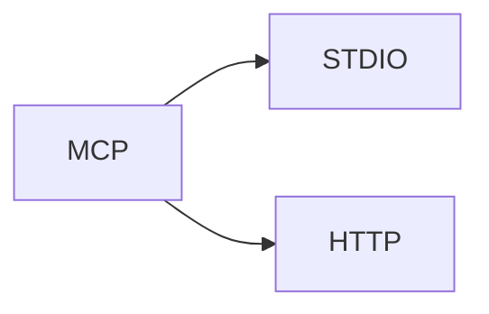

#### stdio

标准输入输出通信。

特点：

* 本地进程
* 实现简单
* 延迟低

适用于：

* Claude Desktop
* IDE插件
* 本地Agent

#### HTTP + SSE

网络通信。

特点：

* 支持远程部署
* 支持多客户端
* 易于扩展

适用于：

* 企业平台
* 云端Agent
* 多用户系统

### 一个最小 MCP Server

下面是官方风格的最简实现。

```python
from mcp.server.fastmcp import FastMCP

mcp = FastMCP("my-tools")

@mcp.tool()
def search_web(query: str) -> str:
    return f"Search result for: {query}"

if __name__ == "__main__":
    mcp.run()
```

代码做了什么？

1. 创建 MCP Server
2. 注册一个 Tool
3. 启动服务
4. 等待 Client 连接

从 Client 的角度看：

它并不关心这个 Tool 来自哪个框架。

只知道：

> 这里有一个符合 MCP 标准的能力提供者。

### MCP 的真正价值

如果只看代码，你可能会觉得：

> “这不就是把函数包了一层吗？”

这恰恰是最容易出现的误解。

MCP 的价值不在于封装函数。

而在于：

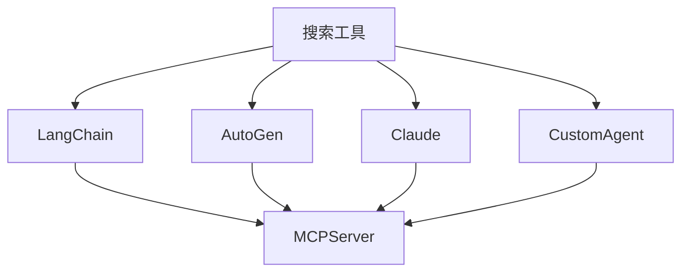

以前：

* 一个工具
* N 个适配器

现在：

* 一个工具
* 一个 MCP Server
* N 个 Client

这就是 MCP 被称为：

> AI 工具世界 USB 标准

的根本原因。

## Part 6：动手 Demo（可运行代码）

理解 MCP 最好的方式，不是看概念，而是亲手写一个最小 Server。

下面的例子暴露两个 Tool：

* 搜索商品
* 查询库存

代码控制在最小规模，方便理解核心机制。

### 最小 MCP Server

```python
from mcp.server.fastmcp import FastMCP

# 创建 Server
mcp = FastMCP("ecommerce-tools")


@mcp.tool()
def search_product(keyword: str) -> str:
    """
    搜索商品
    当用户需要查找商品时使用
    """
    products = [
        "iPhone 16",
        "MacBook Pro",
        "AirPods Pro"
    ]

    result = [
        p for p in products
        if keyword.lower() in p.lower()
    ]

    return str(result)


@mcp.tool()
def check_inventory(product_name: str) -> str:
    """
    查询库存
    当用户需要查看库存时使用
    """
    inventory = {
        "iPhone 16": 128,
        "MacBook Pro": 45,
        "AirPods Pro": 310
    }

    return str(
        inventory.get(product_name, 0)
    )


if __name__ == "__main__":
    mcp.run()
```

### 关键代码解析

#### 创建 Server

```python
mcp = FastMCP("ecommerce-tools")
```

这里相当于创建一个 MCP 服务实例。

#### 注册 Tool

```python
@mcp.tool()
```

装饰器会自动把函数注册到 MCP 能力列表中。

Client 连接时能够发现它。

#### Description 的作用

```python
"""
查询库存
当用户需要查看库存时使用
"""
```

很多人以为这是给开发者看的。

实际上：

这是给 LLM 看的。

模型会根据这里的描述判断：

* 是否调用
* 什么时候调用
* 调用哪个 Tool

### 运行后会看到什么

Server 启动后：

```text
MCP Server started...
Available tools:
- search_product
- check_inventory
```

此时任何 MCP Client 都可以连接。

整个过程如下：

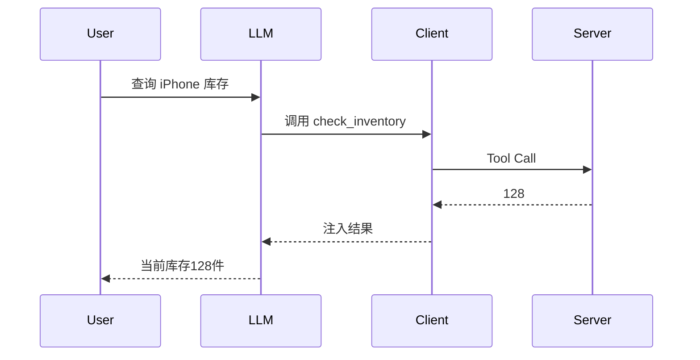

### Demo 的重点

这个例子真正重要的不是库存查询。

而是：

> 今天是库存查询工具。
>
> 明天换成数据库、搜索引擎、CRM、ERP 系统。
>
> 对 Client 来说完全一致。

这就是协议标准化的价值。

---

## Part 7：真实项目场景

### 电商公司 Agent 平台统一工具层

某电商公司内部已经有多个 Agent 系统。

分别服务于：

* 客服
* 运营
* 选品
* 风控
* 售后

每个团队使用的框架都不一样。

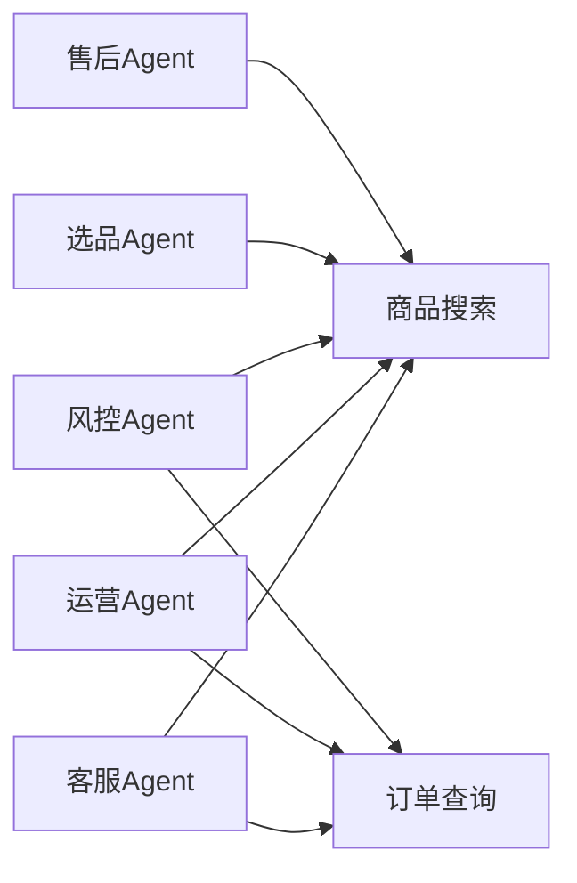

### 出现的问题

商品搜索工具要维护：

* LangChain 版本
* AutoGen 版本
* 自研框架版本
* 工作流平台版本
* 测试环境版本

一个工具五套实现。

每次升级都要同步修改。

### 技术方案

团队建立统一 MCP 平台。

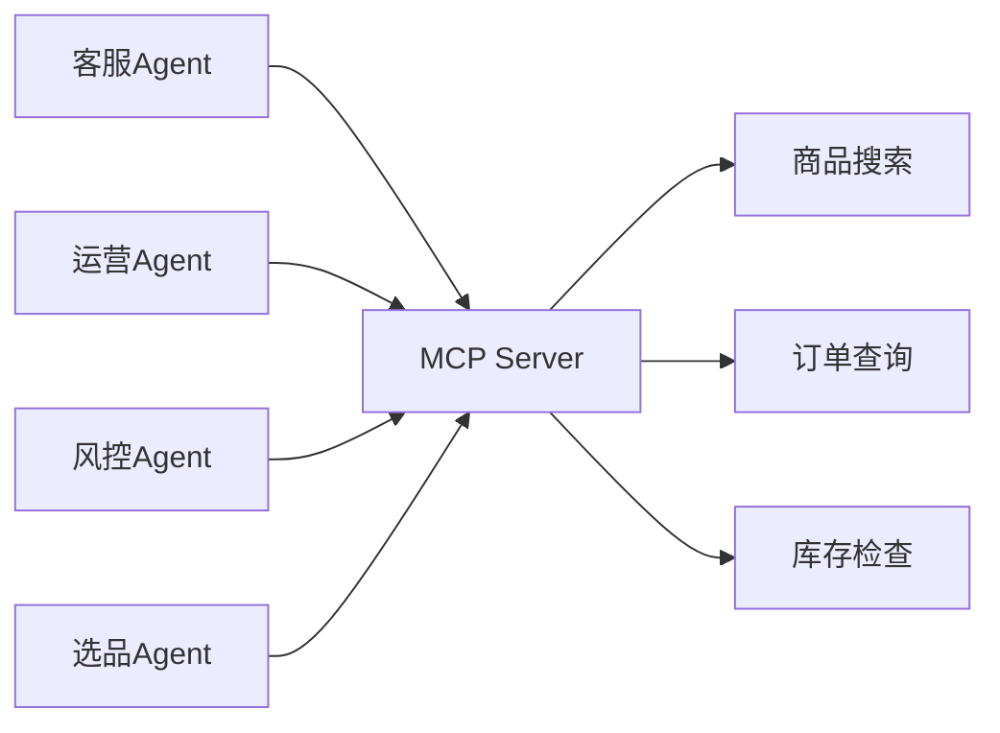

### MCP Server 暴露能力

#### Tool

* search_product
* query_order
* check_inventory

#### Resource

* 商品详情
* 商品知识库
* 库存快照

#### Prompt

* 客服回复模板
* 风控分析模板
* 运营分析模板

### 最终效果

工具接入周期：

| 项目     | 改造前 | 改造后 |
| ------ | --- | --- |
| 新工具接入  | 5人天 | 1人天 |
| 维护成本   | 高   | 低   |
| 适配器数量  | N套  | 1套  |
| 框架切换成本 | 高   | 低   |

维护成本下降约 70%。

团队开始把 MCP 当作：

> AI 基础设施层

而不是某个框架的插件。

---

## Part 8：这里容易踩坑

### 坑一：所有 Tool 全部开放

这是生产环境最危险的问题。

错误做法：

```python
@mcp.tool()
def delete_production_order(order_id: str):
    ...
```

然后直接暴露给所有 Agent。

结果：

营销 Agent 错误调用删除接口。

生产订单被删掉数千条。

### 正确做法

```python
READ_ONLY_TOOLS = [
    "search_product",
    "query_order"
]

ADMIN_TOOLS = [
    "delete_order",
    "modify_inventory"
]
```

按角色控制权限。

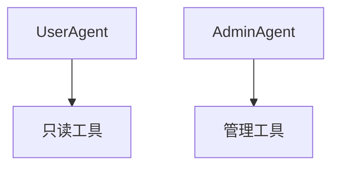

### 为什么会犯错

很多团队把 MCP 当内部接口。

认为：

> “反正是自己人用。”

现实中调用方可能是：

* Agent
* Workflow
* 第三方系统
* 测试环境

权限必须独立设计。

---

### 坑二：Tool Description 写得像没有写

错误示例：

```python
@mcp.tool()
def search_product(keyword: str):
    """
    搜索商品
    """
```

看起来没问题。

实际上模型几乎不知道：

* 什么场景调用
* 参数是什么
* 返回什么

### 正确写法

```python
@mcp.tool()
def search_product(keyword: str):
    """
    根据商品关键词搜索商品。

    使用场景：
    用户询问商品信息时。

    参数：
    keyword：商品名称或关键词。

    返回：
    商品列表。
    """
```

### 为什么有效

LLM 选择工具时主要依赖：

* Tool Name
* Description
* 参数定义

Description 就是模型的 API 文档。

---

### 坑三：把所有工具塞进一个 Server

错误设计：

```text
company-server
├─ search
├─ crm
├─ erp
├─ finance
├─ warehouse
├─ marketing
├─ hr
├─ risk
├─ ...
```

工具数量越来越多。

最终超过上百个。

### 正确设计

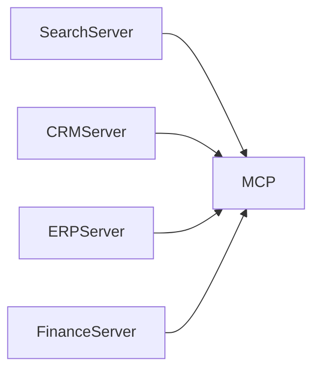

按领域拆分。

保持职责单一。

### 为什么重要

工具越多：

* 上下文越长
* Tool Selection 越困难
* 调用准确率越低

---

## Part 9：面试怎么答

### L1：MCP 协议解决了什么问题？为什么需要它？

#### 回答框架

第一层：

AI 工具生态碎片化。

第二层：

不同框架有不同工具接口。

第三层：

同一个工具需要重复适配。

第四层：

MCP 提供统一标准。

第五层：

实现一次开发、多框架复用。

### 关键词

* 工具生态碎片化
* 标准协议
* 跨框架共享
* 一次实现

---

### L2：MCP 的 Tool、Resource、Prompt 分别是什么？

#### 回答框架

Tool：

执行动作。

例如：

* 搜索
* 下单
* 调用API

Resource：

读取数据。

例如：

* 文件
* 数据库记录
* 知识库

Prompt：

复用模板。

例如：

* 客服模板
* 分析模板

总结：

> Tool 做动作。
>
> Resource 拿数据。
>
> Prompt 复用指令。

---

### L3：生产环境部署数据库 MCP Server，需要考虑哪些安全设计？

#### 回答框架

第一层：权限控制

* 最小权限原则
* 角色隔离

第二层：输入验证

* 参数校验
* SQL 注入防护

第三层：资源保护

* 超时
* 限流
* 熔断

第四层：审计能力

* 调用日志
* 操作追踪

第五层：隔离机制

* 沙箱
* 网络隔离

### 高分回答结构

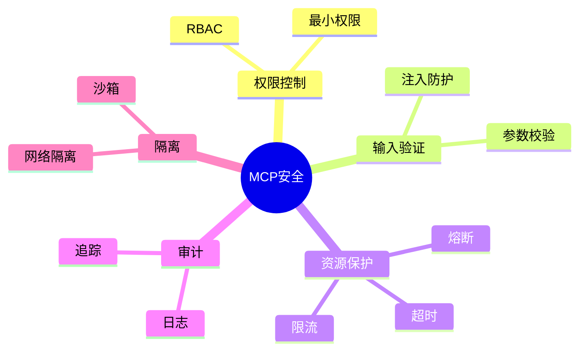

---

## Part 10：考点速查

### **MCP 解决什么问题**

统一工具协议，解决 AI 工具生态碎片化。

### **三类 Primitive**

Tool、Resource、Prompt。

### **MCP 与 Function Calling 区别**

Function Calling 是调用机制。

MCP 是生态协议。

### **两种传输方式**

stdio 与 HTTP+SSE。

### **安全设计核心**

权限控制、输入验证、限流超时、审计日志。

---

## Part 11：必背金句

### [标准化]：统一协议比统一框架更重要

### [复用]：写一次 Server，所有兼容 Client 都能用

### [职责分离]：Tool 做动作，Resource 给数据，Prompt 复用指令

### [描述即文档]：Tool Description 决定模型调用质量

### [安全优先]：不要默认信任任何 Client

---

## Part 12：快速参考表

| 概念          | 作用        | 示例值                     |
| ----------- | --------- | ----------------------- |
| MCP         | AI 工具通信协议 | Model Context Protocol  |
| Client      | 消费能力      | Claude Desktop          |
| Server      | 提供能力      | 商品搜索服务                  |
| Tool        | 执行动作      | search_product          |
| Resource    | 提供数据      | inventory://123         |
| Prompt      | 提示模板      | customer_service_prompt |
| stdio       | 本地通信      | IDE插件                   |
| HTTP+SSE    | 网络通信      | 云端Agent                 |
| Description | 工具说明      | 查询商品库存                  |
| Permission  | 权限控制      | ReadOnly                |

---

## Part 13：思维导图

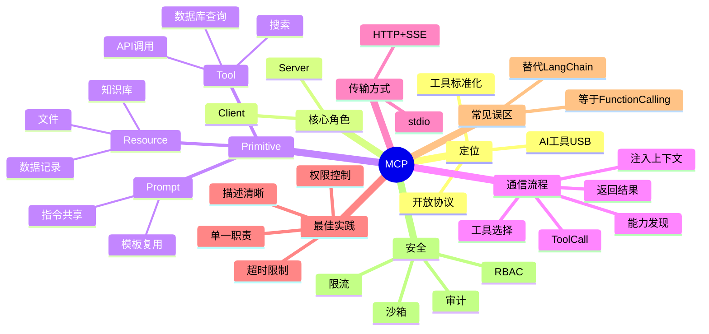

---

## Part 14：本章小结

MCP 并没有发明工具调用，它解决的是工具生态互通问题。

MCP 的核心思想是标准化：通过统一协议连接 Client 与 Server，实现工具能力跨框架共享。

从能力成长路径来看：

* L0：知道 MCP 是什么
* L1：会编写和使用 MCP Server
* L2：理解 Tool、Resource、Prompt 的设计思想
* L3：能够设计企业级 MCP 平台与安全体系

真正需要记住的一句话是：

> MCP = AI 工具世界的 Type-C，写一次 Server，所有框架都能插。

---

## Part 15：下一章预告

这一章解决了一个关键问题：

> 工具如何标准化共享？

但新的问题马上出现：

即使有了 MCP。

Agent 依然面临另一个挑战：

* 什么时候调用工具？
* 调用几个工具？
* 顺序怎么安排？
* 工具失败怎么办？

MCP 解决的是：

> “工具如何接入。”

下一章要解决的是：

> “Agent 如何自主决策使用工具。”

你将进入 Agent 体系最核心的能力之一：

**规划（Planning）与工具编排（Tool Orchestration）**。

届时你会看到：

一个真正成熟的 Agent，不只是会调用工具。

它还会像工程师一样制定计划、拆解任务、动态调整执行路径，并利用 MCP 提供的能力完成复杂目标。