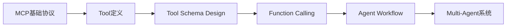
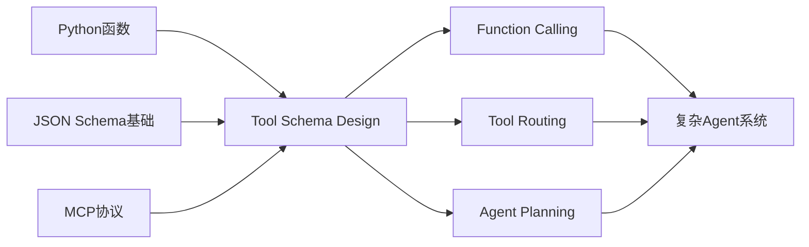
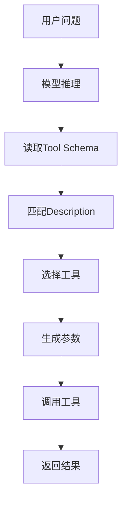
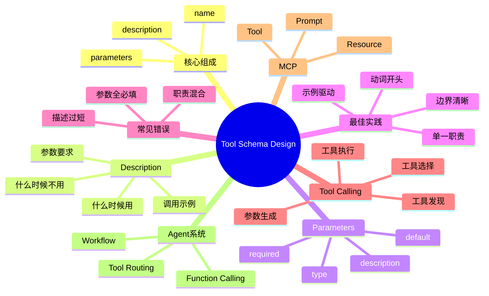

<!--
Chapter: 43
Node: KN-C-000061
Score: 88
Status: ✅ APPROVED
Attempt: 2
Round: 2
Generated: 2026-06-21 00:20:59
-->

# 第43章 Tool Schema Design（工具接口设计） [L1-L2]

## Part 1：为什么要学这个？认知冲突先行

你花了一整天为 Agent 系统实现了 5 个工具。

* `search_web`：搜索互联网
* `query_stock`：查询股票
* `get_exchange_rate`：查询汇率
* `send_email`：发送邮件
* `execute_sql`：执行数据库查询

所有工具都测试通过。

你信心满满地把它们接入 LLM。

结果诡异的事情发生了：

用户问：

> 帮我查一下昨天的 AI 新闻

模型没有调用任何工具，直接开始胡编。

用户问：

> 苹果公司最近怎么样？

模型居然调用了汇率查询工具。

用户问：

> 当前美元兑日元是多少？

模型调用了搜索工具，而不是专门的汇率工具。

你检查代码。

没 Bug。

检查 API。

没问题。

检查网络。

一切正常。

于是你得出一个结论：

> 大模型太笨了。

但真相恰恰相反。

问题可能根本不在代码。

而在 Tool Schema。

很多工程师有一个错误认知：

> Tool Schema 只是格式声明。
>
> name 写对。
>
> parameters 写全。
>
> 剩下交给模型自己理解。

这是传统软件工程思维。

因为人类工程师看到函数名：

```python
search_web(query)
```

几乎立刻知道：

* 什么时候该用
* 什么时候不该用
* 参数应该怎么填

但 LLM 不是工程师。

它看不到你的源码。

看不到 README。

看不到设计文档。

它能看到的只有 Schema。

尤其是：

```json
"description"
```

这个字段。

对于 LLM 而言：

> Tool Schema 就是 API 文档。
>
> 而 description 就是使用说明书。

如果 description 只写：

```json
"description": "搜索网络"
```

模型根本不知道：

* 查询新闻时该不该用
* 查询历史事实时该不该用
* 查询实时价格时该不该用
* 查询股票时该不该用

于是工具调用开始随机漂移。

本章要解决的核心问题是：

> 如何设计一个让 LLM 能正确理解的 Tool Schema？
>
> 怎样通过 description、参数设计和职责划分，让模型在正确时间调用正确工具？

记住这一章最重要的一句话：

> Tool Schema 不是写给人看的 API 文档，而是写给 LLM 的使用说明书。

---

## Part 2：学习路径定位

Tool Schema Design 位于 Agent 工具调用体系的核心位置。

如果没有 Schema：

* MCP 无法暴露工具
* Function Calling 无法选择工具
* Agent 无法正确执行任务

学习路径如下：



进一步展开：



### 前置知识

需要掌握：

* Python 函数定义
* JSON Schema 基础
* MCP 基础概念
* Function Calling 工作机制

### 后置知识

学完本章后可以继续学习：

* Tool Routing
* Dynamic Tool Loading
* Agent Workflow
* Multi-Agent Architecture

### 当前所处层级

| 层级 | 能力                       |
| -- | ------------------------ |
| L0 | 知道工具可以被模型调用              |
| L1 | 能够编写 Tool Schema         |
| L2 | 能够优化 Tool Schema 提高调用准确率 |
| L3 | 能够设计大型 Tool Ecosystem    |
| L4 | 能够构建复杂 Agent 平台          |

本章目标：

> 从 L1 进入 L2。

---

## Part 3：用生活理解它

想象你在一个共享单车停车区。

停着三辆车：

* A
* B
* C

如果二维码旁边只写：

> 交通工具

你知道该骑哪辆吗？

不知道。

如果写：

> 通勤单车，适合 5 公里以内短途

你开始知道用途。

如果写：

> 电助力车，适合长距离骑行

用途更加明确。

LLM 选择工具也是一样。

它不会打开车壳研究发动机。

它只看说明。

Tool Schema 的 description 就是那个说明牌。

### 类比成立的部分

* 用户靠说明选车
* LLM 靠 description 选工具

### 类比失效的部分

现实中的人可以通过经验推断用途。

LLM 不会主动查看函数源码。

对于模型而言：

> description 几乎就是全部认知来源。

因此 Tool Schema 的重要程度远高于传统 API 文档。

---

## Part 4：AI如何映射到传统概念

很多开发者第一次学习 Tool Schema 时会困惑：

> 这不就是接口文档吗？

答案是：

既像，又不完全像。

### 对应关系

| 传统软件开发          | AI Agent世界              |
| --------------- | ----------------------- |
| API 文档          | Tool Schema             |
| 开发者阅读文档         | LLM 阅读 Schema           |
| 函数名             | Tool Name               |
| 接口说明            | Description             |
| 参数定义            | Parameters              |
| Swagger/OpenAPI | Function Calling Schema |
| 服务发现            | Tool Discovery          |
| 接口调用            | Tool Invocation         |

### 最大区别

传统开发：

```text
API 文档
    ↓
人类工程师阅读
    ↓
决定调用
```

AI 开发：

```text
Tool Schema
    ↓
LLM阅读
    ↓
决定调用
```

问题在于：

人类拥有常识。

LLM 没有。

例如：

```json
{
  "name": "search"
}
```

人类开发者能猜出：

> 这是搜索工具。

但模型未必知道：

* 搜索什么
* 什么时候搜索
* 哪些问题不要搜索

因此 AI 世界中：

> Description 的重要性远高于传统 API 文档中的接口简介。

可以把它理解为：

| 传统文档关注 | Tool Schema关注 |
| ------ | ------------- |
| 工具能做什么 | 什么时候该用        |
| 返回什么数据 | 什么时候不用        |
| 实现细节   | 决策边界          |
| 接口规范   | 调用时机          |

这就是 AI Native 设计思维与传统软件设计思维最大的差异之一。

---

## Part 5：技术本质深讲

### Tool Schema 到底是什么

本质上：

Tool Schema 是一个结构化提示词（Structured Prompt）。

很多人认为：

```json
{
  "name": "...",
  "parameters": {...}
}
```

只是格式描述。

实际上：

模型在推理阶段会把这些内容一起读入上下文。

可以理解为：

```text
System Prompt
+
Conversation
+
Tool Schema
=
模型决策依据
```

所以：

> Tool Schema 本质属于 Prompt Engineering 的一部分。

### 核心组成

一个完整 Schema 包含三部分。

```json
{
  "name": "...",
  "description": "...",
  "parameters": {...}
}
```

### Name

工具名称。

推荐：

```text
动词 + 对象
```

例如：

```text
search_web
send_email
execute_sql
query_stock_price
```

不要这样写：

```text
web
tool1
searchTool
data
```

原因很简单：

名称也是模型理解工具的重要信号。

### Description

这是最重要的部分。

模型会重点阅读这里。

一个优秀 Description 应回答四个问题：

#### 1. 什么时候使用

例如：

```text
当用户需要获取最新信息时使用
```

#### 2. 什么时候不要使用

例如：

```text
不适用于历史事实查询
```

#### 3. 典型示例

例如：

```text
适合：
今天黄金价格是多少？
最新Python版本是什么？
```

#### 4. 参数约束

例如：

```text
日期使用 ISO8601 格式
```

---

### Parameters

参数不仅仅是类型声明。

也是给模型看的提示。

差的写法：

```json
{
  "query": {
    "type": "string"
  }
}
```

好的写法：

```json
{
  "query": {
    "type": "string",
    "description": "搜索关键词，推荐英文"
  }
}
```

模型能够利用这些信息生成更正确的参数。

---

### LLM 如何选择工具

整个决策过程如下：



注意：

模型不是先看源码。

而是：

```text
读Schema
↓
理解用途
↓
决定调用
```

---

### 差的 Schema 为什么会失败

例如：

```json
{
  "name": "search",
  "description": "搜索"
}
```

模型获得的信息只有：

```text
这个工具能搜索
```

但不知道：

```text
什么时候搜
搜索什么
什么时候不要搜
```

于是工具边界模糊。

多个工具之间开始重叠。

最终出现误调用。

---

### 好的 Schema 为什么有效

例如：

```json
{
  "name": "search_web",
  "description": "当用户需要获取实时信息、新闻、价格、近期事件时使用。不适用于历史事实和常识问题。例如：今天黄金价格是多少？昨天AI领域发生了什么？"
}
```

此时模型获得的信息变成：

```text
适用场景
+
不适用场景
+
示例问题
```

决策空间被大幅缩小。

调用准确率自然提高。

---

### Schema 质量如何影响准确率

可以把工具选择看成分类问题。

假设系统里有：

* 搜索工具
* 股票工具
* 汇率工具
* 邮件工具
* SQL工具

模型需要从 5 个候选中选 1 个。

Schema 越模糊：

```text
候选边界重叠
↓
分类困难
↓
误调用增加
```

Schema 越清晰：

```text
边界明确
↓
分类容易
↓
调用准确
```

其本质过程如下：


### 核心心智模型

请牢牢记住这一句话：

> Tool Schema = API 文档，但读者不是工程师，而是 LLM。

对于人类：

```text
功能介绍最重要
```

对于模型：

```text
什么时候用最重要
```

因此优秀的 Tool Schema 不只是描述能力。

而是在不断回答一个问题：

> 当用户提出这个需求时，我是不是正确的工具？

## Part 6：动手Demo（可运行代码）

这一节我们不用真正接入 LLM。

而是模拟两个 Tool Schema：

* 一个设计很差
* 一个设计很好

观察差异。

### 最小可运行示例

```python
from pprint import pprint

bad_schema = {
    "name": "search",
    "description": "搜索",
    "parameters": {
        "type": "object",
        "properties": {
            "query": {"type": "string"}
        },
        "required": ["query"]
    }
}

good_schema = {
    "name": "search_web",
    "description": (
        "当用户需要获取最新信息、实时数据、近期事件时使用。"
        "不适用于历史事实和常识问题。"
        "例如：昨天AI领域发生了什么？"
        "今天美元兑日元是多少？"
    ),
    "parameters": {
        "type": "object",
        "properties": {
            "query": {
                "type": "string",
                "description": "搜索关键词"
            },
            "max_results": {
                "type": "integer",
                "description": "返回结果数，默认5",
                "default": 5
            }
        },
        "required": ["query"]
    }
}

print("=== 差的 Schema ===")
pprint(bad_schema)

print("\n=== 好的 Schema ===")
pprint(good_schema)
```

### 关键代码解析

```python
"name": "search_web"
```

工具名采用：

```text
动词 + 对象
```

比单纯的 `search` 更明确。

---

```python
"description": (
    "当用户需要获取最新信息..."
)
```

这里不是功能介绍。

而是调用指南。

重点告诉模型：

* 什么时候用
* 什么时候不用

---

```python
"default": 5
```

提供默认值。

避免模型编造参数。

---

### 运行后你会看到什么

输出两份 Schema。

比较后你会发现：

差异几乎全部集中在 description 和参数说明上。

这也是 Agent 系统里最容易被忽略的地方。

代码复杂度没有变化。

但模型理解能力会发生巨大变化。

---

## Part 7：真实项目场景

### 业务背景

某 AI Agent 产品支持：

* 股票查询
* 汇率查询
* 新闻查询
* 企业信息查询

系统总共暴露了 12 个工具。

初版 Schema：

```json
{
  "name": "stock",
  "description": "查询股票"
}
```

```json
{
  "name": "exchange_rate",
  "description": "查询实时汇率"
}
```

```json
{
  "name": "news",
  "description": "查询新闻"
}
```

看起来没有问题。

上线后问题频发。

---

### 线上故障

用户提问：

> 苹果最近怎么样？

模型有时：

* 调股票工具

有时：

* 调新闻工具

有时：

* 调汇率工具

因为多个工具都包含：

```text
实时
最新
查询
数据
```

这些模糊词。

边界高度重叠。

---

### 技术团队误判

团队认为：

> 模型能力不足。

于是开始：

* 调 temperature
* 换模型
* 改 Prompt

两周过去。

误调用率：

```text
34%
↓
28%
```

改善极其有限。

---

### 真正解决方案

重写 Tool Schema。

例如：

```json
{
  "name": "get_exchange_rate",
  "description": "当用户需要查询两种货币之间的兑换汇率时使用。不适用于股票价格查询。不适用于历史汇率查询。示例：美元兑日元是多少？"
}
```

再例如：

```json
{
  "name": "query_stock_price",
  "description": "当用户需要查询上市公司股票价格时使用。不适用于汇率和加密货币查询。示例：AAPL当前股价是多少？"
}
```

---

### 结果

仅修改 Schema。

没有改：

* Prompt
* 模型
* 业务代码

结果：

| 指标     |   优化前 |   优化后 |
| ------ | ----: | ----: |
| 误调用率   |   34% |    7% |
| 用户满意度  |   3.2 |   4.6 |
| 平均响应时间 | 无明显变化 | 无明显变化 |

这说明：

> Tool Calling 最大的问题往往不是代码，而是工具边界表达不清。

---

## Part 8：这里容易踩坑

### 坑1：把 Description 写成实现文档

### 错误写法

```json
{
  "description": "调用/api/v2/search接口并返回JSON结果"
}
```

模型看完后只知道：

```text
怎么实现
```

却不知道：

```text
什么时候调用
```

---

### 正确写法

```json
{
  "description": "当需要获取最新信息时使用。不适用于历史事实查询。"
}
```

---

### 为什么容易犯错

因为工程师习惯给人写文档。

而 Tool Schema 是写给模型看的。

---

### 坑2：工具职责过大

### 错误设计

```json
{
  "name": "search_and_summarize"
}
```

一个工具同时负责：

* 搜索
* 总结

---

### 正确设计

```json
{
  "name": "search_web"
}
```

```json
{
  "name": "summarize_text"
}
```

---

### 为什么容易犯错

传统开发喜欢封装。

Agent 设计更强调：

> 一工具一职责。

职责越清晰。

选择越准确。

---

### 坑3：所有参数都 Required

### 错误写法

```json
{
  "required": [
    "query",
    "language",
    "timezone",
    "max_results"
  ]
}
```

---

### 后果

用户说：

> 查一下今天新闻

模型为了满足 Schema：

可能编造：

```json
{
  "query": "today news",
  "language": "zh",
  "timezone": "Asia/Shanghai",
  "max_results": 10
}
```

---

### 正确写法

```json
{
  "required": ["query"]
}
```

```json
{
  "max_results": {
    "type": "integer",
    "default": 5
  }
}
```

---

### 为什么容易犯错

开发者希望参数完整。

模型为了满足完整性会开始“脑补”。

最终导致错误调用。

---

## Part 9：面试怎么答

### L1：LLM 如何判断是否调用工具？

#### 面试题

LLM 调用工具时主要依赖 Schema 的哪个字段？

#### 回答框架

* 核心字段是 description
* LLM 看不到源码
* description 决定工具用途理解
* 需要写清使用场景和边界

---

### L2：好的 Description 应包含什么？

#### 面试题

如何设计高质量 Tool Description？

#### 回答框架

包含四部分：

* 适用场景
* 不适用场景
* 调用示例
* 参数格式要求

示例：

```text
查询实时股票价格时使用。
不适用于加密货币。
示例：AAPL当前价格是多少？
```

---

### L3：20个工具导致准确率下降怎么办？

#### 面试题

大型 MCP Server 中工具太多导致选择错误，如何优化？

#### 回答框架

第一层：

动态工具加载。

只注入相关工具。

---

第二层：

优化 Description。

明确工具边界。

---

第三层：

减少重叠能力。

例如：

```text
search_stock
search_news
search_company
```

边界要明显。

---

第四层：

精简 Token。

减少无意义描述。

提高上下文利用率。

---

## Part 10：考点速查

### **Tool Schema 三要素**

name + description + parameters

---

### **Description 决定调用准确率**

模型主要依据 description 做工具选择。

---

### **说明什么时候用**

不要只介绍功能。

必须介绍使用场景。

---

### **说明什么时候不用**

帮助模型排除错误工具。

---

### **一工具一职责**

避免：

```text
search_and_summarize
query_and_update
```

这种职责混合设计。

---

## Part 11：必背金句

### [原则]：Description 比代码更重要

模型先读 Schema，再决定是否调用。

---

### [原则]：什么时候用，比能做什么更重要

工具能力不是重点。

调用边界才是重点。

---

### [原则]：一工具一职责

职责越单一，选择越准确。

---

### [原则]：参数描述也是 Prompt

参数 description 会影响模型生成参数。

---

### [原则]：Tool Schema 是写给 LLM 的

不要按人类工程师的阅读习惯设计 Schema。

---

## Part 12：快速参考表

| 概念                    | 作用     | 示例值                  |
| --------------------- | ------ | -------------------- |
| name                  | 工具标识   | search_web           |
| description           | 决定调用时机 | 查询最新信息时使用            |
| required              | 必须参数   | ["query"]            |
| default               | 默认值    | 5                    |
| parameter description | 指导参数生成 | ISO8601日期格式          |
| tool boundary         | 职责边界   | 仅查询汇率                |
| single responsibility | 避免工具重叠 | search_web           |
| anti-pattern          | 错误设计   | search_and_summarize |

---

## Part 13：思维导图



---

## Part 14：本章小结

很多工程师认为 Tool Schema 只是 JSON 格式声明，这是最大的误区。对于 LLM 来说，Schema 就是工具认知的全部来源，其中 description 决定了工具是否会被正确调用。

真正优秀的 Tool Schema，不是在描述“我能做什么”，而是在回答“什么时候应该用我，什么时候不要用我”。

从成长路径来看：

* L0：知道 Tool 可以被调用
* L1：能够编写合法 Schema
* L2：能够设计高准确率 Schema
* L3：能够管理复杂 Tool Ecosystem

完成本章后，你已经从“会定义工具”迈向“会设计工具”。

---

## Part 15：下一章预告

这一章解决了：

* Tool 是什么
* Schema 如何设计
* Description 为什么决定调用准确率
* 如何减少误调用和漏调用

但新的问题出现了：

即使工具设计得再好，模型依然面临一个挑战：

> 当系统拥有几十甚至上百个工具时，该如何快速找到正确工具？

这是大型 Agent 系统都会遇到的问题。

工具越多：

* Token 消耗越大
* 选择难度越高
* 错误率越容易上升

下一章将进入更高级的话题：

> Tool Routing（工具路由）

你将学习：

* 模型如何从大量工具中筛选候选工具
* Dynamic Tool Loading 的设计思想
* 工具发现（Tool Discovery）机制
* 如何构建可扩展的 Agent Tool Ecosystem

当 Tool Schema 解决了“工具说明书”问题之后，Tool Routing 将解决“工具调度系统”问题。两者结合，才是高质量 Agent 系统的真正基础。