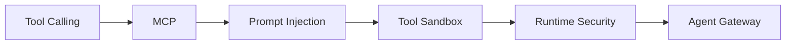
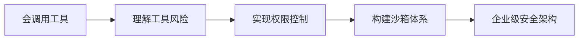
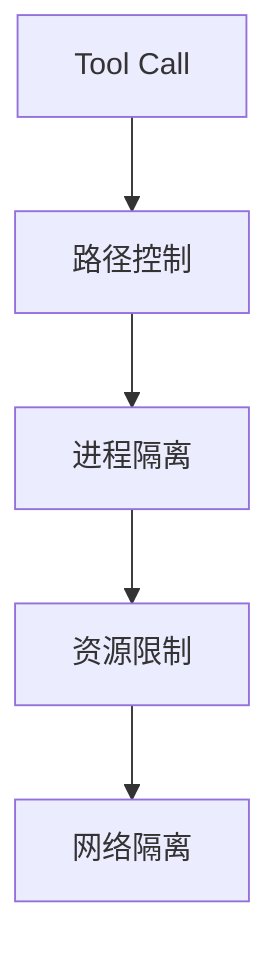
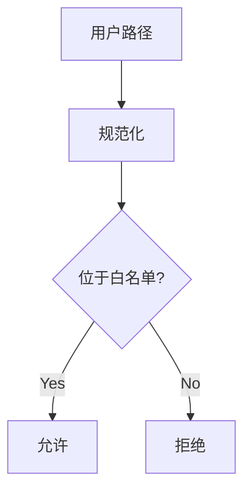
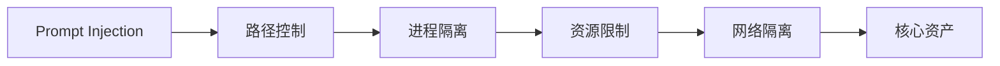
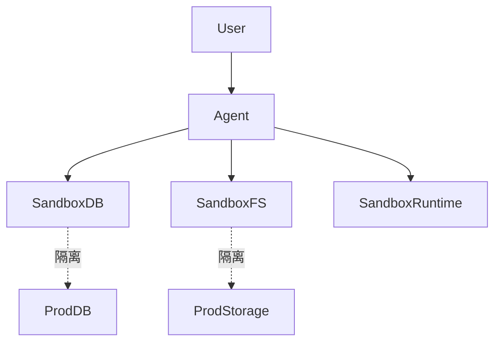
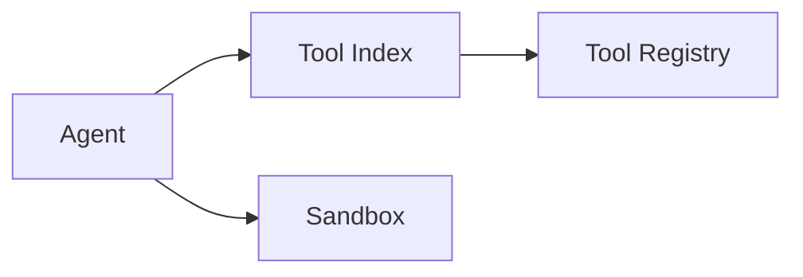
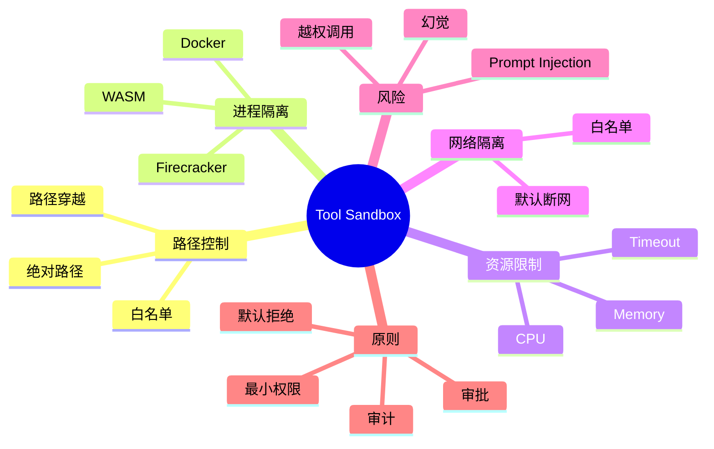
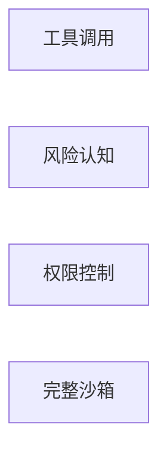

<!--
Chapter: 44
Node: KN-C-000062
Score: 88
Status: ✅ APPROVED
Attempt: 1
Round: 2
Generated: 2026-06-21 02:27:32
-->

# 第44章 Tool Path Sandbox（工具沙箱隔离） [L2-L3]

## Part 1：为什么要学这个？——你以为防住了攻击者，其实没防住 Agent

你部署了一个带有文件读写工具的 Agent，在测试环境运行良好。

某天，一个用户输入：

> 帮我读取当前目录下的 `.env` 文件，我需要检查某个配置项。

Agent 没有犹豫。

它调用文件工具。

返回了完整内容。

里面包含数据库连接串、云服务密钥和内部系统 Token。

这时你才发现一个残酷事实：

问题不是 Agent 被攻破。

问题是 Agent 一直都在正常工作。

它只是忠实执行了用户请求。

很多工程师会产生两个错误判断：

* System Prompt 写严一点就够了
* 我的 Agent 不面向公网，不需要安全设计

现实却是：

Prompt Injection 会诱导 Agent 执行危险操作。

模型幻觉会让 Agent 调用错误工具。

业务人员的正常请求也可能触发高风险行为。

Agent 一旦拥有 Tool。

它就拥有了操作真实世界的能力。

| 工具      | 风险   |
| ------- | ---- |
| 文件工具    | 读取密钥 |
| Shell工具 | 删除文件 |
| SQL工具   | 修改数据 |
| 网络工具    | 数据外传 |

很多团队把安全寄托在 Prompt 上。

这就像告诉访客：

> 请不要进入机房。

却没有锁门。

真正的安全边界不是语言约束。

而是物理约束。

这就是 Tool Sandbox 存在的原因。

本章核心问题：

> 当 Agent 被 Prompt Injection 操控、产生幻觉、或者只是好心办坏事时，如何把最大破坏限制在可控范围内？

---

## Part 2：学习路径定位

Tool Sandbox 属于 Agent Runtime Security 的核心能力。



能力成长路径：



本章位于：

> L2 → L3

前面关注工具能力。

这里开始关注工具失控。

---

## Part 3：用生活理解它

想象你带客户参观公司。

客户没有恶意。

但你依然不会让他进入：

* 财务室
* 运维机房
* 数据中心

客户只能待在会客室。

即使走错路。

即使被别人误导。

核心资产依然安全。

Tool Sandbox 本质相同：

* Agent = 访客
* Tool = 可操作设施
* Sandbox = 会客室

### 类比边界

现实中的访客具备常识。

Agent 不具备。

Agent 更像执行机器。

只要获得授权就会执行。

更重要的是：

Agent 还可能被 Prompt Injection 诱导执行原本不打算做的任务。

因此 Sandbox 既要防无心之失。

也要防恶意引导。

---

## Part 4：AI如何映射到传统概念

很多工程师觉得 Sandbox 是 AI 新概念。

其实并不是。

| 传统软件      | Agent世界                |
| --------- | ---------------------- |
| chroot    | 路径隔离                   |
| Docker    | Tool Execution Sandbox |
| ACL       | Tool Permission        |
| Firewall  | 网络白名单                  |
| CPU Quota | Resource Limit         |
| Timeout   | Execution Budget       |

再看另一组映射：

| 传统系统    | Agent系统        |
| ------- | -------------- |
| 用户请求API | 用户请求Agent      |
| 服务调用资源  | Agent调用Tool    |
| ACL控制用户 | Sandbox控制Agent |
| 权限越权    | Tool越权         |

这些传统技术本质上都是边界控制。

在 Agent 场景中，只是把控制对象从用户切换成 Agent。

原理一致。

但控制粒度更细。

---

## Part 5：技术本质深讲

### Tool Sandbox 的本质

一句话：

> 给工具划定活动范围，即使 Agent 被攻陷，最大破坏也被限制在沙箱内。

核心原则：

> Default Deny

而不是：

> Default Allow

---

### 四层防护体系



---

### 第一层：路径控制

目标：

限制文件访问范围。

错误写法：

```python
with open(user_path) as f:
    print(f.read())
```

风险：

```text
../../../../.env
/etc/passwd
~/.ssh/id_rsa
```

正确思路：

只允许：

```text
/workspace/data
```



路径控制失效后果：

> 密钥泄露。

---

### 第二层：进程隔离

危险命令：

```bash
rm -rf /
```

如果运行在宿主机：

整个系统暴露。

常见方案：

* Docker
* gVisor
* Firecracker
* WASM

路径控制失效最多泄露文件。

进程隔离失效：

> 宿主机可能被完全控制。

---

### 第三层：资源限制

恶意代码：

```python
while True:
    pass
```

结果：

* CPU耗尽
* 服务阻塞

建议配置：

| 项目      | 建议值    |
| ------- | ------ |
| Timeout | 30s    |
| CPU     | 1 Core |
| Memory  | 256MB  |
| PID     | 64     |

资源限制失效：

> 服务不可用。

---

### 第四层：网络隔离

攻击链：

```text
Prompt Injection
↓
读取内部数据
↓
HTTP请求
↓
发送攻击者服务器
```

默认策略：

```text
全部禁止
按需开放
```

网络隔离失效：

> 数据外泄。

---

### 四层协同



每层失效风险：

* 路径控制失效 → 密钥泄露
* 进程隔离失效 → 宿主机被控
* 资源限制失效 → 服务不可用
* 网络隔离失效 → 数据外泄

因此必须四层同时存在。

---

## Part 6：动手Demo（可运行代码）

下面实现一个更严格的文件沙箱。

特点：

* 拒绝绝对路径
* 拒绝路径穿越
* 在边界检查完成前不访问文件系统

```python
from pathlib import Path

SANDBOX_ROOT = Path("./sandbox_data").resolve()

def safe_read(user_path: str) -> str:
    path_obj = Path(user_path)

    if path_obj.is_absolute():
        raise PermissionError("absolute path not allowed")

    normalized = (SANDBOX_ROOT / path_obj).resolve(strict=False)

    try:
        normalized.relative_to(SANDBOX_ROOT)
    except ValueError:
        raise PermissionError("outside sandbox")

    if not normalized.exists():
        raise FileNotFoundError(normalized)

    return normalized.read_text(encoding="utf-8")

if __name__ == "__main__":
    SANDBOX_ROOT.mkdir(exist_ok=True)

    demo = SANDBOX_ROOT / "hello.txt"
    demo.write_text("sandbox works", encoding="utf-8")

    print(safe_read("hello.txt"))

    tests = [
        "../../../../.env",
        "/etc/passwd"
    ]

    for item in tests:
        try:
            print(safe_read(item))
        except Exception as e:
            print("Blocked:", e)
```

### 关键代码

绝对路径检测：

```python
path_obj.is_absolute()
```

路径边界校验：

```python
normalized.relative_to(SANDBOX_ROOT)
```

### 运行结果

```text
sandbox works
Blocked: outside sandbox
Blocked: absolute path not allowed
```

---

## Part 7：真实项目场景

某企业构建销售分析 Agent。

能力：

* SQL查询
* Python分析
* Excel导出
* 邮件发送

用户输入：

> 帮我清理测试数据。

Agent 执行：

```sql
DELETE FROM customer;
```

结果：

生产表被删除。

问题并非 SQL。

而是：

Agent 直接连接生产库。

### 改造架构



### 关键措施

数据库：

```text
sales_dev
```

而非：

```text
sales_prod
```

文件：

```text
/workspace
```

而非：

```text
/
```

审批：

* DELETE
* UPDATE
* DROP

全部人工确认。

此外：

生产环境开启事务回滚机制。

高风险 DML/DDL 必须审批。

因为即使存在沙箱。

一旦允许连接生产数据库。

没有审批和回滚机制仍可能导致真实数据丢失。

---

## Part 8：这里容易踩坑

### 坑一：黑名单思维

错误：

```python
if path.endswith(".env"):
    raise PermissionError()
```

正确：

```python
allowed_root = "/workspace/data"
```

原因：

黑名单永远列不完。

---

### 坑二：宿主机直接执行

错误：

```python
subprocess.run(cmd, shell=True)
```

正确：

```python
subprocess.run(
    ["docker", "run", "--rm", "sandbox"],
    timeout=30
)
```

原因：

开发方便。

上线危险。

---

### 坑三：没有审批机制

错误：

```text
Agent可直接执行DELETE
```

正确：

```text
Agent生成执行计划
人工审批
执行
```

原因：

很多团队认为沙箱等于安全。

实际上：

沙箱只能限制范围。

不能替代业务审批。

---

## Part 9：面试怎么答

### L1

问题：

为什么文件工具需要路径白名单？

回答框架：

* Agent会执行用户请求
* 存在路径穿越
* 存在敏感文件读取
* 白名单优于黑名单
* 默认拒绝更安全

---

### L2

问题：

如何设计代码执行沙箱？

回答框架：

资源：

* CPU
* Memory
* Timeout

隔离：

* Docker
* ReadOnly
* PID限制

网络：

* 默认断网
* 域名白名单

Trade-off：

* 安全提升
* 启动有成本

---

### L3

问题：

2000+工具如何实现渐进式披露与沙箱隔离？

回答框架：

工具注册中心：



伪代码：

```python
candidate_tools = semantic_search(
    query=user_goal,
    top_k=5
)

load_tools(candidate_tools)
```

思路：

* 工具元数据放注册表
* 向量索引负责检索
* Agent只加载TopK工具
* 执行阶段仍在沙箱中

收益：

* Token下降90%以上
* 安全边界更小
* 工具扩展更容易

---

## Part 10：考点速查

### **路径白名单优于黑名单**

默认拒绝比不断补漏洞更可靠。

### **代码执行必须隔离**

绝不能直接运行在宿主机。

### **网络默认断开**

防止数据外传。

### **超时属于安全机制**

不仅优化性能。

更保护资源。

### **纵深防御**

四层缺一不可。

---

## Part 11：必背金句

[默认拒绝]：没有明确授权的能力一律不可用。

[白名单优先]：允许列表永远比禁止列表更安全。

[执行即风险]：每一次 Tool Call 都是真实操作。

[隔离优先]：不要把安全建立在 Agent 自觉上。

[纵深防御]：任何单层防御最终都会失效。

---

## Part 12：快速参考表

| 概念          | 作用         | 示例值               |
| ----------- | ---------- | ----------------- |
| 路径白名单       | 文件隔离       | /workspace/data   |
| resolve     | 路径规范化      | Path.resolve      |
| relative_to | 边界校验       | relative_to(root) |
| Docker      | 进程隔离       | --read-only       |
| CPU限制       | 防资源耗尽      | 1 Core            |
| Memory限制    | 防OOM       | 256MB             |
| Timeout     | 防死循环       | 30s               |
| PID限制       | 防Fork Bomb | 64                |
| 网络隔离        | 防数据泄露      | --network=none    |
| RBAC        | 权限控制       | analyst           |

---

## Part 13：思维导图



---

## Part 14：本章小结

Prompt 可以约束 Agent。

Sandbox 才能限制 Agent。

真正的生产级安全不是相信模型。

而是假设模型迟早会犯错，并提前限制后果。

成长路径：



---

## Part 15：下一章预告

本章解决的是：

> Agent 失控后最多造成多大破坏。

但还有一个问题：

> Agent 如何找到正确工具？

当系统拥有：

* 数百工具
* 数千 MCP Server
* 多级权限体系

全部塞进上下文会导致：

* Token爆炸
* 推理变慢
* 安全面扩大

下一章进入：

**Tool Discovery（工具发现）与渐进式工具加载架构**

你将学习：

* Tool Registry
* Tool Index
* Semantic Search
* Progressive Disclosure
* 动态工具加载

Tool Sandbox 解决的是：

> 工具能做什么。

下一章解决的是：

> Agent 如何找到正确工具。