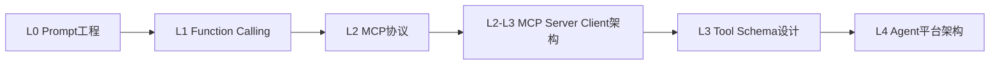
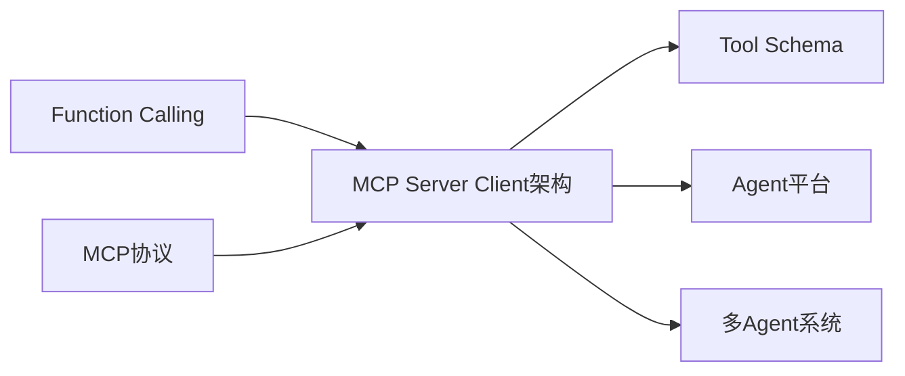
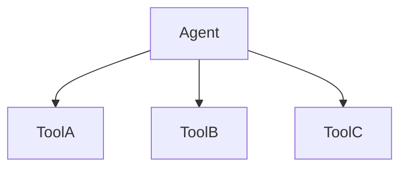
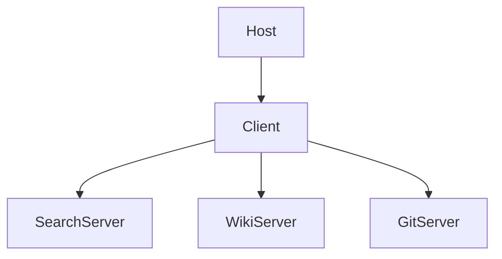
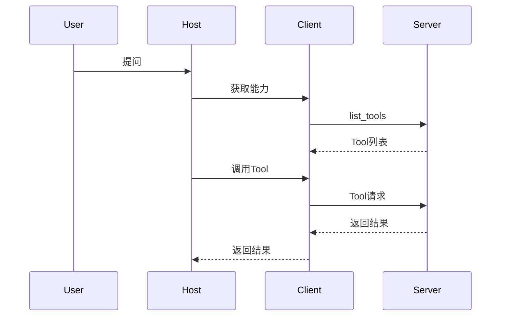
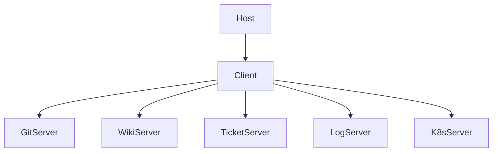
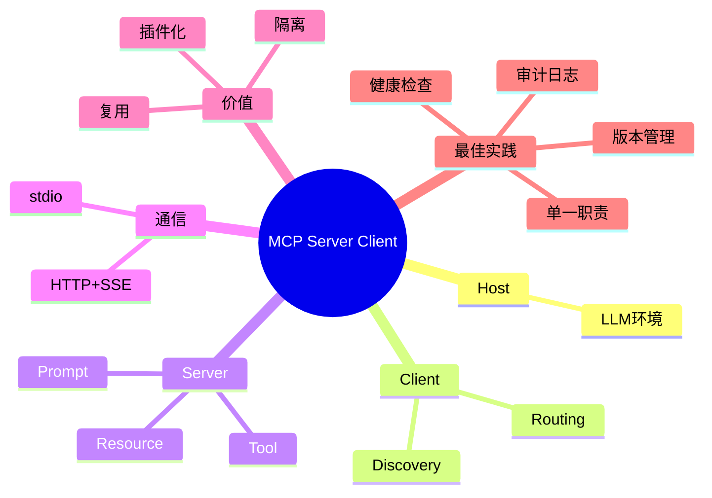

<!--
Chapter: 46
Node: KN-C-000064
Score: 91
Status: ✅ APPROVED
Attempt: 1
Round: 2
Generated: 2026-06-21 02:41:50
-->

# 第46章 MCP Server / Client 架构 [L2-L3]

## Part 1：为什么要学这个？[认知冲突先行]

你花了三周时间构建了一个 AI 客服 Agent。

核心代码里写死了：

* 查询订单
* 查询物流
* 搜索知识库
* 创建工单
* 查询用户信息

系统上线后一切正常。

突然有一天，产品经理说：

> 公司新上线了一套工单系统，Agent 也要支持。

于是你：

* 修改 Tool 代码
* 重新测试
* 重新发布

几天后工单系统 API 升级。

你又重复一遍。

大多数工程师会认为：

> 新增工具就改代码，这不是理所当然吗？

问题就在这里。

浏览器安装一个新插件，不需要重新编译浏览器。

为什么很多 AI Agent 增加一个工具却要改核心代码？

因为你把工具当成了应用的一部分。

而 MCP 认为：

> 工具应该是独立能力，而不是应用源码的一部分。

本章要解决的问题：

> 如何让 AI 应用像浏览器安装插件一样扩展能力，而不修改核心代码？

---

## Part 2：学习路径定位

MCP Server / Client 架构属于 MCP 的架构层知识。



### 前置知识与后续知识



L2 掌握协议层：

* MCP 是什么
* Tool/Resource/Prompt 是什么

L3 掌握架构层：

* Tool 放在哪里
* Server 如何拆分
* 如何实现能力扩展

本章横跨 L2 与 L3，是后续 Tool Schema 设计的基础。

---

## Part 3：用生活理解它

把 MCP 想成智能家居系统。

你手机里的控制 App 不需要为每个设备重写。

只要新设备遵守统一协议：

* 智能灯
* 智能窗帘
* 扫地机器人

都能被自动发现。

对应关系：

* App = Host
* 协议层 = Client
* 智能设备 = Server

新增设备：

> 增加 Server 即可。

### 类比边界

真实 MCP Server：

* 可以远程部署
* 可以做权限控制
* 可以同时服务多个 Client
* 可以暴露复杂业务能力

因此不能把它简单理解成智能设备。

---

## Part 4：AI 如何映射到传统概念

| 传统软件     | MCP世界          |
| -------- | -------------- |
| 浏览器      | Host           |
| 插件管理器    | Client         |
| 浏览器插件    | Server         |
| RPC      | Tool Call      |
| REST API | Tool           |
| 微服务      | MCP Server     |
| 服务发现     | Tool Discovery |

### 架构变化

传统模式：



MCP 模式：



新增工具：

传统模式：

* 改代码
* 发布

MCP 模式：

* 部署新 Server

结束。

---

## Part 5：技术本质深讲

### 三个角色

#### Host

运行 LLM 的环境。

例如：

* Claude Desktop
* Cursor
* 自研 Agent

职责：

* 推理
* 会话管理

#### Client

嵌入 Host。

职责：

* 连接 Server
* 能力发现
* 请求转发

#### Server

能力提供者。

可暴露：

* Tool
* Resource
* Prompt

### 工作流程



### stdio 与 HTTP+SSE

#### stdio


特点：

* 本地通信
* 延迟低

关键点：

> stdio 模式下，Server 通常由 Client 启动并管理生命周期。

适用于：

* Claude Desktop
* Cursor

#### HTTP+SSE


特点：

* 跨机器
* 云部署

关键点：

> HTTP+SSE 模式下，Server 独立运行，不依赖 Client 启动。

适用于：

* Kubernetes
* 企业平台

### 技术本质

MCP 不是简单工具协议。

它实现的是：

> Tool 能力与 Agent 核心代码解耦。

从而获得：

* 插件化
* 故障隔离
* 能力复用
* 独立部署

---

## Part 6：动手 Demo（可运行代码）

```python
from typing import Dict, Callable


class MCPServer:
    def __init__(self, name: str):
        self.name = name
        self.tools: Dict[str, Callable] = {}

    def register_tool(self, tool_name: str, func: Callable):
        self.tools[tool_name] = func

    def list_tools(self):
        return list(self.tools.keys())

    def call_tool(self, tool_name: str, *args):
        if tool_name not in self.tools:
            raise ValueError(f"Tool not found: {tool_name}")
        return self.tools[tool_name](*args)


class MCPClient:
    def __init__(self):
        self.tool_router = {}

    def connect_server(self, server: MCPServer):
        for tool in server.list_tools():
            self.tool_router[tool] = server

    def call_tool(self, tool_name: str, *args):
        if tool_name not in self.tool_router:
            raise ValueError(f"Unknown tool: {tool_name}")

        server = self.tool_router[tool_name]
        return server.call_tool(tool_name, *args)


def search_docs(keyword):
    return f"搜索结果: {keyword}"


def query_ticket(ticket_id):
    return f"工单: {ticket_id}"


search_server = MCPServer("search")
search_server.register_tool("search_docs", search_docs)

ticket_server = MCPServer("ticket")
ticket_server.register_tool("query_ticket", query_ticket)

client = MCPClient()

client.connect_server(search_server)
client.connect_server(ticket_server)

print(client.call_tool("search_docs", "MCP"))
print(client.call_tool("query_ticket", "T-1001"))
```

### 运行结果

```text
搜索结果: MCP
工单: T-1001
```

### 关键点

新增 Server：

```python
client.connect_server(new_server)
```

无需修改 Host。

---

## Part 7：真实项目场景

某 SaaS 公司使用 Claude Desktop 构建内部 AI 助手。

初期：

* Git
* Wiki
* 日志

三个工具。

后期扩展到：

* 工单系统
* Kubernetes
* 数据仓库
* 运维平台

工具数量超过 15 个。

### 重构方案



### 迁移策略

没有直接切换。

采用双轨制：

* 旧 Tool 继续运行
* 新 MCP Server 并行运行

通过 Feature Flag：

* 10%流量
* 30%流量
* 100%流量

逐步迁移。

两周稳定后下线旧实现。

### 收益

| 指标     | 改造前 | 改造后   |
| ------ | --- | ----- |
| 新工具上线  | 2天  | 20分钟  |
| 可用性    | 95% | 99.5% |
| Tool数量 | 5   | 12+   |

---

## Part 8：这里容易踩坑

### 坑1：所有工具塞进一个 Server

错误：

```text
mega-server
```

正确：

```text
git-server
wiki-server
ticket-server
```

原因：

Server 应该代表职责边界。

---

### 坑2：不做健康检查

错误：

```python
def start():
    print("ok")
```

正确：

```python
def start():
    check_db()
    check_api_key()
```

原因：

快速失败比运行时失败更安全。

---

### 坑3：无权限控制

错误：

```python
def call_tool(req):
    return run(req)
```

正确：

```python
def call_tool(req):
    verify_token(req)
    return run(req)
```

原因：

避免未授权访问敏感工具。

---

## Part 9：面试怎么答

### L1

Host、Client、Server 分别负责什么？

回答要点：

* Host 负责 LLM
* Client 负责协议通信
* Server 提供能力
* 一个 Host 可连接多个 Server

### L2

什么时候选 stdio？

什么时候选 HTTP+SSE？

回答要点：

* stdio：本地进程，由 Client 启动
* HTTP+SSE：远程部署，独立服务
* 根据部署方式决定

### L3

多个 Client 并发访问怎么办？

回答框架：

* 无状态优先
* 连接池
* 文件锁
* 事务隔离

状态场景：

例如分页查询。

不要把状态放在连接里。

应该设计：

* session_id
* Redis 持久化状态

这样 Server 才能水平扩展。

关键观点：

> MCP 支持多 Client 并发，但状态管理属于 Server 实现责任。

---

## Part 10：考点速查

### **Host / Client / Server**

三层职责划分。

### **Discovery**

能力自动发现。

### **Multiple Server**

一个 Host 可以连接多个 Server。

### **stdio vs HTTP+SSE**

本地与远程部署差异。

### **Single Responsibility**

Server 单一职责原则。

---

## Part 11：必背金句

**[插件化原则]：新增工具应该新增 Server，而不是修改 Host。**

**[单一职责原则]：一个 Server 只负责一个能力域。**

**[能力发现原则]：Tool 应由 Client 动态发现，而非静态写死。**

**[故障隔离原则]：Server 独立进程，问题限制在局部。**

**[协议优先原则]：Host 不关心工具实现，只关心 MCP 协议。**

**[架构决策原则]：当工具数量超过 5 个或团队超过 3 人时，从内置 Tool 迁移到 MCP Server 架构通常是值得的技术投资。**

---

## Part 12：快速参考表

| 概念        | 作用    | 示例             |
| --------- | ----- | -------------- |
| Host      | 运行环境  | Claude Desktop |
| Client    | 通信层   | MCP Client     |
| Server    | 能力提供者 | Git Server     |
| Tool      | 函数能力  | search_docs    |
| Resource  | 数据资源  | wiki_page      |
| Prompt    | 模板    | review_prompt  |
| Discovery | 能力发现  | list_tools     |
| stdio     | 本地通信  | Cursor         |
| HTTP+SSE  | 远程通信  | K8s服务          |
| Router    | 请求路由  | Tool→Server    |

---

## Part 13：思维导图



---

## Part 14：本章小结

MCP Server / Client 架构解决的是工具管理问题，而不仅仅是工具调用问题。

通过 Host、Client、Server 解耦，工具能力变成独立部署的服务，而不是 Agent 内部代码。

从 L2 的协议理解走向 L3 的架构设计，是构建企业级 Agent 平台的重要一步。

---

## Part 15：下一章预告

这一章解决了：

> Tool 放在哪里。

但还有一个问题：

即使拥有几十个 MCP Server，模型如何知道：

* 什么时候调用？
* 调哪个？
* 参数怎么填？

答案藏在 Tool Schema 中。

下一章：

**Tool Schema Design（工具接口设计）**

你将学习：

* description 如何影响工具命中率
* 参数设计如何影响推理质量
* 企业级 Tool Schema 编写规范
* 如何让模型在正确时机调用正确工具

真正打通 MCP 工具生态的最后一公里。