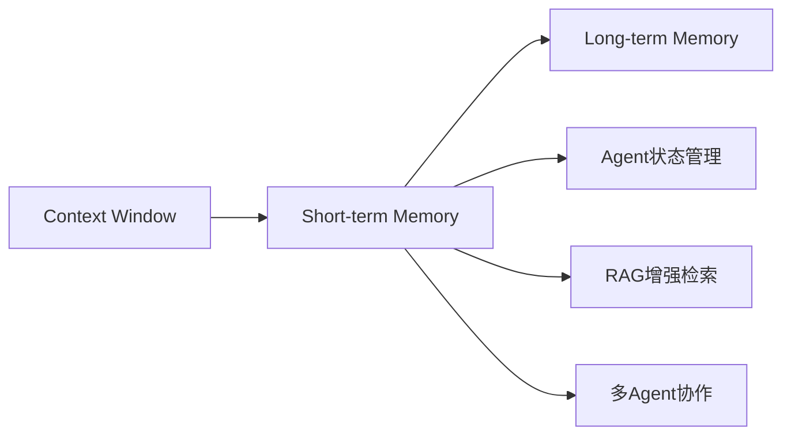
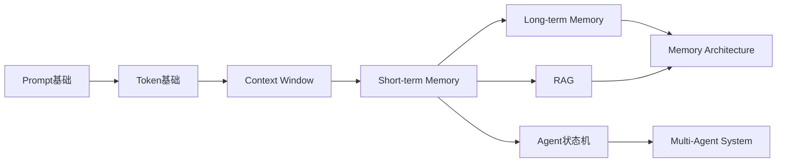
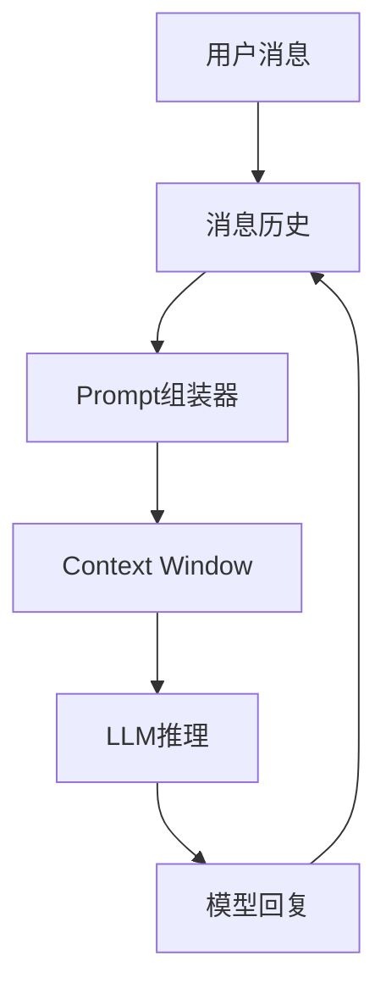
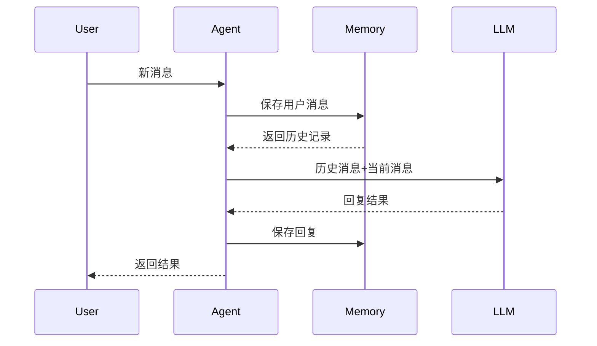
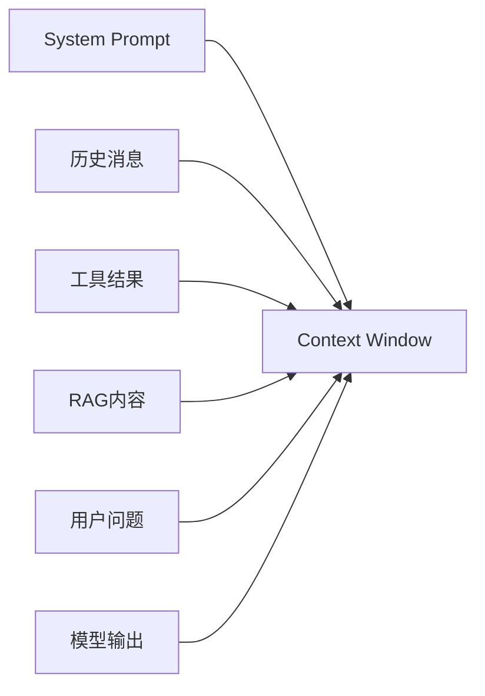
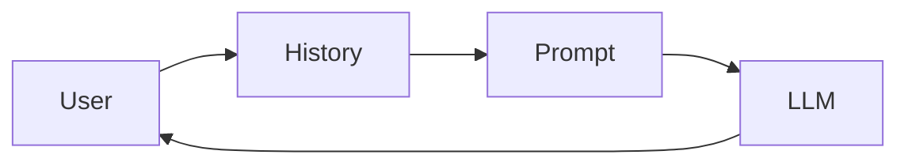
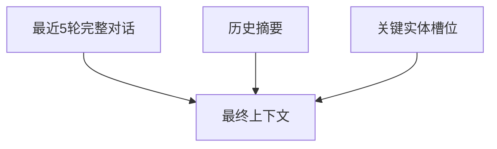
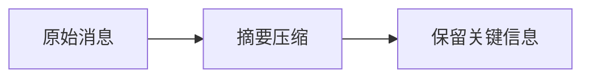
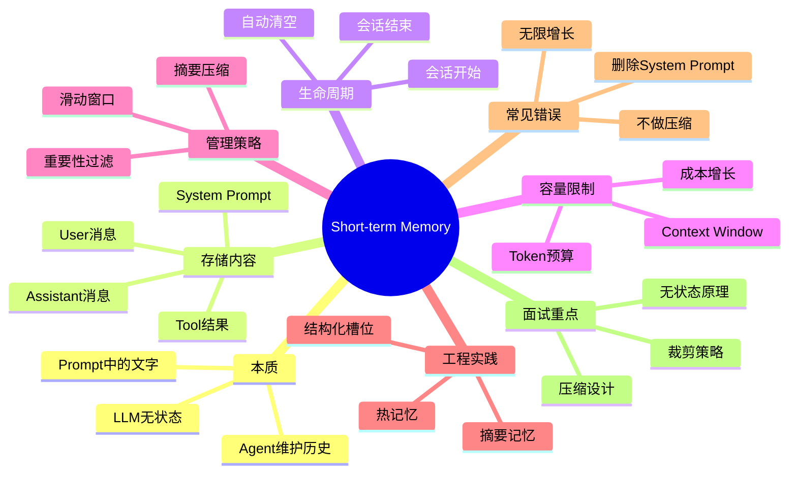

<!--
Chapter: 47
Node: KN-C-000065
Score: 88
Status: ✅ APPROVED
Attempt: 1
Round: 2
Generated: 2026-06-21 03:36:31
-->

# 第47章 Short-term Memory（短期记忆） [L1-L2]

## Part 1：为什么要学这个？[认知冲突先行]

你在开发一个 AI 客服 Agent。

用户连续问了 5 个问题：

* “帮我查一下订单状态”
* “这个订单什么时候发货？”
* “如果超时没收到怎么办？”
* “退款规则是什么？”
* “那第一个问题的答案能再详细点吗？”

测试时你突然发现：

Agent 完全懵了。

它不知道“第一个问题”是什么。

你很困惑：

> 我明明已经把历史对话全部拼进 Prompt 了，它为什么还是“不记得”？

很多工程师第一次接触 Agent 时都有一个误解：

他们以为：

> 把历史消息拼进 Prompt = LLM 记住了历史

听起来很合理。

但这其实和真实情况差得很远。

想象两种场景：

场景 A：

你亲自参加了整个会议。

场景 B：

有人把会议记录打印出来交给你。

虽然你都能回答问题，但两者本质不同。

前者拥有连续状态。

后者只是一次性阅读文本。

LLM 属于后者。

它不会把上一轮对话“存进脑子”。

它每次调用时，都会重新读取你传进去的全部文本。

换句话说：

> LLM 没有记忆，只有上下文。

真正保存记忆的不是模型。

而是你的 Agent 程序。

这也是很多人第一次设计 Memory 系统时最容易产生的认知偏差：

* 以为记忆存在模型内部
* 实际记忆存在 Prompt 外部
* 以为模型持续思考
* 实际模型每次都是重新阅读

本章要解决的核心问题是：

**如果 LLM 天生无状态，那么 Agent 是如何实现“记住刚才说过什么”的？**

同时我们还会回答几个关键工程问题：

* 短期记忆到底存在哪里？
* Context Window 为什么会溢出？
* 为什么长对话成本会越来越高？
* Agent 如何管理和裁剪历史消息？
* 短期记忆与长期记忆的边界在哪里？

---

## Part 2：学习路径定位

Short-term Memory 是 Agent Memory 模块中最基础的一层。

如果没有短期记忆：

* Agent 无法连续对话
* 无法完成多步任务
* 无法引用之前的信息
* 无法进行链式推理

它位于 Agent 学习路径中的核心位置。



从整体学习路线看：



理解短期记忆之后，你才能真正理解：

> Agent 为什么看起来像“有记忆”，但本质上依然是无状态系统。

---

## Part 3：用生活理解它

把短期记忆想象成会议室里的白板。

开会过程中：

* 大家把讨论内容写到白板上
* 新参与者通过阅读白板理解上下文
* 后续讨论基于白板继续展开

这就像 Agent 把历史消息拼进 Prompt。

LLM 每次回答前：

都会重新阅读这块“白板”。

会议结束：

白板被擦掉。

下一场会议重新开始。

这就像会话结束后短期记忆消失。

### 类比成立的部分

* 白板 = Context Window
* 白板内容 = 消息历史
* 阅读白板 = LLM读取Prompt
* 擦除白板 = 会话结束

### 类比失效的部分

人类参加会议后会形成内部记忆。

LLM 不会。

即使刚刚读完白板，

下一次 API 调用时它依然会忘记。

必须重新把白板内容交给它。

因此：

> 人类的记忆在脑子里，LLM 的“记忆”在 Prompt 里。

---

## Part 4：AI如何映射到传统概念

很多后端工程师第一次接触 Memory 时容易困惑。

因为“记忆”这个词听起来像 JVM 内存、Redis Cache 或数据库。

实际上都不完全对应。

下面是比较准确的映射关系。

| 传统软件概念          | AI Agent对应概念           |
| --------------- | ---------------------- |
| Session         | 会话上下文                  |
| Request Context | Context Window         |
| 内存对象            | Messages列表             |
| Cache           | Memory Store           |
| 数据库             | Long-term Memory       |
| HTTP无状态请求       | LLM API调用              |
| Session恢复       | Memory Replay          |
| 日志回放            | Context Reconstruction |

进一步理解：

| 传统开发        | Agent开发          |
| ----------- | ---------------- |
| 服务保存Session | Agent保存Messages  |
| 请求带Cookie   | Prompt带历史消息      |
| 服务读取Session | LLM读取上下文         |
| Session过期   | Context被裁剪       |
| 数据持久化       | Long-term Memory |

最关键的一点：

传统 Web 系统里：

```text
用户状态
↓
保存在服务端
↓
请求时读取
```

Agent 系统里：

```text
消息历史
↓
保存在Agent程序
↓
调用时重新拼接Prompt
```

所以：

> Agent 的短期记忆更接近 Session，而不是数据库。

---

## Part 5：技术本质深讲

### 真正的本质

很多人会说：

> 短期记忆就是聊天记录。

这句话没错。

但不够深入。

更准确的说法是：

> 短期记忆是 Agent 维护的一组消息历史，并在每次 LLM 调用时重新注入 Context Window。

注意几个关键词：

* Agent维护
* 消息历史
* 每次重新注入
* Context Window

核心事实：

**LLM 本身没有状态。**

下面两个调用：

```python
response1 = llm.invoke("你好")
response2 = llm.invoke("我刚才说了什么？")
```

第二次调用时，

模型根本不知道第一次发生过什么。

因为两次调用彼此独立。

要实现记忆：

必须这样做：

```python
messages = [
    {"role": "user", "content": "你好"},
    {"role": "assistant", "content": "你好，请问有什么可以帮助你？"},
    {"role": "user", "content": "我刚才说了什么？"}
]
```

然后把整个 messages 一起发送。

模型才能理解：

“我刚才说了什么”中的“刚才”指代什么。

### 工作机制



注意：

模型回复生成后，

还会被写回 Memory。

这样下一轮才能继续引用。

### 一次完整调用过程



### 短期记忆包含什么

不仅仅是聊天记录。

实际生产环境通常包含：

| 内容          | 示例            |
| ----------- | ------------- |
| User消息      | 用户提问          |
| Assistant消息 | 模型回复          |
| Tool结果      | 搜索结果          |
| 中间状态        | 当前步骤          |
| 任务上下文       | 工作目标          |
| 系统指令        | System Prompt |

例如：

```python
[
  {"role":"system","content":"你是客服助手"},
  {"role":"user","content":"查询订单123"},
  {"role":"assistant","content":"订单已发货"},
  {"role":"tool","content":"物流信息..."},
  {"role":"assistant","content":"预计明天送达"}
]
```

### Context Window限制

短期记忆最大的敌人：

就是 Context Window。



它们共同竞争有限空间。

假设模型支持：

128K Tokens

并不意味着：

历史消息可以占满128K。

因为还要预留：

* System Prompt
* 工具结果
* 检索内容
* 输出空间

实际工程中常见预算：

| 模块            | Token预算 |
| ------------- | ------- |
| System Prompt | 5K      |
| Memory        | 40K     |
| RAG内容         | 15K     |
| 当前问题          | 2K      |
| 输出预留          | 10K     |

### 最简单的实现

下面是一个最小短期记忆实现。

```python
class AgentMemory:
    def __init__(self, max_messages=10):
        self.messages = []
        self.max_messages = max_messages

    def add_message(self, role, content):
        self.messages.append(
            {
                "role": role,
                "content": content
            }
        )

        if len(self.messages) > self.max_messages:
            self.messages.pop(0)

    def get_context(self):
        return self.messages


memory = AgentMemory()

memory.add_message(
    "user",
    "帮我分析销售数据"
)

memory.add_message(
    "assistant",
    "好的，请上传数据"
)

memory.add_message(
    "user",
    "重点关注第二列异常值"
)

for msg in memory.get_context():
    print(msg)
```

这个实现体现了短期记忆最核心的思想：

* 保存历史
* 每轮追加
* 超限裁剪
* 调用时整体发送

### 为什么必须管理记忆

很多团队上线后都会踩同一个坑：

历史无限增长。

结果：

* Token成本暴涨
* 响应速度下降
* Context溢出
* 模型性能下降

因此短期记忆本质上不是：

> 如何保存历史

而是：

> 如何在有限 Context Window 中保存最重要的历史

这也是后面所有 Memory Architecture、Long-term Memory、RAG Memory 设计的出发点。

记住本章最重要的一句话：

> 短期记忆不是 LLM 脑子里的东西，而是 Prompt 里的文字；记忆在外，状态在里。

## Part 6：动手Demo（可运行代码）

理解短期记忆最好的方式，不是看定义，而是亲手实现一个。

下面这个 Demo 模拟 Agent 的消息历史管理。

特点：

* 保存历史消息
* 保留 System Prompt
* 超出容量自动裁剪
* 每次调用返回完整上下文

```python
from collections import deque


class AgentMemory:
    def __init__(self, max_messages=6):
        self.system_prompt = {
            "role": "system",
            "content": "你是一个数据分析助手"
        }
        self.messages = deque()
        self.max_messages = max_messages

    def add_message(self, role, content):
        self.messages.append(
            {
                "role": role,
                "content": content
            }
        )

        while len(self.messages) > self.max_messages:
            self.messages.popleft()

    def get_context(self):
        return [self.system_prompt] + list(self.messages)


memory = AgentMemory(max_messages=4)

memory.add_message(
    "user",
    "帮我分析销售数据"
)

memory.add_message(
    "assistant",
    "好的，请上传文件"
)

memory.add_message(
    "user",
    "重点关注第二列"
)

memory.add_message(
    "assistant",
    "第二列是订单金额"
)

memory.add_message(
    "user",
    "找异常值"
)

for msg in memory.get_context():
    print(msg)
```

### 关键代码解析

```python
self.system_prompt = {
    "role": "system",
    "content": "你是一个数据分析助手"
}
```

固定保存 System Prompt。

无论怎么裁剪都不能删除。

```python
while len(self.messages) > self.max_messages:
    self.messages.popleft()
```

实现滑动窗口。

超过容量就删除最早消息。

```python
return [self.system_prompt] + list(self.messages)
```

组装最终 Prompt。

真实调用 LLM 时发送的就是这个结果。

### 运行后你会看到什么

假设最大容量为 4。

当第 5 条消息进入时：

```text
user: 帮我分析销售数据
assistant: 好的，请上传文件
```

会被裁剪掉。

最终保留：

```text
system: 你是一个数据分析助手
user: 重点关注第二列
assistant: 第二列是订单金额
user: 找异常值
```

这就是最基础的 Short-term Memory。

---

## Part 7：真实项目场景

### 电商客服 Agent

某头部电商平台每天处理超过 10 万次客服会话。

平均对话长度：

* 普通咨询：6~8轮
* 复杂投诉：20+轮

最初架构非常简单：



每轮调用都把全部历史消息塞进 Prompt。

开发团队认为：

> 反正 Context Window 有 128K，应该够用。

上线第三天问题出现了。

### 问题1：Context Overflow

复杂投诉场景：

```text
订单咨询
↓
物流查询
↓
售后申请
↓
退款沟通
↓
人工客服转接
```

历史累计：

90K+ Tokens

再加：

* System Prompt
* 工具结果
* 当前问题

直接突破限制。

报错率达到：

7.2%

### 问题2：用户体验崩溃

为了避免溢出。

团队开始粗暴裁剪：

```text
删除最早消息
↓
继续对话
```

结果用户问：

```text
刚才说的退货地址是什么？
```

Agent：

```text
请重新提供信息
```

用户体验急剧下降。

### 最终方案

采用三层记忆架构：



热记忆：

* 最近5轮完整消息

摘要记忆：

* 每3轮生成一次摘要

结构化记忆：

* 订单号
* 收货地址
* 客服承诺
* 退款金额

永不裁剪。

最终效果：

| 指标       | 优化前    | 优化后   |
| -------- | ------ | ----- |
| 上下文溢出率   | 7.2%   | 0.1%  |
| 重复询问信息   | 23%    | 2.1%  |
| 平均延迟     | 4.8秒   | 1.2秒  |
| 月Token成本 | $12000 | $7200 |

这就是工程级 Short-term Memory 的价值。

---

## Part 8：这里容易踩坑

### 错误1：裁剪掉 System Prompt

错误代码：

```python
messages.pop(0)
```

看起来没问题。

实际上：

```python
[
  system,
  user,
  assistant,
  user
]
```

删除后变成：

```python
[
  user,
  assistant,
  user
]
```

模型失去身份约束。

某金融 Agent 就曾因此跳过身份验证。

正确做法：

```python
system = messages[0]

history = messages[1:]

history.pop(0)

messages = [system] + history
```

System Prompt 永远保留。

---

### 错误2：历史无限增长

错误代码：

```python
messages.append(new_message)
```

没有任何限制。

运行一个月后：

```text
10轮
20轮
50轮
100轮
```

Prompt 成本线性增长。

正确做法：

```python
MAX_TOKENS = 64000

if token_count > MAX_TOKENS:
    compress_history()
```

必须建立预算机制。

---

### 错误3：只做裁剪不做摘要

错误方案：

```text
旧消息
↓
直接删除
```

问题：

用户引用历史内容时无法回答。

正确方案：



保留语义而不是直接遗忘。

---

### 为什么这些错误如此常见

因为很多开发者把 Memory 理解成：

```text
存储问题
```

实际上：

```text
信息管理问题
```

真正困难的是：

> 什么该保留，什么该遗忘。

---

## Part 9：面试怎么答

### L1：LLM 是无状态的，那 Agent 如何记住历史？

#### 回答框架

1. LLM API 调用彼此独立
2. 模型本身不保存状态
3. Agent 维护 messages 列表
4. 每次调用重新传入历史消息

示意：

```python
messages = [
    {"role": "user", "content": "..."},
    {"role": "assistant", "content": "..."}
]
```

核心结论：

> Memory 在 Agent 代码里，不在模型里。

---

### L2：Context Window 满了怎么办？

#### 回答框架

三种主流策略：

| 策略    | 优点     | 缺点     |
| ----- | ------ | ------ |
| 滑动窗口  | 简单     | 丢失早期信息 |
| 摘要压缩  | 保留语义   | 增加计算成本 |
| 重要性过滤 | 保留关键事实 | 实现复杂   |

补充：

关键事实可以进入长期记忆。

需要时重新检索。

---

### L3：如何设计最小信息损失压缩方案？

#### 回答框架

先区分任务类型：

推理型任务：

```text
保留完整推理链
```

客服型任务：

```text
摘要压缩
```

关键实体：

```text
结构化保存
```

设计原则：

```text
热记忆
+
摘要记忆
+
关键实体
```

评价指标：

* Recall
* Token压缩率
* 响应延迟
* 用户满意度

---

## Part 10：考点速查

### **LLM本身无状态**

每次 API 调用完全独立。

---

### **短期记忆存储在 Context Window**

本质是 Prompt 中的消息历史。

---

### **Context Window 有容量限制**

超出后模型无法访问对应内容。

---

### **裁剪必须保留 System Prompt**

否则模型失去角色约束。

---

### **三种主流上下文管理策略**

滑动窗口、摘要压缩、重要性过滤。

---

## Part 11：必背金句

### [无状态原则]

LLM 每次调用都是一次全新的推理过程。

### [记忆外置原则]

记忆存在 Prompt 外，不存在模型参数里。

### [窗口有限原则]

Context Window 永远是稀缺资源。

### [System保护原则]

裁剪历史时永远不要删除 System Prompt。

### [压缩优于遗忘原则]

摘要保留信息价值，直接删除只会损失上下文。

---

## Part 12：快速参考表

| 概念                | 作用     | 示例值         |
| ----------------- | ------ | ----------- |
| Short-term Memory | 保存会话历史 | Messages    |
| Context Window    | 模型可见范围 | 128K Tokens |
| System Prompt     | 定义行为约束 | 你是客服助手      |
| Sliding Window    | 删除旧消息  | 最近10轮       |
| Summary Memory    | 历史压缩   | 200字摘要      |
| Importance Filter | 保留关键事实 | 订单号         |
| Hot Memory        | 最近上下文  | 最近5轮        |
| Token Budget      | 成本控制   | 64K         |
| Tool Result       | 工具返回内容 | 搜索结果        |
| Long-term Memory  | 持久存储   | 向量数据库       |

---

## Part 13：思维导图



---

## Part 14：本章小结

短期记忆并不是模型内部的记忆，而是 Agent 在外部维护的消息历史，并在每次调用时重新注入 Prompt。

LLM 天生无状态，连续对话能力来自 Context Window 中保存的上下文，而不是模型参数发生了变化。

从成长路径看：

```text
L0：知道消息历史会被拼进Prompt

↓

L1：理解短期记忆本质是Context Window管理

↓

L2：能够设计裁剪、摘要和预算策略

↓

L3：构建完整Memory Architecture
```

本章最重要的记忆锚点：

> 短期记忆是 Prompt 里的文字，不是 LLM 脑子里的东西；记忆在外，状态在里。

---

## Part 15：下一章预告

这一章解决了：

```text
Agent 如何记住当前会话
```

但一个更大的问题出现了：

```text
会话结束之后怎么办？
```

用户今天说：

```text
我是VIP客户
```

三天后再次登录：

```text
帮我查订单
```

短期记忆已经消失。

Agent 为什么还能知道：

```text
这是同一个用户
```

答案已经超出了 Context Window 的能力范围。

因为：

```text
短期记忆
≠
长期记忆
```

下一章我们将进入 Agent Memory 的第二层：

**Long-term Memory（长期记忆）**

你将学习：

* 长期记忆与短期记忆的根本区别
* 为什么向量数据库会成为 Agent 的“外部大脑”
* 用户画像如何长期保存
* Memory Retrieval 如何工作
* Agent 如何跨会话持续成长

当你理解长期记忆之后，Agent 才真正开始从“会聊天”进化到“会记人”。