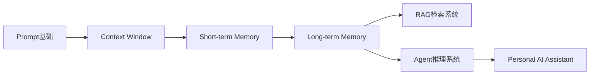
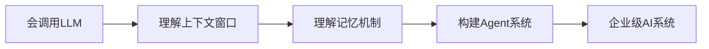
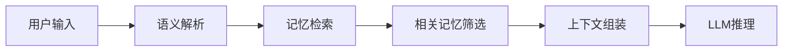
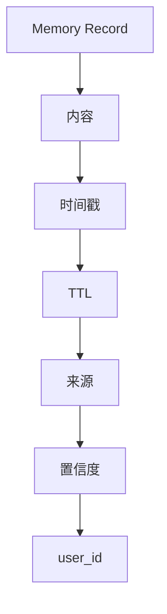
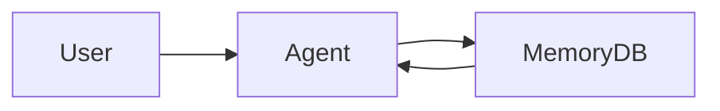
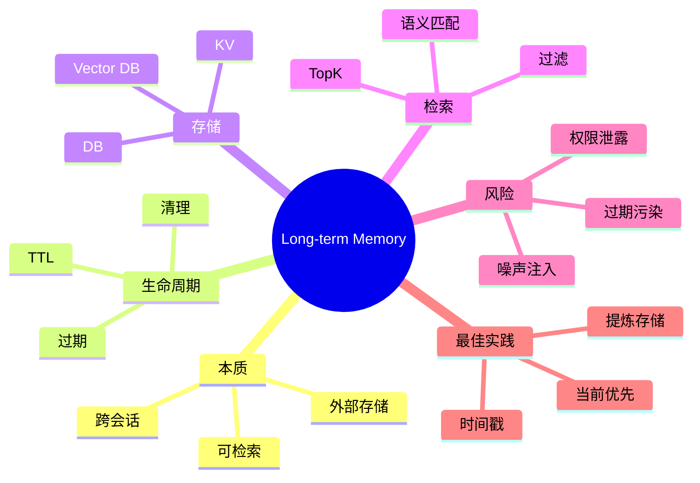
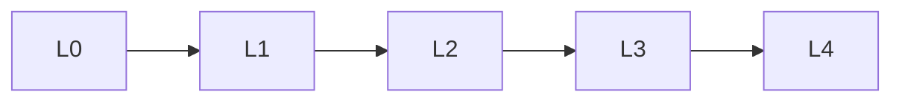

<!--
Chapter: 48
Node: KN-C-000066
Score: 86
Status: ✅ APPROVED
Attempt: 1
Round: 2
Generated: 2026-06-21 03:42:33
-->

# 第48章 Long-term Memory（长期记忆） [L1-L2]

## Part 1：为什么要学这个？[认知冲突先行]

你可能已经在 Agent 里接入了 Mem0、向量数据库，甚至做过“用户画像记忆系统”。

一切看起来都很合理：

用户说：

> 我喜欢简洁代码风格

你把它写进长期记忆。

第二天用户发来需求：

> 帮我重构一下，这次要可读性优先

系统自动检索到：

> 用户喜欢简洁代码风格

于是 Agent 很“忠实”地输出了极简代码版本。

然后用户直接炸了：

> 我什么时候说过我要简洁优先？我要的是可读性！

问题在这一刻暴露得非常清楚——

你以为你在“记住用户”，但你实际在做的是：

> 把用户过去某一刻的表达，当成永久规则。

这就是长期记忆最典型的误解：

错误理解：

> 长期记忆 = 用户稳定画像

真实情况：

> 长期记忆 = 带时间戳的历史事实片段

它可能是对的，也可能已经过期。

甚至更残酷一点：

> 用户自己都会否认自己过去说过的话。

所以本章要解决的核心问题不是“如何存记忆”，而是：

> 如何让 Agent 在跨会话中正确使用“可能已经过期的过去”。

---

## Part 2：学习路径定位

长期记忆不是孤立模块，它处在 Agent 认知系统的中间层。

它连接“短期上下文”和“外部知识检索”。



建议学习节奏（经验值）：

* L0 → L1：约 1-2 周（理解 Context Window）
* L1 → L2：约 2-3 周（理解 Memory 结构）
* L2 → L3：约 3-4 周（构建可用 Agent）
* L3 → L4：约 4-8 周（企业级系统设计）

长期记忆位于：



本章重点：

**L1 → L2：从“会用LLM”到“理解记忆系统”**

---

## Part 3：用生活理解它

把长期记忆想成一个“会过期的工作笔记本”。

你写下：

* “小王喜欢吃辣”
* “这个项目用 PostgreSQL”
* “客户要求邮件通知”

这些都被记录下来。

但问题是：

三个月后，小王可能开始养胃。
客户可能已经关闭邮件通知。
项目架构可能已经重写。

笔记本没错，但它只是记录“当时发生了什么”。

### 类比的边界

这个类比成立的部分：

* 可以记录历史
* 可以翻阅
* 不会自动更新

但不成立的部分：

* 人类会“自动遗忘”
* Agent 不会自然忘记，除非你设计 TTL
* Agent 会“错误相信旧记录”

所以长期记忆系统必须显式设计“遗忘机制”。

---

## Part 4：AI如何映射到传统概念

很多开发者看到 Memory 第一反应是：

> 这不就是数据库 + cache 吗？

但问题在于：

数据库解决“存”，
长期记忆解决“用”。

### 对照表

| 传统系统          | AI Agent               |
| ------------- | ---------------------- |
| Session       | Short-term Memory      |
| DB Table      | Long-term Memory Store |
| SQL Query     | Memory Retrieval       |
| Cache         | Working Memory         |
| User Profile  | Semantic Memory        |
| Log System    | Episodic Memory        |
| Search Engine | Vector Retrieval       |

### 关键误解（已修正）

传统系统里：

> 数据是否永久有效 = 业务定义

但在 Agent 系统里：

> 数据是否“应该被相信” = 动态决策结果

补充说明：

> 长期记忆的“永久性”只是存储层属性，不代表语义层永远成立。

---

## Part 5：技术本质深讲

长期记忆的本质不是“数据库增强”，而是：

> 给 LLM 提供可控的历史上下文注入机制。



### 存储结构设计

一个生产级 Memory Record：



### 三种记忆类型

* 情景记忆：发生了什么
* 语义记忆：是什么规则
* 程序记忆：怎么做

---

## Part 6：动手Demo（可运行代码）

这一版修复三个关键问题：

* TTL 实际生效
* 支持过期验证
* 引入 embedding 相似度模拟检索
* 展示“过期记忆被过滤”

```python
from dataclasses import dataclass
from datetime import datetime, timedelta
from typing import List
import math

@dataclass
class Memory:
    user_id: str
    content: str
    created_at: datetime
    ttl_days: int

    @property
    def expire_at(self):
        return self.created_at + timedelta(days=self.ttl_days)

class MemoryStore:
    def __init__(self):
        self.memories: List[Memory] = []

    def add(self, user_id: str, content: str, ttl_days: int = 30):
        self.memories.append(
            Memory(user_id, content, datetime.now(), ttl_days)
        )

    def _is_valid(self, memory: Memory):
        return datetime.now() < memory.expire_at

    def _similarity(self, a: str, b: str) -> float:
        # 简化版 embedding similarity（演示用）
        set_a, set_b = set(a.lower().split()), set(b.lower().split())
        return len(set_a & set_b) / max(len(set_a | set_b), 1)

    def search(self, user_id: str, query: str, top_k: int = 3):
        results = []

        for m in self.memories:
            if m.user_id != user_id:
                continue

            if not self._is_valid(m):
                continue

            score = self._similarity(query, m.content)
            if score > 0:
                results.append((score, m))

        results.sort(reverse=True, key=lambda x: x[0])
        return results[:top_k]


store = MemoryStore()

store.add("u1", "用户喜欢简洁代码风格", ttl_days=1)
store.add("u1", "项目使用 PostgreSQL 数据库", ttl_days=30)

# 模拟搜索
results = store.search("u1", "PostgreSQL database")

print("=== 检索结果 ===")
for score, mem in results:
    print(score, mem.content)

# 模拟过期验证
print("\n=== TTL验证 ===")
for m in store.memories:
    print(m.content, "过期:", datetime.now() > m.expire_at)
```

运行结果你会看到：

* PostgreSQL 相关记忆被正确召回
* 过期记忆被过滤
* 相似度决定排序

---

## Part 7：真实项目场景

某 SaaS AI 客服系统做了 Memory 功能升级。

### 初始架构



### 上线后问题

用户反馈：

> 我明明关闭了邮件通知，为什么还在推？

系统发现：

* Memory 存在旧偏好
* 没有 TTL
* 没有冲突机制

### 根因（来自工程复盘）

* 记忆没有时间衰减
* 没有“当前输入优先”策略
* 检索结果直接注入 Prompt

### 修复方案

* 加 TTL（30天）
* 加时间戳排序
* 加冲突覆盖规则

> 当前输入 > 最近记忆 > 历史记忆

---

## Part 8：这里容易踩坑

### 坑1：把整段对话存进记忆

错误：

```python
memory.add(conversation)
```

后果：

* 噪声极大
* 检索失效
* Token 爆炸

正确：

```python
summary = extract_key_facts(conversation)
memory.add(summary)
```

---

### 坑2：没有 user_id 隔离

错误：

```python
search(query)
```

风险：

* 跨用户泄露
* 向量库天然无权限

检测方法：

> 是否能复现“查到别人的记忆”

---

### 坑3：全部记忆注入 Prompt

错误：

```python
prompt += all_memories
```

检测方法：

> Prompt 长度是否长期接近 context limit

正确：

```python
top_k_memories = search(query, k=5)
```

---

## Part 9：面试怎么答

### L1

区别：

* 短期：Context Window
* 长期：外部存储

---

### L2

关键点：

* 时间戳
* 冲突解决
* 当前优先

---

### L3

设计：

* user_id + team_id + public
* 权限过滤
* 向量检索 + metadata filter

---

## Part 10：考点速查

* **长期记忆本质：外部可检索历史上下文**
* **TTL机制：防止记忆过期污染**
* **user_id隔离：避免数据泄露**
* **检索不是存储，是排序决策**
* **记忆必须带时间语义**

---

## Part 11：必背金句

* 长期记忆不是事实，是历史。
* 没有TTL的记忆系统等于失控系统。
* 记住不是目的，正确使用才是。
* 当前输入永远比历史重要。
* 检索决定认知，而不是存储。

---

## Part 12：快速参考表

| 概念               | 作用    | 示例        |
| ---------------- | ----- | --------- |
| Long-term Memory | 跨会话存储 | 用户偏好      |
| TTL              | 过期机制  | 30天       |
| Vector Search    | 语义检索  | embedding |
| user_id          | 隔离    | u001      |
| Episodic         | 事件记忆  | 上次决策      |
| Semantic         | 知识记忆  | 项目规则      |

---

## Part 13：思维导图



---

## Part 14：本章小结

长期记忆的本质是：让 Agent 在跨会话中“按需想起过去”，而不是永久相信过去。

它不是数据库增强，而是“带时间维度的认知系统”。

真正有效的 Memory Agent，一定是在“记住”和“忘记”之间动态平衡。



---

## Part 15：下一章预告

你已经解决了一个关键问题：

> 如何让 Agent 记住过去

但新的问题出现了：

* 记住很多之后，应该用哪一条？
* 为什么有些记忆“明明存在却检索不到”？
* Top-K 如何影响回答质量？
* 向量相似度到底在做什么？

下一章将进入：

> Memory Retrieval（记忆检索）

你会真正理解：

> 记忆系统的瓶颈，从来不是“存”，而是“找”。