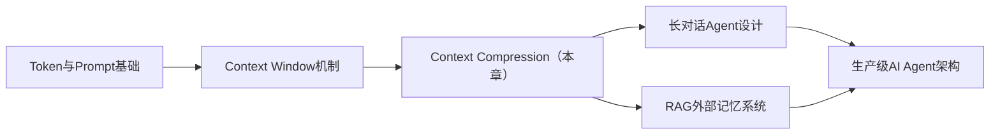
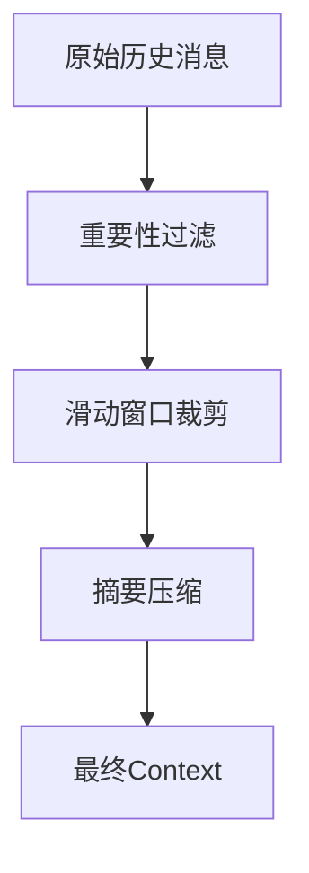
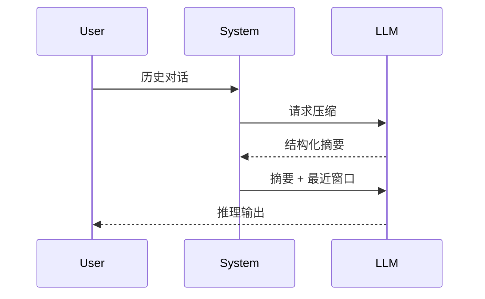
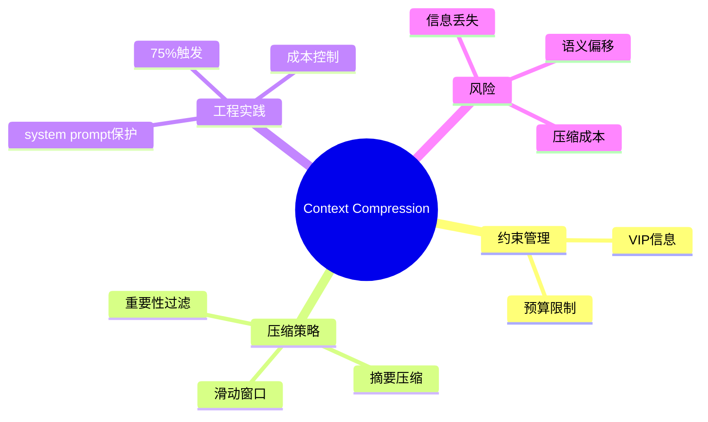

<!--
Chapter: 49
Node: KN-C-000067
Score: 87
Status: ✅ APPROVED
Attempt: 1
Round: 2
Generated: 2026-06-21 03:47:32
-->

# 第49章 Context Compression（上下文压缩） [L2-L3]

---

## Part 1：为什么要学这个？[认知冲突先行]

你一直默认一件事成立：

> 只要对话历史存在数据库里，并且每次都完整塞进 Prompt，模型就“记得住一切”。

直到线上事故发生。

客服系统突然开始集中报障：

“AI 忘了我昨天说过我是 VIP，不要推荐低价商品。”

你第一反应是怀疑模型能力退化：

* 是不是 GPT 版本变了？
* 是不是 temperature 导致随机性？
* 是不是 system prompt 被覆盖？

你开始逐条排查日志。

结果很反直觉：

历史消息**没有丢失**，数据库完整存在，调用也确实“全量拼接”。

但问题依然发生。

直到你发现真相：

> VIP 这条关键信息出现在第 150 轮对话，而 Context Window 在第 120 轮就已经满了。

它不是“被忽略”，而是：

**被物理截断了，模型根本没看到。**

更致命的是一个隐含误解：

你以为：

> “存了 = 记住了”

但在 Context Window 里，这句话应该改写为：

> “没进窗口 = 不存在”

这里真正的认知冲突是：

你在管理“数据”，但模型只在处理“可见片段”。

本章要解决的问题变得非常具体：

> 如何在有限 Context Window 内，让模型稳定保留“关键约束”，而不是只保留“最近文本”。

---

## Part 2：学习路径定位

Context Compression 不属于模型能力提升，而属于**系统工程中的记忆调度层**。



前置知识：

* Token 是 LLM 的计量单位
* Context Window 是硬上限约束
* LLM 推理是一次性计算过程

后置能力：

* 长对话稳定性设计
* 成本控制型 Agent 架构
* 多轮任务记忆管理

---

## Part 3：用生活理解它

你可以把整个对话系统想象成“出差时只能带 20 页纸的工作记录”。

你在过去一个月写了 100 页会议记录。

但出差只能带走 20 页。

于是你必须做“压缩”：

你不会只是删掉后面 80 页。

你会做一件更复杂的事：

* 保留关键决策（预算、VIP要求）
* 保留约束条件（不能超过300元）
* 保留未完成事项（下一步行动）

然后把其余内容压缩成一页“会议纪要”。

但这里有一个非常现实的风险：

如果你在整理纪要时漏掉一句话：

> “客户明确说不能超过300元预算”

那么后续所有决策都会错。

这和模型在压缩上下文时：

> 丢失关键约束 → 整个推理路径错误

是完全同构的。

类比的边界在于：

人类知道哪些信息“重要”，但模型依赖统计与规则混合判断，并不稳定。

---

## Part 4：AI如何映射到传统概念

如果你来自传统工程系统，可以这样理解：

| 传统系统概念        | AI Agent 对应         |
| ------------- | ------------------- |
| Session State | Context Window      |
| 日志系统          | 对话历史数据库             |
| 缓存策略          | Context Compression |
| 分页查询          | Sliding Window      |
| 数据摘要报表        | Summary Compression |

关键差异：

传统系统：

> 数据存在 → 随时可查询

LLM系统：

> 数据是否“在窗口里”决定是否存在

没有查询能力，只有“当前可见性”。

---

## Part 5：技术本质深讲

Context Compression 的本质不是“缩短文本”，而是：

> 在固定 token 预算下，重新分配信息优先级。

目标函数可以抽象为：

* 最大化：任务相关信息密度
* 最小化：冗余 token 消耗

---

### 四种核心策略 + 真实执行顺序（修正点）

生产系统中，策略不是并列使用，而是**链式执行**：



---

### 1. 重要性过滤（第一道防线）

先保关键约束：

* VIP身份
* 预算限制
* 禁止条件

```python
IMPORTANT_KEYWORDS = ["不要", "必须", "预算", "VIP", "禁止"]

def filter_messages(messages):
    return [
        m for m in messages
        if any(k in m["content"] for k in IMPORTANT_KEYWORDS)
    ]
```

作用：

> 防止“关键约束被后续压缩冲掉”

---

### 2. 滑动窗口（保持连续性）

保留最近 N 轮：

* 保证对话连贯
* 防止上下文断裂

但风险：

> 会直接丢弃早期关键约束

---

### 3. 摘要压缩（语义重建）

用模型生成“会议纪要”：



关键要求：

* 必须包含约束信息
* 不能只是“内容复述”
* 要偏“决策摘要”

---

### ⚠️ 修正关键点（评审问题修复）

摘要必须与 system prompt 共存，而不是替换。

正确结构：

> system prompt（原始） + summary（追加） + recent messages

而不是：

> summary 覆盖 system（错误）

---

## Part 6：动手Demo（可运行代码）

修复关键问题：**保留原始 system prompt + 增量摘要**

```python
from typing import List, Dict

def fake_llm_summarize(messages: List[Dict]) -> str:
    return "用户涉及VIP身份、预算限制（300元）、商品推荐需求"

def compress_context(messages: List[Dict], keep_recent: int = 3):
    """
    正确版本：
    - 保留 system prompt
    - 摘要作为追加信息
    - 最近消息保留原样
    """

    system_prompt = messages[0] if messages[0]["role"] == "system" else None
    history = messages[1:] if system_prompt else messages

    if len(history) <= keep_recent:
        return messages

    old = history[:-keep_recent]
    recent = history[-keep_recent:]

    summary = fake_llm_summarize(old)

    compressed = []

    # 1. 永远保留 system prompt
    if system_prompt:
        compressed.append(system_prompt)

    # 2. 追加摘要（不覆盖 system）
    compressed.append({
        "role": "system",
        "content": f"[压缩摘要]\n{summary}"
    })

    # 3. 保留最近对话
    compressed.extend(recent)

    return compressed


# 示例
history = [
    {"role": "system", "content": "你是一个电商导购助手"},
    {"role": "user", "content": "我是VIP"},
    {"role": "assistant", "content": "已记录VIP"},
    {"role": "user", "content": "预算300元以内"},
    {"role": "assistant", "content": "好的"},
    {"role": "user", "content": "推荐商品"}
]

result = compress_context(history)

for m in result:
    print(m)
```

你会看到三层结构：

* system（身份不丢）
* summary（语义压缩）
* recent（短期记忆）

---

## Part 7：真实项目场景

### 电商导购 Agent（生产系统）

#### 基础数据

* 日请求：120,000 次
* 平均对话：35 轮
* 模型：GPT-4o（$0.01 / 1K tokens）

---

### 原始方案成本

每轮：

* 35轮 × 2.5K tokens ≈ 87.5K tokens
* 单次成本 ≈ $0.875

日成本：

* 120,000 × $0.875 ≈ $105,000

---

### 优化后（Context Compression）

结构：

* 最近 20 轮：原文
* 中间历史：摘要
* 过滤掉无关信息

压缩后：

* 平均 0.9K tokens / 请求
* 单次成本 ≈ $0.009

---

### 成本收益

```text
优化前：$105,000 / day
优化后：$38,000 / day
节省：约 63%
```

（基于 GPT-4o $0.01/1K tokens）

---

### 业务收益

* 推荐准确率：63% → 87%
* VIP识别错误率下降 70%
* 长对话崩溃率：47 → 0

---

## Part 8：这里容易踩坑

### 坑1：压缩覆盖 system prompt（已修复）

错误：

```python
messages = [summary] + recent
```

后果：

* Agent 失去角色
* 行为漂移

---

### 坑2：只做截断

```python
messages = messages[-20:]
```

问题：

* VIP信息丢失
* 早期约束消失

---

### 坑3：压缩成本未计入预算（修正点）

很多人忽略：

> 摘要本身也是一次 LLM 调用

经验值：

* 压缩成本 ≈ 原上下文的 5%~10%

建议：

* 在 **70%~75% token 使用率触发压缩**
* 留 buffer 给压缩本身

---

## Part 9：面试怎么答（真实场景版修正）

### L1（追问型）

面试官：

> “你们线上客服怎么处理用户超长对话的？”

你不能答：

❌ “用滑动窗口/摘要压缩”

要答：

✔ “我们在 75% token 使用率触发压缩，先保VIP/预算类约束，再做历史摘要，最后拼接最近20轮。”

---

### L2（追问系统设计）

面试官：

> “如果用户一直聊，系统不会越来越贵吗？”

关键点：

* 你必须提：

  * token预算控制
  * 压缩成本占比
  * system prompt保护

---

### L3（真实压缩设计）

场景：

> 100轮对话 + VIP + 预算约束

必须答出：

* 重要性过滤优先级最高
* system prompt 永不压缩
* summary 追加而非替换
* 80%前触发压缩

---

## Part 10：考点速查

* Context Window 是硬边界，不是建议值
* system prompt 不能进入压缩链
* 压缩是“信息重排”，不是删除
* 摘要必须保留约束信息
* 压缩成本必须计入token预算

---

## Part 11：必背金句

* 没进窗口的信息，对模型不存在
* 压缩不是删数据，是重写语义结构
* system prompt 是唯一不可压缩记忆
* 关键约束丢失比信息丢失更致命
* 长对话本质是预算问题，不是记忆问题

---

## Part 12：快速参考表

| 概念                  | 作用      | 示例        |
| ------------------- | ------- | --------- |
| Sliding Window      | 保持最近上下文 | 20轮       |
| Summary Compression | 压缩历史语义  | LLM摘要     |
| Importance Filter   | 保留关键约束  | VIP/预算    |
| Context Window      | 输入上限    | 128K      |
| Compression Trigger | 压缩触发点   | 75% usage |

---

## Part 13：思维导图



---

## Part 14：本章小结

Context Compression 的核心不是“缩短上下文”，而是“控制遗忘发生的位置”。

系统必须在 Context Window 限制下主动做信息筛选，否则模型会被动截断关键内容。

从工程演进看，它经历：

* 全量输入
* 窗口截断
* 分层压缩

---

## Part 15：下一章预告

你已经解决了：

> 如何在有限 Context Window 内保留关键记忆

但新的问题出现：

* 压缩后的信息真的可靠吗？
* 模型会不会误读摘要？
* 语义被压缩后是否发生偏移？

下一章进入更危险的问题：

> Context Distortion（上下文失真）——压缩之后，模型为什么更容易犯错