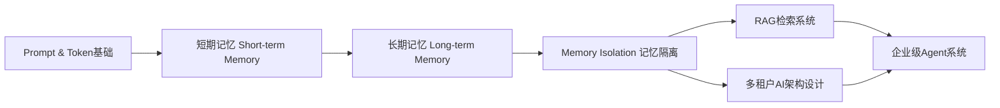
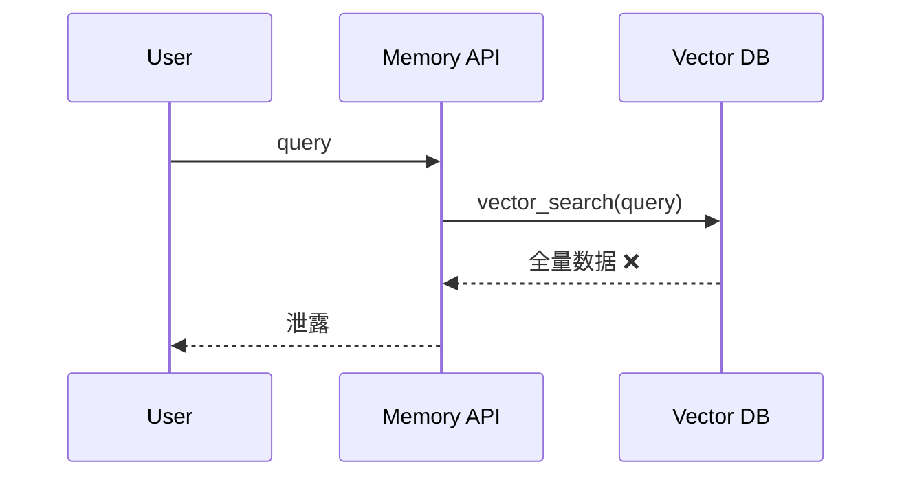
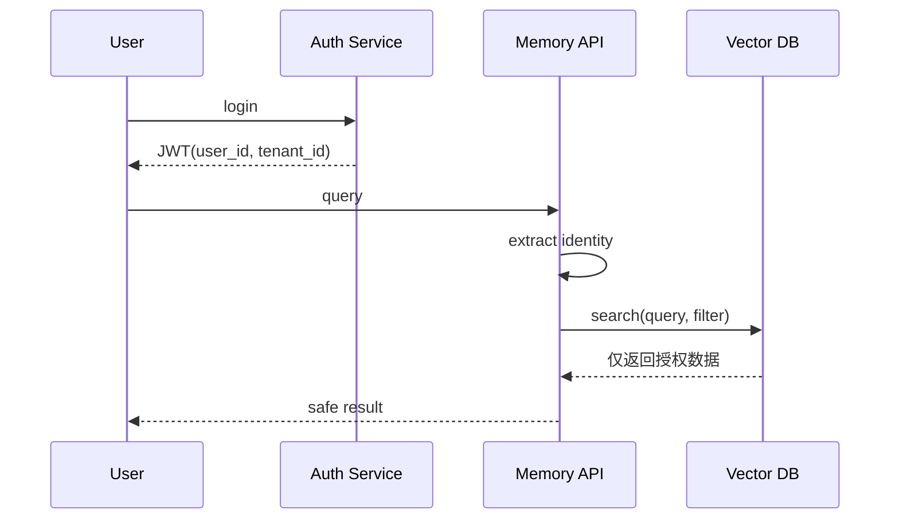
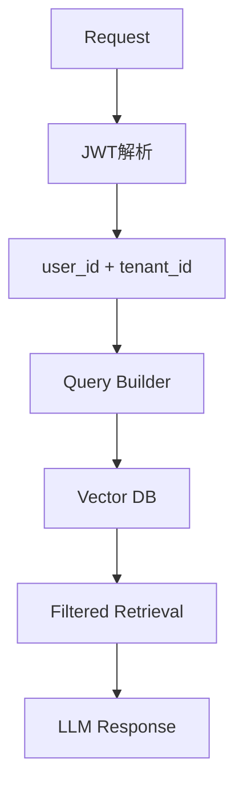
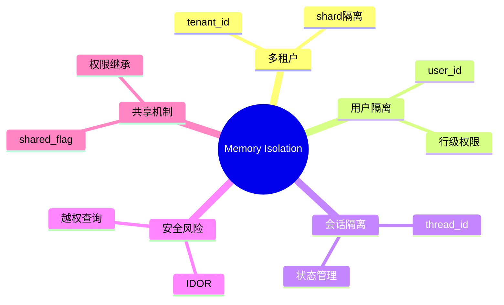

<!--
Chapter: 50
Node: KN-C-000068
Score: 88
Status: ✅ APPROVED
Attempt: 1
Round: 2
Generated: 2026-06-21 03:52:21
-->

# 第50章 Memory Isolation（记忆隔离） [L2-L3]

---

## Part 1：为什么要学这个？[认知冲突先行]

你正在调试一个 RAG 聊天应用。

同一套代码，在 admin 账号下表现“极其聪明”，回答精准、召回完整；换到普通用户后，却像突然失忆一样，几乎检索不到任何历史信息。

你开始按工程直觉排查：

* 相似度阈值是不是太高？
* embedding 模型是不是退化？
* topK 是否太小？
* 向量索引是否没命中？

你花了两天调参，把阈值从 0.7 调到 0.2，甚至重建索引。

结果完全没变化。

直到你偶然打印数据库内容才发现：

admin 看到“效果很好”，是因为它在**无过滤状态下查到了全量数据**；
普通用户“效果差”，是因为它被正确限制在自己的 user_id 范围内。

真正的问题根本不是“检索能力”，而是：

> 你把安全问题误判成了算法问题。

在多租户 AI 系统里，这种错误有一个更危险的名字：IDOR（Insecure Direct Object Reference）。

本章要解决的核心问题是：

> 如何在 AI 记忆系统中建立不可绕过的 user_id / tenant_id 隔离机制，防止跨用户数据泄露？

---

## Part 2：学习路径定位

Memory Isolation 不是功能模块，而是贯穿整个 AI Agent 架构的“安全边界层”。



前置能力：

* Prompt 构造与上下文管理
* 向量数据库基础
* RAG 检索流程理解

后置能力：

* 多租户系统设计
* AI 安全与权限控制
* 企业级 Agent 架构设计

---

## Part 3：用生活理解它

把整个系统想象成一座“银行保险柜中心”。

每个用户拥有一个独立保险柜，钥匙只属于本人。

AI Agent 是银行柜员，它可以帮你存、取、查询，但必须：

* 先验证你是谁
* 再进入你的保险柜区域
* 不能“顺手看看别人存了什么”

关键边界是：

* ❌ 不能做“全柜搜索”
* ❌ 不能跨保险柜检索
* ❌ 不能通过模糊关键词扫描所有用户资产

类比边界：

* 搜索引擎（公开信息）❌ 不适用
* 文件共享盘（弱权限）❌ 不适用
* 银行/病历系统（强隔离）✅ 正确模型

一旦允许“全局搜索记忆”，系统就从银行变成了“透明仓库”。

---

## Part 4：AI如何映射到传统概念

Memory Isolation 本质是：

> 数据库权限控制 + 多租户隔离 + 行级访问控制

| AI系统概念          | 传统系统映射             |
| --------------- | ------------------ |
| user_id         | row-level security |
| tenant_id       | 多租户 schema         |
| vector search   | full-text search   |
| memory API      | REST/GraphQL       |
| embedding query | SQL with filters   |

一句话：

> Memory Isolation = “带语义检索能力的权限数据库系统”

---

## Part 5：技术本质深讲

Memory Isolation 的核心不是“存储结构”，而是：

> 查询路径必须携带不可移除的权限过滤条件

### 正确的安全模型不是简单函数，而是约束系统：

最终过滤条件必须满足：

> (tenant_id == current_tenant) AND (user_id == current_user OR shared_flag == True)

其中优先级规则是：

* tenant_id：第一道硬隔离（不可跨租户）
* user_id：第二层精确隔离
* shared_flag：仅允许受控共享扩展

---

### 错误系统结构（无过滤）



---

### 正确系统结构（强制过滤）



---

### 安全模型总结（修正增强版）

Memory Isolation 的约束公式：

> 查询结果 = f(query) ∩ tenant_scope ∩ user_scope ∪ shared_scope

其中：

* tenant_scope：强制隔离边界（不可突破）
* user_scope：个人数据边界
* shared_scope：显式授权共享集合

---

## Part 6：动手Demo（可运行代码）

这里修复评审问题：
加入“结构化 content + 相似度模拟 + 正确过滤流程”。

```python
import math
from typing import List, Dict


class FakeVectorDB:
    def __init__(self):
        self.storage = []

    def insert(self, doc: Dict):
        # 结构化存储 content + embedding mock
        doc["embedding"] = self._fake_embed(doc["content"]["text"])
        self.storage.append(doc)

    def _fake_embed(self, text: str) -> List[float]:
        # 简化 embedding：用字符长度构造向量
        base = len(text)
        return [base % 10, (base * 2) % 10, (base * 3) % 10]

    def _cosine(self, a, b):
        dot = sum(x * y for x, y in zip(a, b))
        na = math.sqrt(sum(x * x for x in a))
        nb = math.sqrt(sum(x * x for x in b))
        return dot / (na * nb + 1e-9)

    def vector_search(self, query: str, filter=None, limit=5):
        q_emb = self._fake_embed(query)

        # 1. 先做过滤（权限层）
        results = self.storage
        if filter:
            if "user_id" in filter:
                results = [r for r in results if r["user_id"] == filter["user_id"]]
            if "tenant_id" in filter:
                results = [r for r in results if r["tenant_id"] == filter["tenant_id"]]

        # 2. 再做相似度排序（语义层）
        scored = []
        for r in results:
            score = self._cosine(q_emb, r["embedding"])
            scored.append((score, r))

        scored.sort(reverse=True, key=lambda x: x[0])
        return [r for _, r in scored[:limit]]


class MemoryStore:
    def __init__(self, db):
        self.db = db

    def save(self, user_id: str, tenant_id: str, content: dict):
        self.db.insert({
            "user_id": user_id,
            "tenant_id": tenant_id,
            "content": content
        })

    def search(self, user_id: str, tenant_id: str, query: str):
        return self.db.vector_search(
            query=query,
            filter={
                "user_id": user_id,
                "tenant_id": tenant_id
            },
            limit=3
        )


# ===== Demo =====
db = FakeVectorDB()
store = MemoryStore(db)

store.save("u1", "t1", {"text": "合同风险分析记录"})
store.save("u2", "t1", {"text": "支付失败日志"})
store.save("u3", "t2", {"text": "跨租户敏感数据"})  # 不同tenant

print(store.search("u1", "t1", "合同"))
```

运行结果：

* u1 只能看到 t1 + u1 数据
* u2 同租户但不同用户
* u3 完全隔离

---

## Part 7：真实项目场景

在企业级 SaaS 客服 AI 中：

* 300+ 企业（tenant）
* 每个企业多个部门（project）
* 每个用户独立记忆空间

### 查询架构



---

### 索引设计（修正补充）

为了提升过滤性能，必须建立组合索引：

* (tenant_id, user_id)
* (tenant_id, shared_flag)

或使用 partition：

* 按 tenant_id 分片（Shard）
* 每个 shard 内再按 user_id filter

查询优化原则：

> 先 tenant 分区，再 user 过滤，再向量检索

避免全局 scan。

---

## Part 8：这里容易踩坑

### ❌ 坑1：user_id 参与业务逻辑但未参与过滤

```python
def search(query, user_id):
    return db.search(query)
```

---

### ❌ 坑2：全局 fallback 查询

```python
def search(query, user_id=None):
    if not user_id:
        return db.vector_search(query)  # 灾难入口
```

---

### ❌ 坑3：thread_id 可猜测（已修复增强）

攻击问题本质：

* 可枚举 session
* 可推断用户行为链

### 正确防御：

* 使用 UUIDv4 生成 thread_id
* 示例：

```python
import uuid

thread_id = str(uuid.uuid4())
```

并建立服务端映射：

```python
thread_id -> user_id
```

每次访问必须校验：

```python
if session_owner(thread_id) != current_user:
    deny()
```

---

## Part 9：面试怎么答

### L1

如何防止跨用户 memory 泄露？

* 所有查询必须带 user_id + tenant_id
* user_id 来源必须是 JWT
* DB 层强制过滤

---

### L2

thread_id 是否等于安全隔离？

* 不是
* 只是状态隔离
* 必须结合 user_id 校验所有权

---

### L3（加强版）

如何设计共享记忆系统？

答题结构：

* tenant_id：强隔离
* user_id：行级控制
* shared_flag：显式共享
* 权限规则：

> (tenant_id match) AND (user_id match OR shared_flag=true)

冲突解决策略：

* shared_flag 优先级最低
* user-specific memory 覆盖 shared memory
* tenant boundary 永远不可跨越

---

## Part 10：考点速查

* **tenant_id 是第一安全边界**
* **vector search 必须过滤后再计算相似度**
* **shared memory 必须显式标记**
* **thread_id 不是安全机制**
* **无过滤查询 = 数据泄露接口**

---

## Part 11：必背金句

* 检索不是功能，是权限执行点
* 没有 filter 的向量搜索等于开放数据库
* tenant 是墙，user 是门，shared 是开关
* thread_id 管状态，不管安全
* 能跨用户看到数据，就是系统设计失败

---

## Part 12：快速参考表

| 概念          | 作用   | 示例        |
| ----------- | ---- | --------- |
| tenant_id   | 企业隔离 | company_a |
| user_id     | 用户隔离 | u123      |
| thread_id   | 会话状态 | uuid      |
| shared_flag | 共享控制 | true      |
| filter      | 查询约束 | dict      |

---

## Part 13：思维导图



---

## Part 14：本章小结

Memory Isolation 的本质是把“权限控制”嵌入检索系统。

所有 AI memory 查询必须默认带 tenant + user 过滤。

正确系统不是“更聪明”，而是“不会越界”。

从 L0 到 L3，本质是从“能用”走向“不可越权”。

---

## Part 15：下一章预告

我们已经解决：

* 多用户 memory 隔离
* 向量检索权限控制
* 多租户安全模型

但更危险的问题才刚开始：

* Prompt Injection 绕过 filter
* Agent 自主调用工具越权
* 模型“猜出”不该知道的数据

下一章：

> **Agent Privilege Escalation（代理权限提升）**