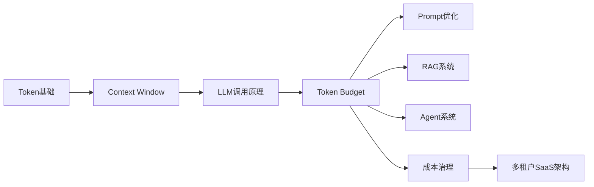
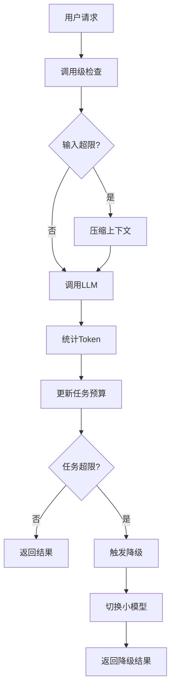
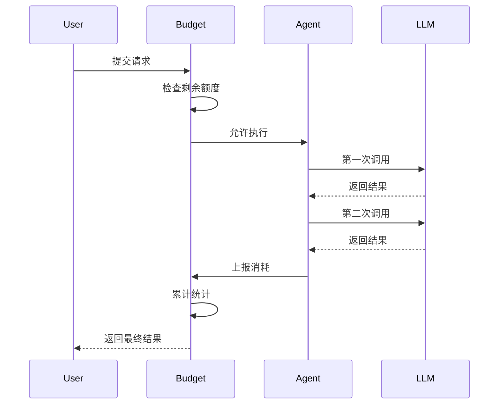
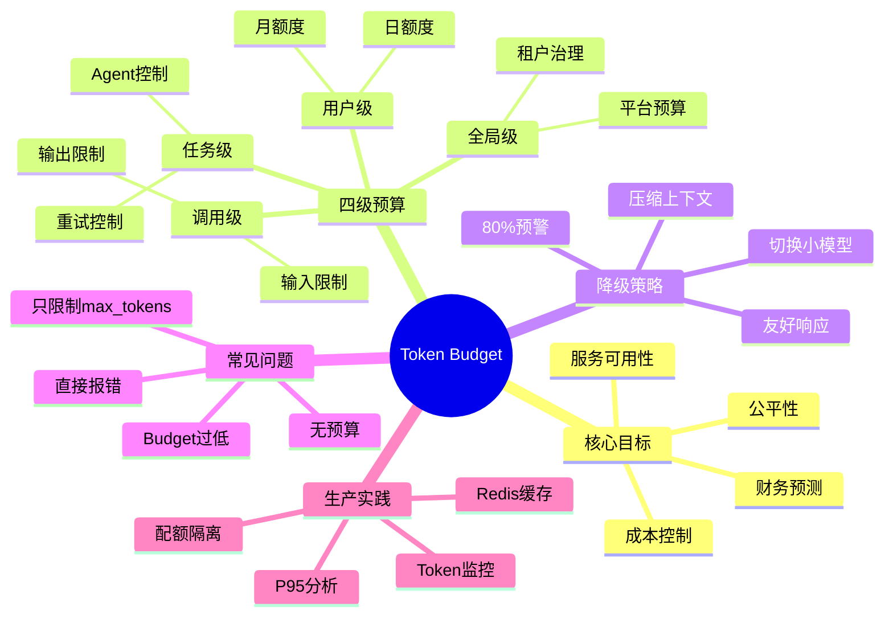

<!--
Chapter: 51
Node: KN-C-000069
Score: 85
Status: ✅ APPROVED
Attempt: 1
Round: 2
Generated: 2026-06-21 04:44:03
-->

# 第51章 Token Budget（Token 预算管理） [L2-L3]

## Part 1：为什么要学这个？[认知冲突先行]

你开发的 AI 客服 Agent 上线一周后，收到云厂商账单：¥12,800。

第一反应通常是：

> 不可能，我明明已经设置了 `max_tokens=4000`。

你打开日志排查，发现真正的问题根本不在输出长度。

某个用户投诉问题触发了 Agent 自动重试逻辑。

一次调用失败。

重试。

再次失败。

继续重试。

Agent 在后台不断调用模型、不断拼接上下文、不断重新检索知识库。

10分钟后，一个任务消耗了接近 900,000 Tokens。

而正常任务平均只有 200,000 Tokens 左右。

这时候很多工程师才意识到：

设置 `max_tokens`，控制的只是一次输出。

账单真正爆炸的地方，往往是：

* Agent循环
* 自动重试
* Tool Calling
* 多轮对话
* RAG检索链路
* 长上下文累积

这就像公司给员工出差报销。

很多人只盯着：

> 单次打车不能超过200元。

却完全没限制：

> 一个月总共能报销多少钱。

结果员工一天打车几十次。

月底财务直接崩溃。

所以真正的问题不是：

> 单次调用会不会太贵？

而是：

> 整个任务会不会失控？

> 单个用户会不会滥用？

> 整个平台有没有成本上限？

这正是 Token Budget 要解决的问题。

本章核心问题：

* 为什么 `max_tokens` 不等于预算管理？
* Token Budget 有哪些层级？
* 为什么生产系统必须做预算控制？
* 超出预算时为什么要降级而不是报错？
* 如何设计真正可落地的 Budget Manager？

---

## Part 2：学习路径定位

很多人学完 Token 后直接进入 Prompt Engineering。

结果上线才发现：

模型能跑，不代表系统能赚钱。

Token 是计量单位。

Token Budget 是成本控制体系。

它属于 AI 工程化能力，而不是模型能力。



### 前置知识

需要理解：

* Token 是什么
* LLM 如何计费
* Prompt 与 Context Window
* API 调用流程

### 后置知识

掌握 Budget 后才能真正理解：

* RAG成本优化
* Agent循环控制
* 多租户资源隔离
* FinOps（AI成本治理）
* 企业级AI平台设计

### 在能力地图中的位置

| 层级 | 能力                 |
| -- | ------------------ |
| L0 | 知道 Token 是计费单位     |
| L1 | 知道 max_tokens 参数   |
| L2 | 能够设计调用级预算          |
| L3 | 能够设计任务级和用户级预算      |
| L4 | 能够设计企业级 Token 治理平台 |

本章定位：

> 从“会调用模型”升级到“会控制成本”。

---

## Part 3：用生活理解它

假设公司员工出差。

财务制度规定：

* 单次打车不超过200元
* 单次出差不超过5000元
* 每月报销不超过20000元

当费用达到80%时：

财务开始提醒。

达到90%时：

优先选择高铁而非飞机。

达到100%时：

停止审批。

这就是 Token Budget。

对应关系：

| 现实世界   | AI系统           |
| ------ | -------------- |
| 单次打车额度 | 调用级预算          |
| 单次出差额度 | 任务级预算          |
| 员工月度额度 | 用户级预算          |
| 公司年度预算 | 全局预算           |
| 财务监控   | Budget Manager |
| 降级交通工具 | 降级模型           |

### 类比的边界

现实中的报销额度通常是固定金额。

但 Token Budget 更复杂：

* 不同模型价格不同
* 输入Token和输出Token价格不同
* 不同任务价值不同

因此预算系统最终管理的是：

> Token消耗 + 成本风险 + 服务质量

而不仅仅是数字上限。

---

## Part 4：AI如何映射到传统概念

对于传统开发者来说。

Token Budget 本质上并不陌生。

很多成熟系统早就有类似思想。

### 传统系统 vs AI系统

| 传统系统概念                | AI系统概念       |
| --------------------- | ------------ |
| 线程池限制                 | Token Budget |
| 数据库连接池                | LLM调用额度      |
| QPS限流                 | 用户Token配额    |
| 熔断器                   | 预算超限降级       |
| 资源配额Quota             | Token Budget |
| K8S ResourceQuota     | 租户Token额度    |
| 成本中心Cost Center       | 用户级预算        |
| 容量规划Capacity Planning | Token预测与预算   |

### 一个经典误区

很多工程师会这样设计：

```python
response = client.chat(
    messages=messages,
    max_tokens=4000
)
```

然后认为：

> 成本已经控制住了。

实际上这里只控制了：

* 单次输出长度

没有控制：

* 输入Token
* 多轮对话
* Agent循环
* 用户累计消耗
* 平台总体成本

真正的 Budget 更像：

```python
if budget.can_consume(task_id, user_id):
    call_llm()
else:
    degrade()
```

关注的是：

> 系统总体资源治理。

而不是单次请求参数。

---

## Part 5：技术本质深讲

### Token Budget 的四层结构

生产级 AI 系统通常有四层预算体系。

#### 第一层：调用级预算（Call Budget）

控制单次请求。

例如：

* 输入最多50k Tokens
* 输出最多4k Tokens

目的：

避免一次调用撑爆上下文窗口。

#### 第二层：任务级预算（Task Budget）

控制整个任务。

例如：

一个 Agent 执行：

* 检索
* 重排
* 推理
* Tool调用
* 总结

累计最多：

200k Tokens

目的：

防止循环和重试失控。

#### 第三层：用户级预算（User Budget）

控制用户配额。

例如：

每日：

100k Tokens

每月：

2M Tokens

目的：

保证公平性。

防止少数用户耗尽资源。

#### 第四层：全局预算（Global Budget）

控制整个系统。

例如：

本月预算：

500M Tokens

达到阈值时：

* 自动降级模型
* 调整服务等级
* 限制免费用户

目的：

保证财务可预测。

---

### Budget Manager 工作原理



---

### Budget 生命周期



---

### 核心数据结构

预算系统本质上维护的是一个资源账本。

```python
from dataclasses import dataclass

@dataclass
class TokenBudget:
    max_input_tokens: int
    max_output_tokens: int
    max_task_tokens: int
    current_task_tokens: int
```

关键字段：

| 字段                  | 作用     |
| ------------------- | ------ |
| max_input_tokens    | 单次输入上限 |
| max_output_tokens   | 单次输出上限 |
| max_task_tokens     | 任务总额度  |
| current_task_tokens | 已使用额度  |

---

### 为什么告警阈值是 70%-80%

很多新手喜欢：

100%才告警。

这是错误设计。

因为压缩上下文也需要消耗资源。

预算模型通常：

| 预算占比     | 动作     |
| -------- | ------ |
| 70%-80%  | 预警     |
| 80%-90%  | 上下文压缩  |
| 90%-100% | 切换小模型  |
| 超过100%   | 返回降级响应 |

这样可以保证：

系统不会突然中断。

---

### Token Budget 的本质

很多人把 Token Budget 理解成：

> 一个计数器。

实际上它更接近：

> AI系统的财务管理系统。

核心目标从来不是省 Token。

而是：

* 控制成本
* 保证公平
* 维持服务质量
* 避免系统失控

记住本章最重要的一句话：

> Token Budget = 给 AI 调用设报销额度，超限触发降级而非报错，把成本从“事后算账”变成“事前管理”。

## Part 6：动手Demo（可运行代码）

理解 Budget 最好的方式，不是看概念，而是亲手实现一个最小版 Budget Manager。

下面这个示例模拟：

* 单次调用消耗 Token
* 任务累计消耗 Token
* 超出预算触发降级

```python
from dataclasses import dataclass

@dataclass
class TokenBudget:
    max_task_tokens: int = 10000
    current_task_tokens: int = 0

    def consume(self, input_tokens: int, output_tokens: int) -> bool:
        used = input_tokens + output_tokens
        self.current_task_tokens += used

        print(
            f"本次消耗={used}, "
            f"累计消耗={self.current_task_tokens}"
        )

        return self.current_task_tokens <= self.max_task_tokens


class BudgetAwareAgent:

    def __init__(self, budget: TokenBudget):
        self.budget = budget

    def run_step(self, input_tokens, output_tokens):

        allowed = self.budget.consume(
            input_tokens,
            output_tokens
        )

        if not allowed:
            return "【降级响应】任务预算已耗尽"

        return "正常执行完成"


budget = TokenBudget(max_task_tokens=10000)

agent = BudgetAwareAgent(budget)

calls = [
    (2000, 500),
    (2500, 500),
    (3000, 1000),
    (2500, 800)
]

for i, call in enumerate(calls, start=1):
    result = agent.run_step(*call)
    print(f"Step {i}: {result}")
```

### 关键代码解释

#### Budget累计统计

```python
self.current_task_tokens += used
```

记录任务级总消耗。

很多系统只记录单次调用。

这是成本失控的根源。

#### 超限检查

```python
return self.current_task_tokens <= self.max_task_tokens
```

返回是否允许继续执行。

#### 降级响应

```python
if not allowed:
    return "【降级响应】任务预算已耗尽"
```

这里没有抛异常。

而是返回可理解的信息。

这就是生产系统推荐做法。

### 运行后你会看到什么

前几次调用：

```text
正常执行完成
```

当累计 Token 超过 10000：

```text
【降级响应】任务预算已耗尽
```

这就是任务级 Budget 的核心机制。

---

## Part 7：真实项目场景

### SaaS 智能客服成本失控案例

某 SaaS 公司接入 DeepSeek Agent。

目标：

* 自动处理客服咨询
* 自动查询知识库
* 自动生成解决方案

上线一个月后。

财务发现：

API 成本达到：

```text
¥12,800
```

远超预算。

### 排查结果

发现两个核心问题。

#### 问题1：缓存缺失

大量用户重复提问：

```text
如何重置密码？
如何修改邮箱？
如何升级套餐？
```

每次都重新请求 LLM。

导致大量重复 Token 消耗。

#### 问题2：Agent 重试死循环

调用链：

```text
Agent
 ↓
检索
 ↓
推理
 ↓
工具调用
 ↓
失败
 ↓
重试
 ↓
失败
 ↓
重试
```

某次异常会话：

```text
900,000 Tokens
```

全部来自一个用户。

### 改造方案

#### 第一层：缓存层

Redis缓存热门问题。

```text
命中率：
0% → 38%
```

#### 第二层：任务级预算

设置：

```text
200,000 Tokens
```

达到上限：

```text
触发降级
```

而非无限重试。

#### 第三层：用户级预算

每用户：

```text
100,000 Tokens / 天
```

达到80%：

```text
告警
```

达到100%：

```text
停止高级模型调用
```

### 最终结果

```text
API成本:
¥12,800 → ¥4,480
```

降幅：

```text
65%
```

同时：

```text
P95延迟:
3.2s → 1.8s
```

用户满意度：

```text
3.8 → 4.6
```

这说明：

Budget 不只是省钱。

还会提升性能。

---

## Part 8：这里容易踩坑

### 错误一：把 max_tokens 当成 Budget

错误代码：

```python
response = llm.chat(
    messages,
    max_tokens=4000
)
```

很多人认为：

```text
成本已经可控
```

实际上：

```text
Agent可能调用100次
```

总消耗：

```text
4000 × 100
```

仍然失控。

正确做法：

```python
if task_tokens > task_budget:
    return degraded_response()

response = llm.chat(
    messages,
    max_tokens=4000
)
```

Budget 必须存在于调用循环之外。

---

### 错误二：超限直接报错

错误代码：

```python
raise Exception(
    "Budget Exceeded"
)
```

结果：

* 用户收到500错误
* 已消耗Token全部浪费
* 对话中断

正确做法：

```python
return {
    "message": (
        "当前任务达到预算上限，"
        "请简化问题或开启新会话"
    )
}
```

降级优于崩溃。

---

### 错误三：预算设置过低

错误配置：

```python
max_task_tokens = 5000
```

而正常任务：

```text
8000~12000 Tokens
```

结果：

```text
频繁触发降级
```

用户认为系统不可用。

正确做法：

根据历史数据配置。

例如：

```text
P95 = 12000
```

则预算可设：

```text
15000~20000
```

留出缓冲空间。

---

## Part 9：面试怎么答

### L1：为什么生产环境必须有 Token Budget？

#### 面试题

你们生产环境如何控制 Token 成本？

#### 回答框架

* Token 按量计费
* Agent存在循环风险
* 单次调用控制不够
* 需要预算管理

回答重点：

```text
调用级预算
任务级预算
用户级预算
```

超限触发降级。

不要直接报错。

---

### L2：如何设计 RAG Agent 的预算方案？

#### 面试题

RAG Agent 包含检索、重排、生成三个阶段。

如何设计预算？

#### 回答框架

总预算：

```text
20000 Tokens
```

分配：

| 阶段 | 预算    |
| -- | ----- |
| 检索 | 10000 |
| 重排 | 5000  |
| 生成 | 4000  |
| 缓冲 | 1000  |

达到80%：

```text
压缩上下文
```

达到100%：

```text
切小模型
```

裁剪顺序：

```text
历史消息
↓
低分文档
↓
输出长度
```

---

### L3：多租户 SaaS 如何设计配额？

#### 面试题

如何保证公平性？

#### 回答框架

租户隔离：

```text
企业A
企业B
企业C
```

分别拥有预算池。

不同套餐：

| 套餐  | 额度   |
| --- | ---- |
| 免费版 | 100k |
| 专业版 | 1M   |
| 企业版 | 10M  |

监控：

```text
P95
P99
```

而不是平均值。

统计方式：

```text
滑动窗口
```

而不是固定窗口。

这样能够避免突发流量误判。

---

## Part 10：考点速查

### **Token Budget 不等于 max_tokens**

前者管理系统资源。

后者仅控制单次输出长度。

### **预算必须分层**

调用级、任务级、用户级、全局级。

缺一不可。

### **80% 告警原则**

给压缩和降级预留缓冲空间。

### **超限优先降级**

不要直接报错。

### **记录实际消耗**

预算设计必须基于真实数据。

不能拍脑袋配置。

---

## Part 11：必背金句

### [预算不是统计]

预算的意义是提前控制，而不是事后分析。

### [单次设限不靠谱]

Agent 成本爆炸通常来自任务累计消耗。

### [预算必须分层]

调用级解决局部问题，任务级解决系统问题。

### [八折告警九折换]

80%预警，90%降级，100%阻断。

### [超了降级别报错]

系统可用性比一次完整回答更重要。

---

## Part 12：快速参考表

| 概念                  | 作用     | 示例值       |
| ------------------- | ------ | --------- |
| max_input_tokens    | 单次输入限制 | 50000     |
| max_output_tokens   | 单次输出限制 | 4000      |
| max_task_tokens     | 任务总预算  | 200000    |
| user_daily_budget   | 用户日预算  | 100000    |
| tenant_month_budget | 租户月预算  | 10000000  |
| global_budget       | 全局预算   | 500000000 |
| warning_threshold   | 预警阈值   | 80%       |
| degrade_threshold   | 降级阈值   | 90%       |
| block_threshold     | 阻断阈值   | 100%      |
| p95_usage           | 预算参考指标 | 12000     |

---

## Part 13：思维导图



---

## Part 14：本章小结

很多工程师以为控制 `max_tokens` 就等于控制成本，但真正的成本风险来自 Agent 循环、重试链路和任务累计消耗。

Token Budget 的核心思想是建立调用级、任务级、用户级、全局级四层预算体系，并在超限时触发降级而非报错。

从 L2 到 L3 的关键跨越，不是学会调用模型，而是学会像平台架构师一样管理 AI 资源与成本。

### 成长路径

| 阶段 | 能力             |
| -- | -------------- |
| L0 | 知道 Token 是计费单位 |
| L1 | 会设置 max_tokens |
| L2 | 会设计调用级和任务级预算   |
| L3 | 会设计用户级和全局级治理体系 |

记忆口诀：

> 单次设限不靠谱，任务总额要锁住；八折告警九折换，超了降级别报错。

---

## Part 15：下一章预告

这一章解决了：

* 如何控制 Token 消耗
* 如何设计预算体系
* 如何避免账单爆炸
* 如何实现降级策略

但新的问题出现了。

即使预算控制得很好。

仍然可能发生：

```text
花了很多 Token
却没有得到更好的答案
```

为什么？

因为影响成本的不只是 Token 数量。

还有：

* Prompt质量
* 上下文长度
* 检索结果质量
* 模型选择策略

下一章将进入：

> Context Compression（上下文压缩）

学习如何在不明显损失效果的前提下，大幅减少上下文长度，让同样的预算获得更高的信息密度和更好的推理效果。

从“控制花多少钱”，进一步升级到：

> “花同样的钱，获得更多价值”。