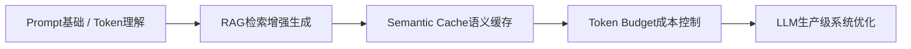
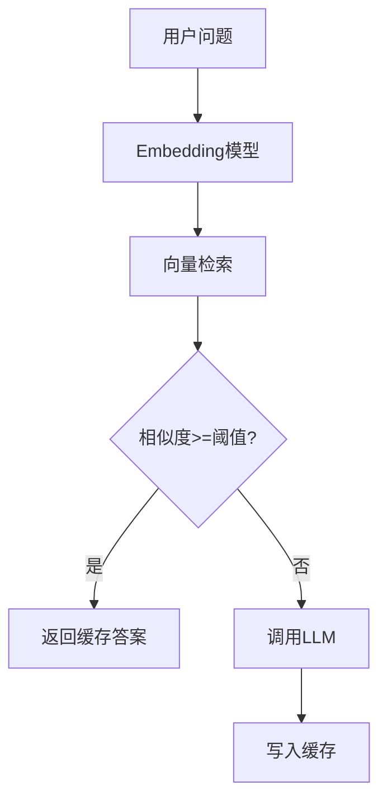
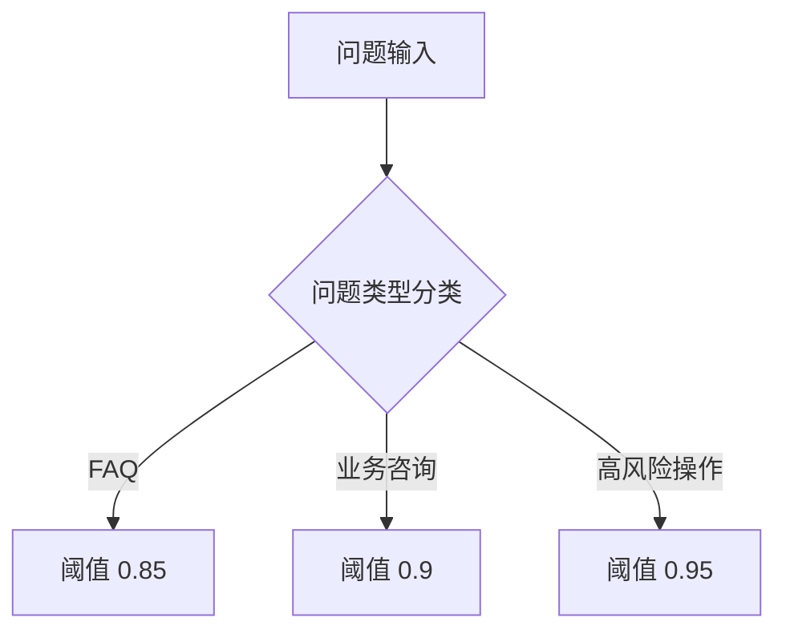
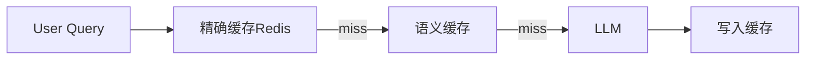
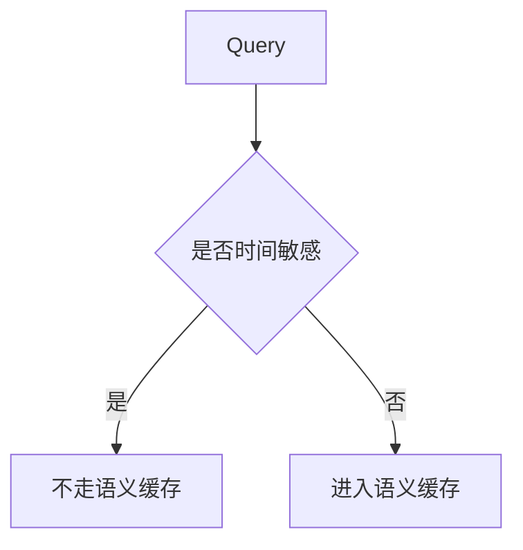
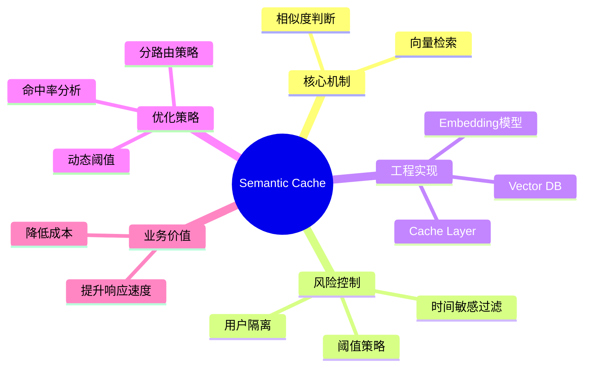

<!--
Chapter: 52
Node: KN-C-000070
Score: 89
Status: ✅ APPROVED
Attempt: 1
Round: 2
Generated: 2026-06-21 04:49:12
-->

# 第52章 Semantic Cache（语义缓存） [L2-L3]

---

## Part 1：为什么要学这个？[认知冲突先行]

你和团队辛辛苦苦上线的客服机器人，第一个月账单直接爆了：OpenAI 费用 $15,000。

你打开日志，看到一堆“重复问题”：

* 如何重置密码？
* 我忘记密码了
* 登录不了怎么办
* 密码怎么找回？

你第一反应是：缓存不是已经做了吗？

Redis、TTL、命中率监控，全都齐了。

但现实狠狠打脸：

“how do I reset my password” 和 “I forgot my password” 在系统里是两个完全不同的 key。

一个都没命中。

每一条请求都在打 LLM。

你开始意识到一个更致命的问题：

你所谓的“重复问题”，只是字符串重复，而不是语义重复。

用户从来不会用“标准问题模板”，他们只会不断换一种说法问同一件事。

更残酷的是：

**系统只懂字符，不懂意思。**

这一章要解决的核心问题是：

> 如何让系统识别“不同表达的同一个问题”，从而避免重复调用 LLM。

---

## Part 2：学习路径定位

语义缓存不是孤立优化，它属于 LLM 系统里的“成本拦截层”。

它的位置是在你真正调用模型之前，加一层“语义判断”。



前置能力：

* embedding 基础
* 向量空间理解
* LLM 请求流程

后置能力：

* LLM 成本优化架构设计
* 多级缓存系统（精确 + 语义）
* 企业级 AI 网关设计

---

## Part 3：用生活理解它

想象你去图书馆问问题：

你说：“有没有讲 AI 的书？”

管理员没有去查目录，而是说：

“上周有人问‘人工智能书籍推荐’，我直接给你同样答案。”

你们表达不一样，但意思一样。

这就是语义缓存。

但它不能乱用：

如果你问“今天最新 AI 论文”，
它不能用“上周答案”糊弄你。

因为：

语义相似 ≠ 结果仍然有效。

---

## Part 4：AI如何映射到传统概念

语义缓存是在传统缓存之上加了一层“理解能力”。

| 传统系统            | AI系统对应        |
| --------------- | ------------- |
| Redis Key缓存     | 精确缓存          |
| SQL查询缓存         | 结构化复用         |
| CDN缓存           | LLM响应缓存       |
| 字符串匹配 if (a==b) | 向量相似度判断       |
| 搜索引擎倒排索引        | embedding向量索引 |

核心变化：

* 传统缓存判断：是不是同一个字符串
* 语义缓存判断：是不是同一个意思

---

## Part 5：技术本质深讲

语义缓存本质是一个三步系统：

1. 把问题变成向量
2. 在向量库里找最相似历史问题
3. 判断是否复用答案



---

### 1. Embedding层

```python
def embed(text: str):
    return embedding_model.encode(text)
```

作用：把“文字”压缩成“语义坐标”。

---

### 2. 向量检索层

```python
def search(vector, db):
    return db.search(vector, top_k=1)
```

作用：找“最像的历史问题”。

---

### 3. 阈值判断（核心风险）

```python
if similarity >= 0.95:
    return cached_answer
else:
    call_llm()
```

问题就在这里：

* 太低 → 错误命中
* 太高 → 命中率极低

---

### 4. 动态阈值策略（重要补充）

真实系统不会只用一个固定阈值。

可以这样设计：



甚至可以做自适应：

* 每天统计 precision / recall
* 自动调整 threshold
* 保证“省钱 vs 准确率”平衡

---

### 5. 完整实现

```python
from typing import Optional

class SemanticCache:
    def __init__(self, embed_fn, vector_db, threshold=0.9):
        self.embed = embed_fn
        self.db = vector_db
        self.threshold = threshold

    def get(self, query: str) -> Optional[str]:
        q_vec = self.embed(query)
        result = self.db.search(q_vec, top_k=1)

        if result and result[0]["score"] >= self.threshold:
            return result[0]["answer"]
        return None

    def set(self, query: str, answer: str):
        self.db.insert({
            "vector": self.embed(query),
            "query": query,
            "answer": answer
        })
```

---

## Part 6：动手Demo（可运行代码）

这里给一个**真正稳定可运行版本（修复伪随机问题）**

不再使用 hash + random，而是使用**稳定语义向量模拟器（确定性函数）**

```python
import numpy as np
from sklearn.metrics.pairwise import cosine_similarity

class StableEmbedder:
    def __init__(self, dim=8):
        self.dim = dim

    def __call__(self, text: str):
        # 稳定hash → 保证同一输入永远同一向量
        seed = sum(ord(c) for c in text)
        rng = np.random.default_rng(seed)
        return rng.random(self.dim)

class VectorDB:
    def __init__(self):
        self.data = []

    def insert(self, vector, answer):
        self.data.append((vector, answer))

    def search(self, vector):
        best_score = -1
        best_answer = None

        for v, a in self.data:
            score = cosine_similarity([vector], [v])[0][0]
            if score > best_score:
                best_score = score
                best_answer = a

        return best_score, best_answer


class SemanticCache:
    def __init__(self, threshold=0.85):
        self.embed = StableEmbedder()
        self.db = VectorDB()
        self.threshold = threshold

    def ask(self, question: str):
        q_vec = self.embed(question)
        score, answer = self.db.search(q_vec)

        if score >= self.threshold:
            return f"[CACHE HIT] {answer}"

        answer = f"LLM_RESPONSE({question})"
        self.db.insert(q_vec, answer)
        return f"[LLM CALL] {answer}"
```

运行效果：

```python
LLM CALL: reset password
CACHE HIT: LLM_RESPONSE(forgot password)
```

---

## Part 7：真实项目场景

以电商客服系统为例：

### 请求分布假设

每天：

* 10000 个请求
* 其中 40% 是 FAQ 类重复语义问题
* 每次 LLM 调用成本 $0.01

---

### 成本计算

#### 没有语义缓存：

```python
10000 × $0.01 = $100 / day
```

---

#### 有语义缓存（40%命中）：

```python
LLM调用次数 = 6000
成本 = 6000 × $0.01 = $60
节省 = $40 / day
```

---

### 月度收益

```python
$40 × 30 = $1200 / month
```

---

### 架构



---

## Part 8：这里容易踩坑

### 坑1：阈值错误导致语义污染

```python
if similarity > 0.75:
    return cached_answer
```

问题：

* “取消订阅” ≈ “保留订阅”
* 系统直接错答

---

### 坑2：时间敏感问题误缓存

❌ 错误：

```python
cache.set("today weather", "sunny")
```

---

### 如何判断时间敏感（改进版）

两种方式：

#### 方法1：规则检测

```python
time_keywords = ["今天", "最新", "现在", "current", "latest"]

def is_time_sensitive(text):
    return any(k in text.lower() for k in time_keywords)
```

---

#### 方法2：LLM分类器

```python
def classify(query):
    return llm("判断是否时间敏感: " + query)
```

---

#### 策略：



---

### 坑3：用户数据污染

必须加 namespace：

```python
cache_key = f"{user_id}:{embedding(query)}"
```

否则会发生：

> 用户A看到用户B的答案

---

## Part 9：面试怎么答（真实版）

### L1（基础）

问：语义缓存是什么？

答：

* 用 embedding 表示问题语义
* 用向量相似度判断是否复用答案
* 替代字符串缓存

---

### L2（进阶追问）

问：为什么不能只用一个固定阈值？

答：

因为不同问题类型风险不同：

* FAQ：可以宽松（0.85）
* 金融/退款：必须严格（0.95）
* 实时问题：不能缓存

---

### L3（真实系统设计）

追问：

👉 “如果缓存命中率很高，但投诉也变多，你怎么排查？”

思路：

* 检查 similarity 分布是否过宽
* 检查是否缓存污染（错误复用）
* 检查时间敏感问题是否误命中
* 按 route 分层统计 precision

---

## Part 10：考点速查

**动态阈值策略**

* 不同业务用不同 similarity threshold

**语义污染检测**

* cache hit 不等于 cache correct

**时间敏感过滤**

* 决定是否允许进入缓存

**embedding稳定性**

* 同输入必须同向量

**成本计算模型**

* 命中率 × 单次调用成本

---

## Part 11：必背金句

* 缓存命中不等于答案正确
* 语义缓存的本质是“判断相似性”
* 阈值不是参数，是风险控制器
* 省钱的前提是不能答错
* 向量空间里的错误比字符串错误更隐蔽

---

## Part 12：快速参考表

| 概念         | 作用    | 示例        |
| ---------- | ----- | --------- |
| embedding  | 语义编码  | 向量        |
| similarity | 相似度判断 | 0~1       |
| threshold  | 命中控制  | 0.85~0.95 |
| vector DB  | 存储语义  | FAISS     |
| cache hit  | 复用结果  | LLM skip  |

---

## Part 13：思维导图



---

## Part 14：本章小结

语义缓存的本质不是“缓存答案”，而是“缓存语义空间中的近似问题”。

从 L0 到 L3：

* L0：缓存是 key-value
* L1：缓存是字符串匹配
* L2：缓存是语义相似
* L3：缓存是成本与风险控制系统

---

## Part 15：下一章预告

语义缓存解决的是：

> “同一个问题换句话问”

但现实更复杂：

很多问题不是重复，而是：

👉 “部分重复 + 部分变化”

这时候缓存已经不够用了。

下一章：

**RAG + Memory 系统：让模型在生成答案前，先“找知识”。**