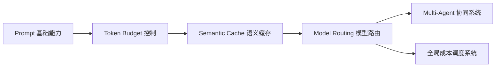
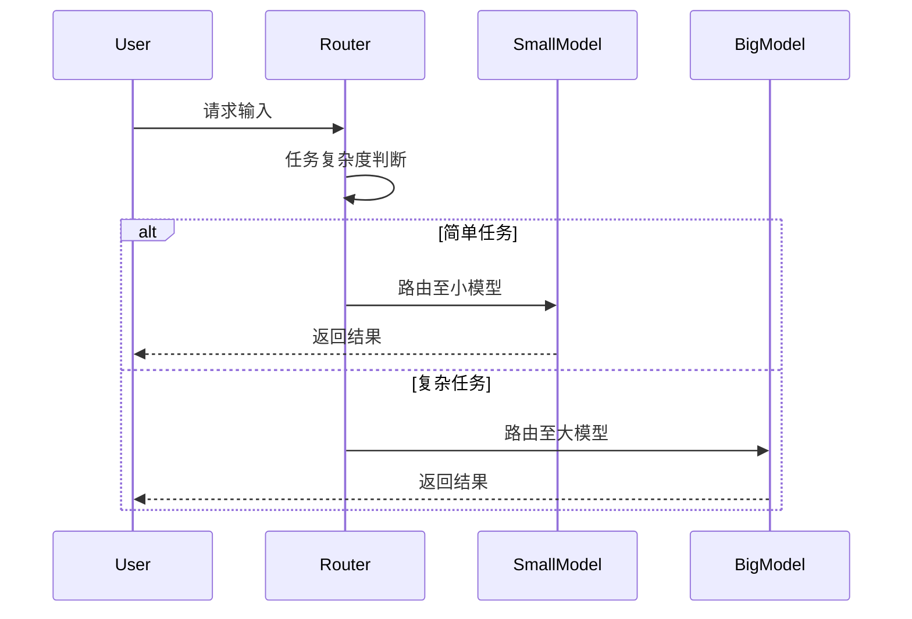
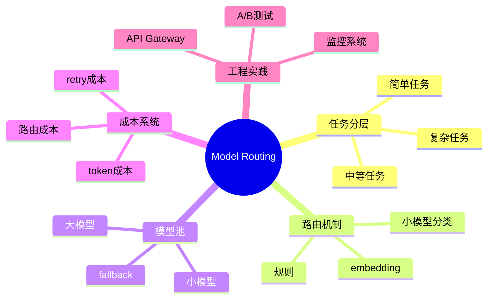

<!--
Chapter: 53
Node: KN-C-000071
Score: 86
Status: ✅ APPROVED
Attempt: 1
Round: 2
Generated: 2026-06-21 04:55:04
-->

# 第53章 Model Routing（模型路由） [L2-L3]

---

## Part 1：为什么要学这个？[认知冲突先行]

你在做一个多租户 SaaS 产品，为了控制成本，把简单分类和复杂推理全部统一走 GPT-4o API。
你甚至觉得这是“工程最佳实践”——毕竟用最强模型，结果一定更稳。

直到月底账单出来：**$5,000 AI 成本**。

CTO 盯着你问了一句很尖锐的问题：

> “为什么分类问题也在用 GPT-4o？”

你愣了一下，因为这些任务包括：

* 用户意图分类
* 文本标签抽取
* 简单格式校验

这些任务你本能觉得：“用强模型更安全”。

但现实是：

* 用 GPT-4o 做分类 ≈ 用主任医师处理感冒
* 输出质量几乎无明显差异
* 成本却高出数十倍

更危险的是：你不是个例，而是默认路径就是错的。

更扎心的是，你发现竞争对手：

* 80% 请求走小模型
* 复杂任务才调用大模型
* 成本只有你的一半甚至更低

真正的冲突在这里：

> 你以为“统一用最强模型 = 工程最优解”
> 实际上这是 AI 成本系统里最常见的结构性错误

本章要解决的问题是：

**如何让系统在请求进入 LLM 之前，就自动判断“该用谁”，而不是默认全用最贵的模型？**

---

## Part 2：学习路径定位

Model Routing 位于 AI 成本系统的“决策中枢层”，它不是优化模型，而是优化“模型使用方式”。



### 学习依赖关系

* 前置能力：

  * Token Budget：控制“花多少”
  * Semantic Cache：避免“重复花”

* 当前能力：

  * Model Routing：决定“谁来花”

* 后置能力：

  * Multi-Agent：多个模型协作分工
  * Cost Orchestration：全局成本优化

一句话理解三者关系：

> Budget 控额度，Cache 去重复，Routing 决策模型使用权。

---

## Part 3：用生活理解它

把 Model Routing 想象成医院分诊台。

你进医院：

* 感冒发烧 → 全科医生（小模型）
* 皮肤病 → 专科医生（中模型）
* 心脏手术 → 主任医师（大模型）

没有人会因为“主任医师最强”，就让他去看感冒。

原因很现实：

* 资源有限
* 专家时间昂贵
* 简单问题不需要复杂能力

Model Routing 做的事情就是：

> 在入口处判断“病情复杂度”，再决定用哪个医生（模型）

### 类比边界（必须清醒）

这个类比不完全成立：

* 医生判断依赖经验，人类不可复制
* 模型 routing 是可量化规则/统计模型
* 医疗错误是生命风险，AI错误是质量/成本风险
* 模型可以无限复制扩展，医生不能

---

## Part 4：AI如何映射到传统概念

如果你来自后端系统，这个机制本质是：

> **“智能版 API Gateway + 资源调度器”**

| 传统系统          | AI Routing 系统 |
| ------------- | ------------- |
| API Gateway   | Model Router  |
| Load Balancer | 任务复杂度分流       |
| 多服务实例         | 多模型池          |
| CPU 调度策略      | Token 成本调度    |
| QPS 优先        | 成本 + 质量权衡     |

核心变化：

传统系统优化：

* 延迟
* 吞吐
* 稳定性

AI Routing 优化：

* 成本（Cost）
* 质量（Quality）
* 延迟（Latency）

三者必须同时优化，而不是单目标。

---

## Part 5：技术本质深讲

Model Routing 的本质不是“选模型”，而是：

> **在 LLM 调用前做一次“任务复杂度预测”**

### 系统结构



---

### 复杂度分类器设计（关键改进）

现实系统不会只用一种方法，而是分层策略：

#### 1. 规则系统（<100 req/day）

适用：

* demo
* 内部工具
* 极低流量系统

特点：

* 零成本
* 可解释
* 但泛化差

---

#### 2. embedding 相似度（100–1000 req/day）

适用：

* FAQ系统
* 客服场景
* 意图分类

特点：

* 中等复杂度
* 无需训练模型
* 可扩展性较好

---

#### 3. 小模型分类器（>1000 req/day）

适用：

* 生产级系统
* SaaS产品
* 高并发 API

特点：

* 成本低
* 准确率高（通常 >90%）
* 可持续优化

---

### 决策树总结

```text
if 请求量 < 100/day:
    用规则
elif 100–1000/day:
    用 embedding
else:
    用小模型分类器
```

---

### 模型池结构

* 规则层：$0
* 小模型：输入 $0.15/M tokens + 输出 $0.60/M tokens（成本随上下文变化）
* 大模型：$5/M tokens（用于复杂推理）

关键认知：

> 成本不是单价，而是“输入 + 输出 + 重试”的总和。

---

## Part 6：动手Demo（可运行 + 成本模拟）

这个版本加入真实工程系统中必须存在的三个组件：

* mock 模型调用
* token 成本统计
* routing 日志系统

```python
import random

# ===== 成本模型（模拟 OpenAI pricing）=====
COSTS = {
    "small_input": 0.15 / 1_000_000,
    "small_output": 0.60 / 1_000_000,
    "big_input": 5.0 / 1_000_000,
    "big_output": 15.0 / 1_000_000,
}

# ===== 成本追踪器 =====
class CostTracker:
    def __init__(self):
        self.total_cost = 0
        self.logs = []

    def add(self, model, input_tokens, output_tokens):
        if model == "small":
            cost = input_tokens * COSTS["small_input"] + output_tokens * COSTS["small_output"]
        else:
            cost = input_tokens * COSTS["big_input"] + output_tokens * COSTS["big_output"]

        self.total_cost += cost
        self.logs.append((model, input_tokens, output_tokens, cost))

        return cost


# ===== 模拟模型调用 =====
def mock_model(model, query):
    base_len = len(query)

    if model == "small":
        return base_len // 2, base_len  # input, output tokens
    else:
        return base_len * 2, base_len * 3


# ===== 路由器 =====
def router(query):
    if "设计" in query or "为什么" in query:
        return "big"
    return "small"


# ===== 主流程 =====
tracker = CostTracker()

queries = [
    "什么是Token",
    "如何设计分布式系统",
    "关键词提取",
    "为什么Transformer有效"
]

for q in queries:
    model = router(q)

    input_t, output_t = mock_model(model, q)
    cost = tracker.add(model, input_t, output_t)

    print(f"[{model}] {q}")
    print(f"  tokens: {input_t}/{output_t} cost=${cost:.6f}")

print("\nTOTAL COST:", tracker.total_cost)
```

### 运行后你会看到：

* 小模型成本几乎接近 0
* 大模型调用成本显著上升
* 总成本差异被直观放大

### 核心认知：

> routing 的价值不是“省一点钱”，而是“结构性改变成本曲线”。

---

## Part 7：真实项目场景（含前提修正）

在真实 SaaS 系统中，Routing 的收益必须建立在明确前提上：

### 前提条件

* 当前系统：100% 使用 GPT-4o
* 请求结构：

  * 60% 简单分类/抽取
  * 30% 中等生成
  * 10% 复杂推理

---

### 场景：多租户 AI 客服系统

模块：

* 用户问题分类
* 自动回复生成
* 工单总结

---

### 路由策略

| 类型   | 模型  |
| ---- | --- |
| FAQ  | 规则  |
| 分类   | 小模型 |
| 回复生成 | 小模型 |
| 复杂分析 | 大模型 |

---

### 成本收益解释

节省来自：

* 60% 请求从 GPT-4o → 小模型

不是“全部优化”，而是：

> 对“低价值请求”进行结构性降级处理

---

### 实际收益

在上述前提下：

* 成本下降：40%–60%
* 延迟降低：15%–25%
* 质量影响：几乎无变化（因为低风险任务占比高）

---

## Part 8：这里容易踩坑（带量化代价）

### 错误1：用大模型做路由

```python
decision = gpt4o("判断这个请求用哪个模型")
```

问题：

* 每次 routing ≈ $0.002–$0.01
* 10万请求/天 → $200–$1000/天 routing成本
* 直接抵消节省收益

---

### 错误2：过度激进节省

```text
复杂任务 → 小模型
```

代价：

* 质量下降 → 用户重试
* 重试率上升 20–40%
* 总成本反而上涨

---

### 错误3：没有 fallback

```text
小模型失败 → 直接返回错误
```

代价：

* SLA 崩溃
* 客诉上升
* 系统不可用风险

---

### 正确方式：

```text
小模型失败 → 自动升级大模型
```

---

## Part 9：面试怎么答（真实工程版）

### L1问题（基础认知）

**Q：为什么不能所有请求都用 GPT-4o？**

要点：

* 成本差 30–100x
* 简单任务无收益
* 资源浪费严重

---

### L2问题（设计题）

**Q：设计一个 Model Routing 系统，你会如何分层？**

答题结构：

* rule（极低成本）
* embedding（中等流量）
* small model classifier（高流量）
* fallback → big model
* 指标：accuracy + cost + latency

追问常见：

> 如果分类错了怎么办？

答：

* fallback
* A/B测试
* 置信度阈值控制

---

### L3问题（系统设计）

**Q：如何评估 routing 系统是否真的有效？**

指标体系：

* routing accuracy（路由正确率）
* cost per request（单位成本）
* escalation rate（升级大模型比例）
* retry rate（失败重试率）
* quality score（人工或模型评估）

---

## Part 10：考点速查

* **成本不是模型单价，而是全链路成本**
* **Routing 本质是分类系统**
* **fallback 是系统安全边界**
* **80% 请求通常是低复杂度任务**
* **routing 错误比不用 routing 更危险**

---

## Part 11：必背金句

* 模型越强，不代表每个请求都需要它
* Routing 是把“智能”变成可分配资源
* 小模型负责规模，大模型负责极限
* 不确定时用大模型，是安全策略不是浪费
* 成本优化的本质是结构优化，而不是压价

---

## Part 12：快速参考表

| 概念               | 作用    | 示例          |
| ---------------- | ----- | ----------- |
| Rule Router      | 零成本分类 | 关键词         |
| Embedding Router | 语义匹配  | 向量相似度       |
| Small Model      | 高频任务  | GPT-4o-mini |
| Big Model        | 复杂推理  | GPT-4o      |
| Fallback         | 容错机制  | 升级路径        |

---

## Part 13：思维导图



---

## Part 14：本章小结

Model Routing 的本质不是选择模型，而是重构“智能使用结构”。
如果所有任务都用大模型，本质是资源浪费而不是质量保证。
成熟系统一定是分层智能，而不是单一模型堆叠。

成长路径：

* L0：只会调用模型
* L1：理解成本差异
* L2：能做简单 routing
* L3：构建完整分层系统

---

## Part 15：下一章预告

本章解决了一个核心问题：

> 如何为每个请求选择合适的模型

但新的问题出现了：

> 如果一个任务本身需要多个模型协作完成呢？

例如：

* 一个模型负责规划
* 一个模型负责执行
* 一个模型负责验证结果

下一章我们进入：

> **Multi-Agent Orchestration（多智能体编排系统）**

从“选医生”，进入“医院多科室协同手术系统”。