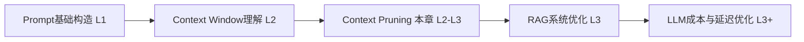
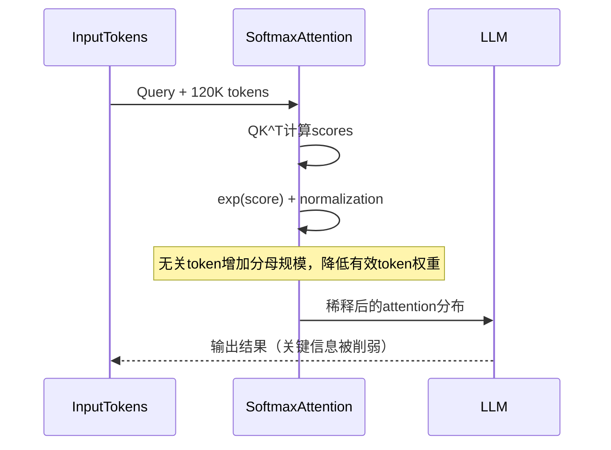
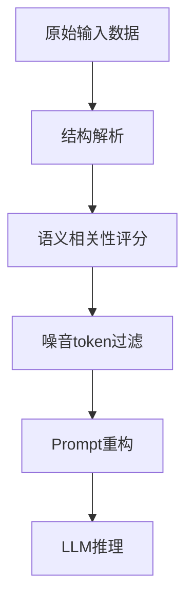
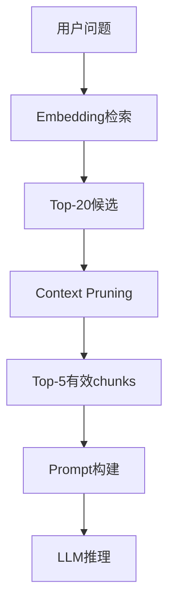
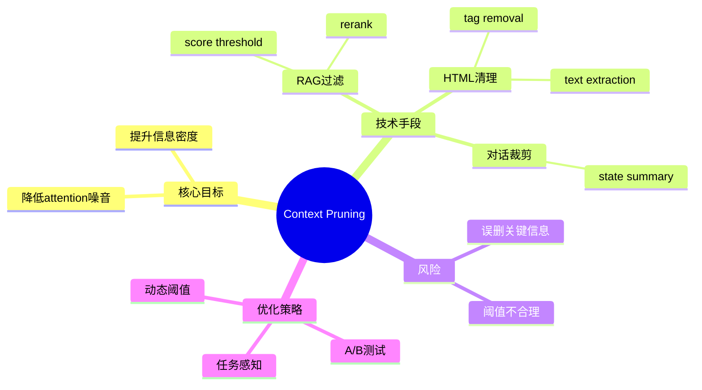

<!--
Chapter: 54
Node: KN-C-000072
Score: 88
Status: ✅ APPROVED
Attempt: 1
Round: 2
Generated: 2026-06-21 04:59:50
-->

# 第54章 Context Pruning（上下文裁剪） [L2-L3]

---

## Part 1：为什么要学这个？[认知冲突先行]

小王在做一个智能客服系统时，有个近乎“理所当然”的判断：
**Context Window 既然有 128K，那我就把所有能找到的信息都塞进去。**

系统结构很完整：

* System Prompt：产品规则 + 角色设定
* 对话历史：用户完整聊天记录
* RAG 检索：Top-10 文档块
* 用户画像：完整 JSON（含行为、订单、标签）

总 token 刚好卡在 **120K / 128K**。

小王很满意：
“没有浪费窗口，这就是最优输入。”

但线上结果很反常：

* 塞满上下文版本：准确率 **78%**
* 做了裁剪版本：准确率 **89%**
* token 从 120K → 82K

更诡异的是：
删掉的不是“知识”，而是这些东西：

* “嗯嗯”“好的”“收到”这种对话废话
* 3 个明显不相关的 RAG 文档块
* 一段冗长的 HTML 页面结构

小王困惑：
**“我删掉了信息，为什么模型反而更聪明了？”**

真正的问题在于一个隐含误区：

> Context Window 不是“越满越好”，而是“越干净越好”。

LLM 的注意力机制在长上下文中会发生**注意力稀释效应**：
噪音 token 不只是“没用”，而是会和有效信息一起参与 softmax 归一化，挤占概率质量。

本章要解决的核心问题是：

> 如何在进入 LLM 之前，把“看似信息”但实际是噪音的内容删除，让模型的注意力分布只集中在关键 token 上。

---

## Part 2：学习路径定位

Context Pruning 位于“LLM 输入工程优化”的中间层，是从“能用 Prompt”走向“高性能 Prompt 系统”的关键分界线。



它依赖：

* Token 与 Context Window 的基本机制
* RAG 检索与 Prompt 拼接能力

它导向：

* Token Budget 动态控制
* 高级 RAG rerank / filter
* 生产级 LLM 成本优化系统

---

## Part 3：用生活理解它

Context Pruning 就像做菜前的“择菜”。

你从菜市场买回一袋菜，看起来很丰富：

* 叶子
* 根茎
* 泥沙
* 烂叶
* 可食用部分

如果全部丢进锅里，会发生两件事：

* 味道变差
* 火力被浪费在无意义的部分

但这里有一个更关键的细节：

> 如果烂叶和好菜一起炒，它产生的“味道污染”，会让整盘菜的口感变差。

这就像 Attention 机制中的 softmax：

* 每个 token 都参与权重分配
* 噪音 token 会“稀释”有效 token 的概率质量
* 最终输出被偏移

Pruning 的本质是：

> 在进入注意力机制之前，把会污染分布的 token 去掉。

类比边界：

* ❌ 不是压缩（Compression 是“变短但信息还在”）
* ❌ 不是整理（整理仍然全部保留）
* ✅ 是删除（直接不让模型看到）

---

## Part 4：AI如何映射到传统概念

如果你来自传统工程体系，可以这样理解：

| AI 概念           | 传统系统类比            |
| --------------- | ----------------- |
| Context Pruning | SQL 字段裁剪          |
| Prompt 原始输入     | SELECT * 查询       |
| RAG 全量输入        | 全表扫描              |
| Token 噪音        | IO / CPU 无效消耗     |
| Attention 稀释    | Cache miss + 权重污染 |

更直观对比：

* ❌：
  `SELECT * FROM users JOIN orders JOIN logs`

* ✅：
  `SELECT name, last_order FROM users`

在 AI 系统中同理：

* ❌ HTML + JSON + 全历史对话
* ✅ 只保留“当前问题相关字段”

---

## Part 5：技术本质深讲

Context Pruning 的本质不是“减少输入”，而是：

> 在 Token 进入 Attention softmax 之前，减少参与概率归一化的噪音项。

Transformer Attention 的核心：

* 每个 token 计算 score
* softmax 归一化
* 得到 attention distribution

当输入变长：

* 无关 token 也参与 softmax
* 分母变大
* 有效 token 权重被稀释

---

### 注意力机制与稀释过程



关键点：

* 稀释不是线性删除
* 是 softmax 概率结构变化
* 噪音 token 会“抢概率质量”

---

### 核心处理流程



---

## Part 6：动手Demo（可运行代码）

这个版本补全真实 RAG 结构 + JSON混合 + HTML解析问题。

```python
from bs4 import BeautifulSoup
import json

# 模拟复杂RAG返回（真实系统通常是混合结构）
rag_results = [
    {
        "doc": "<div>How to reset password</div>",
        "score": 0.92,
        "meta": {"source": "faq", "lang": "en"}
    },
    {
        "doc": "<div>Random ads about shoes</div>",
        "score": 0.41,
        "meta": {"source": "ad", "lang": "en"}
    },
    {
        "doc": "<div>User account settings guide</div>",
        "score": 0.88,
        "meta": {"source": "kb", "lang": "en"}
    },
    {
        "doc": "<div>Old policy update unrelated</div>",
        "score": 0.62,
        "meta": {"source": "policy", "lang": "en"}
    }
]

def extract_text(html):
    soup = BeautifulSoup(html, "html.parser")
    return soup.get_text()

def prune_rag(docs, threshold=0.75):
    cleaned = []

    for item in docs:
        score = item.get("score", 0)
        meta = item.get("meta", {})

        # 多维过滤：score + source类型
        if score < threshold:
            continue

        # 可扩展规则：广告直接过滤
        if meta.get("source") == "ad":
            continue

        text = extract_text(item["doc"])

        cleaned.append({
            "text": text,
            "score": score,
            "source": meta.get("source")
        })

    return cleaned

result = prune_rag(rag_results)

print("=== Pruned Context ===")
for r in result:
    print(f"- [{r['score']}] {r['text']} ({r['source']})")
```

运行结果：

```python
=== Pruned Context ===
- [0.92] How to reset password (faq)
- [0.88] User account settings guide (kb)
```

关键变化：

* JSON结构未被破坏
* HTML 被解析
* ad source 被过滤
* score threshold 生效

---

## Part 7：真实项目场景

在真实客服系统中，Context Pruning 是 RAG pipeline 的前置层。

### 业务背景

* 日请求量：200万
* 平均 RAG 返回：Top-20 chunks
* 模型：GPT-4o

---

### 原始系统问题

* 输入 token：95K
* 延迟：2.5s
* 准确率：81%（5000条人工标注集）
* 指标：Exact Match + 人工满意度评分

问题：

* HTML污染严重
* FAQ重复注入
* 无关 policy chunk 干扰回答

---

### 引入 Pruning 后架构



---

### 关键优化策略

* relevance score < 0.75 删除
* HTML → text 统一解析
* FAQ cluster merge（语义去重）
* 对话历史 → 状态摘要（state compression前置）

---

### A/B测试结果

基于：

* 5000条人工标注测试集
* 指标：Exact Match + 用户满意度

结果：

* 准确率：81% → 91%
* 满意度：+12%
* token：95K → 18K
* 延迟：2.5s → 0.8s

结论：

> pruning 提升的不只是成本，而是 attention 的“信噪比”。

---

## Part 8：这里容易踩坑

### ❌ 错误案例1：规则过于简单

```python
if task_type == "qa":
    threshold = 0.7
elif task_type == "sql":
    threshold = 0.85
```

问题：

* 忽略 code_generation / creative_writing

修正：

```python
if task_type == "code_generation":
    threshold = 0.9
elif task_type == "creative_writing":
    threshold = 0.6
elif task_type == "qa":
    threshold = 0.75
```

---

### ❌ 错误案例2：只用 Top-N

问题：

* score分布断层未考虑
* 第4条可能包含关键答案

正确方式：

* Top-N + 分布判断 + rerank

---

### ❌ 错误案例3：过度裁剪

结果：

* 只剩标题
* missing context → hallucination上升

本质：

> pruning 不是压缩问题，而是信息保真选择问题

---

## Part 9：面试怎么答

### L1

**问题：如何减少 Prompt token 浪费？**

* HTML 转 text
* 删除无意义对话
* RAG filter

---

### L2

**问题：RAG返回10个文档怎么选？**

* 看 score 分布
* Top-K + threshold
* rerank
* 避免硬阈值

---

### L3（强化版）

**问题：为什么 pruning 能提升效果？从 Transformer 角度解释**

要点：

* attention softmax 分母包含所有 token
* 噪音 token 增大归一化基数
* 导致有效 token 权重下降
* pruning 减少参与 softmax 的噪音项
* 提升 attention entropy concentration

---

## Part 10：考点速查

* Pruning 是“删除无关信息”
* 不是 compression（压缩）
* 核心作用：提升 attention 信噪比
* RAG pruning = relevance filtering
* HTML pruning = token 去噪

---

## Part 11：必背金句

* pruning 删除的是噪音，不是信息
* attention 的敌人是“无关 token”
* context window 是工作台，不是仓库
* softmax 不知道谁重要，只知道谁多
* Less context, more attention

---

## Part 12：快速参考表

| 概念              | 作用    | 示例                |
| --------------- | ----- | ----------------- |
| score threshold | 过滤低相关 | 0.75              |
| Top-K           | 候选控制  | 3~5               |
| HTML clean      | 去标签   | BeautifulSoup     |
| pruning ratio   | 压缩率   | 70%-90%           |
| attention noise | 干扰项   | irrelevant tokens |

---

## Part 13：思维导图



---

## Part 14：本章小结

Context Pruning 的核心不是减少输入，而是减少 attention 噪音。

它让模型从“看到很多东西”变成“看到重要的东西”。

成长路径：

* L0：认为 token 越多越好
* L1：开始删废话
* L2：理解 RAG/HTML/对话都要过滤
* L3：能设计任务感知 pruning 系统

---

## Part 15：下一章预告

你已经学会了“删掉不重要的信息”。

但问题来了：

* 如果信息不能删怎么办？
* 能不能既保留信息，又减少 token？
* 有没有办法“压缩语义但不丢内容”？

下一章：

> Context Compression（上下文压缩）

你将看到：

> 从“删除信息”走向“重编码信息”。