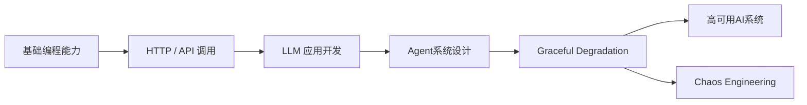
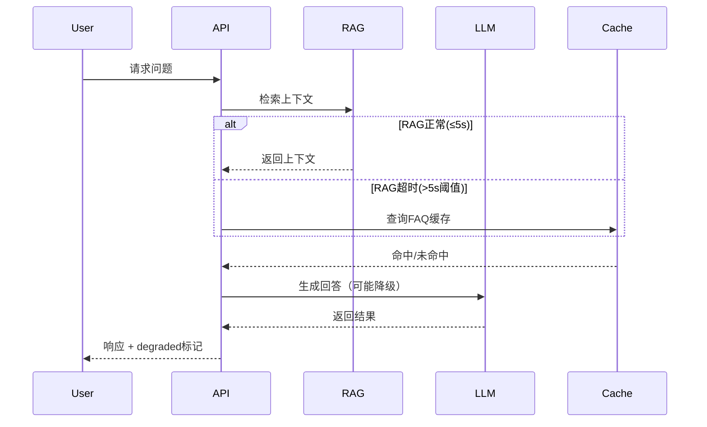
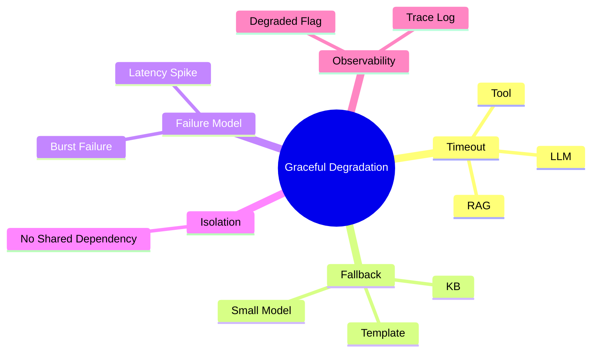

<!--
Chapter: 55
Node: KN-C-000073
Score: 88
Status: ✅ APPROVED
Attempt: 1
Round: 2
Generated: 2026-06-21 05:05:47
-->

# 第55章 Graceful Degradation（优雅降级） [L2-L3]

---

## Part 1：为什么要学这个？[认知冲突先行]

凌晨2点，P0 告警炸开：LLM API 超时率 40%。

你第一反应是“优化策略很明确”：

* 把超时从 10s 拉到 30s
* 加重试机制（最多3次）

你甚至有点安心：**这就是标准容错手段**。

但10分钟后，系统开始反噬你：

* 用户抱怨：“AI越来越慢”
* 请求几乎全部卡在转圈
* 最终失败率继续上升
* 原本还能返回的缓存请求也被拖死

监控曲线变得很讽刺：

* P99 延迟：3s → 45s
* 连接池：100% 占满
* 重试请求占比飙升

你突然意识到一个反常识事实：

> 你以为的“容错”，其实是在延长系统死亡过程。

真正的问题不是 LLM 挂了，而是：

> 系统没有“接管失败”的能力，只会无限等待。

本章要解决的问题是：

> 当 AI 系统任意依赖组件失效时，如何保证系统仍然“可用”，而不是“等待死亡”。

---

## Part 2：学习路径定位

Graceful Degradation 是 AI 系统从“能跑”走向“不会崩”的分水岭能力。



### 学习前置要求（非常关键）

如果你已经具备：

* API调用 + 超时控制经验
* 简单 Agent 或 RAG 系统经验
* 了解连接池 / 并发基本概念

👉 本章阅读时间约 **25~35分钟**

如果你对以下内容不熟：

* 不理解 timeout / retry 区别
* 没做过多工具 Agent
* 没接触过服务降级

👉 建议先回看第52~54章（基础可靠性设计），否则容易误解“降级=缓存”。

---

## Part 3：用生活理解它

可以把 Graceful Degradation 理解为“高铁的多级降级运行系统”。

当系统正常时：

* 高速运行
* Wi-Fi / 空调 / 服务全开

当出现故障时，它不是“停机”，而是分级降级：

### 一级降级（轻微故障）

* 速度降至80%
* Wi-Fi变慢
* 娱乐系统限制

### 二级降级（中度故障）

* 关闭Wi-Fi
* 关闭部分车厢服务
* 保留基本运行

### 三级降级（严重故障）

* 切换柴油动力
* 低速运行到最近站点
* 仅保留安全系统

关键点来了：

> 降级不是“开/关”，而是“能力逐层收缩”。

但这个类比有边界：

* 高铁的降级策略是硬件预设的
* AI 系统的降级路径是软件动态决策的
* AI 需要根据“依赖状态”实时选择降级层级

---

## Part 4：AI如何映射到传统概念

| 传统系统概念 | AI系统中的对应                  |
| ------ | ------------------------- |
| 熔断器    | 阻断持续失败的LLM/RAG调用          |
| 降级页面   | 静态回答 / 模板回复               |
| 超时机制   | 控制LLM /工具最大等待时间           |
| 读缓存    | fallback knowledge（独立知识源） |
| 服务切换   | 小模型替代大模型                  |

关键区别：

> 传统系统是“请求级降级”，AI系统是“推理链级降级”。

AI Agent 的降级发生在：

* 检索链
* 推理链
* 工具调用链
* Prompt构造链

不是返回“页面变简单”，而是：

> 整个决策路径变短、变弱、变保守。

---

## Part 5：技术本质深讲

Graceful Degradation 的本质不是“失败处理”，而是：

> 在不可靠依赖上构建“多层能力收缩系统”。

一个请求的完整路径：



### 关键机制拆解

---

### 1. Timeout（不是等待，而是“切断点”）

* LLM：30s
* RAG：5s
* Tool：10s

> timeout = 降级触发器，不是性能参数

---

### 2. Fallback Chain（多层降级链）

1. Full Mode（LLM + RAG + Tools）
2. Light Mode（LLM + Cache）
3. Minimal Mode（纯LLM）
4. Static Mode（模板）
5. Emergency Mode（失败提示）

---

### 3. Failure Detection（不是报错才算失败）

* latency > threshold
* error rate 滑动窗口 > 10%
* 连续失败次数 > N

---

### 4. State Isolation（关键）

> 降级路径必须不依赖主路径资源

否则会出现：

* 重试占满连接池
* 降级比主路径更慢
* 系统级雪崩

---

## Part 6：动手Demo（可运行代码）

这个版本修复了“均匀随机失败”的问题，改为“突发故障模式”，更贴近真实系统（如 circuit breaker 触发）。

```python
import time

# -------------------------
# 模拟状态（突发故障模型）
# -------------------------
LLM_FAILURE_MODE = False
RAG_FAILURE_MODE = False

request_counter = 0

def trigger_failure_mode():
    global LLM_FAILURE_MODE, RAG_FAILURE_MODE, request_counter
    request_counter += 1

    # 前10次正常，之后RAG挂掉
    if request_counter > 10:
        RAG_FAILURE_MODE = True

    # 第15次开始LLM也开始抖动
    if request_counter > 15:
        LLM_FAILURE_MODE = True


# -------------------------
# RAG调用（带超时语义）
# -------------------------
def call_rag(query, timeout=5):
    if RAG_FAILURE_MODE:
        time.sleep(0.2)
        raise TimeoutError("RAG timeout (simulated burst failure)")

    time.sleep(0.2)
    return {"context": "用户历史对话 + FAQ检索结果"}


# -------------------------
# LLM调用
# -------------------------
def call_llm(prompt, timeout=30):
    if LLM_FAILURE_MODE:
        time.sleep(0.3)
        raise TimeoutError("LLM timeout (burst failure)")

    time.sleep(0.3)
    return f"LLM回答: {prompt}"


# -------------------------
# fallback knowledge（独立知识源）
# -------------------------
FALLBACK_KB = {
    "default": "当前系统繁忙，我基于基础知识回答你的问题。"
}


def fallback_response():
    return FALLBACK_KB["default"]


# -------------------------
# Agent（降级链）
# -------------------------
def agent(query):
    trigger_failure_mode()

    context = None

    # Step1: RAG（带超时判断）
    try:
        context = call_rag(query)
    except TimeoutError:
        context = None  # 降级到无检索

    # Step2: Prompt构造
    prompt = f"{context} 用户问题:{query}" if context else query

    # Step3: LLM
    try:
        answer = call_llm(prompt)
        if context is None:
            return answer + " [degraded-rag]"
        return answer
    except TimeoutError:
        return fallback_response()


# -------------------------
# run
# -------------------------
for i in range(20):
    print(agent("什么是优雅降级？"))
```

关键改进：

* ❌ 不再用 random 均匀失败
* ✅ 使用“阶段性崩溃模型”
* ❌ fallback依赖RAG
* ✅ fallback knowledge 独立
* ❌ 无状态
* ✅ 有故障状态机

---

## Part 7：真实项目场景

金融客服 Agent 系统：

组件：

* LLM（主模型 + 小模型）
* RAG（交易记录检索）
* 工具（账户/交易/风控）

### 正常请求：

用户：“为什么扣款失败？”

返回结构：

```json
{
  "answer": "交易因余额不足失败",
  "balance": 1000,
  "last_transaction": "2026-06-21",
  "status": "normal"
}
```

---

### RAG降级后：

```json
{
  "answer": "检测到账户余额可能不足导致失败",
  "balance": 1000,
  "status": "degraded_rag",
  "note": "部分信息不可用"
}
```

---

### 完全降级：

```json
{
  "answer": "系统繁忙，请稍后查询或联系人工客服",
  "status": "emergency_mode"
}
```

---

关键点：

> 降级不是“少回答”，而是“结构化地少信息”。

---

## Part 8：这里容易踩坑

### 坑1：错误重试放大

```python
# ❌ 错误
for i in range(3):
    call_llm()
```

问题：

* 延迟放大
* 连接池被耗尽

---

### 坑2：降级依赖同源系统

```python
# ❌ 错误
fallback = call_rag_light()
```

问题：

* 轻量RAG仍然依赖同一个DB

---

### 坑3：无降级标识

用户无法判断：

* 是“正常回答”
* 还是“降级回答”

---

## Part 9：面试怎么答（重构版）

### L1

超时后怎么处理？

* timeout = 强制切断点
* 触发 fallback
* 返回最小可用结果

---

### L2

RAG不可用怎么办？

* 纯LLM
* fallback KB
* 静态模板

---

### L3（重构为系统框架）

### 四步框架：

#### 1. 分级（Tiering）

* Critical（账户）
* Important（推荐）
* Nice（天气）

#### 2. 隔离（Isolation）

* 不共享依赖
* fallback不依赖RAG

#### 3. 标记（Tagging）

* degraded flag写入trace

#### 4. 重规划（Replanning）

* Agent跳过失败工具

例：

* 汇率失败（Nice）→ 直接跳过
* 账户查询（Critical）→ 必须执行

---

## Part 10：考点速查

* timeout = 降级触发器
* fallback必须独立依赖
* 降级必须可观测
* 降级是能力收缩，不是错误处理

---

## Part 11：必背金句

* 系统可以变慢，但不能停止响应
* fallback不能依赖故障链路
* 降级是设计，不是补丁
* timeout是系统的“断路器”
* 无标记降级等于未发生

---

## Part 12：快速参考表

| 概念              | 作用     | 示例        |
| --------------- | ------ | --------- |
| Timeout         | 切断失败请求 | 5s/30s    |
| Fallback KB     | 独立知识源  | FAQ       |
| Circuit Breaker | 防雪崩    | error>10% |
| Degraded Flag   | 状态标识   | true      |
| Isolation       | 防依赖污染  | cache独立   |

---

## Part 13：思维导图



---

## Part 14：本章小结

Graceful Degradation 的本质是：在不可靠系统上构建“能力收缩模型”。

系统不会因为局部失败而崩溃，而是逐层变弱。

从 L0 到 L3 的成长，是从“处理错误”走向“设计不崩”。

---

## Part 15：下一章预告

你已经学会：

* 如何让系统不完全崩溃
* 如何设计多级降级链

但新的问题来了：

> 当系统变复杂后，你如何知道“哪一步坏了”？

下一章：

> Tracing（分布式追踪）：AI系统的黑匣子与可观测性核心