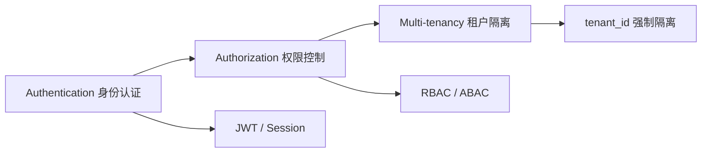
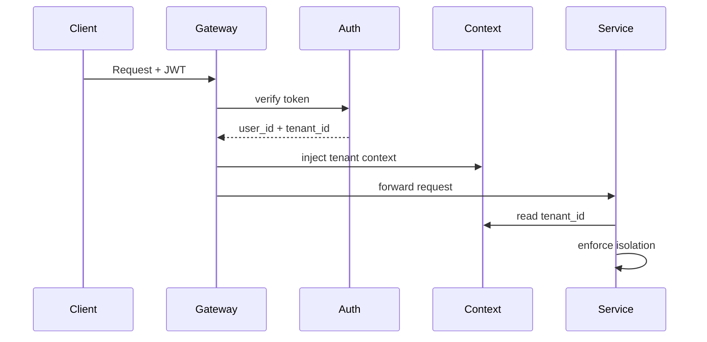
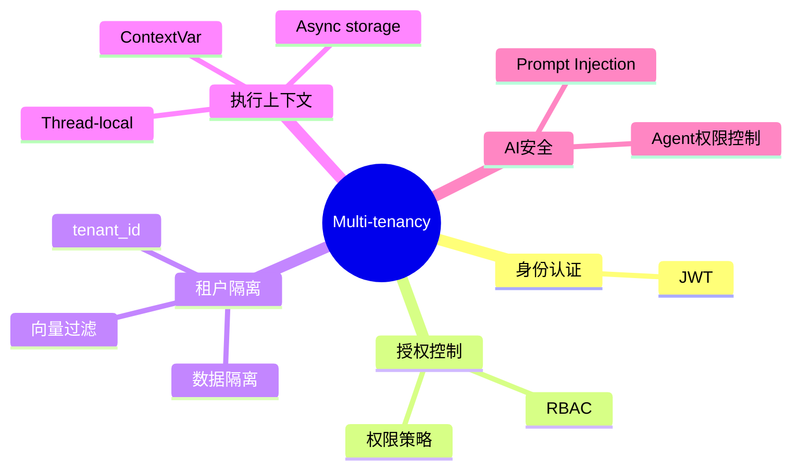

<!--
Chapter: 56
Node: KN-C-000074
Score: 88
Status: ✅ APPROVED
Attempt: 1
Round: 2
Generated: 2026-06-21 05:10:25
-->

# 第56章 Multi-tenancy（多租户架构） [L2-L3]

## Part 1：为什么要学这个？[认知冲突先行]

你以为自己已经掌握了三件事：JWT 认证、RBAC 权限控制、多租户隔离。

所以你很自然地写出一套系统：

* 登录签发 JWT
* 中间件解析 token
* 数据库查询带 tenant_id 过滤

逻辑看起来完美。

直到有一天，客户反馈：

A 公司用户能看到 B 公司合同摘要。

你第一反应是怀疑缓存、怀疑数据库、怀疑模型输出不稳定。

但最后排查结果非常反直觉：

* JWT 是对的
* RBAC 是对的
* SQL 过滤也存在

问题出在一个“默认假设”上：

> 你把 tenant_id 当成“请求参数的一个字段”，而不是“系统不可变事实”。

甚至更隐蔽的是：
系统里存在多个 tenant_id 来源，有的来自 JWT，有的来自 request，有的来自缓存。

攻击者只需要污染其中一个入口，就能完成越权。

这一刻真正的冲击是：

> 多租户不是“你做没做过滤”，而是“系统有没有唯一可信的租户真相源”。

---

## Part 2：学习路径定位

多租户系统容易被误解为“认证的延伸”，但它实际上横跨三个完全不同的层：

* 身份认证（Authentication）：你是谁
* 授权控制（Authorization）：你能做什么
* 租户隔离（Multi-tenancy Isolation）：你属于谁的世界

三者关系如下：



关键误区：

* JWT ≠ 多租户
* RBAC ≠ 数据隔离
* 多租户 ≠ 权限子集

前置知识：

* HTTP / API 基础
* JWT 认证机制（只解决“你是谁”）
* RBAC（只解决“你能做什么”）

后置知识：

* 向量数据库隔离
* Agent 工具权限边界
* AI SaaS 资源调度系统

---

## Part 3：用生活理解它

想象一栋写字楼：

* JWT = 门禁卡（证明你是谁）
* RBAC = 权限标签（你能进会议室还是机房）
* Multi-tenancy = 你属于哪家公司

问题来了：

如果保安只检查“你是谁”，但不检查“你属于哪家公司”，会发生什么？

你可以拿着合法门禁卡进入任何公司办公室。

类比边界：

* 门禁卡 ≠ 公司归属
* 权限 ≠ 数据归属
* 多租户 ≠ 安全策略附加项

多租户解决的是：

> 你“在哪个世界里执行所有操作”。

---

## Part 4：AI如何映射到传统概念

修正后的更精确映射如下：

| AI SaaS 概念 | 传统系统对应           |
| ---------- | ---------------- |
| tenant_id  | 数据域 / 租户边界       |
| JWT        | 登录态 Session      |
| RBAC       | 权限系统             |
| Guardrails | 安全策略引擎 + 输入输出过滤器 |
| 向量库隔离      | schema / 分库分表    |

关键补充理解：

Guardrails 在 AI 系统中不仅是“入口防火墙”，还包括：

* 输入过滤（Prompt Injection）
* 输出过滤（敏感信息泄露）
* 工具调用约束（Agent行为限制）

它比传统 WAF 更靠近“业务语义层”。

---

## Part 5：技术本质深讲

多租户的核心不是“隔离字段”，而是：

> 在所有执行路径中注入不可篡改的租户上下文（Tenant Context）

但这个上下文在不同运行时模型中实现不同：

* Thread-based（传统服务）
* Async context（现代 Python/Node）
* Distributed context（微服务链路）

---

### 核心链路



---

### 关键实现差异（非常重要）

#### 1. Thread-local（传统 Python）

适用于同步 Web 框架，但存在问题：

* 线程复用可能污染上下文

---

#### 2. ContextVar（推荐：FastAPI / Starlette）

```python
from contextvars import ContextVar

tenant_ctx = ContextVar("tenant_id")

def set_tenant(tenant_id: str):
    tenant_ctx.set(tenant_id)

def get_tenant():
    return tenant_ctx.get()
```

适用于：

* FastAPI
* asyncio
* 高并发协程环境

---

#### 3. Node.js（异步链路）

需要 AsyncLocalStorage，而不是全局变量。

---

### 架构原则

> 多租户上下文必须“跟请求走”，不能“跟线程走”。

---

## Part 6：动手Demo（修正SQL安全问题）

这个 Demo 强调：**租户隔离 ≠ SQL 拼接**

```python
class TenantContext:
    _tenant_id = None

    @classmethod
    def set(cls, tenant_id):
        cls._tenant_id = tenant_id

    @classmethod
    def get(cls):
        return cls._tenant_id


def verify_jwt(token):
    return {
        "user_id": "u123",
        "tenant_id": "tenant_A"
    }


def gateway(request):
    payload = verify_jwt(request["jwt"])
    TenantContext.set(payload["tenant_id"])
    return handler()


def handler():
    tenant_id = TenantContext.get()
    return query_db(tenant_id)


# ✅ 修正：使用参数化查询（避免 SQL 注入）
def query_db(tenant_id):
    sql = "SELECT * FROM data WHERE tenant_id = %s"
    params = (tenant_id,)
    return {"sql": sql, "params": params}


request = {
    "jwt": "valid_token",
    "tenant_id": "HACKED"
}

print(gateway(request))
```

运行结果仍然只会基于 JWT tenant：

```text
{'sql': 'SELECT * FROM data WHERE tenant_id = %s', 'params': ('tenant_A',)}
```

---

## Part 7：真实项目场景

在企业级 AI SaaS 中，多租户通常贯穿四层系统：

### 1. API Gateway

* JWT 解析
* tenant_id 注入
* request 参数屏蔽

### 2. AI Service Layer

* Prompt 拼接隔离
* Agent tool scope 控制

### 3. Data Layer

* SQL + Vector 双重过滤
* tenant_id 强制注入

### 4. Billing Layer

* token usage per tenant
* 资源计费隔离

核心原则：

> 租户边界必须在“进入系统时确定”，而不是“查询时判断”。

---

## Part 8：这里容易踩坑（修订增强版）

### ❌ 错误1：信任 request tenant_id

```python
tenant_id = request["tenant_id"]
```

---

### ❌ 错误2：只在 SQL 层过滤

Vector / Prompt 未过滤仍然泄露

---

### ❌ 错误3：共享向量库未过滤

```python
vector_db.search(query_embedding)
```

---

### ❌ 错误4：Embedding 缓存污染（新增）

```python
cache.get(query)
```

问题：

* 不同 tenant 的 query 语义相同
* 命中缓存返回错误 tenant embedding

正确做法：

```python
cache_key = f"{tenant_id}:{query}"
```

---

## Part 9：面试怎么答（增强版）

### L1

四维隔离：

* 数据 / 权限 / 计费 / 资源

---

### L2（增强）

向量数据库设计：

* namespace / index 隔离（强隔离）
* metadata filter（高扩展）

#### 追问优化：

如果 filter 性能差怎么办？

参考答案：

1. 按 tenant_id 分 partition（Pinecone namespace / Milvus partition）
2. 高频租户独立 index
3. filter 字段建立索引
4. 采用 pre-filter（过滤后再 ANN）

---

### L3

资源隔离策略：

* tenant QPS limit
* GPU pool isolation
* dedicated cluster for heavy tenant
* model downgrade fallback

---

## Part 10：考点速查

* tenant_id 必须来自 JWT
* 多租户 ≠ 权限系统
* 向量检索必须过滤 tenant
* Agent 必须绑定租户上下文

---

## Part 11：必背金句

* tenant_id 不可来自 request
* 多租户是系统约束，不是查询条件
* JWT 是唯一可信租户来源
* AI 系统必须默认不信任输入
* 一个漏过滤 = 全租户泄露

---

## Part 12：快速参考表

| 概念            | 作用    | 示例              |
| ------------- | ----- | --------------- |
| tenant_id     | 租户边界  | tenant_A        |
| JWT           | 身份来源  | signed token    |
| ContextVar    | 异步上下文 | request scope   |
| Vector filter | 检索隔离  | metadata filter |

---

## Part 13：思维导图



---

## Part 14：本章小结

多租户不是认证的延伸，而是系统级边界控制。
JWT 解决“你是谁”，RBAC 解决“你能做什么”，多租户解决“你属于谁”。
真正安全的系统必须从请求入口就锁定租户上下文。

成长路径：

* L0：知道 tenant_id
* L1：会写过滤条件
* L2：理解上下文传播
* L3：构建全链路隔离系统

---

## Part 15：下一章预告

你已经能构建“互不看见的租户系统”。

但新的问题出现了：

> 当 AI Agent 拿到工具权限后，它开始“主动推理 + 主动调用 + 主动尝试突破边界”怎么办？

下一章进入：

**Agent Privilege Escalation（AI Agent 权限提升）**

系统安全的真正挑战才刚开始。