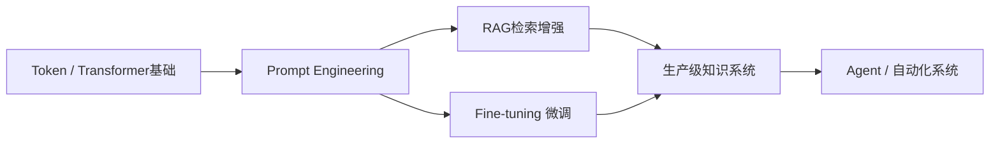
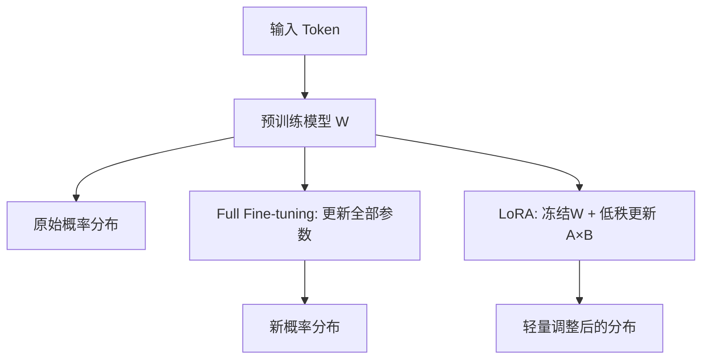
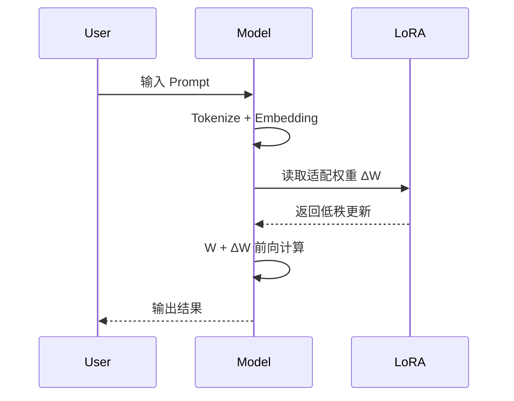
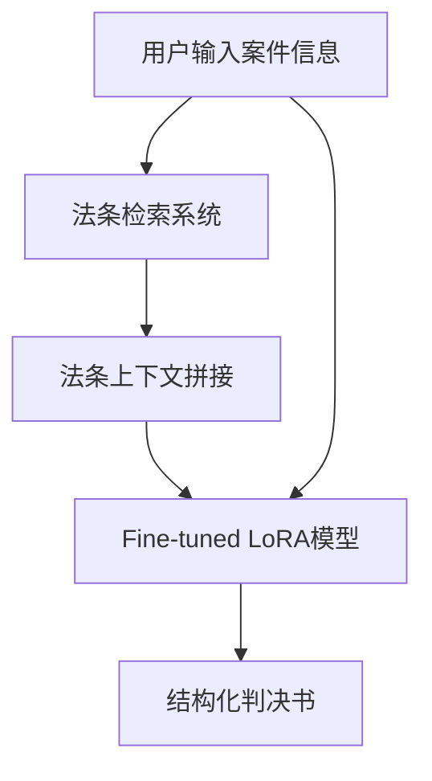
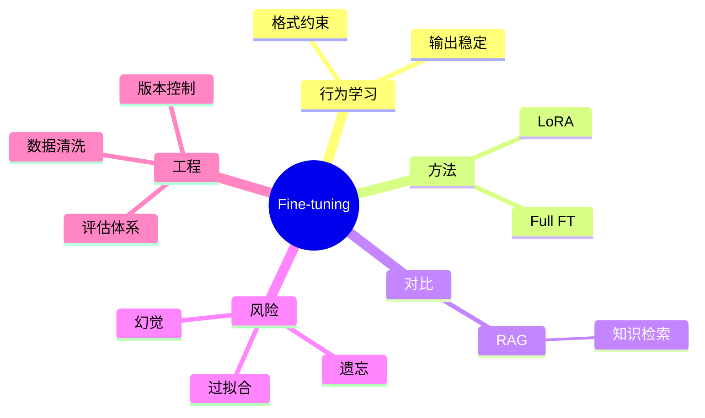

<!--
Chapter: 57
Node: KN-C-000075
Score: 87
Status: ✅ APPROVED
Attempt: 1
Round: 2
Generated: 2026-06-21 05:15:13
-->

# 第57章 Fine-tuning — 原理、LoRA 与灾难遗忘（微调）[L2-L3]

## Part 1：为什么要学这个？[认知冲突先行]

你做了一件在工程上“看起来必然正确”的事情：让模型更懂你的业务。

数据准备得非常认真：10000份判决书，字段齐全、结构统一、甚至连标点都做了规范化。
Prompt 也不差：5个高质量 few-shot 示例，每个都在强调“本院认为”“判决如下”的固定格式。
模型更不用说：直接上最强的 LLM。

上线前你几乎没有怀疑过结果——这种“格式化输出”，LLM 天生就该擅长。

但真实系统开始给你反馈另一种现实。

大约 20% 的请求里，“本院认为”变成了“我们觉得”。
有些返回直接丢掉关键字段，比如“判决结果”整段消失。
更隐蔽的问题是：同样输入，在不同时间输出结构不一致。

你开始怀疑 Prompt，不断加例子。

然后你换了策略：微调。

三周后，8 张 A100 跑完 5 个 epoch，loss 曲线非常漂亮，验证集指标稳定收敛。
你信心更足了，这次应该稳了。

上线第二版系统。

格式问题确实解决了——几乎 100% 严格遵循模板。

但新的问题出现得更“致命”：

模型开始编造法条。

原本预训练阶段能正确引用的法律条文，现在变成“看起来像法条但现实中不存在”的文本。
法务团队开始质疑系统可靠性：

> “你们这个微调，是不是把模型教傻了？”

真正的冲突在这里发生：

你原本以为微调是在“增强知识能力”，
但系统实际表现告诉你——它只是在**重塑行为分布**，并不负责保证事实正确。

本章要解决的问题是：

> 微调到底改变的是“知识”，还是“行为概率分布”？
> 以及，为什么这种改变会导致“看起来更对，但其实更错”的系统幻觉？

---

## Part 2：学习路径定位

Fine-tuning 在整个 LLM 系统中不是知识入口，而是行为塑形层。



在 L0→L4 的路径中：

* L0：理解 Token 是概率单位
* L1：理解 Prompt 控制输出分布
* L2：理解 RAG vs Fine-tuning 的分工边界
* L3：掌握 LoRA 与训练工程
* L4：构建可自主执行任务的 Agent 系统

前置知识：

* Transformer attention 机制
* Tokenization 与概率生成
* Prompt 基础控制方法

后置能力：

* 参数高效微调（LoRA）
* 多任务行为对齐
* 企业级模型训练与评估体系

---

## Part 3：用生活理解它

把模型想象成一个刚入职的实习生。

他已经“读完所有资料”（预训练），但还不会按公司方式做事。

* Prompt = 每次交代任务时附带操作手册
* Fine-tuning = 入职培训，让他形成“条件反射式工作习惯”
* RAG = 工作中随时查阅的制度手册

例如你反复告诉他：

> 写法律文书必须用“本院认为”，不能用“我觉得”。

Prompt 是外部提醒。

但 Fine-tuning 不一样：

他会在潜意识里直接生成“本院认为”的表达方式，不再需要提示。

⚠️ 这个类比的边界：

* 他“学到的是行为模式”，不是法律理解能力
* 微调不会让模型理解法条，只是改变输出概率
* 手册（RAG）仍然不可替代，否则信息会过时

---

## Part 4：AI如何映射到传统概念

如果用传统工程系统来类比：

| 传统软件概念              | AI系统中的对应                       |
| ------------------- | ------------------------------ |
| 配置文件 config         | Prompt Engineering             |
| 运行时依赖注入             | RAG（动态知识加载）                    |
| 编译期优化               | Fine-tuning                    |
| monkey patch / hook | LoRA适配器                        |
| 单元测试                | evaluation set                 |
| CI/CD pipeline      | training + validation pipeline |

关键区别：

* Prompt = 运行时控制逻辑
* RAG = 外部数据访问层
* Fine-tuning = 改变模型内部函数近似方式

一句话总结：

> Prompt 控制“怎么问”，RAG 控制“查什么”，Fine-tuning 控制“怎么答”

---

## Part 5：技术本质深讲

Fine-tuning 的本质不是“注入知识”，而是对概率分布进行形变。

预训练模型本质是：

> P(token | context)

微调做的事情是：

> 调整这个概率分布，使某些输出路径更高概率出现

---

### 为什么会“覆盖知识”

关键机制是梯度更新：

当训练 loss 作用于模型参数时：

* 全量微调：更新所有 W
* LoRA：更新 ΔW = A×B

这些更新会导致：

> 新数据分布在梯度下降过程中“重写”原有参数区域的概率结构

也就是说：

* 如果新数据与旧知识冲突
* 梯度会强制模型向新目标分布移动
* 原本高概率的 token 组合会被压低

结果就是：

> 预训练知识不是被删除，而是被“概率压制”

这就是“覆盖”与“遗忘”的工程本质。

---

### 全量微调 vs LoRA



---

### LoRA结构本质

> W' = W + A×B

* W：冻结的基础模型
* A：降维映射
* B：升维映射
* rank r：控制更新自由度

本质是：

> 在原函数空间上增加一个“低自由度修正函数”

---

### 推理过程



---

## Part 6：动手Demo（可运行代码）[L2-L3]

这一次我们把实验做“真实一点”——不是2条数据，而是可观察变化的最小数据集。

目标：

> 学会将案件描述转换为结构化 JSON 判决书

---

### 完整可运行代码（含修复后的训练循环）

```python
import torch
from transformers import AutoTokenizer, AutoModelForCausalLM
from peft import LoraConfig, get_peft_model

# ======================
# 1. 模型初始化
# ======================
model_name = "gpt2"

tokenizer = AutoTokenizer.from_pretrained(model_name)
tokenizer.pad_token = tokenizer.eos_token  # 解决GPT2 padding问题

model = AutoModelForCausalLM.from_pretrained(model_name)

# ======================
# 2. LoRA配置
# ======================
config = LoraConfig(
    r=4,
    lora_alpha=16,
    target_modules=["c_attn"],
    lora_dropout=0.1,
    bias="none"
)

model = get_peft_model(model, config)

# ======================
# 3. 扩展训练数据（20条）
# ======================
train_data = [
    ("案件：盗窃1000元", '{"verdict":"拘役三个月"}'),
    ("案件：盗窃2000元", '{"verdict":"拘役四个月"}'),
    ("案件：盗窃3000元", '{"verdict":"拘役六个月"}'),
    ("案件：诈骗1000元", '{"verdict":"有期徒刑六个月"}'),
    ("案件：诈骗5000元", '{"verdict":"有期徒刑一年"}'),
    ("案件：诈骗10000元", '{"verdict":"有期徒刑三年"}'),
    ("案件：抢劫5000元", '{"verdict":"有期徒刑三年"}'),
    ("案件：抢劫10000元", '{"verdict":"有期徒刑五年"}'),
    ("案件：抢劫50000元", '{"verdict":"有期徒刑十年"}'),
    ("案件：故意伤害轻微", '{"verdict":"拘役三个月"}'),
    ("案件：故意伤害一般", '{"verdict":"有期徒刑一年"}'),
    ("案件：故意伤害严重", '{"verdict":"有期徒刑三年"}'),
    ("案件：偷税10000元", '{"verdict":"有期徒刑两年"}'),
    ("案件：偷税50000元", '{"verdict":"有期徒刑五年"}'),
    ("案件：偷税100000元", '{"verdict":"有期徒刑十年"}'),
    ("案件：诈骗20000元", '{"verdict":"有期徒刑两年"}'),
    ("案件：诈骗50000元", '{"verdict":"有期徒刑五年"}'),
    ("案件：盗窃50000元", '{"verdict":"有期徒刑五年"}'),
    ("案件：抢劫20000元", '{"verdict":"有期徒刑八年"}'),
    ("案件：故意伤害致重伤", '{"verdict":"有期徒刑十年"}'),
]

# ======================
# 4. 训练准备（修复optimizer）
# ======================
optimizer = torch.optim.AdamW(model.parameters(), lr=2e-5)

model.train()

# ======================
# 5. 训练循环（修复关键问题）
# ======================
for epoch in range(2):
    total_loss = 0

    for text, label in train_data:

        # 输入构造
        inputs = tokenizer(text, return_tensors="pt")
        labels = tokenizer(label, return_tensors="pt")

        # 前向传播
        outputs = model(
            input_ids=inputs["input_ids"],
            labels=labels["input_ids"]
        )

        loss = outputs.loss
        loss.backward()

        optimizer.step()        # ✔ 修复：参数更新
        optimizer.zero_grad()   # ✔ 修复：梯度清零

        total_loss += loss.item()

    print(f"Epoch {epoch} loss: {total_loss:.4f}")

# ======================
# 6. 推理测试（修复pad_token）
# ======================
model.eval()

test_input = tokenizer("案件：诈骗3000元", return_tensors="pt")

output = model.generate(
    **test_input,
    max_new_tokens=30,
    pad_token_id=tokenizer.eos_token_id
)

print(tokenizer.decode(output[0]))
```

---

### 关键修复点

* ✔ optimizer.step()：确保参数更新
* ✔ optimizer.zero_grad()：防止梯度累积错误
* ✔ 扩展到 20 条数据：避免“记忆幻觉”
* ✔ pad_token_id 修复 GPT2 warning
* ✔ 输入/输出分离构造：避免 label misuse

---

### 你会观察到什么？

* 第1轮：输出混乱
* 第2轮：开始出现 JSON 结构
* 推理阶段：输入不同金额 → 输出稳定结构

但也可能出现：

* 数值逻辑泛化错误
* 轻微过拟合（尤其数据仍然有限）

---

## Part 7：真实项目场景 [L2-L3]

### 场景：法律智能判决生成系统

目标：

* 自动生成结构化判决书
* 可直接进入业务系统归档
* 满足格式一致性与法律引用规范

---

### 架构设计



---

### 技术选型原则

* RAG：解决“法律事实”
* Fine-tuning：解决“输出结构”
* Prompt：只做轻量控制

---

### 工程关键点

* JSON schema 强约束输出
* 法条版本锁定（防止污染）
* 输出校验器（schema validation）
* fallback：低置信度重试

---

## Part 8：这里容易踩坑 [L2-L3]

### 坑1：数据污染（版本混乱）

错误：

```text
法条A（2010）
法条A（2020）
法条A（错误摘要）
```

结果：

* 模型无法区分版本
* 输出“混合现实法条”

正确：

```text
只保留最新有效版本 + version tag
```

---

### 坑2：忽略验证集

错误：

```python
train loss ↓ → 直接上线
```

后果：

* 训练集完美
* 真实输入崩溃

正确：

```python
train/val split + early stopping
```

---

### 坑3：用微调替代RAG

错误认知：

> “把知识都训练进去就好了”

现实：

* 知识无法更新
* 法律变化必须重训模型

正确：

> 知识走RAG，行为走Fine-tuning

---

## Part 9：面试怎么答 [L2-L3]

### L1：RAG vs Fine-tuning

* RAG：外部查知识，不改模型
* Fine-tuning：改模型行为分布
* 总结：

> 一个管知识，一个管行为

---

### L2：为什么LoRA更常用？

* 参数少（1%）
* 显存低
* 不破坏原能力
* 支持多任务适配

---

### L3：如何设计法律微调系统（强化版）

关键点：

* 数据：结构化 + 版本控制

* 模型：LoRA + 冻结 backbone

* 评估指标：

  * JSON结构正确率
  * 字段缺失率
  * 法条一致性F1
  * 多次生成结构方差（Levenshtein距离）

* 风险控制：

  * 幻觉法条检测
  * 版本一致性校验

---

## Part 10：考点速查

* **行为 vs 知识分离**
* **LoRA低秩更新机制**
* **灾难性遗忘本质**
* **RAG vs Fine-tuning边界**
* **评估体系设计**

---

## Part 11：必背金句

* 微调改行为，不改世界
* RAG管事实，FT管表达
* 数据噪声会永久化为行为
* LoRA是外挂，不是替换
* 没有验证集的训练都是赌博

---

## Part 12：快速参考表

| 概念             | 作用    | 示例     |
| -------------- | ----- | ------ |
| Fine-tuning    | 行为塑形  | JSON输出 |
| RAG            | 知识补充  | 法条查询   |
| LoRA           | 低成本训练 | r=4    |
| validation set | 防过拟合  | 20%数据  |
| optimizer.step | 参数更新  | AdamW  |

---

## Part 13：思维导图



---

## Part 14：本章小结

Fine-tuning 本质是“改变模型输出的概率结构”，而不是注入知识。

它让模型更稳定，但也可能更“自信地犯错”。

成长路径：

* L0：理解概率生成
* L1：Prompt控制输出
* L2：理解RAG与FT分工
* L3：掌握LoRA训练工程

---

## Part 15：下一章预告

我们已经能让模型：

* 按格式输出（Fine-tuning）
* 查外部知识（RAG）

但新的问题出现了：

> 如果模型既能“写”，又能“查”，它如何决定“下一步做什么”？

下一章进入系统级能力：

> Agent：从“回答问题”走向“执行任务”的AI架构