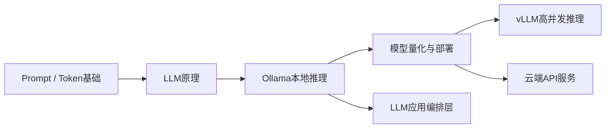
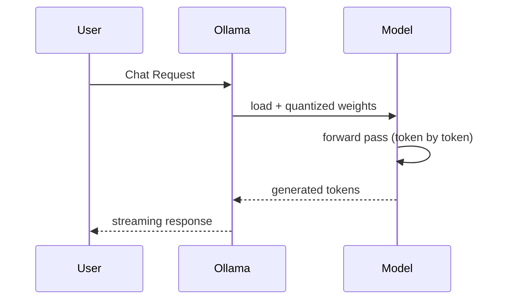
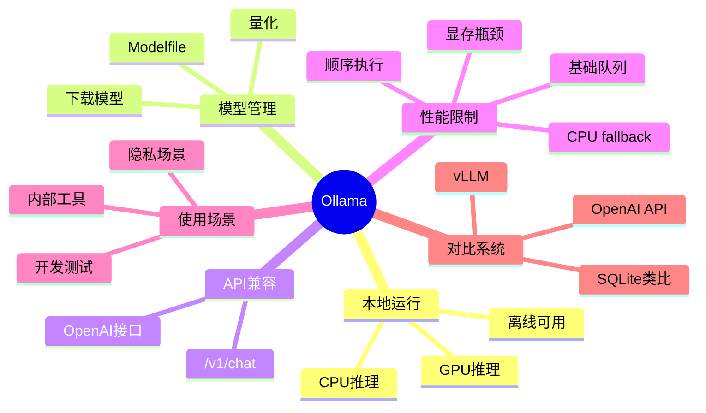

<!--
Chapter: 58
Node: KN-C-000076
Score: 88
Status: ✅ APPROVED
Attempt: 1
Round: 2
Generated: 2026-06-21 05:19:46
-->

# 第58章 Ollama（本地模型部署） [L1-L2]

---

## Part 1：为什么要学这个？[认知冲突先行]

你在电脑上用 Ollama 跑 `llama3.2`，给同事演示“本地模型真的很快”。
响应几乎是秒回，数据也完全不出内网，他眼睛都亮了。

然后他问了一句很自然的问题：

“那我们能不能把公司的客服系统迁到这个上面？每天几万次请求应该没问题吧？”

你几乎不假思索地回答：

“当然可以，Ollama 很轻量的。”

第一天上线，系统还在正常运行。

第二天开始出现卡顿。

第三天，10 个并发请求直接把机器打爆：
显存飙升、排队延迟从 200ms 变成 18 秒、最后 OOM 崩溃。

你突然意识到一个问题：

**“轻量”不等于“能扛生产流量”。**

更关键的误解在这里：

> 你以为 Ollama 是“迷你版云端推理服务”，
> 但它实际上是“开发者本地运行时”。

本章要解决的核心问题是：

**Ollama 到底适合什么场景？为什么它不能直接当生产级推理引擎？**

---

## Part 2：学习路径定位

Ollama 位于“从模型使用到系统化部署”的关键过渡层。



在 L0→L4 路径中的位置：

* L0：Token 与 Prompt 基础
* L1：LLM基础使用
* L1-L2：Ollama本地推理（本章）
* L2：模型部署与量化
* L3：高性能推理系统（vLLM）
* L4：AI Infra 架构设计

前置知识：

* Transformer基本原理
* HTTP API调用方式

后置知识：

* vLLM推理优化
* RAG工程系统
* 多模型路由与编排

---

## Part 3：用生活理解它

Ollama 像家里的厨房。

你可以自己做饭：

* 食材自己准备
* 做饭不排队
* 完全私密
* 成本几乎忽略

但问题是：

你一次只能做一两份饭。

而云端 API 或 vLLM 像餐厅后厨：

* 多炉灶并行
* 专业分工
* 可以同时出几十上百份餐
* 但成本更高、结构更复杂

边界很重要：

* Ollama不是“低配餐厅”
* 它是“单人厨房系统”，不是“工业生产线”

---

## Part 4：AI如何映射到传统概念

如果用传统系统类比，可以更精确地理解：

| AI概念       | 传统类比             |
| ---------- | ---------------- |
| Ollama     | SQLite（单机嵌入式数据库） |
| vLLM       | PostgreSQL 集群    |
| OpenAI API | 云数据库 RDS         |
| 模型权重       | 编译后的可执行程序        |
| Token推理    | SQL查询执行          |

核心理解：

* Ollama = 单机可用系统
* vLLM = 分布式高吞吐系统
* OpenAI = 托管云服务

关键差异：

> SQLite很好用，但你不会用它直接扛全球交易系统。

---

## Part 5：技术本质深讲

Ollama 的本质是：

> 本地 LLM Runtime + 模型管理 + API封装层

它做五件事：

1. 模型下载与管理（Ollama Hub）
2. 模型量化（Q4/Q8自动选择）
3. 本地推理执行
4. OpenAI API兼容层
5. 模型运行配置（Modelfile）

---

### 推理流程



---

### Modelfile（关键补充）

Ollama 不只是“跑模型”，还支持“模型配置化”。

```text
FROM llama3.2

PARAMETER temperature 0.5
PARAMETER num_ctx 4096

SYSTEM "You are a concise assistant that answers like an engineer."
```

创建模型：

```bash
ollama create my-llama -f Modelfile
```

运行：

```bash
ollama run my-llama
```

---

### 核心组件

#### 1. 模型加载

* GGUF / quantized权重
* 自动适配硬件

#### 2. 量化系统

* Q4/Q8压缩
* 显存与精度权衡

#### 3. 推理执行器

* 单请求顺序执行
* 简单队列调度（支持基础并发请求）

#### 4. API层

* OpenAI兼容 `/v1/chat/completions`

---

### OpenAI兼容调用（稳定版）

```python
from openai import OpenAI

try:
    client = OpenAI(
        base_url="http://localhost:11434/v1",
        api_key="ollama-local"
    )

    response = client.chat.completions.create(
        model="llama3.2",
        messages=[{"role": "user", "content": "解释Ollama"}]
    )

    print(response.choices[0].message.content)

except Exception as e:
    print(f"[ERROR] Ollama服务异常: {e}")
    print("请检查：1)服务是否启动 2)模型是否已下载 3)端口11434是否可达")
```

---

### 关键限制（修正）

Ollama 并非完全没有并发能力：

* ✔ 支持请求队列（0.1.15+）
* ✔ 可处理多个连接请求
* ❌ 不支持 continuous batching（vLLM核心能力）
* ❌ 不具备GPU级动态调度优化

因此更准确说法是：

> Ollama 支持“基础并发”，但不具备“高吞吐推理优化”。

---

## Part 6：动手Demo（可运行代码）

### 完整可运行版本（含异常处理）

```python
import requests
import json
import time

url = "http://localhost:11434/v1/chat/completions"

payload = {
    "model": "llama3.2",
    "messages": [
        {"role": "user", "content": "什么是Ollama？"}
    ],
    "temperature": 0.7
}

def call_ollama():
    try:
        response = requests.post(url, json=payload, timeout=30)

        if response.status_code != 200:
            print(f"[HTTP ERROR] {response.status_code}")
            print(response.text)
            return None

        data = response.json()

        if "choices" not in data:
            print("[ERROR] 响应结构异常:", data)
            return None

        return data["choices"][0]["message"]["content"]

    except requests.exceptions.ConnectionError:
        print("[ERROR] 无法连接Ollama服务")
        print("请确认：ollama serve 是否已启动")
    except requests.exceptions.Timeout:
        print("[ERROR] 请求超时")
    except Exception as e:
        print(f"[UNKNOWN ERROR] {e}")

    return None


if __name__ == "__main__":
    start = time.time()

    result = call_ollama()

    if result:
        print("\n=== 输出 ===")
        print(result)

    print(f"\n耗时: {time.time() - start:.2f}s")
```

---

### 运行现象

正常情况：

* 首次请求较慢（模型加载）
* 后续请求稳定 100ms~2s
* 流式输出

异常情况：

* 服务未启动 → ConnectionError
* 模型未下载 → 404 error
* 显存不足 → 延迟暴涨或CPU fallback

---

## Part 7：真实项目场景

一家 B2B SaaS 公司做“AI合同助手”。

目标：

* 合同摘要
* 风险条款检测
* 客户隐私本地处理

---

### 架构

* Ollama + Llama 3.1 8B
* 单机 RTX 4090
* FastAPI API层

---

### 初期效果

* 延迟：200ms
* 成本：接近0
* 用户体验：很好

---

### 线上问题

* 8并发 → GPU显存 14GB → 22GB
* 推理延迟 → 3s+
* OOM崩溃

---

### 根因

* KV Cache 无优化
* 无 continuous batching
* Ollama 顺序执行为主
* 显存换出导致CPU fallback（性能下降50~100倍）

---

### 最终架构

* 开发：Ollama
* 生产：vLLM
* API层：LiteLLM

---

### 成本说明（修正）

* OpenAI API成本：约 $2300/月（按约 300万 tokens/天估算）
* 本地方案：

  * RTX 4090（$1600，一次性）
  * 3年折旧 → ~$44/月
  * 电费 + 运维 → ~$50/月
* 合计：~$100/月级别运行成本

---

## Part 8：这里容易踩坑

### 坑1：误以为Ollama可直接生产化

❌

```python
ollama.run("llama3.2")
```

✔

```text
开发：Ollama
生产：vLLM / API
```

---

### 坑2：Q4盲目使用

* Q4 = 省显存
* 但推理能力下降明显

---

### 坑3：上下文长度默认太小

```json
{
  "num_ctx": 2048
}
```

RAG场景直接爆

---

### 坑4：Ollama内存换出机制（新增）

当显存不足：

* 模型自动迁移 CPU
* 推理速度下降 50~100倍
* 但不会报错（静默降级）

监控：

```bash
ollama ps
```

建议：

```bash
export OLLAMA_NUM_PARALLEL=2
```

---

## Part 9：面试怎么答

### L1

Ollama是什么？

* 本地LLM运行时
* 支持模型下载与推理
* OpenAI兼容API
* 用于开发/隐私场景

---

### L2

如何替换OpenAI？

* base_url → localhost:11434/v1
* API结构不变
* 几乎零代码改动

---

### L3

为什么不能用于高并发？

* 基础队列调度
* 无 continuous batching
* KV cache压力大
* vLLM专为吞吐优化

---

## Part 10：考点速查

* **Ollama定位**：本地运行时，不是生产系统
* **OpenAI兼容性**：API完全可替换
* **量化影响**：Q4换显存换精度
* **并发能力**：有限队列，不是高吞吐
* **关键边界**：开发工具 vs 生产系统

---

## Part 11：必背金句

* 本地能跑，不代表能上线
* Ollama解决的是可用性，不是规模问题
* Q4换的是显存，不是免费能力
* 单机系统没有分布式奇迹
* vLLM解决的是吞吐，不是模型能力
* **能用ollama跑通的工作流，才值得用vLLM重构**

---

## Part 12：快速参考表

| 概念        | 作用    | 示例                 |
| --------- | ----- | ------------------ |
| Ollama    | 本地运行时 | llama3.2           |
| Modelfile | 模型配置  | SYSTEM + PARAMETER |
| Q4量化      | 压缩模型  | Q4_K_M             |
| num_ctx   | 上下文   | 4096/8192          |
| vLLM      | 高吞吐引擎 | PagedAttention     |

---

## Part 13：思维导图



---

## Part 14：本章小结

Ollama 是一个本地大模型运行时，它解决的是“能在自己机器上跑模型”的问题，而不是“如何支撑大规模请求”的问题。
它适合开发与隐私场景，但不适合直接承载生产高并发流量。
真正的工程路径是：Ollama用于验证 → vLLM用于生产 → 云API用于兜底。

---

## Part 15：下一章预告

你已经掌握了本地模型运行方式，也理解了它的边界。

但新的问题来了：

当系统需要支撑 100 并发甚至 1000 并发时，GPU是如何被“重新设计使用方式”的？

下一章：

**vLLM 高性能推理架构**

你会看到：

* PagedAttention如何改变显存管理
* 为什么KV Cache是性能瓶颈
* 以及真正生产级LLM系统的设计方式