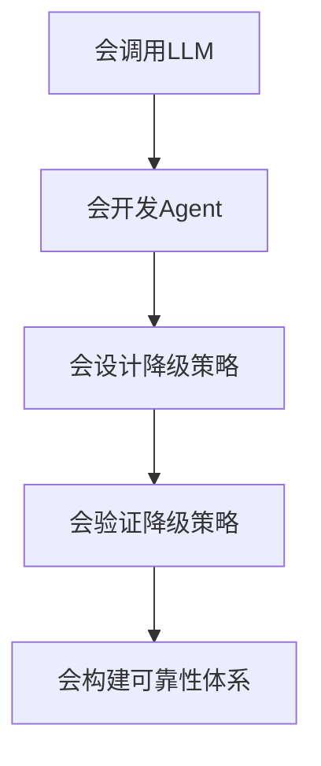
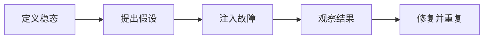
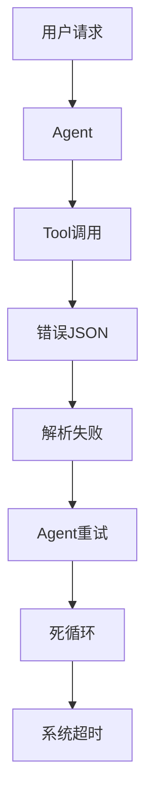
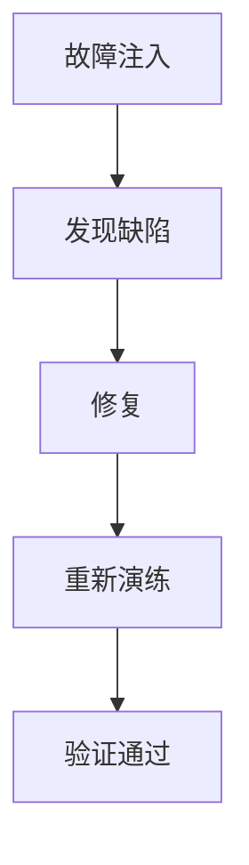
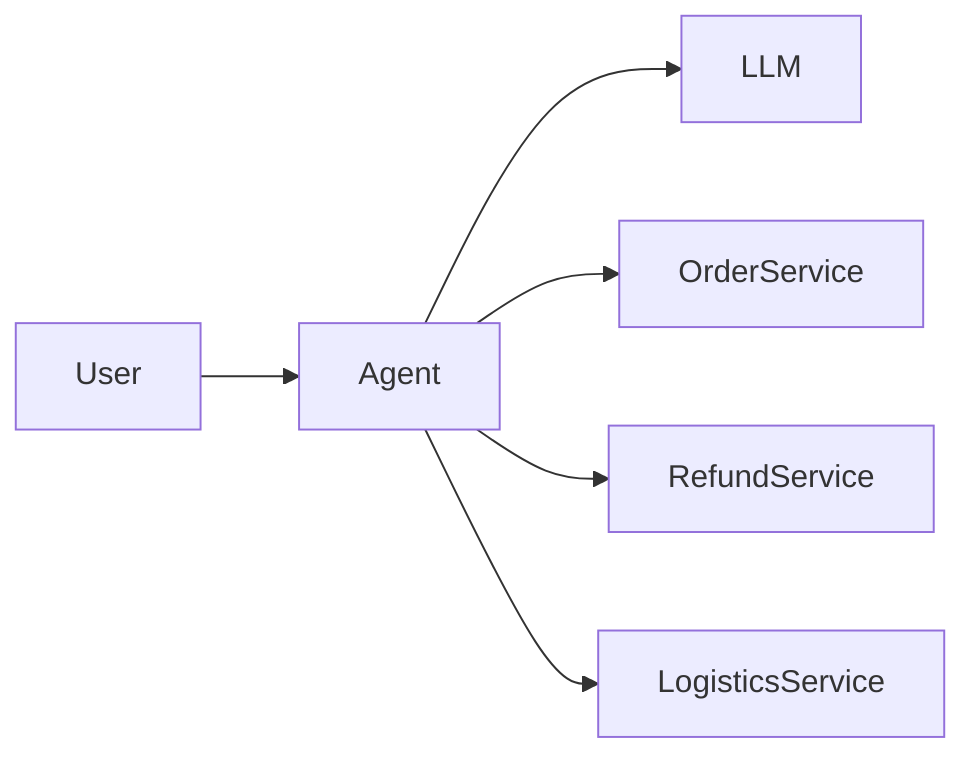
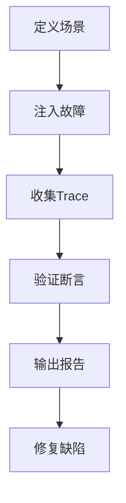
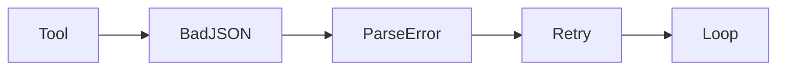
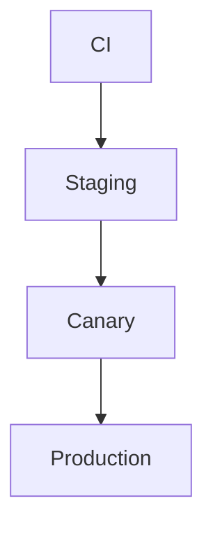
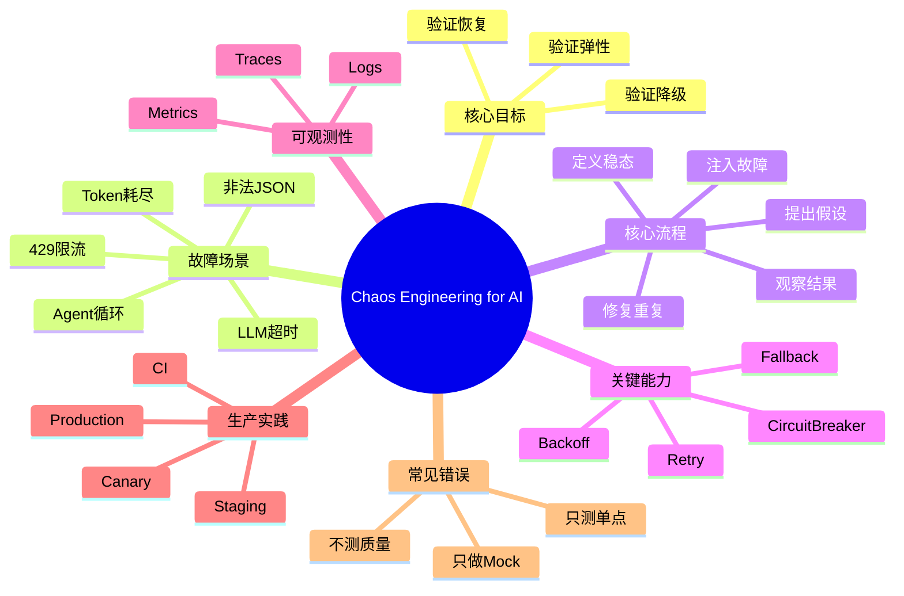

<!--
Chapter: 59
Node: KN-C-000077
Score: 91
Status: ✅ APPROVED
Attempt: 2
Round: 2
Generated: 2026-06-21 06:01:25
-->

# 第59章 Chaos Engineering for AI（AI 系统混沌工程） [L2-L3]

## Part 1：为什么要学这个？认知冲突先行

你写的 AI Agent 在 Demo 演示中完美运行。

部署上线两周后，某天下午 3 点，LLM API 突然开始返回错误。

你一点都不慌。

因为你知道系统里已经写好了降级逻辑。

你甚至对团队说：

> “没事，我们有备用模型，理论上应该自动切换。”

结果十分钟后，监控报警开始疯狂响起。

错误率从 0.2% 飙升到 100%。

用户全部收到：

```text
Service Unavailable
```

排查半天才发现：

降级逻辑判断的是 HTTP 500。

而实际故障返回的是 HTTP 502。

降级代码从来没有执行过。

更糟糕的是：

这段代码已经在生产环境躺了三个月。

没有任何人验证过：

**如果 LLM 真的挂掉，系统到底会不会降级。**

这正是很多 AI 工程团队的共同误区：

> “写了降级代码” ≠ “系统真的能降级”。

传统开发习惯于：

* 写代码
* 写单元测试
* Mock 一个异常
* 看覆盖率通过

于是大家天然认为：

```text
代码存在
=
功能有效
```

但 AI 系统不是这样。

AI 系统依赖：

* 外部 LLM API
* 向量数据库
* Tool 调用
* Agent 多步推理链

任何一个环节出问题，都可能产生级联故障。

真正危险的不是：

> 系统没有降级逻辑

而是：

> 系统有降级逻辑，但从未验证过。

这就是 Chaos Engineering 存在的原因。

它的核心思想非常简单：

> 不要等生产故障发生时才第一次测试你的应急预案。

对于 AI 系统而言：

Chaos Engineering = 主动给系统制造故障。

目的不是搞破坏。

而是验证：

* 超时处理是否有效
* 重试机制是否有效
* Fallback 是否有效
* Agent 是否会死循环
* 用户是否仍然能获得服务

本章要解决的核心问题是：

> 如何通过混沌工程，证明 AI 系统的弹性是真实存在的，而不是停留在代码注释里。

---

## Part 2：学习路径定位

Chaos Engineering 并不是孤立知识。

它属于 AI 系统可靠性（Reliability）体系中的高级实践。

只有理解系统运行机制之后，才有能力主动破坏它。

### 在 AI 工程体系中的位置


### 前置知识

学习本章前建议掌握：

| 知识                   | 原因     |
| -------------------- | ------ |
| LLM API 调用           | 理解故障来源 |
| Agent 工作流            | 理解多步执行 |
| Tracing              | 观察故障传播 |
| Retry机制              | 构建恢复能力 |
| Graceful Degradation | 理解降级设计 |

### 后续知识

掌握混沌工程后，可以继续学习：

| 知识方向                    | 价值         |
| ----------------------- | ---------- |
| AI SRE                  | 构建企业级可靠性体系 |
| Reliability Engineering | 服务稳定性设计    |
| Incident Response       | 故障响应体系     |
| AI Platform Engineering | 平台级弹性能力    |

### 能力成长路径



很多工程师停留在 L2。

他们会写降级代码。

真正的高级工程师会进入 L3：

> 主动证明降级代码真的有效。

---

## Part 3：用生活理解它

想象一家企业总部。

公司安装了：

* 烟雾报警器
* 自动喷淋系统
* 应急照明
* 消防通道

领导非常满意。

因为从纸面上看：

```text
消防系统已建设完成
```

但从来没有做过消防演习。

某天厨房真的起火。

大家才发现：

* 报警器没电
* 喷淋阀门被关闭
* 应急灯损坏
* 消防通道被杂物堵住

问题不是设施不存在。

问题是没人验证它是否可用。

AI 系统中的降级逻辑也是如此。

Chaos Engineering 本质上就是：

> 定期拉响火警，验证整套应急系统真的能工作。

### 类比的边界

现实消防系统遵循确定性规则。

而 AI 系统具有概率性。

即使故障相同：

* 两次输出可能不同
* 两次 Agent 行为可能不同
* 两次恢复路径可能不同

因此 AI 混沌工程比传统消防演练更加复杂。

---

## Part 4：AI如何映射到传统概念

很多传统软件工程师第一次接触 Chaos Engineering 时，会觉得这是一个新概念。

实际上它与传统可靠性工程高度对应。

### 传统软件 vs AI 系统

| 传统软件   | AI系统          |
| ------ | ------------- |
| 数据库故障  | 向量数据库故障       |
| RPC超时  | LLM API超时     |
| 服务限流   | 模型429限流       |
| 返回非法数据 | 非法JSON输出      |
| 消息队列积压 | Token耗尽       |
| 服务雪崩   | Agent级联失败     |
| 熔断器    | 模型Fallback    |
| 容灾演练   | Chaos Testing |

### 故障类型映射

| 传统场景          | AI场景                      |
| ------------- | ------------------------- |
| MySQL Down    | LLM Provider Down         |
| Redis Timeout | Embedding Service Timeout |
| MQ故障          | Tool调用失败                  |
| API 500       | Model API 502             |
| 数据污染          | Prompt Context污染          |

### 核心思想映射

| 传统可靠性 | AI可靠性                |
| ----- | -------------------- |
| 高可用   | 高可用                  |
| 熔断    | 模型切换                 |
| 重试    | Retry + Backoff      |
| 降级    | Graceful Degradation |
| 混沌演练  | AI Chaos Testing     |

因此可以把 Chaos Engineering 理解为：

> Reliability Engineering 在 AI 世界中的延伸。

---

## Part 5：技术本质深讲

### 一个关键误区

很多人认为：

```text
Chaos Engineering
=
随机搞破坏
```

事实上完全不是。

真正的混沌工程是一套严谨的方法论。

核心目标是：

> 验证系统在故障发生时仍能维持稳定状态（Steady State）。

### 混沌工程五步法



---

### 第一步：定义稳态

稳态是系统正常运行时的关键指标。

例如：

| 指标       | 目标   |
| -------- | ---- |
| 成功率      | >99% |
| 响应时间     | <5秒  |
| 用户满意度    | >90% |
| Agent完成率 | >95% |

稳态回答的问题是：

> “系统正常时应该长什么样？”

---

### 第二步：提出假设

例如：

```text
如果主模型超时，
系统将在3秒内切换备用模型，
整体成功率仍然高于95%
```

注意：

这不是测试结果。

只是工程师的假设。

Chaos Engineering 的目的就是验证它。

---

### 第三步：注入故障

这是整个体系最核心的部分。

AI 特有故障场景包括：

### LLM超时

```text
sleep(30s)
```

验证：

* Retry是否触发
* Fallback是否触发

---

### 429限流

```text
HTTP 429
```

验证：

* 指数退避
* 模型切换

---

### 非法JSON

```json
{
  "name":
```

验证：

* Schema校验
* 修复机制

---

### Agent死循环

```text
Tool A -> Tool B -> Tool A
```

验证：

* 最大步数限制
* 循环检测

---

### Token耗尽

```text
context_length_exceeded
```

验证：

* 历史裁剪
* 上下文压缩

---

### AI 系统中的故障传播

传统系统故障传播通常是线性的。

AI 系统往往是级联传播。



一个格式错误的数据。

最终可能演变成整个系统不可用。

---

### 第四步：观察

Chaos Engineering 离不开可观测性。

此时需要：

* Metrics
* Logs
* Traces

尤其是 Tracing。

因为你必须知道：

```text
故障发生在哪里
↓
传播到哪里
↓
谁触发了降级
↓
最终如何恢复
```

没有链路追踪。

混沌测试只是在“制造问题”。

而不是“理解问题”。

---

### 第五步：修复并重复

很多团队做一次演练就结束。

这是错误的。

正确方式是：

```text
故障注入
↓
发现问题
↓
修复问题
↓
再次注入
↓
验证修复
↓
持续循环
```



### AI 混沌工程的核心验证对象

最终所有演练都在验证三件事：

| 验证对象 | 关注点    |
| ---- | ------ |
| 检测能力 | 能否发现故障 |
| 降级能力 | 能否继续服务 |
| 恢复能力 | 能否自动恢复 |

换句话说：

> Chaos Engineering 不是为了证明系统会坏。

而是为了证明：

> 当系统坏掉时，它依然能够活下来。

这也是 AI 系统可靠性建设从 L2 迈向 L3 的关键分水岭。

## Part 6：动手Demo（可运行代码）

理解混沌工程最好的方式，不是看概念。

而是亲手让系统“故障一次”。

下面实现一个最小版 AI 服务。

功能：

* 主模型调用
* 模拟随机超时
* 自动切换备用模型
* 输出演练结果

### 最小可运行示例

```python
import random
import time


class PrimaryLLM:
    def generate(self, prompt: str) -> str:
        if random.random() < 0.5:
            raise TimeoutError("Primary model timeout")
        return f"[PRIMARY] Answer for: {prompt}"


class BackupLLM:
    def generate(self, prompt: str) -> str:
        return f"[BACKUP] Answer for: {prompt}"


def ask_llm(prompt: str) -> str:
    primary = PrimaryLLM()
    backup = BackupLLM()

    try:
        start = time.time()

        result = primary.generate(prompt)

        cost = round(time.time() - start, 3)

        print(f"Primary model success ({cost}s)")

        return result

    except TimeoutError as e:
        print(f"Fault injected: {e}")
        print("Switching to backup model...")

        return backup.generate(prompt)


if __name__ == "__main__":
    for i in range(5):
        print("\n=== Chaos Test ===")
        answer = ask_llm("What is Chaos Engineering?")
        print(answer)
```

### 关键代码解析

#### 模拟故障

```python
if random.random() < 0.5:
    raise TimeoutError("Primary model timeout")
```

50%概率主动制造超时。

这就是故障注入（Fault Injection）。

---

#### 验证降级

```python
except TimeoutError:
```

验证系统是否进入备用路径。

---

#### Fallback

```python
return backup.generate(prompt)
```

验证备用模型是否真正接管服务。

### 运行后你会看到什么

某次运行可能输出：

```text
=== Chaos Test ===
Fault injected: Primary model timeout
Switching to backup model...
[BACKUP] Answer for: What is Chaos Engineering?

=== Chaos Test ===
Primary model success (0.0s)
[PRIMARY] Answer for: What is Chaos Engineering?
```

此时已经完成一次最简单的混沌演练：

* 故障发生
* 系统检测
* 自动降级
* 服务继续

这才叫验证过的弹性。

---

## Part 7：真实项目场景

### 项目背景

某头部电商公司构建智能客服 Agent。

系统能力包括：

* 订单查询
* 退款处理
* 物流追踪
* 商品推荐

架构如下：



每日请求量超过百万。

### 第一次生产事故

系统上线后运行稳定。

某天外部 LLM Provider 触发限流。

返回：

```text
HTTP 429
```

团队认为系统不会出问题。

因为已经写好了降级逻辑。

实际情况：

```text
错误率 100%
持续 47 分钟
影响用户 12000+
```

### 根因分析

工程师捕获的是：

```python
except requests.RequestException:
```

而 SDK 实际抛出：

```python
APITimeoutError
```

因此：

```text
异常发生
↓
未被捕获
↓
降级逻辑未执行
↓
用户收到错误
```

### 引入 Chaos Testing

团队开始使用混沌演练。

每周自动执行：

| 场景      | 目标         |
| ------- | ---------- |
| LLM超时   | 验证Fallback |
| 429限流   | 验证模型切换     |
| 非法JSON  | 验证解析兜底     |
| 空检索结果   | 验证Agent行为  |
| Agent循环 | 验证步数限制     |

### 演练流程



### 最终效果

经过三轮演练：

* 修复7个降级缺陷
* 修复3个异常处理漏洞
* 修复2个Agent死循环问题

真实故障再次发生时：

```text
2.3秒自动切换备用模型
错误率降至0.3%
用户几乎无感知
```

这就是 Chaos Engineering 的价值：

> 在故障真正到来之前，提前发现所有错误的假设。

---

## Part 8：这里容易踩坑

### 错误一：只做 Mock 测试

错误代码：

```python
try:
    raise TimeoutError()
except TimeoutError:
    fallback()
```

工程师觉得：

```text
测试通过
=
生产有效
```

实际上生产环境可能抛出：

```python
APITimeoutError
```

正确做法：

```python
inject_real_timeout()
verify_fallback_triggered()
```

验证真实故障。

---

### 错误二：只测单点故障

错误思路：

```text
LLM正常
Tool正常
数据库正常

系统一定正常
```

AI Agent 并不是这样工作的。

错误传播：



正确做法：

端到端验证整条链路。

---

### 错误三：不验证回答质量

错误代码：

```python
assert status_code == 200
```

这只能说明服务没崩。

不能说明回答可用。

例如：

```text
抱歉，我无法回答。
```

虽然返回200。

但用户体验已经失败。

正确做法：

```python
assert answer_quality >= threshold
```

验证：

* 是否完成任务
* 是否回答问题
* 是否满足业务目标

### 为什么容易犯错

因为传统测试关注：

```text
系统活着
```

而 AI 测试关注：

```text
系统活着
+
回答有价值
```

两者完全不同。

---

## Part 9：面试怎么答

### L1：Chaos Engineering 是什么？和传统测试有什么区别？

#### 回答框架

核心定义：

> 主动制造故障验证系统弹性。

关键区别：

| 传统测试     | Chaos Engineering |
| -------- | ----------------- |
| 验证功能正确   | 验证故障恢复            |
| 关注代码     | 关注系统              |
| 假设故障不会发生 | 假设故障一定发生          |

加分点：

提到 AI 特有故障：

* LLM超时
* 幻觉输出
* 非法JSON
* Agent循环

---

### L2：列举三个 AI 特有混沌场景

#### 回答框架

场景一：

```text
LLM超时
```

验证：

```text
Retry + Fallback
```

---

场景二：

```text
429限流
```

验证：

```text
指数退避
模型切换
```

---

场景三：

```text
非法JSON
```

验证：

```text
Schema校验
兜底回复
```

---

### L3：如何融入 CI/CD？

#### 回答框架

不要把所有演练都塞进 CI。

采用分层策略：



CI：

* 快速故障注入
* Mock验证

Staging：

* 全链路演练

Canary：

* 小流量灰度演练

Production：

* 有限爆炸半径测试

加分金句：

> 混沌测试不是全量全跑，而是分层演练。

---

## Part 10：考点速查

### **Chaos Engineering**

主动制造故障验证系统弹性。

### **Fault Injection**

通过故障注入模拟真实生产事故。

### **Steady State**

系统正常运行时的基准状态。

### **Graceful Degradation**

发生故障后仍然提供有限服务。

### **Blast Radius**

控制故障影响范围。

---

## Part 11：必背金句

### [原则]：写了降级代码，不代表系统能降级

必须经过真实故障验证。

### [原则]：故障不是意外，而是必然

混沌工程假设故障一定会发生。

### [原则]：验证恢复能力比验证成功路径更重要

成功路径每天都在运行。

失败路径可能一年都没跑过。

### [原则]：AI 故障往往具有级联效应

一个错误输出可能污染整个 Agent 流程。

### [原则]：每个故障场景至少演练五次

一次成功不代表永远成功。

---

## Part 12：快速参考表

| 概念                | 作用     | 示例值      |
| ----------------- | ------ | -------- |
| Chaos Engineering | 验证系统弹性 | 故障演练     |
| Steady State      | 定义正常状态 | 成功率99%   |
| Fault Injection   | 制造故障   | Timeout  |
| Retry             | 自动重试   | 3次       |
| Backoff           | 指数退避   | 1s→2s→4s |
| Fallback          | 降级方案   | 切备用模型    |
| Tracing           | 故障定位   | Trace ID |
| Circuit Breaker   | 熔断保护   | Open     |
| Blast Radius      | 影响范围控制 | 5%流量     |
| Chaos Report      | 演练报告   | 场景×结果    |

---

## Part 13：思维导图



---

## Part 14：本章小结

很多团队认为：

> 降级代码存在，就代表系统可靠。

这是错误认知。

Chaos Engineering 的本质不是破坏系统。

而是主动证明：

> 当系统发生故障时，它依然能够继续提供服务。

成长路径可以理解为：

```text
L0：会调用模型

L1：会构建Agent

L2：会设计降级方案

L3：会验证降级方案

L4：会建设AI可靠性平台
```

从 L2 到 L3 的关键跃迁只有一句话：

> 不再相信“理论上能降级”，而是要求“演练证明能降级”。

---

## Part 15：下一章预告

本章解决了一个关键问题：

```text
系统故障时怎么办？
```

我们学习了：

* 故障注入
* 混沌演练
* 降级验证
* 弹性评估

但新的问题出现了：

即使系统发生故障并成功降级，

我们如何知道：

```text
故障发生在哪？
为什么发生？
传播到了哪里？
是谁触发了恢复？
```

如果没有观测能力：

混沌测试只能告诉你系统坏了。

却无法告诉你为什么坏。

下一章将进入 AI 可靠性体系最重要的支柱之一：

> Tracing（分布式追踪）

你将学会为每一次 LLM 调用、RAG 检索、Tool 调用建立完整执行链路，让 AI 系统拥有像飞机黑匣子一样的故障追踪能力。