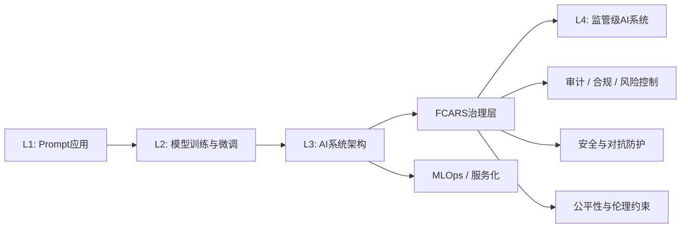
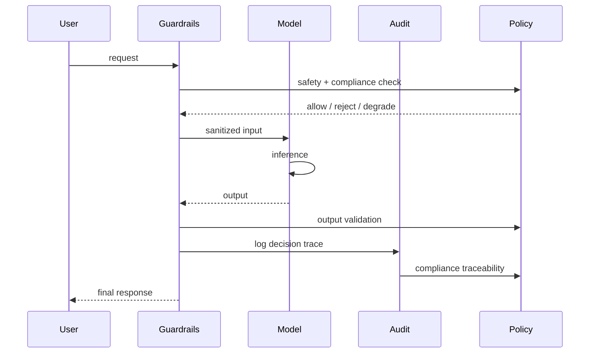
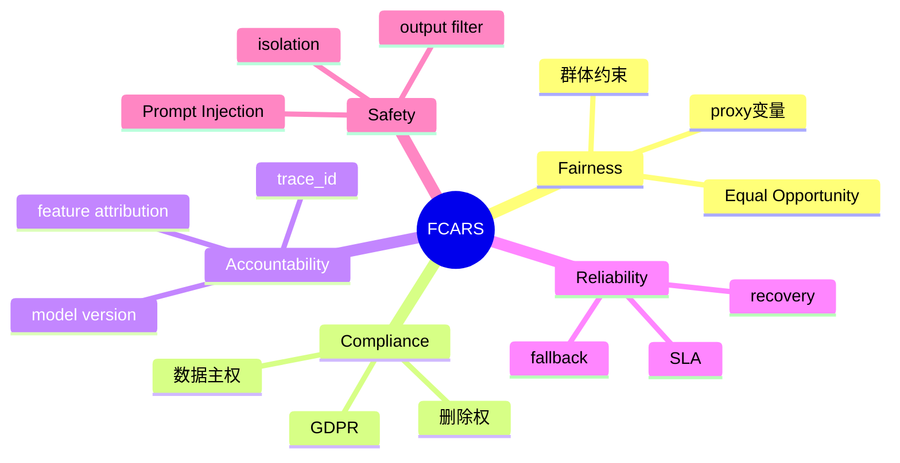

<!--
Chapter: 60
Node: KN-C-000078
Score: 87
Status: ✅ APPROVED
Attempt: 1
Round: 2
Generated: 2026-06-21 06:06:06
-->

# 第60章 FCARS 框架（AI 治理框架） [L3-L4]

---

## Part 1：为什么要学这个？[认知冲突先行]

你第一次以为“AI治理”是个很简单的事情。

模型上线前做一次测试集评估，指标不错；训练数据做了脱敏；再加一层内容过滤器。你甚至会觉得：只要工程做规范一点，AI系统就天然是“安全可控”的。

直到现实开始逐个击穿这种假设。

---

信贷系统上线三个月后，坏账率下降 15%，业务部门很满意。但合规团队突然介入，给出另一组完全不同的数据：

* 某区域拒批率 62%
* 餐饮/零售行业系统性被压分
* 客户投诉集中在“看不懂拒绝理由”

你第一反应是：**我们没用敏感字段，怎么可能有偏见？**

但监管的回答很直接：

> “公平性不等于不使用敏感字段，而是不能产生差异化影响。”

---

这时候冲突开始扩大，不只是 Fairness：

* Compliance：GDPR 要求“被遗忘权”，但模型已经训练完成，删不掉
* Accountability：系统能记录日志，但无法解释“为什么是这个人被拒”
* Reliability：模型在流量高峰时性能下降，但没有降级策略
* Safety：外部数据源被注入异常文本，模型输出开始被诱导偏移

你突然意识到：

> 你以为你在做一个模型问题，但监管认为你在运营一个社会决策系统。

---

FCARS 要解决的核心问题是：

**当 AI 已经“表现正常”时，如何证明它在公平、合规、可追责、可靠、安全五个维度都仍然成立？**

---

## Part 2：学习路径定位

FCARS 位于“模型能力”与“社会系统约束”的交界层，是从 L3 工程系统迈向 L4 监管级 AI 的必经结构。



前置能力：

* Transformer / LLM 基础
* 基础 MLOps
* API 与日志系统设计

后置能力：

* AI 风控系统设计
* 合规工程体系
* 可审计 AI 架构

---

## Part 3：用生活理解它

FCARS 就像一辆车的“年检 + 行驶监控 + 事故追责系统”的组合。

* Fairness：四个轮子不能一边磨损，否则车会跑偏
* Compliance：必须有牌照、保险、合法路线权限
* Accountability：黑匣子记录每一次转向和刹车
* Reliability：刹车失灵时要有备用制动系统
* Safety：安全气囊 + 防撞结构 + 紧急断油机制

但关键区别是：

车是机械系统，一次检查就够
AI是概率系统，每一次输出都可能改变“规则边界”

所以 FCARS 是持续运行的治理系统，而不是一次性检查。

---

## Part 4：AI如何映射到传统概念

| FCARS维度        | 传统软件系统  | AI系统本质        |
| -------------- | ------- | ------------- |
| Fairness       | 业务规则一致性 | proxy变量导致隐性歧视 |
| Compliance     | 法务合规    | 数据主权 + 生命周期管理 |
| Accountability | 代码可追踪   | 决策链路重建        |
| Reliability    | SLA/高可用 | 概率系统稳定性       |
| Safety         | 安全测试    | 对抗攻击与输出控制     |

关键变化：

传统系统：

> 执行路径固定

AI系统：

> 输出是概率空间中的采样结果

---

## Part 5：技术本质深讲

FCARS 本质是一个“多层约束叠加系统”，作用于 AI 生命周期的四个阶段：

* 数据层
* 模型层
* 推理层
* 输出层



---

### 五个维度工程本质

**Fairness**
不是“删敏感字段”，而是：

* 检测 proxy variables
* 群体统计约束（Equal Opportunity）
* 输出分布对齐

**Compliance**
不是文档，而是系统能力：

* 数据血缘（Data Lineage）
* 数据驻留控制（Data Residency）
* 用户数据删除能力（GDPR）

**Accountability**
核心是 decision trace：

必须记录：

* 输入特征
* 模型版本
* 输出概率
* 决策路径
* 人工干预记录

---

**Reliability**

* SLA
* fallback策略
* degradation机制

**Safety**

* input过滤（Prompt Injection）
* model隔离
* output审查

---

### Fairness 的工程现实（重要补充）

公平性不是单一算法问题，而是统计约束问题。

常见方法包括：

* Group fairness constraints
* Reweighing
* Post-processing calibration
* 对抗方法（Adversarial approaches）

这里的“对抗方法”并不是标准唯一解，而是一类思路：

> 通过训练一个“无法从表示中恢复敏感属性”的辅助模型，逼迫主模型减少信息泄露

它只是工具之一，而不是唯一工程路径。

---

## Part 6：动手Demo（最小FCARS审计系统）

下面实现一个轻量级 FCARS audit logger + fairness check：

```python
import json
import uuid
from datetime import datetime
from fairlearn.metrics import equalized_odds_difference

# -----------------------------
# 模拟模型输出
# -----------------------------
def mock_model(x):
    return 1 if sum(x) > 1.5 else 0, 0.8  # (prediction, confidence)

# -----------------------------
# 生成 trace id
# -----------------------------
def gen_trace_id():
    return str(uuid.uuid4())

# -----------------------------
# 审计日志系统（简化版）
# -----------------------------
audit_log = []

def log_event(event):
    audit_log.append(json.dumps(event))

# -----------------------------
# 模拟数据
# -----------------------------
X = [
    [0.2, 0.3],
    [0.9, 0.8],
    [0.1, 0.4],
    [1.0, 0.9],
]

y_true = [0, 1, 0, 1]

sensitive_group = [0, 1, 0, 1]  # 模拟不同群体

y_pred = []

# -----------------------------
# 推理 + FCARS记录
# -----------------------------
for i, x in enumerate(X):
    trace_id = gen_trace_id()
    pred, conf = mock_model(x)
    y_pred.append(pred)

    log_event({
        "trace_id": trace_id,
        "input": x,
        "prediction": pred,
        "confidence": conf,
        "timestamp": datetime.now().isoformat()
    })

# -----------------------------
# Fairness评估
# -----------------------------
metric = equalized_odds_difference(
    y_true=y_true,
    y_pred=y_pred,
    sensitive_features=sensitive_group
)

print("Fairness metric:", metric)
print("Audit logs:", len(audit_log))
```

运行结果你会看到：

* 每条预测都有 trace_id
* 所有决策可回放
* fairness 指标可计算

---

## Part 7：真实项目场景

在金融风控系统中，FCARS通常嵌入在“决策链路中间层”。

典型架构：

* 数据源：征信 + 行为 + 行业数据
* 模型：风险评分模型 + LLM解释层
* 决策：放款/拒绝/人工审核

问题出现方式往往不是 crash，而是：

* 某行业系统性低分
* 某区域拒绝率异常
* 模型解释不一致

FCARS改造通常包括：

* fairness constraint（群体约束）
* audit trail（链路追踪）
* fallback rule engine（兜底规则）
* safety filter（输入输出防护）

---

## Part 8：这里容易踩坑

### 坑1：公平性=删字段

```python
features = [f for f in data if f != "gender"]
```

问题：proxy变量仍然存在

---

### 坑2：问责性=日志

```python
log.info(prediction)
```

问题：无法解释 why

---

正确做法（结构化日志 + trace）：

```python
import logging
import json

logger = logging.getLogger("audit")

def structured_log(event):
    logger.info(json.dumps(event))
```

在企业中通常会写入 Elasticsearch：

```json
{
  "trace_id": "abc123",
  "model_version": "v2.1",
  "features": {...},
  "prediction": 1
}
```

并通过 trace_id 串联整个决策链。

---

## Part 9：面试怎么答

### L1

FCARS五维：

* Fairness
* Compliance
* Accountability
* Reliability
* Safety

---

### L2

AI vs 传统问责：

* AI是概率模型
* 需要 feature-level trace
* 需要 model version tracking

---

### L3（强化版）

被遗忘权处理：

1. 小数据集（<10万）：
   → 直接 retrain 成本可接受

2. 中等规模（10万-100万）：
   → machine unlearning + bias correction

3. 大规模（>100万）：
   → 成本过高
   → fallback：模型下线 or 用户重授权

关键权衡：

* 计算成本
* 法律风险
* 模型性能影响

---

## Part 10：考点速查

* Fairness ≠ 去敏感字段
* Accountability ≠ logging
* Compliance = 数据生命周期
* Reliability = 系统降级能力
* Safety = 多层防御体系

---

## Part 11：必背金句

* 公平性不是删除字段，而是约束结果
* 合规性管的是数据的生命周期
* 问责性要求“能解释为什么”
* 可靠性是系统失败后的生存能力
* 安全性是攻击面控制能力

---

## Part 12：快速参考表

| 概念             | 作用   | 示例                |
| -------------- | ---- | ----------------- |
| Fairness       | 群体公平 | Equal Opportunity |
| Compliance     | 法律约束 | GDPR              |
| Accountability | 决策追溯 | trace_id          |
| Reliability    | 系统稳定 | SLA 99.9%         |
| Safety         | 防攻击  | Guardrails        |

---

## Part 13：思维导图



---

## Part 14：本章小结

FCARS的核心不是“检查清单”，而是AI系统的约束结构。

它让AI从“模型正确”升级为“系统可治理”。

从L0到L3的成长路径是：

* 会用模型
* 会搭系统
* 会控制风险

---

## Part 15：下一章预告

当你以为FCARS已经解决“AI是否可以上线”的问题时，新的问题出现了：

攻击者不再攻击模型本身，而是攻击“系统之间的信任链”。

下一章将进入：

> Prompt Injection 与 AI 安全边界

你会看到：

* 为什么 Guardrails 会失效
* 为什么外部数据可以控制模型行为
* AI系统真正的攻击面在哪里