<!--
Chapter: 61
Node: KN-C-000079
Score: 88
Status: ✅ APPROVED
Attempt: 1
Round: 2
Generated: 2026-06-21 07:33:03
-->

# 第61章 AI Compliance（AI 合规性） [L3-L4]

## Part 1：为什么要学这个？[认知冲突先行]

你负责一个 AI 客服系统。

某天，一位德国用户根据 GDPR 第17条要求删除自己的全部数据。你检查了系统：

* PostgreSQL 用户表：已删除
* 对话历史表：已删除
* 用户画像表：已删除

你很自信地回复：

> 您的数据已经被彻底删除。

三个月后，监管审计来了。

审计员在向量数据库中执行一次语义检索，竟然仍然找到了该用户曾经咨询过的订单记录、地址信息和支付方式。

原因很简单：

虽然数据库里的记录被删了，但文本生成的 Embedding 仍然保存在向量库中。

这些向量没有用户名，没有邮箱，没有手机号。

但通过相似性检索，依然能够恢复出用户相关信息。

于是你突然发现：

你删除了“数据”，却没有删除“数据的影子”。

很多工程师对于 AI 合规的理解停留在传统软件时代：

> 合规 = 加个隐私政策页面 + 删数据库记录

但在 AI 系统里：

* 数据会进入向量库
* 数据会进入长期记忆系统
* 数据会进入审计日志
* 数据可能进入微调数据集
* 数据甚至可能影响模型权重

所以真正的问题变成了：

> 当数据散落在整个 AI 技术栈中时，我们如何证明自己真的遵守了 GDPR、数据主权、被遗忘权和审计要求？

这正是本章要解决的核心问题。

---

## Part 2：学习路径定位

AI Compliance 已经不属于 Prompt 工程或 Agent 开发层面。

它属于 AI Native 系统进入企业级落地后的治理能力。

很多团队能够把 Agent 做出来。

但只有少数团队能够把 Agent 合规地上线到欧盟、中国、日本、美国等市场。

### 在 AI Native 路径中的位置

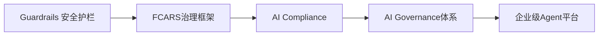

### 前置知识

工程师至少需要掌握：

* RAG 架构
* 向量数据库
* Agent 工作流
* 权限管理
* 审计日志

### 后续知识

掌握 AI Compliance 后，会进入：

* AI Governance（AI治理）
* 风险控制体系
* 企业级Agent平台设计
* 跨区域数据管理

### 知识依赖图

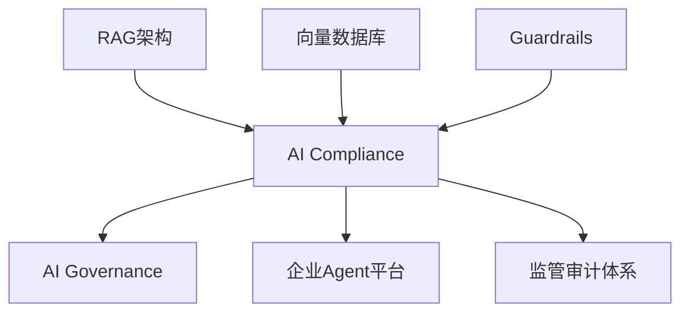

### 本章定位

如果说：

* Guardrails 解决的是“系统安全”
* Reliability 解决的是“系统稳定”

那么：

> AI Compliance 解决的是“系统是否合法存在”。

---

## Part 3：用生活理解它

把 AI 合规想象成一家餐厅办理食品安全许可证。

监管部门检查的并不只是今天端上桌的菜。

他们还会检查：

* 食材来源记录
* 冷链温度日志
* 后厨监控录像
* 废弃食材处理记录
* 员工健康证明

即使今天的菜很好吃。

只要冰箱里发现过期食材：

餐厅也可能被停业整顿。

AI 系统同样如此。

监管机构不只关心模型回答得准不准。

他们更关心：

* 数据从哪来
* 用户是否同意
* 是否能够删除
* 是否能够追溯
* 是否符合当地法规

### 类比的边界

这个类比并不完全成立。

餐厅的食材通常集中存放。

而 AI 系统中的数据可能分散在：

* SQL数据库
* 向量数据库
* 缓存系统
* 日志系统
* 模型训练数据

因此 AI 合规的复杂度远高于传统食品安全检查。

---

## Part 4：AI如何映射到传统概念

对于传统软件工程师来说，AI 合规并不是全新的概念。

很多思想早已存在。

只是 AI 放大了问题规模。

### 传统软件 vs AI 系统

| 传统软件概念  | AI 系统对应概念                |
| ------- | ------------------------ |
| 数据库删除记录 | 被遗忘权（Right to Erasure）   |
| 访问日志    | 审计日志（Audit Trail）        |
| 数据权限控制  | 数据主权（Data Sovereignty）   |
| 用户协议    | 知情同意（Informed Consent）   |
| 最小权限原则  | 数据最小化（Data Minimization） |
| 业务操作记录  | AI决策链记录                  |
| 系统可追踪   | 模型可解释与可追溯                |
| 数据备份策略  | 数据生命周期管理                 |

### 为什么 AI 更难

传统系统：

```text
用户数据
   ↓
数据库
```

AI 系统：

```text
用户数据
   ↓
数据库
   ↓
Embedding
   ↓
向量库
   ↓
RAG
   ↓
Agent Memory
   ↓
日志系统
   ↓
训练数据集
```

数据的传播路径变长了。

删除和审计的难度也指数级上升。

### FCARS中的位置

在 FCARS 五维框架中：

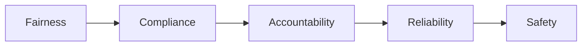

Compliance 不单独存在。

它与问责性、可靠性、安全性高度耦合。

例如：

* 没有审计日志 → 无法问责
* 没有删除机制 → 不合规
* 没有权限隔离 → 数据泄露

因此 AI Compliance 本质是治理能力的一部分。

---

## Part 5：技术本质深讲

### AI 合规到底在约束什么

很多人以为：

> 合规是在限制 AI。

实际上：

> 合规是在限制数据流动方式。

监管机构并不关心你使用 GPT、Claude 还是开源模型。

他们关心的是：

* 数据去了哪里
* 谁访问了数据
* 为什么访问
* 能否删除
* 是否留痕

所以 AI Compliance 本质上是：

> 对数据生命周期（Data Lifecycle）的工程化管理。

---

### 六大核心组成部分

#### 1. 数据主权（Data Sovereignty）

核心问题：

> 数据存储在哪个国家？

例如：

欧盟用户数据可能要求：

* 存储在欧盟区域
* 在欧盟境内处理
* 不得随意跨境传输

错误架构：

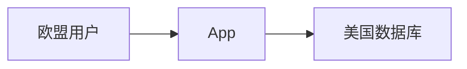

正确架构：

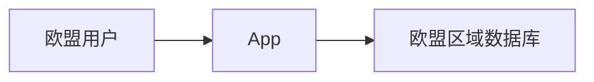

---

#### 2. 知情同意（Informed Consent）

用户必须知道：

* 收集什么数据
* 为什么收集
* 保存多久
* 谁能访问

技术实现通常包括：

* Cookie Consent
* 数据授权页面
* 隐私协议版本管理

---

#### 3. 数据最小化（Data Minimization）

很多团队喜欢：

> 先收集，未来可能有用。

GDPR 的思路恰好相反：

> 不需要的数据，不允许收集。

例如：

AI 客服回答物流问题。

需要：

* 订单号

不需要：

* 身份证照片
* 银行流水

原则：

```text
Need to Know
而不是
Nice to Have
```

---

#### 4. 被遗忘权（Right to Erasure）

这是 AI 系统最容易踩坑的部分。

用户删除账号后，需要删除：

* 用户资料
* 对话历史
* Embedding
* 长期记忆
* 缓存数据
* 日志中的PII

很多团队只删 SQL。

真正的难点是删向量。

### AI 数据删除全链路

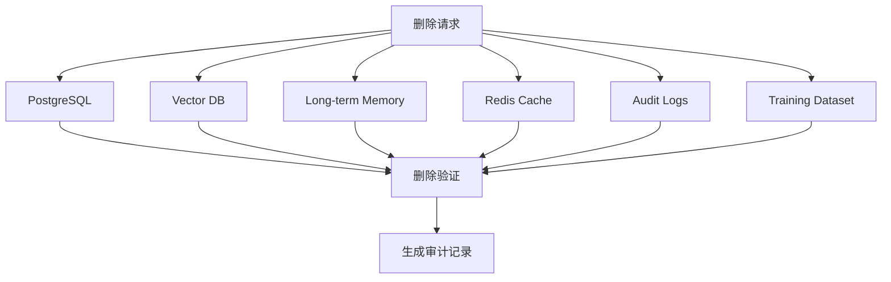

### 为什么向量库最危险

Embedding 看起来只是数字：

```python
[0.134, -0.582, 0.917, ...]
```

但这些数字保存着语义信息。

通过相似性检索：

* 地址
* 订单号
* 邮箱
* 用户偏好

都有可能被间接恢复。

因此：

> 向量也是个人数据。

---

### 5. 审计日志（Audit Trail）

监管机构真正喜欢看的不是模型。

而是日志。

因为日志决定：

> 事故发生后能否追责。

一个完整审计链通常包括：

* 用户输入
* 检索结果
* Prompt内容
* 模型输出
* 工具调用
* 人工审核结果

### 审计链路

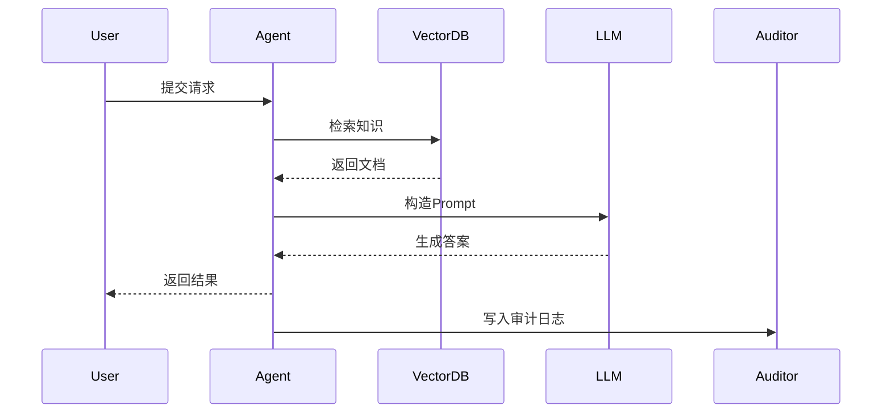

### 合规日志要求

必须满足：

* 不可篡改
* 可追溯
* 长期保存
* 可回放

行业实践通常要求：

| 行业  | 典型保留周期 |
| --- | ------ |
| 互联网 | 1-3年   |
| 金融  | 5-7年   |
| 医疗  | 5-10年  |
| 政府  | 更长     |

---

### 6. 透明度（Transparency）

当 AI 影响用户利益时。

用户有权知道：

* 为什么做出这个决策
* 使用了哪些数据
* 是否存在人工复核

例如：

贷款审批 Agent。

错误做法：

```text
系统拒绝贷款申请。
```

正确做法：

```text
系统基于收入证明、
信用评分和负债率进行评估，
当前评分未达到审批阈值。
```

透明度不要求公开模型权重。

而要求：

> 用户能够理解影响自身权益的决策逻辑。

---

### Privacy by Design：合规的终极思想

传统模式：

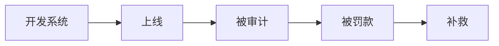

现代模式：

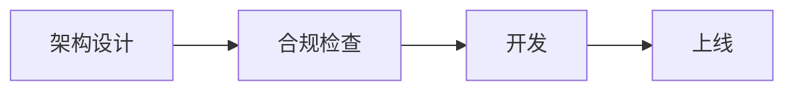

这就是 Privacy by Design。

核心思想只有一句：

> 合规设计要做在赛跑前，而不是被罚后——删数据要删向量，日志要留七年，数据主权先划线。

## Part 6：动手Demo（可运行代码）

理论说了很多，真正落地时最容易出问题的地方其实只有一个：

> 用户删除账号时，如何确保向量库中的数据也被同步删除？

下面用一个最小示例模拟实现。

### 场景

系统保存用户知识库。

每个向量都带有 metadata。

删除用户时，根据 user_id 批量删除。

### 最小可运行示例

```python
from datetime import datetime

# 模拟向量数据库
vector_store = [
    {
        "vector_id": "v1",
        "text": "订单号123456，地址东京涩谷区",
        "metadata": {"user_id": "u001"}
    },
    {
        "vector_id": "v2",
        "text": "用户偏好电子产品",
        "metadata": {"user_id": "u001"}
    },
    {
        "vector_id": "v3",
        "text": "其他用户数据",
        "metadata": {"user_id": "u002"}
    }
]

audit_logs = []


def delete_user_vectors(user_id):
    global vector_store

    before_count = len(vector_store)

    # 删除属于该用户的向量
    vector_store = [
        item
        for item in vector_store
        if item["metadata"]["user_id"] != user_id
    ]

    deleted_count = before_count - len(vector_store)

    # 写入审计日志
    audit_logs.append({
        "event": "user_vector_deletion",
        "user_id": user_id,
        "deleted_vectors": deleted_count,
        "timestamp": datetime.utcnow().isoformat()
    })

    return deleted_count


deleted = delete_user_vectors("u001")

print("删除向量数量:", deleted)
print("剩余向量:", vector_store)
print("审计日志:", audit_logs)
```

### 关键代码解析

```python
if item["metadata"]["user_id"] != user_id
```

这是整个合规删除的核心。

如果入库时没有保存 user_id：

```python
metadata = {}
```

未来就无法精准删除。

很多团队的问题不是删不掉。

而是压根找不到哪些向量属于哪个用户。

---

```python
audit_logs.append(...)
```

删除完成后必须留痕。

因为监管审查时要证明：

* 谁发起删除
* 删除了什么
* 删除多少条
* 什么时间删除

---

### 运行后你会看到什么

```text
删除向量数量: 2

剩余向量:
[
  {
    "vector_id":"v3",
    ...
  }
]

审计日志:
[
  {
    "event":"user_vector_deletion",
    ...
  }
]
```

这就是一个最基础的 GDPR 删除链路。

真实系统会扩展到：

* PostgreSQL
* Redis
* Pinecone
* Weaviate
* Milvus
* Elasticsearch
* S3 对象存储

同步删除。

---

## Part 7：真实项目场景

### 跨境电商 AI 客服 Agent

这是目前最典型的 AI 合规场景之一。

### 业务背景

一家跨境电商公司进入欧洲市场。

系统能力：

* AI 客服
* 多语言问答
* 订单查询
* 智能推荐

技术架构：

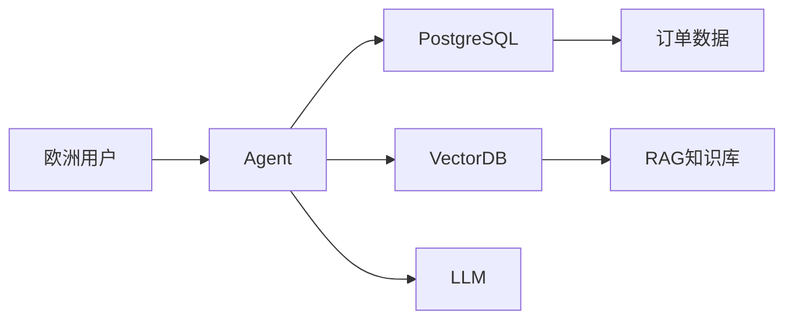

### 初始实现

工程团队认为：

```text
删除用户
=
删除PostgreSQL记录
```

因此：

```sql
DELETE FROM users
WHERE user_id='u001';
```

执行后认为已经满足 GDPR。

---

### 实际问题

用户历史对话已经被切分：

```text
Chunk 1
Chunk 2
Chunk 3
...
```

随后生成 Embedding：

```text
Embedding A
Embedding B
Embedding C
...
```

并存储进 Pinecone。

结果：

用户资料删除了。

Embedding 没删。

通过语义检索依然能够恢复：

* 地址
* 电话
* 订单号
* 支付偏好

最终被认定：

> 未完整执行被遗忘权。

---

### 合规改造方案

向量入库阶段增加 metadata：

```python
metadata = {
    "user_id": user_id,
    "document_id": document_id,
    "timestamp": timestamp
}
```

删除流程：

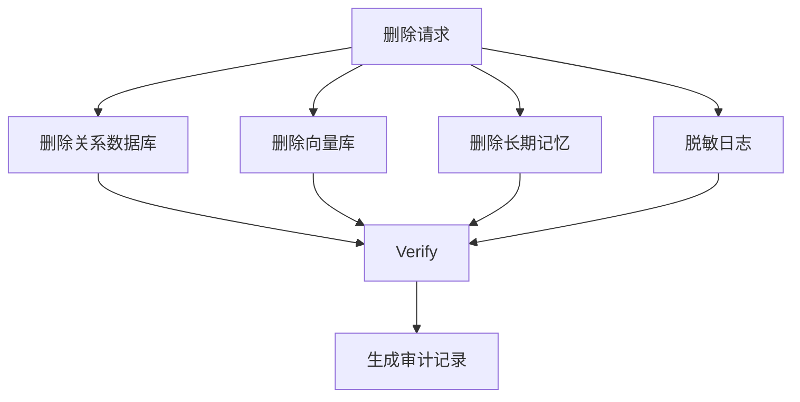

---

### 最终结果

系统增加：

* 数据地图（Data Map）
* 删除任务编排
* 自动验证
* 审计日志

从工程角度看：

AI Compliance 最终变成了一个数据生命周期管理系统。

---

## Part 8：这里容易踩坑

### 坑一：只删 SQL，不删向量

#### 错误做法

```python
delete_user(user_id)

db.execute(
    "DELETE FROM users WHERE id=?",
    (user_id,)
)
```

#### 正确做法

```python
delete_user(user_id)

delete_sql(user_id)

delete_vectors(user_id)

delete_memory(user_id)

write_audit_log(user_id)
```

### 为什么会犯

传统软件思维惯性。

很多工程师没有意识到：

Embedding 本身也是用户数据。

---

### 坑二：向量没有 metadata

#### 错误做法

```python
vector_db.upsert(
    vector=embedding
)
```

#### 正确做法

```python
vector_db.upsert(
    vector=embedding,
    metadata={
        "user_id": user_id,
        "document_id": document_id
    }
)
```

### 为什么会犯

项目初期追求快速上线。

觉得以后再补。

结果未来删除时根本找不到目标向量。

---

### 坑三：审计日志保存30天

#### 错误做法

```python
LOG_RETENTION_DAYS = 30
```

#### 正确做法

```python
LOG_RETENTION_DAYS = 2555
```

2555 天约等于 7 年。

### 为什么会犯

很多团队只考虑存储成本。

没有考虑监管审查周期。

当监管机构要求查看三年前记录时：

日志已经被自动清理。

即使系统没有做错事，也无法证明自己没做错。

---

## Part 9：面试怎么答

### L1：如果用户行使“被遗忘权”，AI系统需要删除哪些数据？

#### 回答框架

至少覆盖五类：

1. 用户账号数据
2. 对话历史
3. 向量数据库 Embedding
4. 长期记忆存储
5. 日志中的 PII

加分项：

* 微调数据集
* 缓存系统
* 数据备份

核心原则：

> 删除必须覆盖整个数据生命周期。

---

### L2：AI系统在欧洲上线，需要满足哪些 GDPR 要求？

#### 回答框架

数据主权：

* 数据存储位置合法

知情同意：

* 用户明确授权

数据最小化：

* 只采集必要数据

被遗忘权：

* 全链路删除

审计日志：

* 可追溯且长期保存

透明度：

* 用户知道决策依据

---

### L3：企业内部 Agent 落地，你最关注哪些非功能需求？

#### 回答框架

第一层：

安全与合规

* 权限控制
* 数据生命周期
* 审计日志

第二层：

可控性

* 人在回路
* 敏感操作审批
* 工具白名单

第三层：

可观测性

* Trace
* Replay
* Metrics

### 高分总结

> 安全决定能不能用，合规决定能不能上线，可观测性决定出了问题能不能定位。

---

## Part 10：考点速查

### **数据主权（Data Sovereignty）**

数据必须存储和处理在法规允许的区域。

### **被遗忘权（Right to Erasure）**

删除范围不仅包含数据库，还包括向量库和长期记忆。

### **数据最小化（Data Minimization）**

完成业务目标所需之外的数据原则上不应采集。

### **审计日志（Audit Trail）**

必须保证不可篡改、可追溯、长期保留。

### **72小时通报义务**

发生数据泄露后，必须在规定时间内通知监管机构。

---

## Part 11：必背金句

**[数据地图]：看不见数据流向，就不可能实现合规。**

**[删除原则]：删数据不是删表，而是删除整个生命周期中的所有副本。**

**[数据主权]：数据放在哪里，本质上决定你受谁监管。**

**[审计原则]：没有日志，就等于没有发生。**

**[Privacy by Design]：合规不是上线后的补丁，而是架构阶段的设计约束。**

---

## Part 12：快速参考表

| 概念                 | 作用     | 示例值                  |
| ------------------ | ------ | -------------------- |
| Data Sovereignty   | 控制数据地域 | EU Region            |
| Informed Consent   | 用户授权   | Consent Accepted     |
| Data Minimization  | 减少采集范围 | 仅订单号                 |
| Right to Erasure   | 删除用户数据 | Delete User Pipeline |
| Audit Trail        | 监管追溯   | 7 Years Retention    |
| Transparency       | 解释决策依据 | Decision Reason      |
| PII                | 个人敏感信息 | 邮箱、电话                |
| Embedding Metadata | 向量追踪   | user_id              |
| WORM Storage       | 日志防篡改  | Object Lock          |
| Privacy by Design  | 设计即合规  | Architecture Review  |

---

## Part 13：思维导图

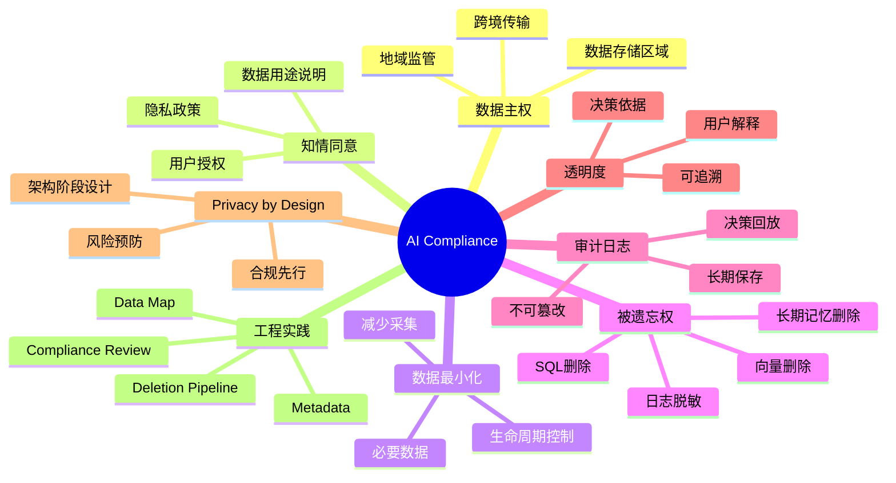

---

## Part 14：本章小结

AI 合规的核心不是法律条文，而是数据生命周期管理。

被遗忘权最容易踩坑的地方在于向量数据库，因为删除用户不等于删除 Embedding。

真正成熟的 AI 系统遵循 Privacy by Design，把数据主权、审计日志、透明度和删除机制在架构设计阶段就做进去。

### 成长路径

L0：

* 知道 GDPR 存在

L1：

* 理解被遗忘权和数据主权

L2：

* 能设计删除流程和审计日志

L3：

* 能设计跨区域合规架构

L4：

* 能将合规要求转化为企业级 AI 平台能力

---

## Part 15：下一章预告

这一章解决了一个关键问题：

> AI 系统如何合法地处理用户数据。

但新的问题马上出现：

即使系统完全合法，也不代表系统公平。

例如：

* 不同群体是否受到同等对待？
* 模型是否存在隐性偏见？
* 推荐系统是否歧视某类用户？
* 招聘 Agent 是否偏向某些群体？

这些问题已经超出了“合规”的范畴。

进入了“治理”的范畴。

下一章将进入 AI 治理体系中的另一个核心主题：

> 如何系统化评估一个 AI 系统是否真正值得被信任。