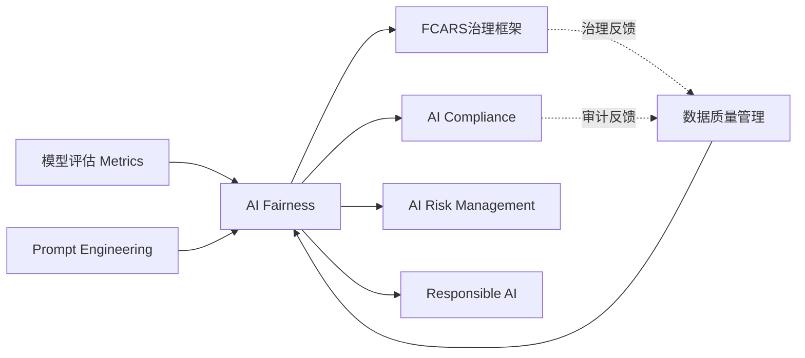
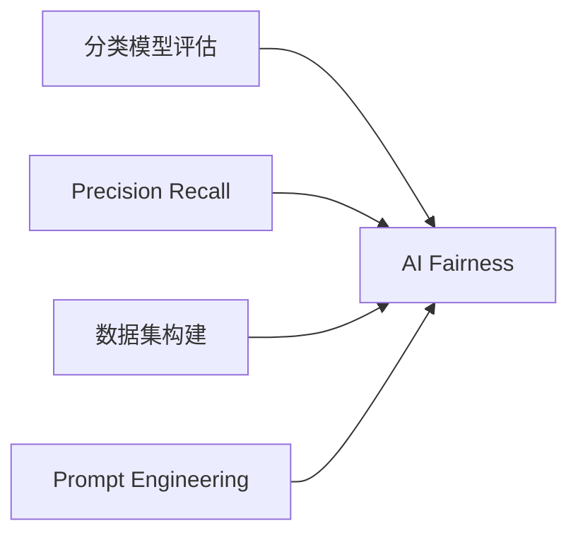
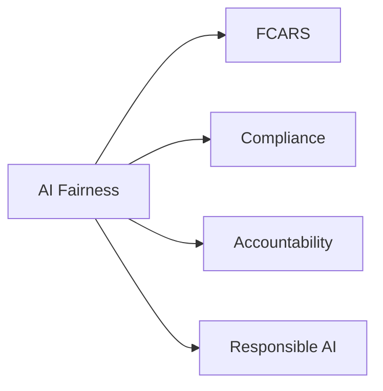
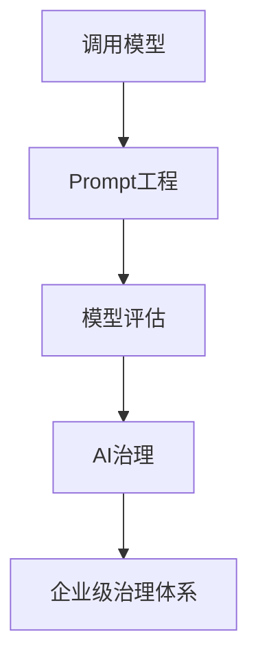
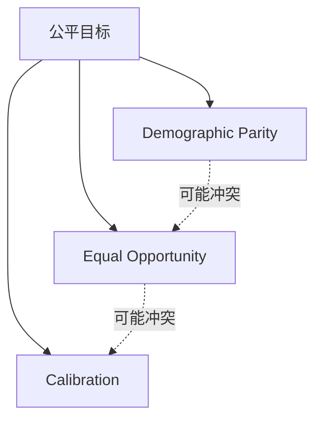
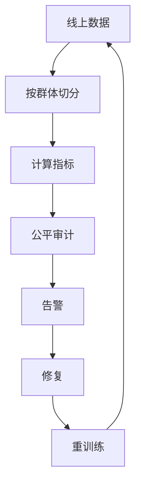
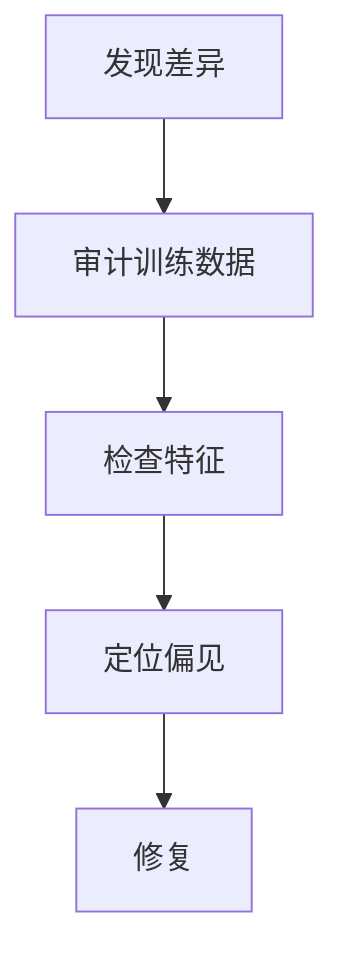
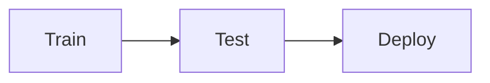
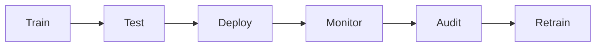
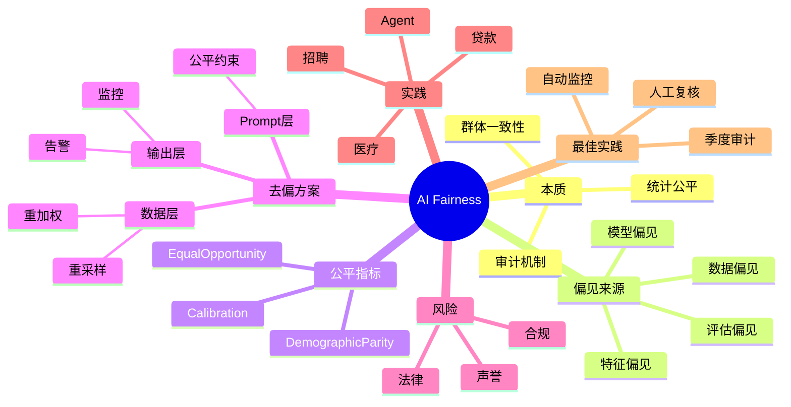

<!--
Chapter: 62
Node: KN-C-000080
Score: 88
Status: ✅ APPROVED
Attempt: 1
Round: 2
Generated: 2026-06-21 08:08:10
-->

# 第62章 AI Fairness（AI 公平性） [L3-L4]

## Part 1：为什么要学这个？[认知冲突先行]

你的智能客服系统已经上线半年。

运营看板一片绿色：

* 用户满意度：95%
* 问题解决率：93%
* 投诉率：0.8%

团队一致认为项目已经成功。

直到某天老板转来一封投诉邮件：

> 为什么我和女朋友用同一句“我想申请贷款”咨询你们AI，她收到的是“请填写申请表”，而我收到的是“暂不符合贷款条件”？

你开始排查。

结果发现：

* 两人的征信评分相同
* 收入水平相同
* 负债情况相同

进一步统计后发现：

| 群体 | 贷款通过率 |
| -- | ----- |
| 女性 | 57%   |
| 男性 | 49%   |

差异并不像新闻里的极端案例那么夸张。

只有8个百分点。

但问题在于：

这个差异持续存在了半年。

累计影响了数万次决策。

更关键的是：

你从来没有监控过性别维度。

此时很多工程师才意识到：

> 整体准确率高，不代表系统公平。

很多团队相信：

* 我们没有歧视意图
* 模型没有读取性别字段
* 总体指标很好

因此系统一定公平。

这其实是一种危险的错觉。

AI公平性讨论的从来不是主观善意。

而是统计结果。

本章要解决的问题是：

**如何用数据证明不同群体被同等对待，而不是依赖“我们认为自己没有歧视”的主观判断。**

---

## Part 2：学习路径定位

AI Fairness 属于 AI 治理体系的重要组成部分。

它不再关注：

* 模型能不能运行
* Prompt写得好不好

而开始关注：

* 模型是否持续公平
* 系统是否满足监管要求
* 企业是否具备治理能力

### 知识路径



这条反馈链非常重要。

公平性问题一旦发现，最终往往要回到：

* 数据采集
* 数据标注
* 数据分布

重新治理。

### 前置知识



### 后续知识



### 能力定位



---

## Part 3：用生活理解它

把 AI 公平性想象成高考阅卷。

阅卷老师看不到考生姓名。

理论上已经避免了人为偏见。

但教育部门仍会抽样检查：

如果同等水平考生中：

* 男生平均分长期高于女生10分
* 或某地区考生普遍被压分

即使没有老师故意这么做，也说明评分体系存在问题。

AI公平性做的事情类似。

它不是检查开发者有没有恶意。

而是检查：

> 同等条件的人，是否获得了相近结果。

### 类比的边界

高考评分规则由人制定。

AI规则来自数据学习。

因此很多偏见并不是人为写进去的。

而是模型自己从历史模式中学出来的。

---

## Part 4：AI如何映射到传统概念

很多传统工程师会问：

> 代码里根本没有 gender 判断，为什么还会产生性别偏见？

因为 AI 不靠规则执行。

而靠统计学习。

### 传统系统 vs AI系统

| 传统开发    | AI系统   |
| ------- | ------ |
| 显式规则    | 隐式模式   |
| if-else | 概率推断   |
| Bug定位   | 偏见发现   |
| 功能测试    | 公平测试   |
| 单案例分析   | 群体统计分析 |

### 概念映射

| 传统概念        | AI公平性对应         |
| ----------- | --------------- |
| 单元测试        | Fairness Test   |
| SLA         | Fairness KPI    |
| 回归测试        | Fairness Audit  |
| 性能监控        | Bias Monitoring |
| Bug修复       | Bias Mitigation |
| Code Review | Data Review     |

### 核心认知升级

传统开发：

> 没写进去就不会发生。

AI开发：

> 没写进去，也可能学出来。

---

## Part 5：技术本质深讲

### AI偏见的四个来源

#### 1. 训练数据偏见

历史数据本身存在偏见。

例如：

过去十年招聘记录：

| 性别 | 录用占比 |
| -- | ---- |
| 男性 | 78%  |
| 女性 | 22%  |

模型会把这种历史现象误当成正确规律。

---

#### 2. 特征选择偏见

即使删除敏感属性。

代理特征仍可能泄露信息。

| 敏感属性 | 代理特征 |
| ---- | ---- |
| 种族   | 邮政编码 |
| 年龄   | 毕业年份 |
| 性别   | 兴趣标签 |
| 收入   | 居住区域 |

---

#### 3. 模型放大偏见

互联网本身存在大量刻板印象。

例如：

* 工程师 → 男性
* 护士 → 女性

模型可能进一步强化这种关联。

---

#### 4. 评估偏见

测试集无法代表真实用户。

例如：

测试集90%来自一线城市。

真实用户仅占40%。

评估结果自然失真。

---

### 三大公平性指标

#### Demographic Parity

关注：

不同群体获得正向结果的比例是否接近。

公式：

```text
P(通过 | 男性)
≈
P(通过 | 女性)
```

---

#### Equal Opportunity

关注：

真正符合条件的人是否被平等识别。

公式：

```text
TPR男性
≈
TPR女性
```

这是招聘、贷款最常用指标。

---

#### Calibration

关注：

预测概率是否可信。

例如：

模型预测风险80%。

不同群体中都应接近80%真实发生率。

---

### 指标如何选择

现实中无法同时完美满足所有公平性指标。

因此必须根据业务场景选择。

| 场景     | 优先指标               | 原因           |
| ------ | ------------------ | ------------ |
| 招聘筛选   | Equal Opportunity  | 避免优秀候选人被漏掉   |
| 贷款审批   | Equal Opportunity  | 确保有资质用户被公平识别 |
| 广告投放   | Demographic Parity | 保证曝光机会均衡     |
| 医疗风险预测 | Calibration        | 概率可信最重要      |
| 保险定价   | Calibration        | 风险预测需准确校准    |

### 指标冲突



很多情况下：

提高一种公平性指标。

可能降低另一种指标。

因此公平性本质上是工程权衡。

### 公平性审计流程



### 三层去偏方案

#### 数据层

* 重采样
* 重加权
* 数据增强

#### Prompt层

增加公平性约束。

#### 输出层

监控：

* 通过率
* 错误率
* 平均置信度

### 核心原则

不要问：

> 模型准确率是不是95%。

而要问：

> 每个群体是不是都接近95%。

---

## Part 6：动手Demo（可运行代码）

下面模拟一个更接近真实场景的公平性审计。

样本量1000条。

通过率差异只有6个百分点。

这更符合现实中的隐性偏见。

```python
import pandas as pd
import random

random.seed(42)

records = []

for _ in range(500):
    approved = 1 if random.random() < 0.56 else 0
    records.append(
        {"gender": "male", "approved": approved}
    )

for _ in range(500):
    approved = 1 if random.random() < 0.62 else 0
    records.append(
        {"gender": "female", "approved": approved}
    )

df = pd.DataFrame(records)

approval_rate = (
    df.groupby("gender")["approved"]
    .mean()
    .reset_index()
)

print("群体通过率")
print(approval_rate)

male_rate = approval_rate.loc[
    approval_rate["gender"] == "male",
    "approved"
].iloc[0]

female_rate = approval_rate.loc[
    approval_rate["gender"] == "female",
    "approved"
].iloc[0]

difference = abs(
    female_rate - male_rate
)

print(
    f"\n通过率差异: {difference:.2%}"
)

threshold = 0.05

if difference > threshold:
    print("⚠️ 公平性告警")
else:
    print("✅ 公平性通过")
```

### 关键代码

```python
df.groupby("gender")["approved"].mean()
```

按群体计算通过率。

```python
difference = abs(
    female_rate - male_rate
)
```

计算差异。

```python
threshold = 0.05
```

定义容忍阈值。

### 运行结果

可能输出：

```text
群体通过率

female 0.618
male   0.556

通过率差异: 6.20%

⚠️ 公平性告警
```

这类差异远没有新闻案例夸张。

却是企业真实审计中最常见的问题。

---

## Part 7：真实项目场景

### AI招聘系统公平治理

某大型国企使用AI筛选简历。

年处理简历：

50万份以上。

### 问题发现

第二季度审计发现：

控制以下变量：

* 学历
* 工作经验
* 技能评分

后得到：

| 群体 | 通过率 |
| -- | --- |
| 男性 | 68% |
| 女性 | 32% |

模型明显存在偏差。

### 根因分析



发现问题来源：

* 历史录用男性占78%
* 社团经历特征存在偏置
* 特定运动标签影响评分

### 修复措施

#### 数据层

重采样平衡性别比例。

#### 模型层

加入公平约束。

#### 评估层

新增：

* Equal Opportunity
* Demographic Parity

#### 流程层

增加人工复核。

### 修复结果

| 指标                  | 修复前 | 修复后 |
| ------------------- | --- | --- |
| 男性通过率               | 68% | 65% |
| 女性通过率               | 32% | 62% |
| 性别差异                | 36% | 3%  |
| Equal Opportunity差异 | 28% | 2%  |

可以看到：

并没有通过大幅压低男性通过率来实现公平。

而是让双方接近合理水平。

最终重新发现27名被误筛掉的女性候选人。

其中3人成功入职。

---

## Part 8：这里容易踩坑

### 坑1：整体准确率掩盖群体问题

错误代码：

```python
accuracy = correct / total
```

正确代码：

```python
for group in groups:
    group_accuracy = (
        group_df["label"]
        == group_df["pred"]
    ).mean()
```

原因：

平均值会掩盖少数群体问题。

---

### 坑2：上线测一次就结束

错误流程：



正确流程：



原因：

数据漂移会重新引入偏见。

---

### 坑3：删除敏感字段就认为安全

错误代码：

```python
df.drop(columns=["gender"])
```

问题：

邮编、兴趣标签、毕业年份仍可能泄露信息。

正确做法：

持续运行公平性审计。

---

## Part 9：面试怎么答

### L1：AI偏见四来源是什么

回答框架：

* 训练数据偏见
* 特征选择偏见
* 模型放大偏见
* 评估偏见

每个都要给出真实例子。

---

### L2：如何检测和缓解AIGC偏见

检测：

* 构建公平测试集
* 群体切片分析
* 对抗样本测试

指标：

* Demographic Parity
* Equal Opportunity
* Calibration

缓解：

* 数据重采样
* 数据加权
* Prompt约束
* 微调去偏

---

### L3：Agent系统已经公平微调，为什么仍有偏见

回答框架：

#### 模型层

检查微调效果。

#### Prompt层

检查Few-shot样本覆盖。

#### RAG层

检查知识库覆盖率。

#### Agent层

检查工具调用频率。

例如：

某群体平均调用工具次数：

| 群体 | 工具调用次数 |
| -- | ------ |
| A  | 3.2    |
| B  | 1.4    |

说明Agent路由存在差异。

#### 工具辅助排查

常用工具：

* AIF360
* Fairness Indicators
* TensorFlow Model Remediation

典型流程：


这类回答会明显优于只说“检查模型”。

---

## Part 10：考点速查

### **AI偏见四来源**

训练数据、特征选择、模型放大、评估偏见。

### **Demographic Parity**

关注结果比例是否一致。

### **Equal Opportunity**

关注优秀样本是否被公平识别。

### **Calibration**

关注概率预测是否可信。

### **三层去偏策略**

数据层、Prompt层、输出层。

---

## Part 11：必背金句

**[公平性]：公平不是主观善意，而是统计证据。**

**[评估原则]：总体准确率不能代表所有群体准确率。**

**[治理原则]：公平性不是上线检查，而是持续审计。**

**[工程原则]：删掉敏感字段不等于消除偏见。**

**[实践口诀]：先按敏感属性切分数据，再算指标，最后比差异——三步走完才算完成一次公平性检查。**

---

## Part 12：快速参考表

| 概念                  | 作用      | 示例          |
| ------------------- | ------- | ----------- |
| Demographic Parity  | 比较通过率   | 男52% 女51%   |
| Equal Opportunity   | 比较TPR   | 男89% 女88%   |
| Calibration         | 检查概率可信度 | 风险80%=真实80% |
| Protected Attribute | 受保护属性   | 性别          |
| Proxy Feature       | 代理特征    | 邮编          |
| Bias Audit          | 偏见审计    | 季度执行        |
| Resampling          | 数据平衡    | 1:1采样       |
| Threshold           | 告警阈值    | 5%          |
| Human Review        | 人工复核    | 招聘审批        |
| Fairness KPI        | 公平指标    | 差异<5%       |

---

## Part 13：思维导图



---

## Part 14：本章小结

AI公平性的核心不是证明模型准确，而是证明不同群体被同等对待。

公平性必须通过指标、审计和持续监控来验证，而不是依赖主观判断。

真正成熟的AI团队会把公平性纳入工程体系，而不是当作上线前一次性的检查。

### 成长路径

L0：理解什么是偏见。

L1：识别偏见来源。

L2：计算公平指标。

L3：建设公平治理流程。

L4：构建企业级Responsible AI体系。

---

## Part 15：下一章预告

这一章回答了：

> AI是否公平？

但还有一个更棘手的问题：

如果用户被拒贷。

如果候选人被淘汰。

如果监管机构来审查。

他们一定会继续追问：

> 为什么会这样？

公平性证明的是：

> 是否被平等对待。

下一步需要回答的是：

> 决策依据是什么？

> 谁来承担责任？

因此，在掌握了 AI 治理的宏观框架之后，我们进入 Agent 工程实践层。

下一章将进入设计模式篇，从最经典的 Agent 执行模式开始：

**ReAct Pattern（推理-行动循环）** — Agent 如何通过”思考→行动→观察”循环完成复杂任务的工程实现