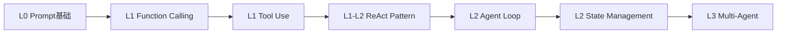
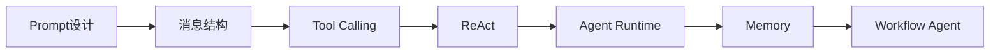
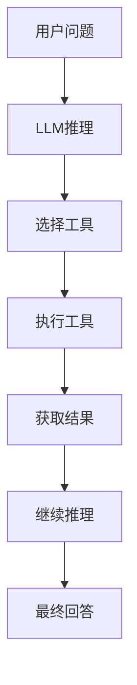
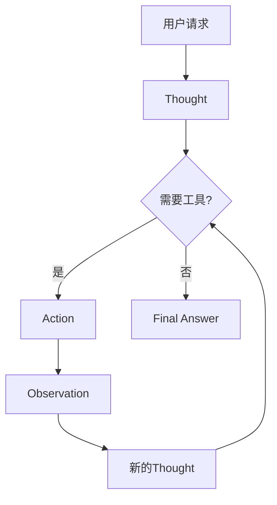
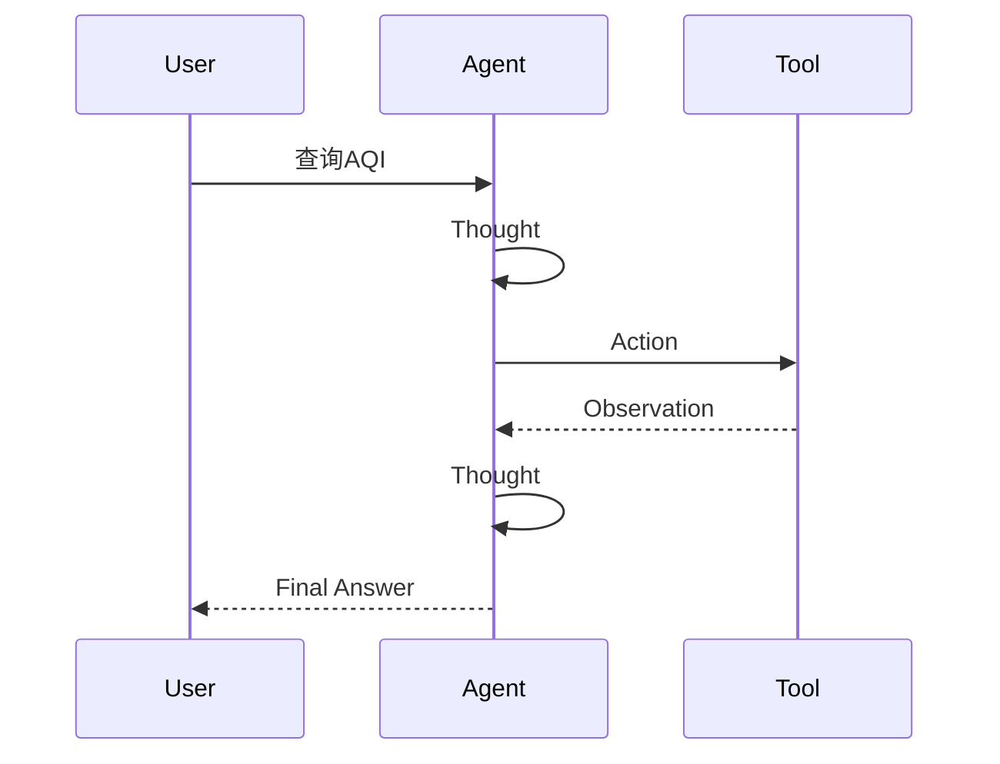
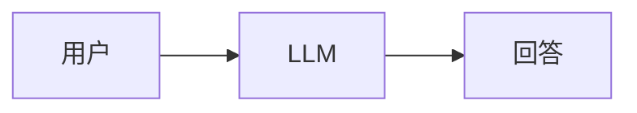
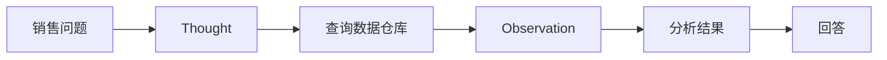
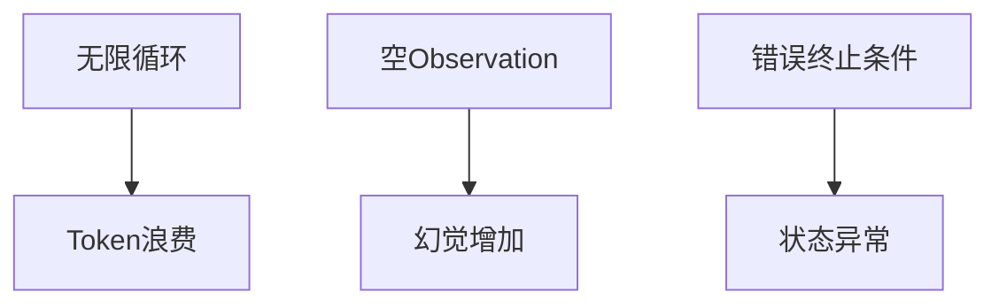
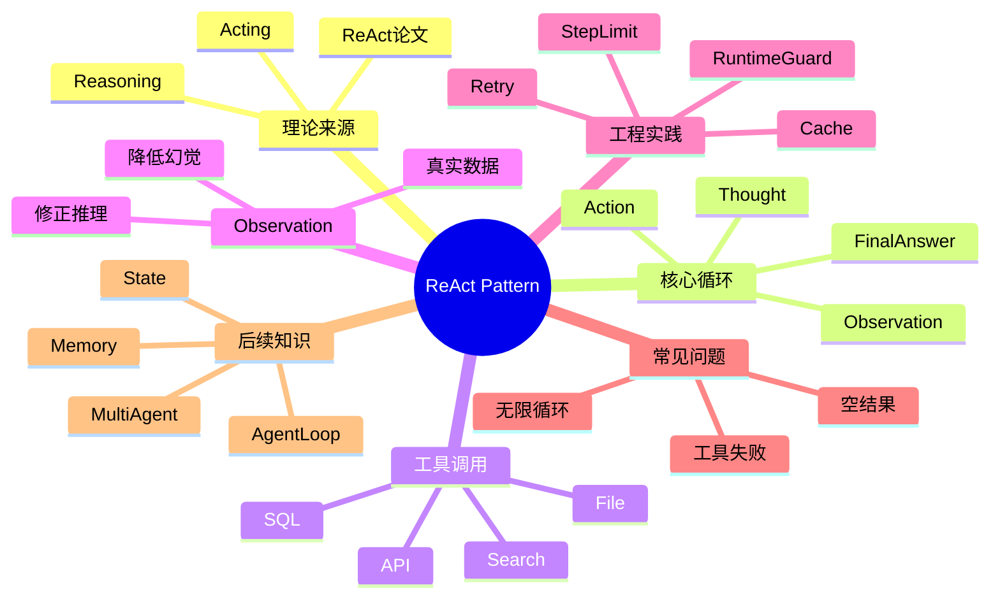

<!--
Chapter: 63
Node: KN-P-000005
Score: 91
Status: ✅ APPROVED
Attempt: 1
Round: 2
Generated: 2026-06-21 09:17:23
-->

# 第63章 ReAct Pattern（推理-行动循环） [L1-L2]

## Part 1：为什么要学这个？[认知冲突先行]

很多工程师第一次接触 Agent 时，会产生一个非常自然的想法：

既然已经给模型配置了搜索工具、数据库工具、天气工具，那么模型遇到需要实时信息的问题时，一定会主动去查。

上线后的现实却经常相反。

某团队给客服 Agent 配置了搜索工具，希望它回答物流问题。

用户问：

> 我的订单为什么还没发货？

系统后台明明提供了：

```python
tools = [query_order_status]
```

但 Agent 的回答却是：

> 通常订单会在 24 小时内发货，请耐心等待。

问题在于：

它根本没有查询订单。

两小时后运营人员发现，这个订单实际上因为库存异常已经被冻结。

模型给出了一个听起来合理、实际上完全错误的答案。

这类问题并不罕见。

很多团队在 Demo 阶段没有发现，是因为测试问题恰好落在模型知识范围内。

一旦进入生产环境：

* 实时天气
* 股票价格
* 订单状态
* 数据仓库指标
* 企业内部知识

这些信息都超出了模型训练时的知识边界。

此时会出现一个关键认知冲突：

**拥有工具，不等于会使用工具。**

Tool 只是能力。

真正决定：

* 是否调用工具
* 调用哪个工具
* 何时停止调用
* 如何利用结果继续思考

的是 ReAct Pattern。

本章要解决的问题是：

> Agent 如何像调查员一样，在推理与行动之间不断循环，依靠证据而不是猜测完成任务？

---

## Part 2：学习路径定位

ReAct 是 Agent 执行机制中的核心模式。

如果把 Agent 看成一个完整系统：

* LLM 是大脑
* Tool 是外部能力
* ReAct 是决策循环

没有 ReAct，工具只是摆设。

### 在学习路径中的位置



### 前置知识与后续知识



### 学完本章后

你将能够：

* 理解 ReAct 的理论来源
* 理解 Thought、Action、Observation
* 看懂主流 Agent 框架执行流程
* 分析 Agent 为什么不调用工具
* 排查循环失控问题

---

## Part 3：用生活理解它

想象你在陌生城市找一家餐厅。

你不会一出地铁就直接断言：

> 餐厅一定在左边。

真实过程更像：

先分析地图位置。

然后打开导航。

查看导航结果。

发现走错路后重新判断。

继续导航。

直到找到目标。

这就是 ReAct。

推理不是一次完成的。

行动也不是盲目的。

每一次行动都会带来新的观察结果，而新的观察结果又会改变下一步推理。

### 类比成立的部分

* 导航前的判断对应 Thought
* 打开地图对应 Action
* 地图反馈对应 Observation
* 调整路线对应下一轮 Thought

### 类比失效的部分

现实中的人拥有稳定世界模型。

Agent 的推理能力依赖 LLM。

因此：

* 推理可能错误
* 工具可能失败
* Observation 可能不完整

ReAct 提升的是决策质量，而不是保证正确。

---

## Part 4：AI如何映射到传统概念

很多软件工程师第一次接触 ReAct 时，会觉得它像一种全新的东西。

实际上并非如此。

很多概念在传统软件工程中都能找到对应物。

| 传统软件    | Agent世界       |
| ------- | ------------- |
| if/else | Thought       |
| API调用   | Action        |
| 返回值     | Observation   |
| while循环 | ReAct Loop    |
| 状态机     | Agent State   |
| 工作流引擎   | Agent Runtime |
| 调试日志    | Thought Trace |
| RPC调用   | Tool Use      |

传统程序：

```python
weather = get_weather("上海")

if weather["aqi"] > 150:
    print("减少外出")
else:
    print("正常活动")
```

开发者提前决定了：

* 调哪个函数
* 如何判断
* 如何返回

而 ReAct Agent：

```text
Thought:
用户需要实时AQI

Action:
search_aqi

Observation:
AQI=182

Thought:
空气污染较严重

Final Answer:
建议减少户外运动
```

最大的区别是：

决策逻辑从程序员转移到了模型。



---

## Part 5：技术本质深讲

### ReAct 从哪里来

ReAct 来自论文：

**Reasoning and Acting in Language Models**

名字本身就揭示了核心思想：

* Reasoning（推理）
* Acting（行动）

研究者发现：

Chain of Thought 虽然能提升推理能力，但仍然存在一个根本问题。

它只能思考。

不能行动。

例如：

```text
问题：
上海今天空气质量如何？
```

Chain of Thought：

```text
我需要知道上海AQI。
AQI决定空气质量等级。
如果AQI较高则建议减少外出。
```

推理过程没错。

但模型没有获得 AQI。

它依然在猜。

### Chain of Thought 与 ReAct 的区别

| 项目     | Chain of Thought | ReAct |
| ------ | ---------------- | ----- |
| 推理     | 有                | 有     |
| 调用工具   | 无                | 有     |
| 获取实时信息 | 无                | 有     |
| 与外界交互  | 无                | 有     |
| 动态修正计划 | 弱                | 强     |

Chain of Thought：

```text
Think → Think → Think → Answer
```

ReAct：

```text
Think → Act → Observe → Think
```

### 为什么必须引入行动

纯 LLM 有两个天然限制。

#### 限制一：知识截止

模型不知道：

* 今天新闻
* 当前库存
* 实时天气
* 数据库内容

#### 限制二：无法执行操作

模型可以建议：

> 查询数据库

但无法真正查询。

ReAct 解决的就是这两个问题。

### 核心循环



### 核心组件

#### Thought

负责：

* 分析问题
* 制定计划
* 判断是否调用工具

#### Action

负责：

* 搜索
* 查询
* 执行操作

#### Observation

负责：

* 接收结果
* 更新上下文
* 修正推理

#### Final Answer

负责：

* 输出结果
* 结束任务

### 为什么 Observation 最关键

很多人以为 ReAct 的重点是调用工具。

实际上重点是 Observation。

因为它把现实世界的信息带回模型。



### 关于循环限制

很多初学者认为：

> ReAct 默认会一直循环直到完成任务。

这种理解并不准确。

现代 Agent 框架通常都会提供：

* recursion limit
* step limit
* max_iterations
* runtime guard

不同框架名称不同，但目标一致：

避免无限循环。

例如：

```python
MAX_STEPS = 10
```

达到上限后：

* 返回错误
* 强制终止
* 请求人工介入

这是生产环境必备机制。

### 一句话记忆

> ReAct 的本质不是调用工具，而是利用行动获得证据，再利用证据修正推理。

---

## Part 6：动手Demo（可运行代码）

下面实现一个极简版 ReAct Agent。

它会根据用户问题自动识别城市，再决定调用天气工具。

```python
import re


def search_weather(city: str) -> str:
    weather_db = {
        "上海": "晴天，25°C",
        "北京": "多云，22°C",
        "深圳": "小雨，28°C"
    }
    return weather_db.get(city, "未找到天气信息")


def extract_city(question: str) -> str:
    cities = ["上海", "北京", "深圳"]

    for city in cities:
        if city in question:
            return city

    return "上海"


def react_agent(question: str) -> str:
    print("Thought: 用户似乎在询问天气")

    city = extract_city(question)

    print(f"Thought: 从问题中识别到城市={city}")
    print(f'Action: search_weather("{city}")')

    observation = search_weather(city)

    print(f"Observation: {observation}")

    print("Thought: 已获得实时信息，可以回答用户")

    return f"{city}今天天气：{observation}"


result = react_agent("北京今天天气怎么样？")

print("\nFinal Answer:")
print(result)
```

### 关键代码解析

城市不是写死的。

```python
city = extract_city(question)
```

这里体现的是：

**推理决定行动。**

不同问题会触发不同工具参数。

### 运行后结果

```text
Thought: 用户似乎在询问天气
Thought: 从问题中识别到城市=北京
Action: search_weather("北京")
Observation: 多云，22°C
Thought: 已获得实时信息，可以回答用户

Final Answer:
北京今天天气：多云，22°C
```

### LangGraph 示例说明

不同版本的 LangGraph 中：

```python
create_react_agent(...)
```

的返回对象、状态结构、消息格式可能存在差异。

因此实际开发时必须以当前版本官方文档为准。

示例代码仅展示调用思路：

```python
from langgraph.prebuilt import create_react_agent

agent = create_react_agent(
    model=llm,
    tools=tools
)
```

需要注意：

不同版本的：

* invoke输入格式
* messages结构
* 返回结果字段

可能并不完全一致。

生产项目应锁定依赖版本并查阅对应文档。

---

## Part 7：真实项目场景

### 企业销售分析Agent

销售团队每天都会提问：

* 本月销售额是多少
* 哪个区域增长最快
* 哪个产品下降最严重

第一版系统采用：



结果频繁出现：

* 编造数字
* 使用旧数据
* 趋势分析错误

### 引入 ReAct



执行过程：

```text
Thought:
需要获取销售数据

Action:
query_sales()

Observation:
1380万元

Thought:
需要计算同比

Action:
query_growth()

Observation:
18%

Final Answer:
销售额1380万元，同比增长18%
```

### 技术栈

| 模块    | 技术               |
| ----- | ---------------- |
| LLM   | GPT-4o           |
| Agent | LangGraph        |
| 数据仓库  | ClickHouse       |
| Tool层 | Function Calling |
| 监控    | LangSmith        |

### 效果说明

以下数据为案例模拟统计，用于说明 ReAct 带来的典型收益，不代表行业统一基准：

* 数据正确率由约60%提升到90%以上
* 幻觉显著减少
* 人工复核工作量明显下降
* 工具调用平均2至4次完成任务

核心原因只有一个：

系统开始依赖真实数据，而不是依赖模型记忆。

---

## Part 8：这里容易踩坑

### 坑一：把工具当成自动能力

错误理解：

```python
tools = [search_tool]
```

模型一定会查。

实际上不一定。

需要通过 Prompt、Agent Runtime、Tool Schema 共同引导。

### 坑二：工具异常没有反馈

错误写法：

```python
except Exception:
    return ""
```

正确写法：

```python
except Exception:
    return "数据库超时"
```

Observation 必须可解释。

### 坑三：无限循环

错误：

```python
while True:
    run_agent()
```

正确：

```python
MAX_STEPS = 10
```

设置熔断。

### 坑四：字符串匹配判断结束

错误方式：

```python
if "Final Answer" in result:
    break
```

现代框架更推荐：

* finish_reason
* structured state
* explicit status
* runtime signal

例如：

```python
if state["status"] == "finished":
    break
```

这样更稳定。



---

## Part 9：面试怎么答

### L1

#### Thought、Action、Observation 分别是什么？

回答框架：

* Thought负责规划
* Action负责执行
* Observation负责反馈
* 三者构成闭环

### L2

#### ReAct 为什么比纯 LLM 更适合实时场景？

回答框架：

* 可以访问外部系统
* 获取实时数据
* Observation修正推理
* 降低幻觉

### L3

#### Agent 不断重复调用搜索工具怎么办？

回答框架：

* 检查Thought
* 检查Observation
* 检查终止条件
* 检查工具返回质量
* 增加熔断机制

### 高级工程题

#### 如何设计 ReAct Agent 的观测结果缓存与重试机制？

回答框架：

1. 为每次工具调用生成唯一Key
2. 相同查询优先读取缓存
3. 失败请求指数退避重试
4. 记录失败原因进入Observation
5. 达到阈值后触发Fallback
6. 防止重复Action导致循环

---

## Part 10：考点速查

**ReAct = Reasoning + Acting**

推理与行动结合。

**Tool 不等于会使用**

工具存在不代表模型会调用。

**Observation 是核心输入**

它负责把现实世界带入推理链。

**循环必须受控**

需要 step limit 或 runtime guard。

**ReAct 不等于 Agent**

ReAct 是模式，Agent 是系统。

---

## Part 11：必背金句

[证据优先]：没有 Observation，就没有可靠结论。

[工具只是能力]：Tool 决定能做什么，ReAct 决定什么时候做。

[推理必须可观测]：Thought Trace 是调试 Agent 的关键。

[循环必须可终止]：没有循环限制的 Agent 不适合生产环境。

[真实结果修正推理]：Observation 的价值高于额外的推理步骤。

---

## Part 12：快速参考表

| 概念            | 作用    | 示例              |
| ------------- | ----- | --------------- |
| Thought       | 分析问题  | 需要查询天气          |
| Action        | 调用工具  | search_weather  |
| Observation   | 接收结果  | 晴天25°C          |
| Final Answer  | 输出结果  | 今日适合出行          |
| Tool          | 外部能力  | API、SQL         |
| Agent Loop    | 驱动循环  | Runtime         |
| Step Limit    | 防死循环  | 10              |
| Runtime Guard | 安全控制  | recursion limit |
| State         | 保存上下文 | messages        |
| Trace         | 调试记录  | Thought日志       |

---

## Part 13：思维导图



---

## Part 14：本章小结

ReAct 的核心不是工具调用，而是基于证据的动态决策。

Thought 负责思考，Action 负责行动，Observation 负责把现实世界反馈给模型。

从成长路径来看：

* L0：理解 Prompt
* L1：掌握 Tool Use
* L1-L2：掌握 ReAct
* L2：实现 Agent Loop
* L3：构建复杂 Agent 系统

---

## Part 15：下一章预告

这一章解决了一个关键问题：

> Agent 如何通过推理与行动的循环获得真实信息。

但新的问题出现了。

当 Agent 已经执行了六轮工具调用时：

* 历史状态存在哪里？
* Observation 如何持续保留？
* 中断后如何恢复执行？
* 循环是谁驱动的？

这些问题已经超出了 ReAct 本身。

当单个 Agent 的 ReAct 能力成熟之后，工程上的下一个问题是：

如何把多个 Agent 组织起来？谁来分配任务？谁来汇总结果？

下一章将进入：

**Supervisor-Worker Pattern（主从多 Agent 模式）** — 一个 Supervisor 如何拆解任务、分配给多个 Worker Agent 并聚合结果