<!--
Chapter: 64
Node: KN-P-000006
Score: 90
Status: ✅ APPROVED
Attempt: 1
Round: 2
Generated: 2026-06-21 09:42:42
-->

# 第64章 Supervisor-Worker Pattern（主从多 Agent 模式） [L2-L3]

## Part 1：为什么要学这个？[认知冲突先行]

很多工程师第一次构建复杂 Agent 系统时，会有一个几乎本能的判断：

> 任务做不好，一定是模型不够强。

于是他们不断升级模型。

从小模型换成大模型。

从 32K Context 换成 128K Context。

从单工具调用升级到十几个工具。

结果系统依然不稳定。

例如一个企业研究 Agent，需要完成：

* 搜集公司资料
* 阅读财报
* 分析行业趋势
* 输出投资报告

很多团队会把这些任务全部塞进一个 Agent。

表面上看：

* 模型更强
* 上下文更大
* 工具更多

理论上应该表现更好。

但实际情况经常相反。

原因很简单：

同一个 Agent 同时承担了规划、搜索、分析、汇总、写作等多个角色。

这就像让一个人同时担任：

* 项目经理
* 财务分析师
* 行业研究员
* 报告撰写员

即使能力再强，也会出现：

* 信息遗漏
* 上下文污染
* 响应变慢
* 推理链混乱

某教学案例中，一个企业研报系统从单 Agent 架构改造成 Supervisor-Worker 架构后，内部测试数据显示平均处理时间明显下降，遗漏问题显著减少。但这里的数据仅代表特定项目和特定任务场景，不代表所有系统都会获得相同收益。

真正的问题并不是：

> 模型够不够聪明。

而是：

> 系统是否采用了正确的协作方式。

本章要解决的问题是：

**如何让多个专业 Agent 像一个高效团队一样协同工作，而不是让一个 Agent 独自承担所有工作？**

答案就是：

**Supervisor-Worker Pattern。**

一句话记忆：

> 主管负责决策和派活，专家负责执行和交付。

---

## Part 2：学习路径定位

Supervisor-Worker 是从单 Agent 向多 Agent 系统演进的重要阶段。

它关注的不再是：

> Agent 如何调用工具。

而是：

> Agent 如何管理其他 Agent。

### 知识路径

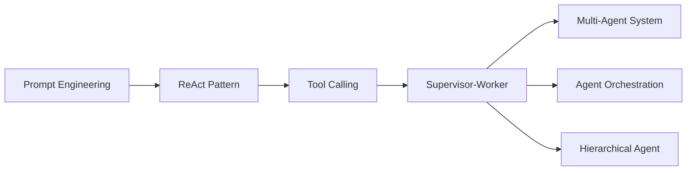

### 前置知识

| 知识                 | 为什么需要         |
| ------------------ | ------------- |
| Prompt Engineering | 设计角色职责        |
| ReAct Pattern      | 理解 Agent 执行过程 |
| Tool Calling       | 理解工具使用机制      |
| 基础工作流思想            | 理解任务拆分        |

### 后续知识

| 知识                       | 作用           |
| ------------------------ | ------------ |
| State Machine            | 管理复杂状态流转     |
| LangGraph Workflow       | 构建可视化工作流     |
| Multi-Agent Architecture | 大规模 Agent 协作 |
| Agent Memory             | 跨 Agent 状态共享 |

### 为什么是 L2-L3？

L1 关注：

> Agent 如何完成任务。

L2 关注：

> 多个 Agent 如何协作。

L3 关注：

> Agent 如何管理 Agent。

Supervisor-Worker 正是从执行层走向编排层的重要跃迁。

---

## Part 3：用生活理解它

想象你在装修房子。

需要完成：

* 设计
* 水电
* 木工
* 泥工
* 验收

有两种组织方式。

第一种：

找一个全能工人。

第二种：

找一个项目经理，再配多个专业师傅。

项目经理负责：

* 制定计划
* 安排顺序
* 协调资源
* 汇总进度

专业师傅负责：

* 各自领域工作

第二种通常更高效。

Supervisor 就像项目经理。

Worker 就像专业师傅。

### 类比成立的地方

* 明确职责边界
* 专业化分工
* 支持并行执行
* 存在统一协调者

### 类比失效的地方

现实中的工人经常直接沟通。

而在很多 Supervisor-Worker 系统中：

Worker 之间通常通过 Supervisor 协调。

这样更容易：

* 审计
* 调试
* 控制状态

但需要注意：

这并不是绝对规则。

某些高级 Multi-Agent 系统允许 Agent-to-Agent Communication。

只是随着 Worker 数量增长，状态同步和一致性管理会变得更加复杂。

因此：

> Worker 不直接通信是推荐架构，而不是唯一架构。

---

## Part 4：AI如何映射到传统概念

对于传统软件工程师来说，这种模式并不陌生。

### 概念映射表

| 传统系统            | AI 系统              |
| --------------- | ------------------ |
| Project Manager | Supervisor         |
| Worker Process  | Worker Agent       |
| Task Queue      | Agent Task         |
| Scheduler       | Task Router        |
| Workflow Engine | Supervisor         |
| Microservice    | Specialized Worker |
| Job Result      | Worker Output      |

### 架构映射

传统系统：

```text
Controller
    ↓
ServiceA
ServiceB
ServiceC
```

AI 系统：

```text
Supervisor
    ↓
Research Worker
Analyst Worker
Writer Worker
```

### 与 Pipeline 的区别

| 对比项 | Pipeline | Supervisor-Worker |
| --- | -------- | ----------------- |
| 路径  | 固定       | 动态                |
| 并行  | 有限       | 强                 |
| 决策  | 无        | 有                 |
| 扩展性 | 一般       | 高                 |
| 容错  | 较弱       | 较强                |

Pipeline 更像流水线。

Supervisor-Worker 更像项目管理体系。

---

## Part 5：技术本质深讲

### 核心思想

其本质是：

> 任务拆分 + 专业执行 + 集中协调。

复杂任务：

```text
分析企业财报
```

会被拆成：

```text
资料收集
财务分析
行业分析
报告生成
```

再交给不同 Worker。

### 系统组成

#### Supervisor

职责：

* 接收请求
* 拆解任务
* 分配 Worker
* 跟踪状态
* 错误处理
* 汇总结果

不负责：

* 具体业务执行

#### Worker

职责：

* 执行子任务
* 调用工具
* 返回结果

不负责：

* 全局规划
* 状态编排

### 工作流程

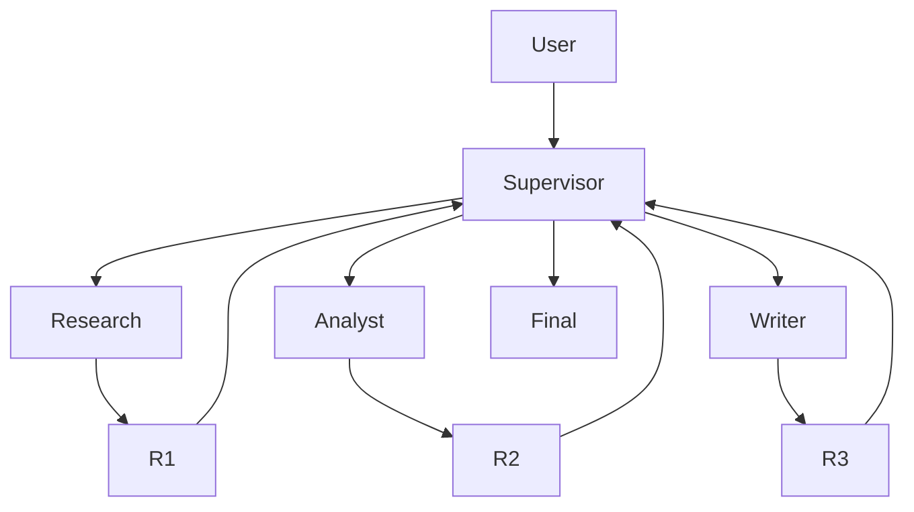

### Task Routing

Supervisor 的关键能力是：

**任务路由。**

例如：

| 任务   | Worker        |
| ---- | ------------- |
| 搜索网页 | Research      |
| 财报分析 | Analyst       |
| 数据处理 | Data Worker   |
| 代码生成 | Coding Worker |

### 动态调度

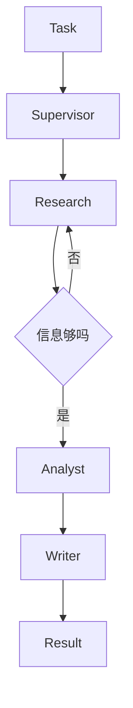

Supervisor 可以决定：

* 是否重试
* 是否增加 Worker
* 是否提前结束
* 是否切换模型

### Context 隔离机制

单 Agent：

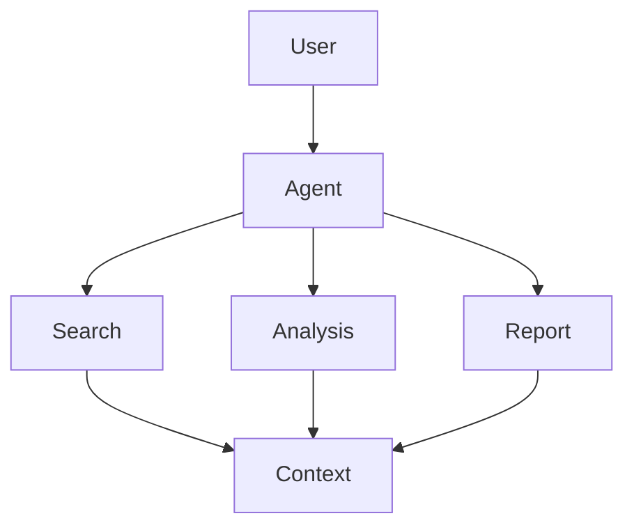

所有内容共享上下文。

容易导致：

* Token 增长
* 信息污染
* 注意力分散

Supervisor-Worker：

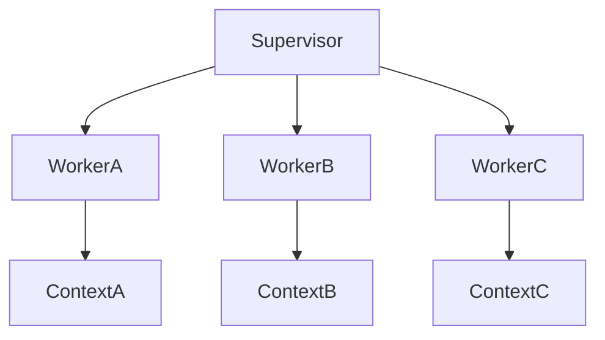

每个 Worker 拥有独立上下文。

但这里有一个重要前提：

> 只有当任务被有效拆分时，Context 隔离才会真正带来收益。

如果任务划分不合理：

* Worker 重复工作
* Supervisor 需要大量汇总
* 信息来回传递

那么额外协调成本可能抵消部分收益。

### 实现思路

为了保证示例稳定可运行，本章不使用非官方实验性 Supervisor 库。

下面展示最常见的实现思路：

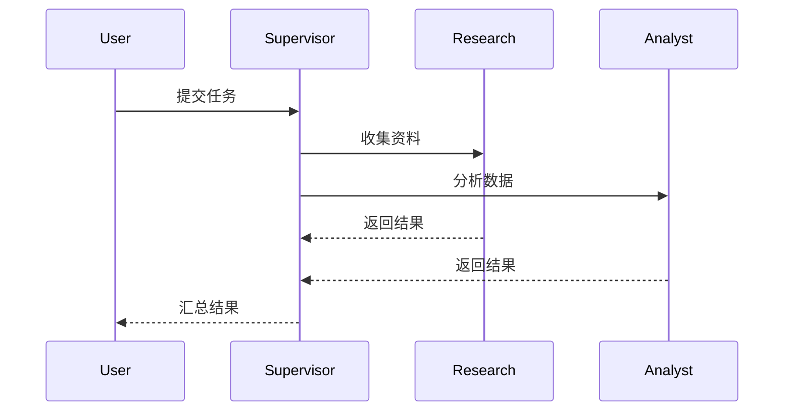

### 为什么效率会提升

假设：

* Research：20 秒
* Analysis：30 秒
* Report：18 秒

串行：

```text
20 + 30 + 18 = 68秒
```

理想并行：

```text
max(20,30) + 18 = 48秒
```

但真实系统还存在：

* 调度开销
* 网络开销
* Agent 通信开销
* 汇总开销

因此实际收益通常小于理论收益。

正确理解应该是：

> 并行带来潜在加速，但最终收益取决于任务结构和系统实现。

### 三条核心原则

#### 原则1：Supervisor 不执行

只决策。

不干活。

#### 原则2：Worker 最小权限

每个 Worker 只拥有必要工具。

#### 原则3：混合模型架构

| 角色                | 推荐模型  |
| ----------------- | ----- |
| Supervisor        | 强推理模型 |
| Research Worker   | 中等模型  |
| Formatter Worker  | 小模型   |
| Translator Worker | 小模型   |

---

## Part 6：动手 Demo（可运行代码）

下面实现一个最小 Supervisor-Worker 系统。

为了方便运行：

* 不依赖 LangGraph
* 不依赖外部 Agent 框架
* 使用 ThreadPoolExecutor 模拟并行

需要特别说明：

**Writer 在本示例中被简化为本地汇总器。**

生产环境中：

Writer 完全可以设计成独立 Worker。

```python
from concurrent.futures import ThreadPoolExecutor
import time


def research_worker(task):
    time.sleep(2)
    return f"[研究] 已收集 {task} 相关资料"


def analyst_worker(task):
    time.sleep(3)
    return f"[分析] 已完成 {task} 核心指标分析"


def writer_aggregator(research_result, analysis_result):
    report = f"""
=== 最终报告 ===

{research_result}

{analysis_result}

结论：
目标企业整体表现良好。
"""
    return report


def supervisor(task):
    with ThreadPoolExecutor(max_workers=2) as executor:

        research_future = executor.submit(
            research_worker,
            task
        )

        analyst_future = executor.submit(
            analyst_worker,
            task
        )

        research_result = research_future.result()

        analysis_result = analyst_future.result()

    final_report = writer_aggregator(
        research_result,
        analysis_result
    )

    return final_report


if __name__ == "__main__":
    result = supervisor("苹果公司财报")
    print(result)
```

### 关键代码说明

* Supervisor 负责调度
* Research Worker 负责资料收集
* Analyst Worker 负责分析
* Writer Aggregator 负责结果整合

### 运行结果

```text
=== 最终报告 ===

[研究] 已收集 苹果公司财报 相关资料

[分析] 已完成 苹果公司财报 核心指标分析

结论：
目标企业整体表现良好。
```

### 流程图

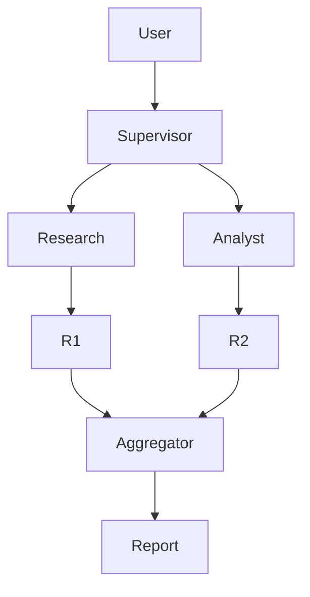

---

## Part 7：真实项目场景

### 场景：证券研究 AI 平台

输入：

```text
分析比亚迪最新季度财报
```

输出：

```text
研究报告
财务图表
风险分析
投资建议
```

### Worker 设计

#### Research Worker

工具：

* 搜索引擎
* PDF 阅读器

负责：

* 财报抓取
* 新闻抓取

#### Analyst Worker

工具：

* Pandas
* SQL

负责：

* 财务指标分析

#### Visualization Worker

工具：

* Matplotlib
* Plotly

负责：

* 图表生成

#### Writer Worker

负责：

* 报告撰写
* 结论整理

### 架构图

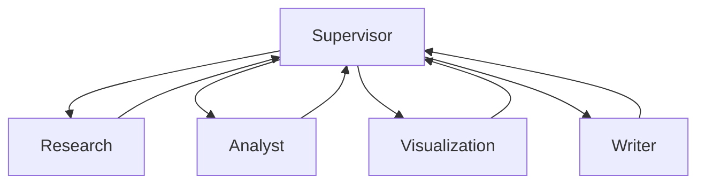

### 实际价值

提升并不来自更大的模型。

而来自：

* 专业化分工
* 并行执行
* 上下文隔离
* 动态调度

---

## Part 8：这里容易踩坑

### 坑1：Supervisor 自己下场干活

错误：

```python
def supervisor(task):
    data = search_web(task)
    result = analyst(task)
    return result
```

正确：

```python
def supervisor(task):
    research = research_worker(task)
    analysis = analyst_worker(task)
    return merge(research, analysis)
```

原因：

Supervisor 会被执行细节污染。

### 坑2：所有 Worker 都用最强模型

错误：

```python
research = GPT4()
analyst = GPT4()
writer = GPT4()
```

正确：

```python
supervisor = GPT4()

research = MiniModel()
writer = SmallModel()
```

原因：

成本与吞吐量都会恶化。

### 坑3：Worker 随意互相通信

错误：

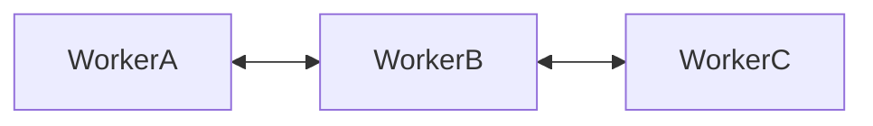

正确：

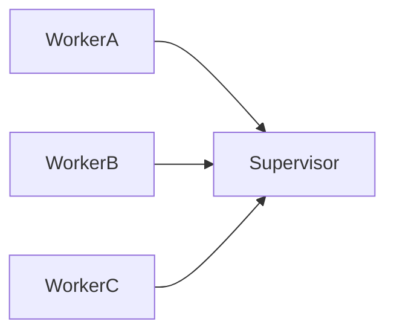

说明：

直接通信并非一定错误。

但会显著增加：

* 状态同步复杂度
* 调试难度
* 审计难度

---

## Part 9：面试怎么答

### L1：Supervisor 与 Worker 的职责边界是什么？

回答框架：

* Supervisor 负责规划
* Supervisor 负责调度
* Worker 负责执行
* Worker 返回结果
* 职责分离降低耦合

### L2：Worker 超时怎么办？

回答框架：

* Timeout
* Retry
* Fallback Worker
* 部分结果返回
* 状态恢复

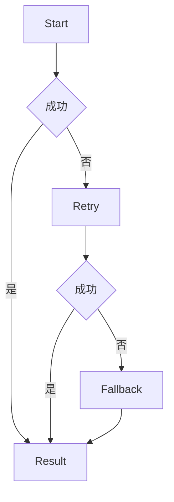

### L3：为什么 Supervisor 用大模型？

回答框架：

* 规划复杂
* 路由复杂
* 推理复杂

Worker：

* 边界明确
* 重复性高

### L3+：100 个 Worker 如何做负载均衡？

回答框架：

* 任务队列
* Worker Pool
* 动态扩缩容
* 优先级调度
* 健康检查

### L3+：如何避免 Supervisor 成为单点瓶颈？

回答框架：

* 多 Supervisor
* 分层 Supervisor
* 分区调度
* 状态存储外置
* Leader Election

### L3+：Worker 结果冲突怎么办？

回答框架：

* 置信度评分
* 仲裁 Agent
* 多数投票
* 人工审核

---

## Part 10：考点速查

### **Supervisor**

任务分解、调度路由、状态管理、结果汇总。

### **Worker**

执行专业领域任务。

### **Task Routing**

决定任务派给谁。

### **Context Isolation**

避免上下文污染。

### **Mixed Model Strategy**

大模型负责决策，小模型负责执行。

---

## Part 11：必背金句

[职责分离]：决策与执行必须分离。

[最小权限]：不给 Worker 多余能力。

[上下文隔离]：独立上下文降低干扰。

[动态调度]：流程由结果驱动而不是写死。

[混合模型]：规划用强模型，执行用经济模型。

---

## Part 12：快速参考表

| 概念                 | 作用    | 示例             |
| ------------------ | ----- | -------------- |
| Supervisor         | 调度中心  | Manager Agent  |
| Worker             | 执行者   | Research Agent |
| Routing            | 路由任务  | Analyst        |
| Context Isolation  | 上下文隔离 | 独立消息历史         |
| Parallel Execution | 并行执行  | 多线程            |
| Retry              | 重试    | 3次             |
| Timeout            | 超时控制  | 60秒            |
| Fallback           | 备用执行器 | Analyst-V2     |
| Tool Scope         | 工具边界  | Search Only    |
| Mixed Model        | 混合模型  | 强模型+小模型        |

---

## Part 13：思维导图

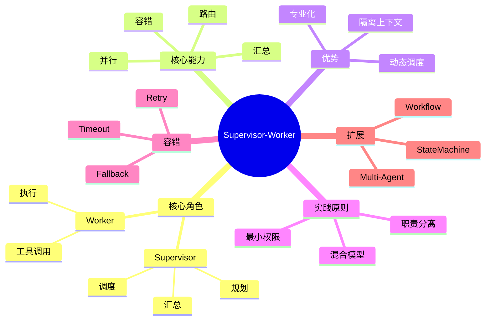

---

## Part 14：本章小结

复杂任务失败，很多时候不是模型能力问题，而是协作架构问题。

Supervisor-Worker 通过任务拆分、专业执行和集中协调，把单 Agent 难以完成的大任务拆解成多个可管理的小任务。

从工程视角看，它是构建 Multi-Agent 系统最重要的基础模式之一。

### 成长路径

L0：

理解 Agent 概念。

L1：

掌握 ReAct 与 Tool Calling。

L2：

能够设计多个 Agent 协作。

L3：

能够设计完整 Supervisor-Worker 系统并实现调度、容错和资源优化。

---

## Part 15：下一章预告

这一章解决的问题是：

> 多个 Agent 如何协同完成复杂任务？

但新的挑战出现了：

* 当前任务进行到哪一步？
* Worker 失败后如何恢复？
* 中间状态存放在哪里？
* 如何实现断点续跑？

这些问题都指向同一个核心能力：

> 工作流状态管理。

下一章我们将进入：

**State Machine（状态机）**

你会学到：

* State 是什么
* Transition 是什么
* Event 如何驱动流程
* 为什么复杂 Agent Workflow 本质上是状态机
* LangGraph 的 StateGraph 思维模型

当你掌握状态机之后，Supervisor-Worker 将从一种协作模式，升级为一个真正可观测、可恢复、可维护的工程系统。