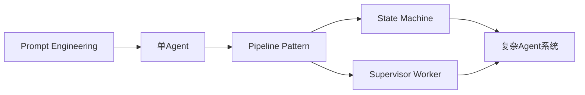
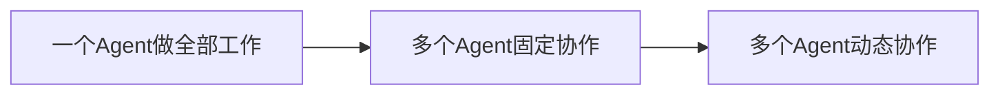
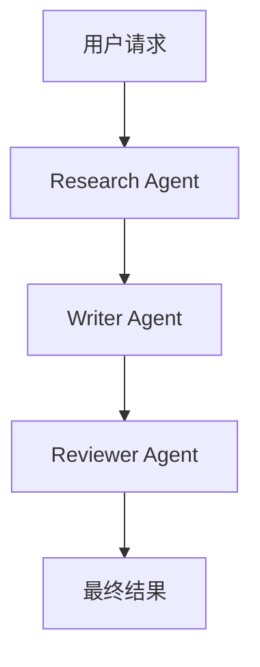
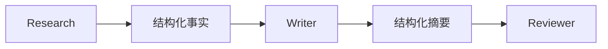
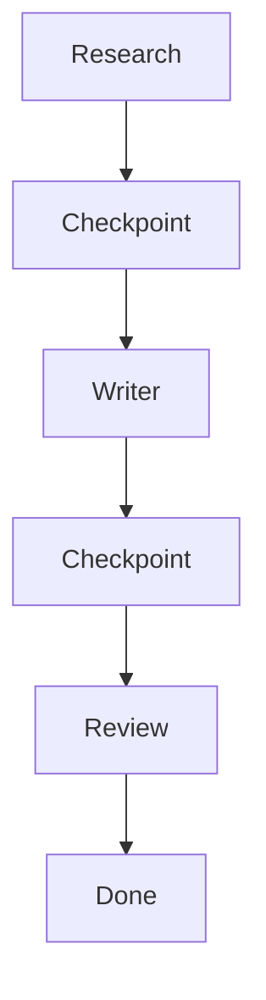
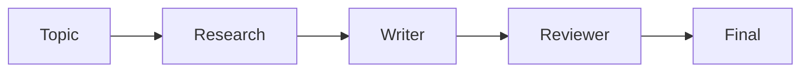
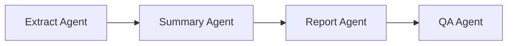
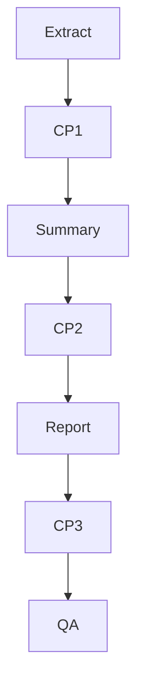
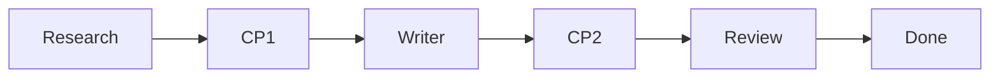
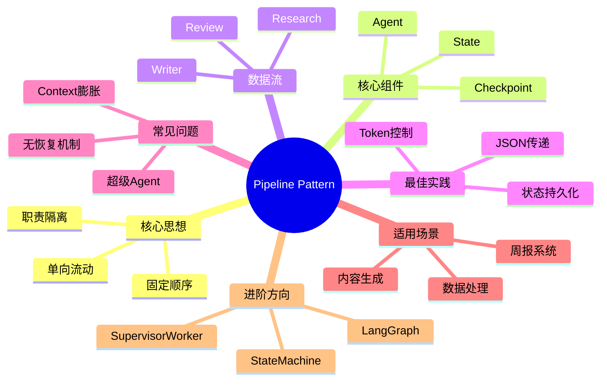

<!--
Chapter: 65
Node: KN-P-000007
Score: 93
Status: ✅ APPROVED
Attempt: 1
Round: 2
Generated: 2026-06-21 09:47:45
-->

# 第65章 Pipeline Pattern（串行 Agent 流水线） [L1-L2]

## Part 1：为什么要学这个？[认知冲突先行]

很多工程师第一次做 Agent 系统时，会下意识追求一种“终极方案”：

把检索、分析、写作、审核全部塞进一个 Prompt，让一个超级 Agent 一次完成全部工作。

看起来很合理。

调用一次模型，总比调用三次模型更快吧？

某团队在内部内容生成项目的早期阶段就采用过这种方案（这里采用匿名化教学案例描述）。他们把资料检索、文章撰写、事实核查和格式整理全部交给一个 Agent。

结果并不理想。

系统经常出现：

* 输出结构不稳定
* 关键事实遗漏
* 调试困难
* 响应时间偏长

后来团队进行了重构：

```text
Research Agent
      ↓
Writer Agent
      ↓
Reviewer Agent
```

调用次数从 1 次增加到 3 次。

但平均响应时间反而下降。

很多读者看到这里容易得出错误结论：

> 调用次数越多越快。

这当然不成立。

真正的原因是：

* 每个 Agent 的上下文更小
* 单次任务更聚焦
* 无需让模型同时思考多个职责
* 中间结果可以压缩和过滤

性能提升的核心来自上下文缩减与职责隔离，而不是调用次数增加本身。

这正是 Pipeline Pattern 想解决的问题：

当任务本身具有明确的固定流程时，如何通过多个专职 Agent 协作，让系统获得更好的稳定性、可维护性和可扩展性？

本章将回答：

1. Pipeline 为什么是最常见的多 Agent 架构？
2. 什么时候应该拆分 Agent？
3. Agent 之间如何传递数据？
4. 如何设计失败恢复机制？
5. 什么时候应该升级到更复杂架构？

---

## Part 2：学习路径定位

Pipeline 是 Agent 工程体系中的基础模式。

它位于单 Agent 与复杂工作流之间。

很多团队失败的原因不是技术太弱，而是架构升级太快。

他们直接进入：

* 动态规划
* 多 Agent 调度
* Agent Swarm
* 自主决策系统

结果系统复杂度远超业务需求。

更现实的情况是：

大量生产系统至今仍然运行在 Pipeline 架构之上。



前置知识：

* Prompt 基础
* LLM 调用机制
* Token 概念
* Context Window

后续知识：

* State Machine
* Supervisor-Worker
* LangGraph
* Multi-Agent Orchestration

知识定位如下：



Pipeline 正是第二阶段。

它是从“写 Prompt”迈向“设计 AI 系统”的第一步。

---

## Part 3：用生活理解它

想象一家餐厅。

如果让一个人负责：

* 买菜
* 洗菜
* 切菜
* 炒菜
* 打包
* 配送

理论上能完成全部工作。

但效率不会太高。

现实中更常见的是：

* 采购负责采购
* 后厨负责制作
* 打包员负责包装
* 骑手负责配送

每个人只做自己最擅长的部分。

前一个人的输出，就是后一个人的输入。

Pipeline 本质上就是这种协作方式。

```text
Research
   ↓
Write
   ↓
Review
```

### 类比的边界

现实流水线可以：

* 临时插队
* 人工干预
* 返工修改

而标准 Pipeline 更强调：

* 固定顺序
* 单向流动
* 职责明确

因此：

```text
A → B → C
```

通常不会自动变成：

```text
A → B → A → C
```

一旦需要动态回退或条件决策，就开始进入状态机模式的领域。

---

## Part 4：AI如何映射到传统概念

很多传统工程师第一次接触 Pipeline 时会产生一种熟悉感。

因为类似思想早已存在。

例如 ETL：

```text
Extract
   ↓
Transform
   ↓
Load
```

编译器：

```text
Lexer
   ↓
Parser
   ↓
Optimizer
   ↓
Code Generator
```

CI/CD：

```text
Build
   ↓
Test
   ↓
Deploy
```

AI Pipeline 只是把处理节点换成 Agent。

| 传统软件   | AI Pipeline                 |
| ------ | --------------------------- |
| ETL    | Research → Summary → Report |
| 编译器阶段  | 多 Agent 处理链                 |
| 微服务调用链 | Agent 调用链                   |
| DTO    | JSON 数据传递                   |
| 缓存     | Checkpoint                  |
| 工作流引擎  | LangGraph                   |

传统代码：

```python
data = load_data()
cleaned = clean_data(data)
report = generate_report(cleaned)
```

AI Pipeline：

```python
research = research_agent(topic)
summary = summary_agent(research)
report = writer_agent(summary)
```

最大的区别在于：

传统函数输出确定。

Agent 输出具有概率性。

因此需要：

* 状态记录
* 结果验证
* 失败恢复

---

## Part 5：技术本质深讲

### Pipeline 到底是什么

Pipeline 并不是简单地把多个 Agent 连起来。

真正的本质是：

> 将复杂任务拆解成固定顺序的职责链。

例如：

```text
Topic
  ↓
Research
  ↓
Writer
  ↓
Reviewer
```

每个 Agent 只处理自己的职责。

Research 不写文章。

Writer 不做检索。

Reviewer 不负责收集资料。

职责越单一，结果越稳定。

### 三个核心特征

#### 固定顺序

执行路径在设计阶段确定。

```text
Research → Writer → Reviewer
```

运行过程中不会随意改变。

#### 单向流动

数据持续向前流动。

```text
Input
 ↓
A
 ↓
B
 ↓
C
 ↓
Output
```

#### 职责隔离

每个 Agent 专注一个问题。

Prompt 更短。

推理更聚焦。

### 工作原理



### 数据如何流动

错误做法：

```text
全部历史记录
全部日志
全部原文
全部Agent输出
        ↓
下一步
```

正确做法：



例如：

```json
{
  "topic": "Pipeline",
  "facts": [
    "固定流程",
    "职责隔离"
  ]
}
```

### Pipeline 为什么经常比单 Agent 更快

这里有一个常见误区。

很多人认为：

```text
调用次数少 = 一定更快
```

事实上并不一定。

假设单 Agent：

```text
上下文：
12000 Token

任务：
检索+写作+审核
```

而 Pipeline：

```text
Research: 2000
Writer: 3000
Review: 1000
```

总 Token 更少。

模型处理负担更小。

因此经常会更快。

但必须强调：

Pipeline 并非必然更快。

实际耗时还受到以下因素影响：

* 模型类型
* 网络延迟
* 输出长度
* 推理深度
* 服务端排队
* 并发策略

因此更准确的说法是：

> Pipeline 在很多任务中经常更快，但不是天然更快。

### Checkpoint

生产环境一定会遇到失败。

例如：

```text
Research ✔
Writer ✔
Review ✖
```

没有 Checkpoint：

```text
全部重跑
```

有 Checkpoint：

```text
直接从 Review 重试
```



### LangGraph 如何表示 Pipeline

在 Pipeline 模式下，LangGraph 往往呈现为线性路径。


需要特别说明：

这里展示的是 Pipeline 模式在 LangGraph 中的表达方式。

并不是 LangGraph 本身只能表示线性流程。

实际上 LangGraph 还支持：

* 条件分支
* 动态路由
* 循环
* 人机协作节点

只是当我们选择 Pipeline Pattern 时，通常会把图设计成线性结构。

### 适用边界

适合：

* 文档生成
* 数据处理
* 内容审核
* 周报生成

不适合：

* 动态决策
* 多路径选择
* 专家并行协作

判断标准：

```text
流程是否固定？
```

如果答案是：

```text
永远都是 A → B → C
```

优先考虑 Pipeline。

---

## Part 6：动手Demo（可运行代码）

```python
from typing import TypedDict


class PipelineState(TypedDict):
    topic: str
    research: str
    draft: str
    final_article: str


def research_agent(topic: str) -> str:
    return f"研究结果：{topic} 是一种用于组织 Agent 协作的模式。"


def writer_agent(research: str) -> str:
    return f"文章草稿：\n{research}"


def reviewer_agent(draft: str) -> str:
    return draft + "\n\n审核通过：内容结构完整。"


def run_pipeline(topic: str) -> PipelineState:
    state: PipelineState = {
        "topic": topic,
        "research": "",
        "draft": "",
        "final_article": ""
    }

    state["research"] = research_agent(topic)

    state["draft"] = writer_agent(
        state["research"]
    )

    state["final_article"] = reviewer_agent(
        state["draft"]
    )

    return state


if __name__ == "__main__":
    result = run_pipeline("Pipeline Pattern")

    print("=== 最终结果 ===")
    print(result["final_article"])
```

### 关键代码解析

状态对象：

```python
state: PipelineState
```

用于保存：

* 当前状态
* 中间结果
* 最终输出

数据传递：

```python
state["draft"] = writer_agent(
    state["research"]
)
```

Writer 不关心 Topic。

只消费上一步结果。

这体现了职责隔离原则。

### 运行结果

输出类似：

```text
=== 最终结果 ===
文章草稿：
研究结果：Pipeline Pattern 是一种用于组织 Agent 协作的模式。

审核通过：内容结构完整。
```

### 真实系统对应关系



---

## Part 7：真实项目场景

### 项目背景

某企业知识情报团队需要自动生成行业周报。

数据来源包括：

* 新闻资讯
* 财报公告
* 技术博客
* 行业报告

每天处理约 300~500 篇内容。

下面数据为真实项目匿名化后的统计结果。

统计周期：

* 连续 30 天
* 共处理约 12000 条资讯

### 初始方案

单 Agent：

```text
全部资料
   ↓
超级Prompt
   ↓
最终周报
```

问题：

* Prompt 超长
* 质量波动
* 调试困难

平均耗时约 35 秒。

### 改造方案



### Agent 分工

Extract：

负责事实提取。

Summary：

负责信息压缩。

Report：

负责生成周报。

QA：

负责格式与事实检查。

### Checkpoint



### 项目结果

30 天统计结果：

* 平均耗时：35 秒 → 14 秒
* Token 消耗下降约 58%
* 人工修改率：22% → 7%
* 恢复时间下降约 80%

需要注意：

这些数据来自特定业务场景。

并不意味着所有 Pipeline 项目都会获得相同幅度收益。

真正产生收益的关键仍然是：

* 合理职责拆分
* 上下文压缩
* Checkpoint 设计

---

## Part 8：这里容易踩坑

### 坑1：传递全部历史记录

错误：

```python
next_input = {
    "history": history,
    "logs": logs,
    "docs": docs
}
```

正确：

```python
next_input = {
    "facts": facts,
    "summary": summary
}
```

原因：

Context 越大，不代表效果越好。

### 坑2：没有 Checkpoint

错误：

```python
a = step_a()
b = step_b(a)
c = step_c(b)
```

正确：

```python
save_checkpoint(a)

b = step_b(a)
save_checkpoint(b)

c = step_c(b)
```

失败时直接恢复。

### 坑3：超级 Agent

错误 Prompt：

```text
检索
分析
写作
审核
排版
校验
```

正确：

```text
Research
 ↓
Writer
 ↓
Reviewer
```

职责越清晰，系统越稳定。

---

## Part 9：面试怎么答

### L1：什么时候应该使用 Pipeline？

回答框架：

* 流程固定
* 顺序明确
* 职责可拆分

例如：

```text
Research
 ↓
Write
 ↓
Review
```

### L2：Writer Context 超限怎么办？

回答思路：

* 不传原文
* 传结构化事实
* 分层摘要
* Token Budget

例如：

```json
{
  "facts": [],
  "summary": []
}
```

### L3：什么时候升级到 Supervisor-Worker？

观察：

* 是否出现分支
* 是否需要动态路由
* 是否需要并行专家

如果仍然是：

```text
A → B → C
```

继续使用 Pipeline。

### 系统设计题

设计一个支持失败恢复的内容生成 Pipeline。

参考思路：

1. Research、Writer、Review 三阶段拆分
2. 每阶段输出结构化 JSON
3. 阶段结束立即持久化 Checkpoint
4. 失败时从最近 Checkpoint 恢复
5. 增加状态表记录执行进度
6. 增加人工审核节点处理异常情况

架构示意：



高级回答重点：

* 幂等设计
* 状态管理
* 重试机制
* 成本控制

---

## Part 10：考点速查

**固定顺序**

执行路径提前确定。

**单向流动**

数据持续向前传递。

**职责隔离**

一个 Agent 一个职责。

**结构化传递**

JSON 优于长文本。

**Checkpoint**

支持失败恢复。

---

## Part 11：必背金句

[固定流程优先 Pipeline]：不要为简单问题引入复杂调度。

[一个 Agent 一种职责]：职责越聚焦，结果越稳定。

[结构化数据优先]：JSON 胜过长篇上下文。

[Checkpoint 是生产标配]：失败恢复能力决定系统可用性。

[Pipeline 不是万能架构]：出现动态决策时应考虑升级。

---

## Part 12：快速参考表

| 概念             | 作用      | 示例值                    |
| -------------- | ------- | ---------------------- |
| Pipeline       | 串行执行流程  | Research→Writer→Review |
| Agent          | 单步处理节点  | Summary Agent          |
| State          | 保存状态    | TypedDict              |
| Checkpoint     | 失败恢复    | Redis                  |
| JSON传递         | 控制上下文   | facts                  |
| Context Budget | Token控制 | 4000                   |
| LangGraph      | 工作流编排   | StateGraph             |
| Fixed Flow     | 固定路径    | A→B→C                  |
| Recovery       | 故障恢复    | Resume                 |

---

## Part 13：思维导图



---

## Part 14：本章小结

Pipeline Pattern 是最经典的多 Agent 协作模式，其核心思想是把复杂任务拆解成固定顺序的多个专职 Agent。

工程实践中真正重要的不是 Agent 数量，而是职责划分、结构化数据流以及 Checkpoint 机制。

成长路径可以理解为：

```text
L0：会调用模型
 ↓
L1：会拆分职责
 ↓
L2：会设计Pipeline
 ↓
L3：会选择合适架构
```

掌握 Pipeline，意味着开始从 Prompt 使用者转变为 AI 系统设计者。

---

## Part 15：下一章预告

本章解决的问题是：

> 多个 Agent 如何按照固定流程稳定协作？

Pipeline 给出的答案是：

```text
固定顺序
职责隔离
单向流动
```

但新的问题很快出现：

```text
审核通过怎么办？
审核失败怎么办？
不同输入走不同路径怎么办？
```

此时系统开始拥有：

* 状态
* 转换
* 条件
* 事件

简单流水线已经不足以描述这种行为。

下一章我们将进入：

**State Machine（状态机）**

你将学会：

* 如何定义 Agent 状态
* 如何设计状态转换
* 如何实现条件分支
* LangGraph 的 StateGraph 为什么本质上是状态机

Pipeline 解决的是：

> 按顺序执行。

State Machine 解决的是：

> 如何选择下一步该去哪里。