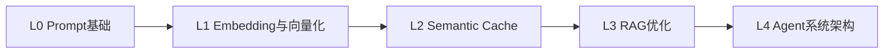
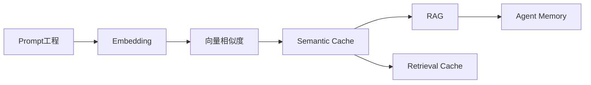
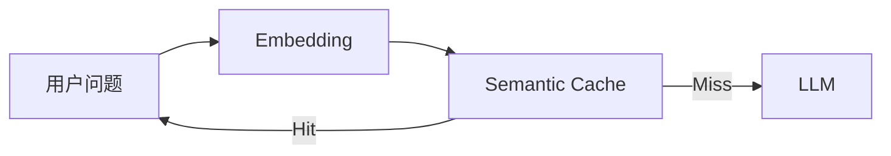
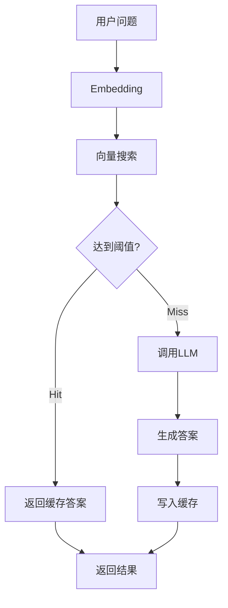
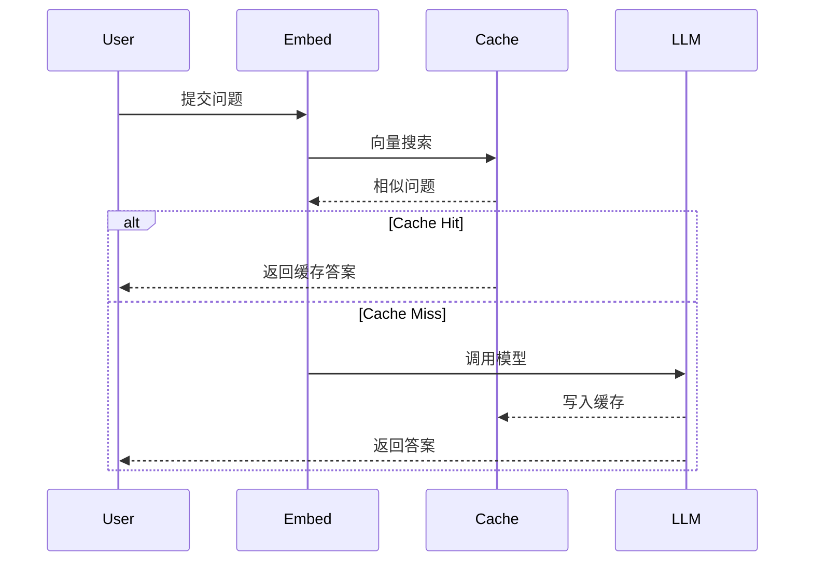
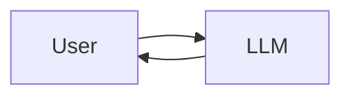
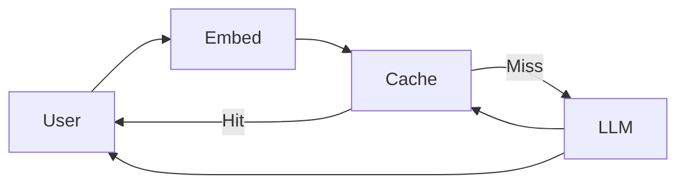
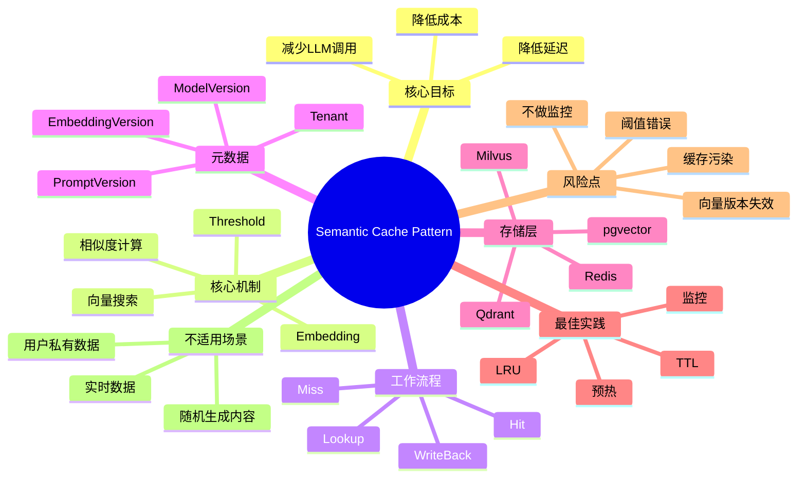

<!--
Chapter: 66
Node: KN-P-000008
Score: 92
Status: ✅ APPROVED
Attempt: 1
Round: 2
Generated: 2026-06-21 09:55:24
-->

# 第66章 Semantic Cache Pattern（语义缓存模式） [L2-L3]

## Part 1：为什么要学这个？[认知冲突先行]

你以为你已经理解了 Semantic Cache Pattern（语义缓存模式）？

很多工程师第一次做 AI 应用优化时，都会下意识套用自己熟悉的缓存经验：

```text
Key = 用户问题
Value = LLM回答
```

看起来没有任何问题。

系统上线之后，你开始观察日志。

结果发现下面这些问题全部触发了新的 LLM 调用：

| 用户输入       | 是否命中缓存 |
| ---------- | ------ |
| 怎么申请年假？    | ❌      |
| 年假怎么申请？    | ❌      |
| 请问如何申请年休假？ | ❌      |
| 休假审批流程是什么？ | ❌      |

这时候很多人的结论是：

> 用户表达太随机，所以缓存命中率低。

但真相恰恰相反。

用户并没有变。

变化的只是措辞。

真正没有理解用户意图的是缓存系统。

传统缓存理解的是：

```text
字符是否完全一致
```

用户表达的是：

```text
语义是否一致
```

对于 Redis 而言：

```text
怎么申请年假
```

与：

```text
年假怎么申请
```

完全是两个不同的 Key。

对于人类而言：

```text
它们是在问同一件事
```

这就形成了 AI 系统中特有的矛盾：

> 用户的问题在变化，但问题背后的含义并没有变化。

如果每次都重新调用 LLM：

* 成本持续上升
* 延迟持续增加
* 重复计算大量存在

而这些请求本来可以被复用。

本章要解决的核心问题：

* 为什么传统缓存在 AI 场景下效果有限？
* Semantic Cache 到底缓存了什么？
* 为什么很多 FAQ 型系统能通过语义缓存显著降低 LLM 调用次数？
* 如何设计生产级 Semantic Cache 架构？

记住这一章的核心心智模型：

> 语义缓存 = 向量相似度版的 Redis。它不关心问题是否完全一样，而关心问题是不是在表达同一个意思。

---

## Part 2：学习路径定位 [L2-L3]

Semantic Cache 并不属于 Prompt 入门知识。

它属于 AI 应用架构优化阶段的重要模式。

通常只有当系统已经具备：

* LLM 调用能力
* Embedding 能力
* 向量检索能力

之后，团队才会开始关注：

```text
成本
延迟
吞吐量
缓存复用
```

此时语义缓存才真正发挥价值。

### L0 → L4 路径定位



### 前置知识与后续知识



### 本章在系统中的位置



语义缓存位于 LLM 前面。

它不是提升答案质量的组件。

它的目标是：

```text
避免本来就不需要发生的 LLM 调用
```

这是成本优化与性能优化的重要手段。

---

## Part 3：用生活理解它

想象一家大型图书馆。

普通缓存像一个只会查书名的新管理员。

你昨天问：

> 有没有 AI 入门书？

今天问：

> 有没有人工智能基础教材？

管理员会认为这是两本不同的书。

因为关键词不一样。

语义缓存更像经验丰富的图书馆员。

他知道：

```text
AI ≈ 人工智能
ML ≈ 机器学习
```

虽然问法不同，但主题相同。

于是直接给出上次的推荐结果。

无需重新翻阅目录。

无需重新检索资料。

无需重新思考。

### 类比的边界

这里有一个容易误解的地方。

图书馆员真的理解知识。

语义缓存并不理解。

它只是把文本转换成向量后，通过数学距离判断：

```text
两个问题是否足够接近
```

所以它本质上仍然是：

```text
向量计算
```

而不是推理能力。

---

## Part 4：AI如何映射到传统概念

很多后端工程师学习 Semantic Cache 时会觉得陌生。

实际上它和传统缓存非常像。

区别只有一个：

> Key 从字符串变成了向量。

### 概念映射表

| 传统软件世界      | AI 世界                  |
| ----------- | ---------------------- |
| Redis Key   | Embedding Vector       |
| Hash Lookup | Vector Search          |
| 精确匹配        | 相似匹配                   |
| Cache Hit   | Similarity ≥ Threshold |
| Cache Miss  | Similarity < Threshold |
| Value       | LLM Response           |
| Namespace   | Prompt/User隔离          |
| TTL         | TTL                    |
| LRU         | LRU                    |

### 传统缓存

请求：

```text
GET user:1001
```

Redis执行：

```text
Hash匹配
```

只有完全一致才命中。

### 语义缓存

请求：

```text
年假怎么申请？
```

向量化后：

```text
[0.12, 0.34, 0.88 ...]
```

系统搜索历史问题：

```text
怎么申请年假？
```

计算相似度：

```text
0.96
```

超过阈值。

直接返回缓存答案。

### 本质差异

传统缓存关注：

```text
是不是同一个Key
```

语义缓存关注：

```text
是不是同一个意思
```

这是 AI 系统缓存设计与传统系统缓存设计最根本的区别。

---

## Part 5：技术本质深讲

很多人认为：

> Semantic Cache 就是把 Prompt 放进向量数据库。

这只是现象。

真正的本质是：

> 用向量相似度匹配替代字符串匹配。

整个流程包含三个核心阶段。

### 阶段1：Cache Lookup

用户发起请求：

```text
怎么申请年假？
```

系统不会立刻调用 LLM。

而是先执行：

```text
Embedding(Question)
```

生成向量：

```text
Q = [0.31, 0.84, 0.56 ...]
```

随后在缓存向量库中执行搜索：

```text
Top-K Similar Questions
```

返回结果：

```text
年假怎么申请？
Similarity = 0.95
```

---

### 阶段2：Cache Hit

当相似度达到业务设定阈值时：

```text
Similarity >= Threshold
```

直接返回缓存结果。

流程结束。

此时：

```text
不调用LLM
不消耗Token
不产生额外推理成本
```

响应时间可能从秒级下降到毫秒级。

---

### 阶段3：Cache Miss

如果没有找到足够接近的问题：

```text
Similarity < Threshold
```

系统进入正常推理流程。

```text
调用LLM
生成答案
返回结果
```

随后写回缓存。

这一步非常关键。

如果没有写回：

```text
永远无法形成缓存积累
```

缓存价值也无法增长。

---

### 完整流程图



### 生产环境真正缓存什么？

很多初学者认为缓存内容只有：

```text
Question
Answer
```

实际生产系统通常会保存更多元数据。

| 字段             | 作用       |
| -------------- | -------- |
| Question       | 原始问题     |
| Embedding      | 问题向量     |
| Answer         | 缓存答案     |
| Prompt Version | Prompt版本 |
| Model Version  | 模型版本     |
| Temperature    | 生成参数     |
| Created At     | 创建时间     |
| TTL            | 过期时间     |

缓存结构更接近：

```text
Cache Entry
├── Question
├── Embedding
├── Answer
├── PromptVersion
├── ModelVersion
├── Temperature
└── TTL
```

原因很简单。

如果系统从：

```text
gpt-4.1
```

升级到：

```text
gpt-5.x
```

历史缓存答案可能已经不符合新的输出规范。

如果继续复用：

```text
旧缓存污染新模型
```

就会导致质量问题。

---

### Similarity Threshold 为什么难调？

很多资料会直接给出：

```text
0.92
0.95
0.97
```

这样的数字。

但这不是通用答案。

阈值受到多个因素影响：

* Embedding模型
* 相似度算法
* 业务领域
* 问题分布
* 错误容忍度

例如：

| 场景    | 倾向   |
| ----- | ---- |
| FAQ问答 | 可以稍低 |
| 法律咨询  | 通常更高 |
| 医疗问答  | 通常更高 |
| 企业知识库 | 需要实测 |

真正合理的方法是：

```text
离线评测
+
人工标注
+
线上A/B实验
```

而不是照搬某个固定数字。

---

### 核心组件

#### Embedding Model

负责：

```text
文本 → 向量
```

常见模型：

* text-embedding-3-small
* text-embedding-3-large
* BGE系列
* E5系列

Embedding质量直接决定命中效果。

---

#### Vector Store

负责：

```text
近邻搜索
```

常见实现：

* FAISS
* Milvus
* Qdrant
* pgvector

---

#### Metadata Filter

负责隔离缓存空间。

例如：

```text
tenant_id
prompt_version
model_version
```

避免不同场景互相污染。

---

### 生产级架构图



理解到这里，你应该已经建立起一个完整认知：

普通缓存解决的是：

```text
文本是否完全相同
```

Semantic Cache Pattern 解决的是：

```text
两个问题是否表达同一个意思
```

这正是 AI 系统缓存设计与传统缓存设计的分水岭。

## Part 6：动手 Demo（可运行代码） [L2-L3]

理论理解之后，我们自己实现一个最小版 Semantic Cache。

这里有一个容易被忽略的问题。

很多教程用 TF-IDF 模拟 Embedding，但中文默认按空格分词。

例如：

```text
怎么申请年假
年假怎么申请
```

如果不做中文分词，TF-IDF 很可能无法体现两句话的相似性。

因此下面的 Demo 显式使用中文分词后的文本来模拟向量化过程。

目标：

* 新问题到来
* 搜索历史缓存
* 命中直接返回
* Miss 调用模拟 LLM
* 写回缓存形成闭环

### 最小可运行示例

```python
from sklearn.feature_extraction.text import TfidfVectorizer
from sklearn.metrics.pairwise import cosine_similarity

cache_questions = [
    "怎么 申请 年假"
]

cache_answers = [
    "进入OA系统，选择请假管理并提交年假申请。"
]

vectorizer = TfidfVectorizer()

def semantic_cache_lookup(query, threshold=0.6):
    corpus = cache_questions + [query]

    vectors = vectorizer.fit_transform(corpus)

    query_vector = vectors[-1]
    cache_vectors = vectors[:-1]

    similarities = cosine_similarity(
        query_vector,
        cache_vectors
    )[0]

    best_score = similarities.max()

    if best_score >= threshold:
        idx = similarities.argmax()
        return True, cache_answers[idx], best_score

    return False, None, best_score

query = "年假 怎么 申请"

hit, answer, score = semantic_cache_lookup(query)

if hit:
    print("CACHE HIT")
    print("Similarity:", round(score, 3))
    print("Answer:", answer)
else:
    llm_answer = "进入OA系统后提交年假审批申请。"

    cache_questions.append(query)
    cache_answers.append(llm_answer)

    print("CACHE MISS")
    print("Write Back To Cache")
    print("Answer:", llm_answer)
```

### 关键代码解析

#### 缓存存储

```python
cache_questions = [...]
cache_answers = [...]
```

真实系统一般存储于：

* Redis
* Qdrant
* Milvus
* pgvector

#### 中文分词

```python
"怎么 申请 年假"
```

这里使用空格模拟分词结果。

真实项目通常会：

```text
Embedding API
BGE模型
E5模型
text-embedding模型
```

而不是直接依赖 TF-IDF。

#### 相似度计算

```python
cosine_similarity(...)
```

返回：

```text
0 ~ 1
```

数值越高代表语义越接近。

#### Cache Miss 写回

```python
cache_questions.append(query)
cache_answers.append(llm_answer)
```

这一步形成缓存闭环。

没有写回，就无法积累缓存价值。

### 运行后你会看到什么

查询：

```text
年假 怎么 申请
```

可能输出：

```text
CACHE HIT
Similarity: 1.0
Answer: 进入OA系统，选择请假管理并提交年假申请。
```

如果查询：

```text
公司 报销 流程
```

则可能输出：

```text
CACHE MISS
Write Back To Cache
Answer: 进入财务系统提交报销申请。
```

这就是 Semantic Cache 最小实现的完整闭环。

---

## Part 7：真实项目场景 [L2-L3]

### 场景：企业知识库问答系统

某大型企业拥有：

* 5000+员工
* 数百份制度文档
* 每天数万次内部问答请求

员工经常提问：

```text
怎么申请年假？
年假审批流程是什么？
请假在哪里提交？
如何申请休假？
```

虽然表述不同。

但本质是同一个 FAQ。

### 初始架构



所有问题都直接调用模型。

监控结果：

| 指标    | 数值   |
| ----- | ---- |
| 日请求量  | 20万  |
| LLM调用 | 20万  |
| 平均延迟  | 2.4秒 |
| 成本    | 持续增长 |

分析日志后发现：

```text
大量问题重复出现
```

### 引入语义缓存



### 技术选型

| 组件          | 方案         |
| ----------- | ---------- |
| Embedding   | BGE-M3     |
| Cache Store | Qdrant     |
| Metadata    | Redis      |
| TTL         | 7天         |
| Eviction    | LRU        |
| Monitoring  | Prometheus |

### Cache Entry设计

```text
Question
Embedding
Answer
PromptVersion
ModelVersion
Temperature
TTL
TenantId
```

### 上线结果

需要特别说明：

下面的数据来自：

```text
高重复FAQ企业知识库场景
```

并不代表所有 AI 系统都能获得相同收益。

对于开放问答系统：

```text
命中率可能远低于此
```

结果如下：

| 指标     | 优化前  | 优化后   |
| ------ | ---- | ----- |
| 命中率    | 0%   | 47%   |
| 平均延迟   | 2.4s | 0.9s  |
| LLM调用量 | 20万  | 10.6万 |
| 推理成本   | 100% | 约55%  |

这也是为什么企业 FAQ 场景特别适合 Semantic Cache。

---

## Part 8：这里容易踩坑 [L2-L3]

### 坑1：全局单一命名空间

错误代码：

```python
cache_key = embedding(question)
```

问题：

```text
客服助手
销售助手
律师助手
```

可能命中同一个缓存答案。

正确做法：

```python
cache_key = {
    "tenant": tenant_id,
    "prompt": prompt_hash,
    "vector": embedding(question)
}
```

原因：

```text
同一个问题
不同角色
答案可能完全不同
```

---

### 坑2：盲目套用固定阈值

错误思路：

```python
threshold = 0.95
```

然后认为所有系统都适合。

现实情况：

* 不同Embedding模型不同
* 不同距离算法不同
* 不同行业不同

正确做法：

```text
离线评测
人工标注
线上AB测试
```

共同确定阈值。

原因：

```text
不存在万能阈值
```

---

### 坑3：Embedding模型升级

这是很多团队上线半年后才遇到的问题。

旧缓存：

```text
Embedding V1
```

新系统：

```text
Embedding V2
```

此时缓存中的历史向量已经不再处于同一个向量空间。

错误做法：

```python
继续使用旧向量
```

可能导致：

```text
相似度异常
命中率下降
错误命中增加
```

正确做法：

```python
metadata = {
    "embedding_version": "v2"
}
```

并在升级后：

* 重建缓存
* 重新向量化
* 按版本隔离

---

### 坑4：从不监控命中率

错误做法：

```python
cache.enable()
```

上线后再也不看。

正确做法：

```python
metrics.hit_rate()
metrics.miss_rate()
metrics.avg_similarity()
```

持续监控：

* Hit Rate
* Miss Rate
* Top Queries
* 平均相似度

否则缓存失效都没人知道。

---

## Part 9：面试怎么答 [L2-L3]

### L1：语义缓存与传统HTTP缓存的本质区别是什么？

回答框架：

核心一句话：

```text
传统缓存是精确匹配
语义缓存是相似匹配
```

展开：

* HTTP Cache基于Key
* Semantic Cache基于向量
* HTTP要求完全一致
* Semantic Cache允许表达变化

举例：

```text
怎么申请年假
年假怎么申请
```

HTTP：

```text
Miss
```

Semantic Cache：

```text
Hit
```

---

### L2：相似度阈值应该如何调优？

回答框架：

阈值本质是：

```text
正确率与命中率的平衡
```

阈值过低：

* 命中率提高
* 错误答案增加

阈值过高：

* 正确率提高
* 命中率下降

重点强调：

```text
没有通用最佳阈值
```

必须结合：

* Embedding模型
* 数据集
* 业务风险

进行评估。

---

### L3：如何避免缓存污染？

回答框架：

核心关键词：

* Namespace
* Tenant
* Prompt Hash
* Model Version
* Metadata Filter

设计示例：

```text
tenant_id
+
prompt_hash
+
model_version
+
vector
```

解释：

避免：

* 多租户污染
* Prompt污染
* 模型升级污染

这是生产级系统的重要设计点。

---

## Part 10：考点速查 [L2-L3]

### **语义缓存不是字符串缓存**

核心依据是向量相似度，而不是字符完全一致。

### **Cache Hit依赖Similarity Threshold**

命中条件是相似度达到业务要求。

### **阈值没有万能答案**

最佳阈值依赖模型、数据和场景。

### **缓存条目必须带元数据**

Prompt版本、模型版本、Embedding版本都很重要。

### **实时数据通常不适合缓存**

答案变化太快，缓存风险高于收益。

---

## Part 11：必背金句 [L2-L3]

[语义优先]：缓存判断的是意思是否相同，而不是文本是否相同。

[正确率优先]：一次错误命中，往往比一次额外LLM调用代价更高。

[隔离优先]：Prompt、租户和模型版本必须拥有独立缓存空间。

[监控优先]：看不到Hit Rate的缓存，等于不存在。

[版本优先]：Embedding模型升级后，要考虑历史向量失效问题。

---

## Part 12：快速参考表 [L2-L3]

| 概念                | 作用     | 示例值               |
| ----------------- | ------ | ----------------- |
| Embedding         | 文本向量化  | 1536维向量           |
| Similarity        | 相似度计算  | Cosine Similarity |
| Threshold         | 命中阈值   | 需业务验证             |
| Cache Hit         | 直接返回缓存 | Similarity=0.96   |
| Cache Miss        | 调用LLM  | Similarity=0.72   |
| TTL               | 过期控制   | 7天                |
| Namespace         | 隔离空间   | tenant+prompt     |
| Model Version     | 模型隔离   | gpt-5.x           |
| Embedding Version | 向量版本   | bge-v1            |
| LRU               | 淘汰策略   | 最近最少使用            |
| Hit Rate          | 命中率监控  | FAQ场景30%-60%      |
| Warmup            | 冷启动预热  | Top100 FAQ        |

---

## Part 13：思维导图 [L2-L3]



---

## Part 14：本章小结 [L2-L3]

Semantic Cache Pattern 的本质不是缓存文本，而是缓存语义。

通过 Embedding、向量检索和相似度判断，系统能够识别“问法不同但含义相同”的问题，从而避免大量重复的 LLM 调用。

从成长路径来看：

```text
L0：理解缓存思想

→ L1：理解Embedding与向量相似度

→ L2：实现Semantic Cache闭环

→ L3：设计生产级缓存架构与治理体系
```

当你能够独立完成：

```text
阈值调优
命名空间设计
缓存监控
版本治理
```

就已经具备生产环境落地 Semantic Cache 的能力。

---

## Part 15：下一章预告 [L2-L3]

这一章解决了一个关键问题：

```text
如何避免重复调用LLM
```

但新的问题出现了。

即使缓存没有命中：

```text
系统仍然需要调用LLM
```

而模型本身并不知道：

```text
企业内部制度
最新业务规则
私有知识库内容
```

此时单纯依赖模型训练数据已经不够。

系统需要一种机制：

```text
回答之前
先去知识库找资料
再组织答案
```

这正是下一章要解决的问题：

```text
RAG（Retrieval-Augmented Generation）
```

下一章你将看到：

* 为什么 RAG 被称为开卷考试模式
* 检索、增强、生成三阶段如何协作
* 向量数据库在 RAG 中承担什么职责
* Semantic Cache 与 RAG 如何组合形成生产级 AI 架构

当 Semantic Cache 负责：

```text
减少重复计算
```

而 RAG 负责：

```text
补充外部知识
```

一个真正可规模化、低成本、高准确率的 AI 应用架构才算完整建立。