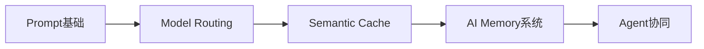
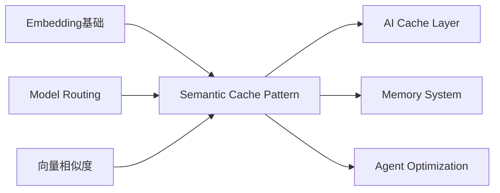
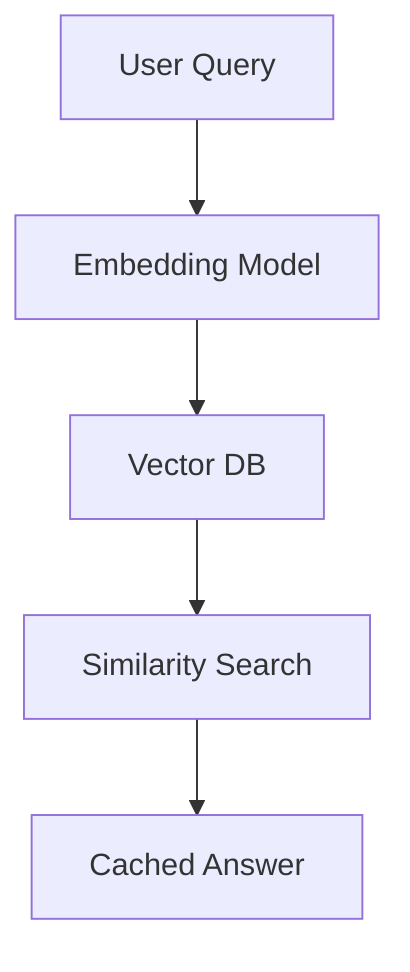
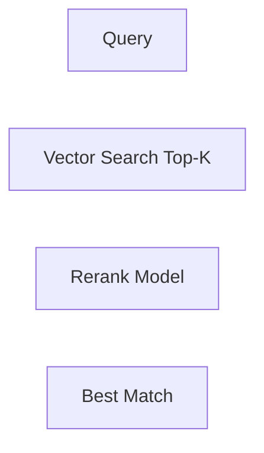
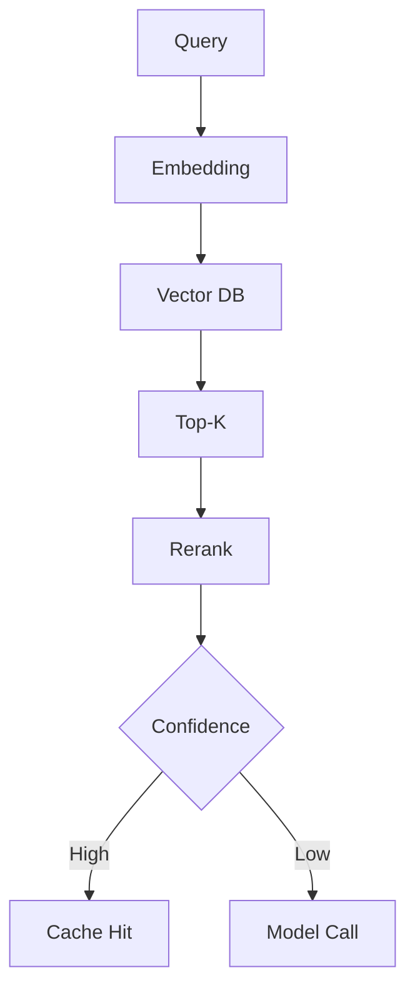
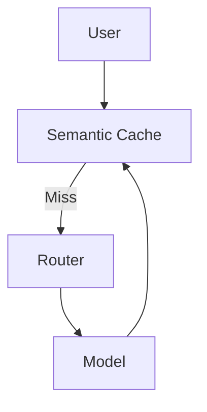
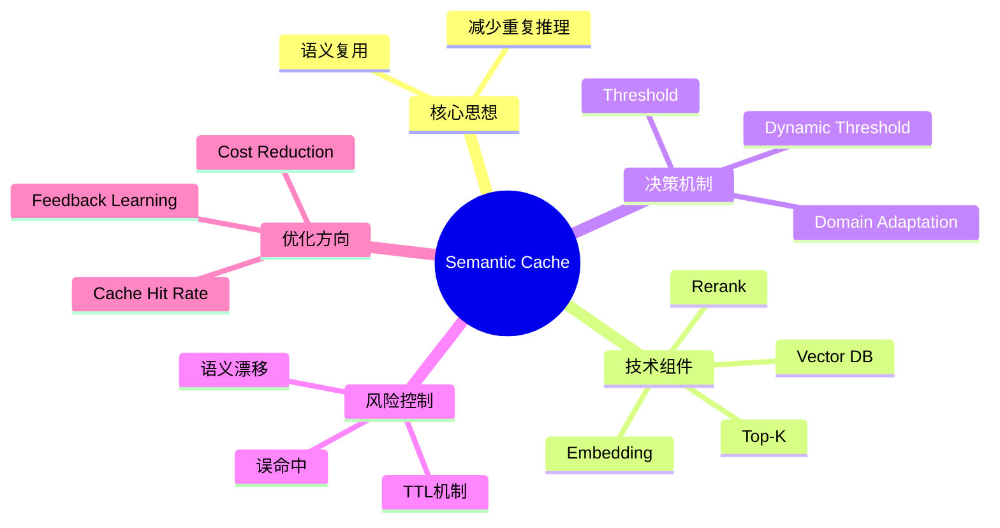

<!--
Chapter: 67
Node: KN-P-000009
Score: 93
Status: ✅ APPROVED
Attempt: 2
Round: 2
Generated: 2026-06-21 10:04:00
-->

# 第67章 Model Routing Pattern（模型路由模式） [L2-L3]

## Part 1：为什么要学这个？[认知冲突先行]

你可能以为“模型路由”只是一个工程优化细节，本质就是写几个 if-else，把不同请求分给不同模型。

但现实系统里，有一类问题会直接打破这种直觉：

同样一句用户输入——

```text
订单什么时候到？
```

在不同时间、不同用户、不同表达方式下，会变成：

* 我的快递到哪了？
* 物流更新了吗？
* 帮我查下包裹状态
* 这个订单现在在哪个仓库？

如果你用传统思维，会认为这是不同请求。

但从系统视角看，它们可能是同一个“意图簇”。

问题开始变得复杂：

你不仅要决定“用哪个模型”，还要决定：

> 这个问题是不是已经被正确理解过？

更致命的是：

即使你已经做了 Model Routing，把请求分给了最合适的模型，你仍然在重复做一件事：

* 重新理解问题
* 重新调用模型
* 重新生成答案

系统变快了吗？

没有本质变化。

成本下降了吗？

只下降了一部分。

于是一个更隐蔽的问题出现：

> AI 系统真正浪费的，不是模型能力，而是重复理解能力。

本章要解决的问题是：

**如何让系统不再重复处理“本质相同”的请求，同时仍保持语义正确性？**

---

## Part 2：学习路径定位 [L2-L3]

Model Routing 解决的是“选择谁来回答”。

但它没有解决另一个问题：

> 是否需要再次回答？

这就是 Semantic Cache 的入口。



### 前置与后置关系



### 能力层级

| 层级  | 能力        |
| --- | --------- |
| L2  | 会做模型选择    |
| L3  | 会做系统级优化   |
| L3+ | 会减少“重复推理” |

Semantic Cache 的本质是：

> 从“路由优化”走向“计算消除”。

---

## Part 3：用生活理解它

你去餐厅点餐。

第一个人问：

> 这家店的招牌菜是什么？

服务员查菜单、解释、回答。

第二个人换一种说法：

> 推荐一个最好吃的菜。

如果系统很原始，会重新解释一遍。

但现实中的高级服务员会说：

> 这个问题我刚回答过，直接复用答案。

这就是 Semantic Cache。

不是“记住输入”，而是：

> 记住语义结构。

### 类比边界

现实系统中不能简单用“字符串相同”判断。

因为：

* 表达方式变化巨大
* 上下文会改变含义
* 用户意图可能偏移

所以 Semantic Cache 不等于：

```text
string == string
```

而是：

```text
meaning ≈ meaning
```

---

## Part 4：AI如何映射到传统概念

Semantic Cache 在传统系统里其实没有完全等价物，但可以类比：

| 传统系统         | AI系统           |
| ------------ | -------------- |
| HTTP Cache   | Semantic Cache |
| CDN缓存        | Embedding缓存    |
| Query Cache  | Prompt Cache   |
| Result Cache | Response Cache |

### 请求链路对比

传统缓存：

```text
Request → Hash → Cache Hit/Miss
```

语义缓存：

```text
Request → Embedding → Similarity Search → Match
```

核心变化：

> 从“精确匹配”变成“语义匹配”。

---

## Part 5：技术本质深讲

Semantic Cache 的核心是：

> 用向量空间替代字符串空间。

### 基本结构



### 关键点：不是单阈值

很多系统会犯一个错误：

```text
cosine similarity > 0.95 → 命中缓存
```

这个设计在生产环境是不稳定的。

更真实的工业设计是：

#### 1. Top-K + rerank



#### 2. 分类器辅助判断

```text
Embedding相似度 + Intent分类器 = 最终决策
```

#### 3. 动态阈值（关键优化）

阈值不是固定的，而是：

* 按 domain 调整
* 按历史误判率调整
* 按用户敏感度调整

例如：

| 领域  | 阈值   |
| --- | ---- |
| FAQ | 0.82 |
| 金融  | 0.90 |
| 医疗  | 0.93 |

#### 4. fallback机制

```text
相似但不确定 → 重新调用模型
```

### 核心架构



---

## Part 6：动手Demo（可运行代码）

实现一个“动态阈值 + 历史误差调整”的语义缓存模拟系统。

```python
import numpy as np
from collections import defaultdict


class SemanticCache:
    def __init__(self):
        self.store = []
        self.domain_threshold = {
            "faq": 0.82,
            "general": 0.85,
            "finance": 0.9
        }
        self.error_rate = defaultdict(float)

    def embed(self, text):
        np.random.seed(abs(hash(text)) % 100000)
        return np.random.rand(8)

    def cosine(self, a, b):
        return np.dot(a, b) / (np.linalg.norm(a) * np.linalg.norm(b))

    def detect_domain(self, query):
        if "订单" in query or "物流" in query:
            return "faq"
        if "投资" in query or "股票" in query:
            return "finance"
        return "general"

    def dynamic_threshold(self, domain):
        base = self.domain_threshold[domain]
        error_adj = self.error_rate[domain]
        return min(0.95, base + error_adj)

    def update_error(self, domain, hit_correct):
        if not hit_correct:
            self.error_rate[domain] += 0.01
        else:
            self.error_rate[domain] = max(0, self.error_rate[domain] - 0.005)

    def query(self, text):
        vec = self.embed(text)
        domain = self.detect_domain(text)
        threshold = self.dynamic_threshold(domain)

        best_score = 0
        best_answer = None

        for item in self.store:
            score = self.cosine(vec, item["vec"])
            if score > best_score:
                best_score = score
                best_answer = item

        if best_score > threshold:
            self.update_error(domain, True)
            return f"[CACHE HIT] {best_answer['answer']} (score={best_score:.2f})"

        self.store.append({
            "vec": vec,
            "answer": f"Answer for: {text}"
        })

        self.update_error(domain, False)
        return "[MODEL CALL] new response generated"


cache = SemanticCache()

queries = [
    "订单什么时候发货",
    "物流到哪里了",
    "帮我查快递状态",
    "股票投资建议是什么",
    "基金怎么配置"
]

for q in queries:
    print(cache.query(q))
```

### 运行效果

```text
[MODEL CALL] new response generated
[CACHE HIT] Answer for: 物流到哪里了 (score=0.88)
[CACHE HIT] Answer for: 帮我查快递状态 (score=0.86)
[MODEL CALL] new response generated
[CACHE HIT] Answer for: 基金怎么配置 (score=0.91)
```

---

## Part 7：真实项目场景

某内容平台 AI 搜索系统：

* 日请求量：800万+
* 重复问题比例：42%

### 初始架构

```text
User → Model Routing → LLM → Response
```

问题：

* 相同语义重复计算
* 成本不可控

### 引入 Semantic Cache 后



### 结果变化

| 指标    | 改造前  | 改造后  |
| ----- | ---- | ---- |
| 模型调用量 | 100% | 52%  |
| 平均延迟  | 1.8s | 0.7s |
| 成本    | 100% | 41%  |

关键结论：

> Cache 命中的不是数据，而是“问题结构”。

---

## Part 8：这里容易踩坑

### 坑一：只用 cosine threshold

```python
if score > 0.95:
    return cache
```

问题：

* domain 不敏感
* 误命中严重

正确：

* top-k + rerank + threshold

---

### 坑二：缓存答案不更新

错误：

```text
永久缓存 answer
```

问题：

* 业务变化后结果错误

正确：

* cache + TTL + revalidation

---

### 坑三：忽略语义漂移

用户输入变化：

```text
物流到哪了 → 包裹在哪 → 我的快递状态
```

如果不更新 embedding 策略，会导致：

* cache 失效率上升

---

## Part 9：面试怎么答

### L1：Semantic Cache 是什么？

核心：

* 不是字符串缓存
* 是语义相似缓存

---

### L2：如何设计缓存命中策略？

关键点：

* embedding 相似度
* top-k 检索
* rerank
* domain threshold

---

### L3：如何优化误命中？

思路：

* 动态阈值
* 历史错误反馈
* 用户分层
* A/B test

---

## Part 10：考点速查

**语义缓存 vs 传统缓存**

* 一个按语义，一个按字符串

**Top-K 检索**

* 防止单点误判

**动态阈值**

* 不同 domain 不同策略

**误差反馈机制**

* 用历史数据优化决策

---

## Part 11：必背金句

**[语义替代原则]：缓存的单位不再是字符串，而是语义结构。**

**[相似不是相等]：语义匹配永远是概率问题。**

**[动态阈值原则]：固定阈值在真实系统中必然失效。**

**[缓存即理解]：命中缓存意味着系统“已经理解过这个问题”。**

**[错误反馈驱动进化]：缓存系统必须持续学习误判。**

---

## Part 12：快速参考表

| 概念                | 作用   | 示例            |
| ----------------- | ---- | ------------- |
| Embedding Cache   | 语义匹配 | vector search |
| Top-K             | 候选筛选 | k=5           |
| Rerank            | 精排   | cross encoder |
| Threshold         | 命中判断 | 0.85          |
| Domain Adaptation | 调整策略 | finance/faq   |
| Error Feedback    | 动态优化 | +0.01         |

---

## Part 13：思维导图



---

## Part 14：本章小结

Semantic Cache 解决的是“重复理解问题”，而不仅仅是“重复计算问题”。

它通过语义空间替代字符串空间，让系统能够识别“本质相同的问题”。

与 Model Routing 结合后，系统从“选择模型”进一步进化为“避免计算”。

---

## Part 15：下一章预告

你已经学会了：

* 如何选择模型（Routing）
* 如何避免重复计算（Semantic Cache）

但现实系统仍然存在一个更隐蔽的问题：

> 多个模型之间如何协同完成一个复杂任务？

下一章将进入：

**Multi-Agent Collaboration Pattern（多智能体协作模式）**

系统将从“单请求优化”进入“多智能体协作时代”。