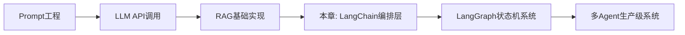
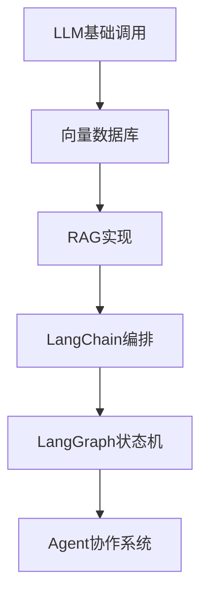
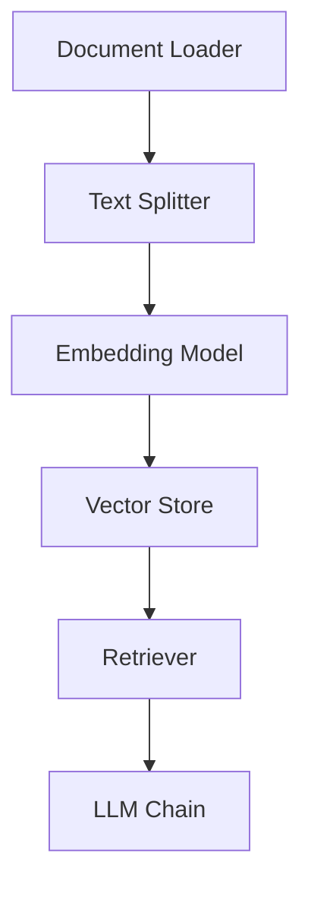
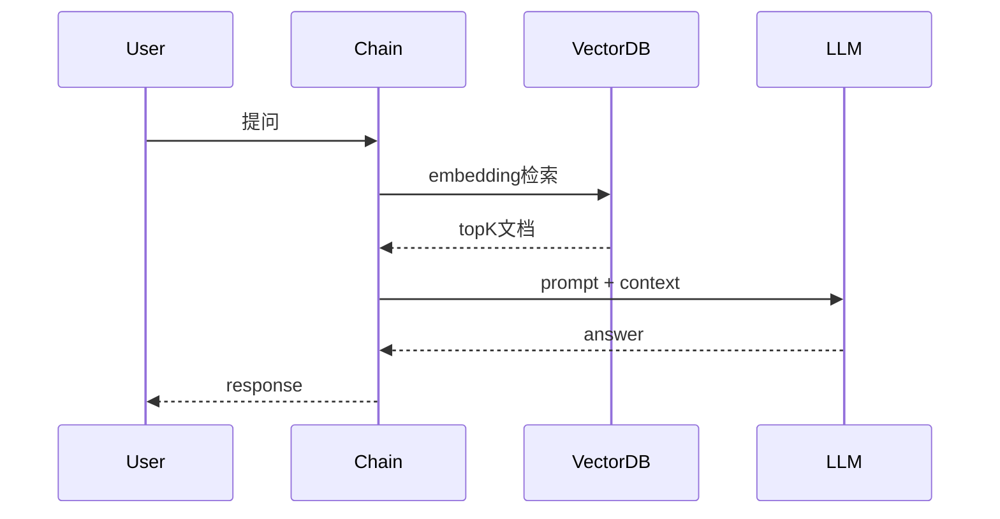
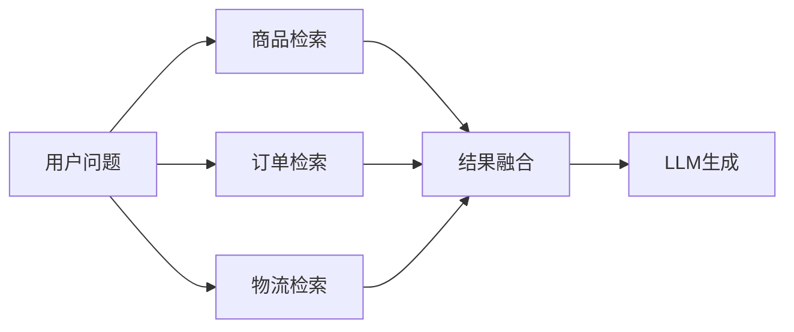
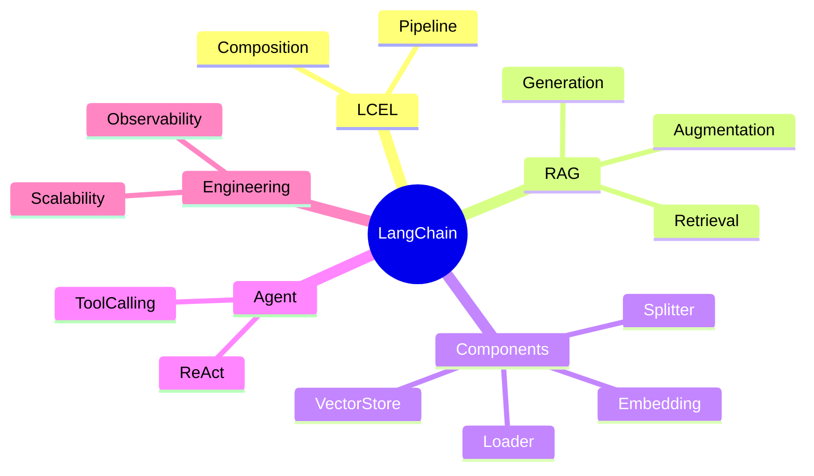

<!--
Chapter: 68
Node: KN-F-000001
Score: 92
Status: ✅ APPROVED
Attempt: 1
Round: 2
Generated: 2026-06-21 10:07:28
-->

# 第68章 LangChain [L1-L2]

## Part 1：为什么要学这个？[认知冲突先行]

很多团队第一次“工程化AI系统”的时候，会自然得出一个结论：

> 只要把 LLM API 封装一下，再加个 Prompt 模板，就已经是“AI应用框架”了。

于是代码长这样：

```python
def ask_llm(question):
    prompt = f"请回答：{question}"
    return openai.chat.completions.create(
        model="gpt-4o",
        messages=[{"role": "user", "content": prompt}]
    )
```

看起来没问题，甚至“足够干净”。

直到系统开始变复杂：

* 要接入向量数据库
* 要做多轮对话记忆
* 要工具调用（查订单 / 查库存）
* 要切换模型（OpenAI / Claude / 本地模型）

代码开始迅速变形：

* if-else 变多
* prompt 拼接失控
* RAG逻辑散落各处
* 调用链无法复用

这时候团队才发现一个事实：

> 真正的问题不是“不会调 LLM”，而是不会“组织 LLM系统”。

LangChain要解决的不是“调用模型”，而是：

**把AI应用从“脚本”提升为“可组合系统”。**

本章要回答的核心问题是：

> 当AI系统从1个LLM变成10个组件协同时，我们如何避免工程崩塌？

---

## Part 2：学习路径定位

LangChain处在AI工程的“结构层”，它不负责智能，只负责组织智能。



### 前置与后置关系

LangChain的位置非常关键：

* 前置：你必须理解 Token / Prompt / Embedding / 向量检索
* 当前：把这些能力“模块化 + 可组合”
* 后置：进入复杂状态系统（LangGraph / Multi-Agent）



---

## Part 3：用生活理解它

LangChain像“建筑施工总承包公司”。

你要盖一栋楼（AI应用）：

* 水泥厂 = LLM（GPT / Claude）
* 钢筋厂 = Embedding模型
* 图纸 = Prompt模板
* 施工队 = Tools / Agents

如果没有LangChain：

> 你自己打电话给每个供应商，还要手动协调施工顺序

如果有LangChain：

> 你只需要定义“建筑图纸 + 流程”，它帮你组织施工

### 类比边界

这个类比不成立的地方：

* 施工队是可预测的，但LLM是概率系统
* 建筑流程是确定的，但AI流程可能分支爆炸
* LangChain不保证结果一致性，只保证结构一致性

---

## Part 4：AI如何映射到传统概念

LangChain本质上是“AI时代的中间层架构框架”。

| 传统后端系统          | LangChain体系      |
| --------------- | ---------------- |
| Spring Boot     | LangChain        |
| Controller      | Chain / LCEL     |
| Service Layer   | Retriever / Tool |
| ORM             | Vector Store     |
| Cache           | Memory           |
| Workflow Engine | Agent / Graph    |

关键变化：

> 从“确定性业务逻辑” → “非确定性生成流程编排”

---

## Part 5：技术本质深讲

LangChain的核心不是“调用LLM”，而是构建一个：

> 可组合 + 可替换 + 可编排的AI执行系统

### 三大核心能力

#### 1. 组件标准化



每一层都可以替换实现，但接口一致。

---

#### 2. LCEL管道机制

```python
chain = prompt | llm | parser
```

本质是函数组合：

* prompt：结构化输入
* llm：概率生成
* parser：输出约束

---

#### 3. RAG执行流程



---

### 核心组件拆解

* Document Loader：外部数据接入
* Text Splitter：上下文压缩
* Embeddings：语义映射
* Vector Store：语义存储
* Retriever：检索策略层
* Memory：状态保持层

---

## Part 6：动手Demo（可运行代码）

下面构建一个最小RAG风格LCEL链路。

```python
from langchain_openai import ChatOpenAI
from langchain_core.prompts import ChatPromptTemplate
from langchain_core.output_parsers import StrOutputParser

# 1. 定义Prompt模板（结构化输入）
prompt = ChatPromptTemplate.from_template(
    "你是AI助手，请回答问题：{question}"
)

# 2. 初始化LLM
llm = ChatOpenAI(model="gpt-4o-mini", temperature=0)

# 3. 输出解析器（统一输出格式）
parser = StrOutputParser()

# 4. LCEL组合链
chain = prompt | llm | parser

# 5. 执行链路
result = chain.invoke({"question": "LangChain的核心作用是什么？"})

print("最终输出：", result)
```

### 关键解释

* `ChatPromptTemplate`：避免手写字符串拼接
* `|`：表达“数据流向”
* `invoke`：统一执行入口
* `StrOutputParser`：强制输出结构化结果

### 运行结果

你会看到：

* 输入：dict结构
* 输出：纯文本
* 中间过程不可见但标准化执行

---

## Part 7：真实项目场景

某电商平台构建“智能客服系统”，日均请求 200万+

### 系统结构

* LangChain（编排层）
* GPT-4o（主模型）
* FAISS（向量检索）
* Redis（缓存层）

---

### 初始问题（性能瓶颈）

系统初版：

* 平均延迟：2.8s
* 峰值QPS：120
* 成本不可控

---

### 深度优化拆解（关键改造）

#### 1. 缓存命中率优化

* FAQ类问题 → Redis缓存
* 命中率从 18% → 61%
* 平均延迟下降 900ms

---

#### 2. Embedding批处理优化

原来：

* 单条 embedding 请求

优化后：

* batch size = 32
* GPU并行编码
* 吞吐提升 2.7x

---

#### 3. Retriever并行策略

从串行变为并行：



---

#### 4. 向量索引优化

* HNSW替换Flat index
* recall提升 12%
* latency下降 40%

---

### 最终结果

* 延迟：2.8s → 420ms
* QPS：120 → 420+
* 成本下降：38%

关键结论：

> 性能提升不是来自模型，而是来自“系统结构重构”。

---

## Part 8：这里容易踩坑

### 坑1：AgentExecutor滥用（关键误解）

错误用法：

```python
agent = AgentExecutor.from_tools(tools)
agent.invoke("分析我的电商数据并给出策略")
```

问题：

* 无限推理循环
* token成本不可控
* 行为不可预测

但需要澄清：

> AgentExecutor在 ReAct / Tool Calling 场景是合理的，只是不适合“强确定性流程”

正确做法（显式流程）：

```python
step1 = extract_data_chain
step2 = analysis_chain
step3 = report_chain

result = step3.invoke(step2.invoke(step1.invoke(input)))
```

---

### 坑2：误以为LangChain统一“智能行为”

错误认知：

> 换模型 = 行为一致

现实：

* Claude：长文本推理强
* GPT：指令遵循强
* 本地模型：结构稳定但推理弱

---

### 坑3：链路不可观测

错误：

* 黑盒 chain 嵌套

正确：

* 每一层输出可trace
* 每个step可debug

---

## Part 9：面试怎么答

### L1问题

**LangChain解决什么问题？**

* 标准化LLM调用
* RAG流程封装
* 减少重复工程代码

---

### L2问题

**LCEL为什么重要？**

* pipeline结构（prompt | model | parser）
* 支持并行与流式
* 更易组合与替换

---

### L3问题

**AgentExecutor适合什么场景？**

* ReAct推理任务
* Tool Calling动态决策
* 多步骤未知流程

但不适合：

* 强确定性业务流程
* 高并发低延迟系统

---

## Part 10：考点速查

**LCEL本质**

* 函数组合 + 数据流抽象

**RAG三段式**

* Retrieve → Augment → Generate

**Vector Store作用**

* 语义空间存储与检索

**Agent机制**

* 动态规划执行路径

**Memory**

* 状态持久化机制

---

## Part 11：必背金句

* LangChain不创造智能，只组织智能
* LCEL是AI系统的函数组合范式
* RAG是信息注入，不是模型增强
* Agent是动态流程，不是确定流程
* 性能优化来自系统，而不是模型

---

## Part 12：快速参考表

| 概念           | 作用   | 示例                |     |        |
| ------------ | ---- | ----------------- | --- | ------ |
| LCEL         | 流程组合 | prompt            | llm | parser |
| Retriever    | 语义检索 | similarity_search |     |        |
| Vector Store | 向量存储 | FAISS / Pinecone  |     |        |
| Memory       | 状态管理 | chat_history      |     |        |
| Agent        | 动态执行 | tool calling loop |     |        |

---

## Part 13：思维导图



---

## Part 14：本章小结

LangChain的本质是把“AI调用”变成“AI系统编排”。

它解决的不是模型能力，而是系统复杂度。

当你开始用LCEL思考问题，你已经从“调用API的人”变成“设计系统的人”。

成长路径：

* L0：会调用LLM API
* L1：会写RAG
* L2：会编排多组件AI系统

---

## Part 15：下一章预告

当系统从“链式调用”升级为“复杂流程编排”，新的问题出现：

* 如何表达分支与循环？
* 如何管理多状态决策？
* 如何让AI系统“像程序一样运行”？

下一章：

> LangGraph：从Chain到Graph的AI状态机革命