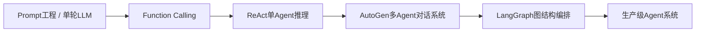
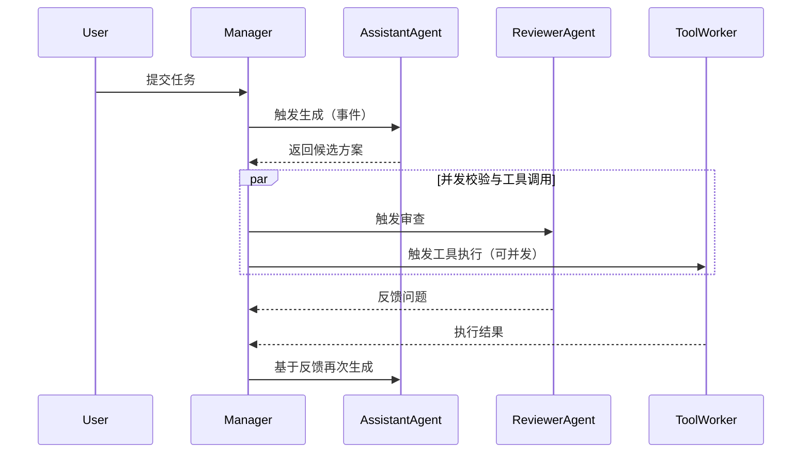
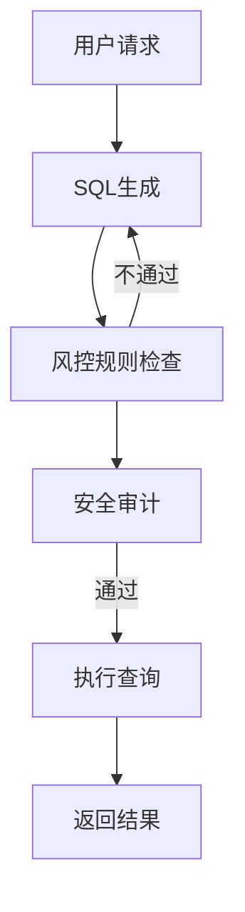
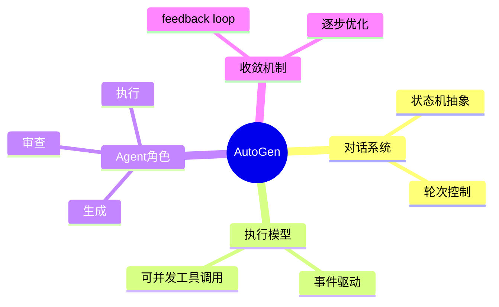

<!--
Chapter: 70
Node: KN-F-000003
Score: 90
Status: ✅ APPROVED
Attempt: 1
Round: 2
Generated: 2026-06-21 10:37:35
-->

# 第70章 AutoGen [L2-L3]

## Part 1：为什么要学这个？[认知冲突先行]

AutoGen

很多人第一次接触 AutoGen，会自然带着一个“现代分布式系统直觉”：

> 多 Agent = 多线程并行 = 各自独立计算 = 最后汇总结果

但现实运行结果往往让人困惑：系统并没有同时“开工”，反而像一个讨论群——你一句我一句，甚至还会互相打断、纠错、回滚。

更反直觉的是：即使你在代码里配置了多个 Agent，真正发生的并不是“并行思考”，而是**围绕共享上下文的轮次演化**。看起来像聊天，实际上是在做收敛计算。

但这里存在一个关键误解：

> “轮流发言” ≠ “单线程执行”

AutoGen 的表层行为确实像轮询，但底层实现早已不是简单的串行模型，而是一个**事件驱动 + 异步调度 + 可并发工具调用的多智能体系统**。

于是问题变成了：

> 为什么一个看似“聊天系统”的框架，本质上却能支撑复杂任务分解、并发工具执行与收敛优化？

这一章要解决的，就是这个认知偏差：
AutoGen 不是聊天工具，也不是并行计算器，而是一个**以对话为接口的状态机计算框架**。

---

## Part 2：学习路径定位

AutoGen 位于“单 Agent → 图编排系统”的过渡层，是多 Agent 协作的早期抽象形态。



前置知识：

* LLM function calling
* ReAct 推理模式
* 基础 Python 执行与API调用

后置能力：

* 多 Agent 系统设计
* 复杂任务分解
* 可控工作流编排（LangGraph）

---

## Part 3：用生活理解它

把 AutoGen 想象成一个“产品评审会”。

产品经理、工程师、测试、安全审计坐在一起：

* 产品经理提出需求
* 工程师实现方案
* 测试提出漏洞
* 安全人员质疑风险

但关键点不是“大家同时工作”，而是：

> 每一轮讨论都会改变下一轮的方向

类比边界：

* ❌ 不是流水线（没有固定顺序生产）
* ❌ 不是并行计算（不是同时解题）
* ❌ 不是群聊闲聊（有明确目标函数）
* ✅ 是“带反馈收敛的决策系统”

---

## Part 4：AI如何映射到传统概念

| AI概念             | 传统系统                  | 本质   |
| ---------------- | --------------------- | ---- |
| AssistantAgent   | 服务模块                  | 生成逻辑 |
| ReviewerAgent    | 规则引擎                  | 校验约束 |
| UserProxyAgent   | 执行器                   | 真实运行 |
| GroupChatManager | 事件调度器                 | 控制流  |
| 多轮对话             | retry + feedback loop | 收敛优化 |

关键差异：

传统系统是“控制流写死”，
AutoGen 是“控制流由内容动态生成”。

---

## Part 5：技术本质深讲

AutoGen 的本质不能再简单说成：

> “单线程轮流执行 + 状态共享上下文”

这个说法在教学简化中成立，但在工程实现层面是不完整的。

更准确的理解是：

> AutoGen = 对话驱动的状态机抽象 + 事件调度执行模型（概念上轮流，执行上可异步并发）

它的执行结构通常包含三层：

1. 对话状态层（Context State）
2. 调度控制层（GroupChatManager）
3. 执行与工具层（Agents + Tools）



关键点：

* “轮次”是逻辑概念，不等于线程模型
* 工具调用可以并发执行（IO/DB/HTTP）
* Manager 是事件调度器，而不是简单循环器
* 状态变化由“对话内容 + 工具结果”共同驱动

---

## Part 6：动手Demo（可运行代码）

这一版我们修正一个关键问题：
**不再每轮重新生成 SQL，而是引入“反馈驱动的渐进修正”机制。**

```python
class AssistantAgent:
    def generate_sql(self, question, previous_sql="", feedback=""):
        # 基于上一轮结果进行修正，而不是重新生成
        if "missing join" in feedback.lower():
            return previous_sql + " JOIN users ON orders.user_id = users.id"
        if previous_sql:
            return previous_sql  # 保持已有改进
        return "SELECT * FROM orders"

class ReviewerAgent:
    def review(self, sql):
        if "JOIN" not in sql:
            return "missing join condition"
        if "users.id" not in sql:
            return "missing join key"
        return "OK"

class UserProxyAgent:
    def execute(self, sql):
        return f"executed: {sql}"

class GroupChatManager:
    def __init__(self):
        self.assistant = AssistantAgent()
        self.reviewer = ReviewerAgent()
        self.user = UserProxyAgent()

    def run(self, question, max_rounds=3):
        sql = ""
        feedback = ""

        for i in range(max_rounds):
            sql = self.assistant.generate_sql(question, sql, feedback)
            feedback = self.reviewer.review(sql)

            print(f"[Round {i}] SQL={sql} | feedback={feedback}")

            if feedback == "OK":
                return sql, self.user.execute(sql)

        return sql, "failed"

manager = GroupChatManager()
result = manager.run("get user orders")
print(result)
```

运行特点：

* SQL 在每一轮都会“继承上一轮结果”
* Reviewer 的反馈直接影响下一轮生成
* 系统呈现“逐步修复”而不是“重复生成”

你会看到类似过程：

```python
[Round 0] SELECT * FROM orders | missing join condition
[Round 1] SELECT * FROM orders JOIN users ON ... | OK
```

核心变化：

> 从“重新生成” → “基于反馈的轨迹修正”

---

## Part 7：真实项目场景

在金融风控系统中，AutoGen 常用于：

> 多角色规则推理 + SQL生成 + 安全执行闭环

### 场景

需要生成复杂反欺诈 SQL：

* 用户行为分析
* 设备指纹关联
* 多表 join 风控规则

### 架构

* AssistantAgent：生成 SQL
* ReviewerAgent：规则校验（风控逻辑）
* RiskAgent：安全策略检查
* UserProxyAgent：执行查询



特点：

* 不是一次生成 SQL，而是“多轮风控审查”
* 每一轮都可能改变 SQL 结构
* 强约束环境下必须收敛

---

## Part 8：这里容易踩坑

### 坑1：误以为 AutoGen 是并行系统

错误：

```python
results = [agent.run(task) for agent in agents]
```

问题：

* 没有共享状态
* 无法形成反馈闭环
* 失去“对话收敛能力”

正确：

```python
manager.run(task)
```

---

### 坑2：忽略异步与事件调度能力

错误理解：

> AutoGen = for loop

实际：

> 事件驱动 + 可并发 tool execution

---

### 坑3：每轮重新生成导致无法收敛

错误：

```python
sql = assistant.generate_sql(question)
```

问题：

* 没有轨迹继承
* 无法逐步优化

正确：

* 引入 previous state + feedback

---

## Part 9：面试怎么答

### L1

AutoGen 是什么？

要点：

* 多 Agent 对话框架
* 基于 GroupChat 调度
* 通过轮次收敛结果

---

### L2

为什么需要 UserProxyAgent？

要点：

* 执行 LLM 输出代码
* 返回真实环境反馈
* 构建闭环系统

---

### L3

AutoGen vs LangGraph？

要点：

* AutoGen：对话驱动（动态）
* LangGraph：图结构（确定性）
* 一个偏探索，一个偏生产

---

## Part 10：考点速查

**1. AutoGen 是对话状态机**
→ 不是聊天系统，而是计算结构

**2. Manager 控制执行流**
→ 决定轮次与发言顺序

**3. Agent 角色分工明确**
→ 生成 / 审查 / 执行

**4. 反馈驱动收敛**
→ 每轮结果影响下一轮

**5. 支持事件驱动与并发工具调用**
→ 不等于单线程模型

---

## Part 11：必背金句

* 对话不是形式，而是计算结构
* 轮次不是循环，而是状态更新
* Agent 的价值在冲突，不在协作
* 执行不是生成，而是验证
* 收敛来自反馈，而不是重复

---

## Part 12：快速参考表

| 概念               | 作用   | 示例            |
| ---------------- | ---- | ------------- |
| AssistantAgent   | 生成   | SQL/代码        |
| ReviewerAgent    | 校验   | 规则检查          |
| UserProxyAgent   | 执行   | DB/系统调用       |
| GroupChatManager | 调度   | 事件控制          |
| Feedback Loop    | 收敛机制 | iterative fix |

---

## Part 13：思维导图



---

## Part 14：本章小结

AutoGen 的核心不是“多 Agent 并行”，而是“对话驱动的状态机计算模型”。

它通过轮次 + 反馈 + 角色分工，让系统逐步逼近正确解。

成长路径：

* L0：以为是并行 Agent
* L1：理解角色分工
* L2：理解反馈循环
* L3：理解事件驱动状态机

---

## Part 15：下一章预告

当系统从“对话驱动”走向“工程化落地”，问题就变成：

* 如何让 Agent 行为可控？
* 如何避免无限对话？
* 如何把“聊天系统”变成“生产系统”？

下一章：

> LangGraph：用图结构彻底接管 Agent 执行流