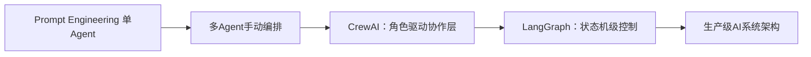
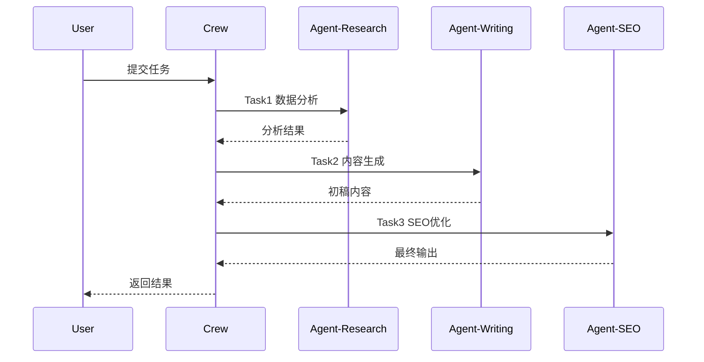
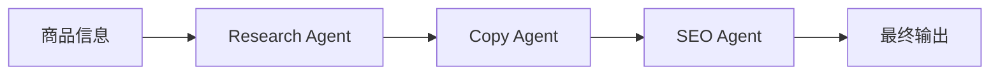
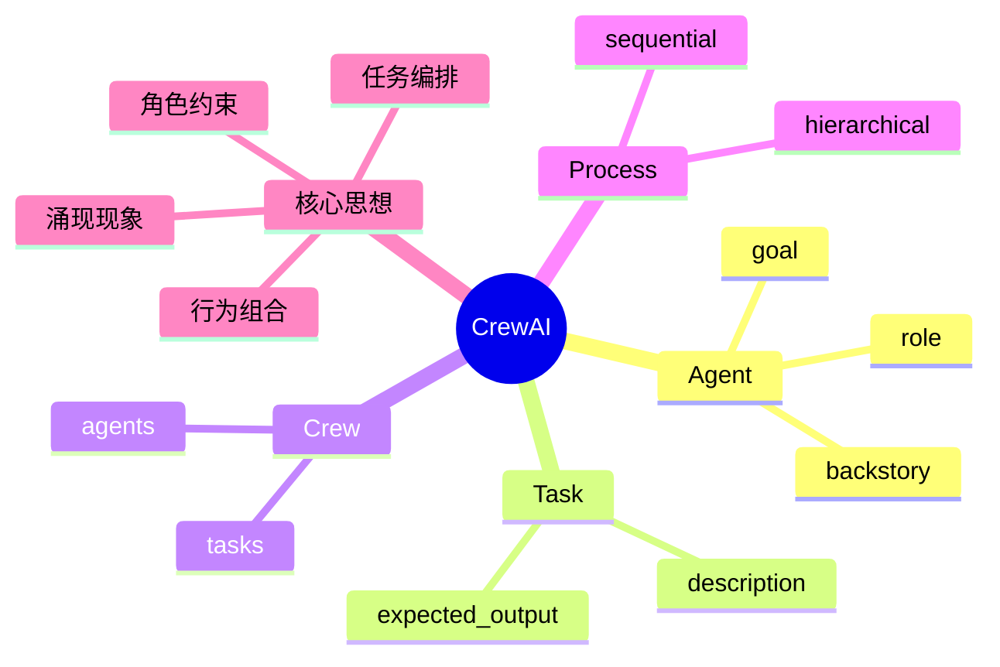

<!--
Chapter: 71
Node: KN-F-000004
Score: 92
Status: ✅ APPROVED
Attempt: 1
Round: 2
Generated: 2026-06-21 10:41:07
-->

# 第71章 CrewAI [L2]

## Part 1：为什么要学这个？[认知冲突先行]

很多人第一次接触 CrewAI，会自然形成一个“工程直觉”：
多 Agent 系统 = 写一堆 if-else + prompt 拼接 + 路由控制。

于是你会尝试“像写后端一样写 AI 系统”：

* 用条件分支决定谁执行任务
* 用函数调用控制流程顺序
* 用手写调度器协调多个模型输出

短期看起来合理，但一旦任务复杂起来，问题会立刻暴露：

同一个“竞品分析任务”，跑三次可能得到三种完全不同的结构：
有时先写结论，有时先写数据，有时甚至跳过分析步骤。

你会下意识认为：控制逻辑不够严密。

于是一个团队做了实验：
他们没有继续强化 if-else，而是换了一种方式——只做“角色定义”，不再写显式流程控制。

* 市场分析 Agent：负责提炼信息
* 数据采集 Agent：负责抓取与整理
* 报告生成 Agent：负责结构化输出

每个 Agent 只写三件事：role、goal、backstory。

结果系统“看起来更稳定”了。

但这里有一个关键误区需要纠正：
这种稳定性提升，并不能简单归因于“角色驱动”这一单一机制。

更合理的解释是多因素叠加：

* 任务被拆分后降低了单步复杂度
* 不同 Agent 上下文隔离减少了互相污染
* prompt 结构标准化提高了一致性
* role/backstory 提供了行为先验约束

也就是说：

> CrewAI 的效果不是“魔法出现”，而是多个工程因素共同压缩了不确定性空间。

本章要解决的问题是：

> 如何用“角色组织 + 任务拆分”的方式，构建一个可协作的多 Agent 系统，而不是依赖脆弱的流程控制逻辑。

---

## Part 2：学习路径定位

CrewAI 在 AI Native 架构中处于“从单 Agent 到组织化多 Agent”的中间层。

它不负责底层推理，也不负责严格状态机控制，而是负责“如何组织多个智能体协作”。



前置知识：

* LLM 基础调用与 Prompt 设计
* JSON / 结构化输出控制
* 基本任务拆分思维

后置知识：

* LangGraph 状态机建模
* 复杂 Agent 回路设计
* 生产级可观测 AI 系统设计

CrewAI 的本质定位：

> 它不是控制器，而是“组织方式抽象层”。

---

## Part 3：用生活理解它

可以把 CrewAI 想象成一部电影拍摄现场。

你不是在写“摄影机怎么移动”，而是在定义三类人：

* 导演（决定方向）
* 编剧（负责内容结构）
* 剪辑师（负责最终表达）

你只需要给他们：

* 各自职责（role）
* 要达成的目标（goal）
* 工作风格（backstory）

然后说一句：“开始拍摄。”

他们会自己协作完成一部电影。

但这个类比也有边界：

* 电影团队是强约束组织结构
* CrewAI 中 Agent 行为是概率生成的
* 实际输出可能偏离预期但仍在“合理空间内”

---

## Part 4：AI如何映射到传统概念

如果你有传统工程背景，可以这样理解：

| 传统软件概念      | CrewAI 对应概念             |
| ----------- | ----------------------- |
| 类 / 对象      | Agent                   |
| 方法 / 函数     | Task                    |
| 服务编排        | Crew                    |
| 流程控制器       | Process                 |
| 业务需求说明      | role + goal + backstory |
| 顺序 pipeline | sequential execution    |
| 分布式协调系统     | hierarchical process    |

关键差异：

传统系统强调：

> 显式控制流（Control Flow First）

CrewAI 强调：

> 隐式行为空间（Behavior Space First）

你不是“控制每一步”，而是在“塑造每个 Agent 的决策倾向”。

---

## Part 5：技术本质深讲

CrewAI 的核心可以拆成一句话：

> 它是一个基于角色约束的任务编排执行框架，而“涌现”只是执行过程中行为分布的结果表现。

需要特别注意一点：

“涌现”不是系统失控，而是：

* 多 Agent 在约束条件下的概率性行为组合结果
* 仍然发生在明确的任务编排与执行顺序之中

### 四个核心抽象

* Agent：行为主体（role / goal / backstory）
* Task：任务单元（description / expected_output）
* Crew：执行集合
* Process：执行策略（sequential / hierarchical）

---

### 执行结构



---

### 关键机制解释

#### 1. role（角色）

定义“注意力偏好空间”，例如：

* 更关注数据还是表达
* 更偏结构还是创意

---

#### 2. goal（目标）

定义优化方向：

模型会倾向于选择更符合 goal 的生成路径。

---

#### 3. backstory（背景）

提供隐式先验：

* 行业经验
* 写作风格
* 结构偏好

它影响的是“生成分布”，不是规则。

---

### 执行本质

CrewAI 的执行不是“函数调用链”，而是：

> 在任务约束下的多 Agent 分阶段生成系统

但要强调：

* 仍然是顺序或层级执行框架
* 并不是完全自由的“群体自治系统”
* 每一步仍由 Process 明确调度

---

## Part 6：动手Demo（可运行代码）

```python
from crewai import Agent, Task, Crew, Process

# 市场分析 Agent
market_agent = Agent(
    role="Market Analyst",
    goal="提取产品核心卖点",
    backstory="5年电商分析经验，擅长用户评论归纳",
    verbose=True
)

# 文案 Agent
copy_agent = Agent(
    role="Copywriter",
    goal="生成高转化电商标题",
    backstory="广告行业背景，熟悉AIDA模型",
    verbose=True
)

# SEO Agent
seo_agent = Agent(
    role="SEO Specialist",
    goal="优化关键词覆盖",
    backstory="熟悉搜索引擎优化规则",
    verbose=True
)

task1 = Task(
    description="分析蓝牙耳机评论，提取3个卖点",
    expected_output="JSON格式卖点列表",
    agent=market_agent
)

task2 = Task(
    description="基于卖点生成商品标题",
    expected_output="不超过30字标题",
    agent=copy_agent
)

task3 = Task(
    description="优化标题关键词覆盖",
    expected_output="SEO优化后的标题",
    agent=seo_agent
)

crew = Crew(
    agents=[market_agent, copy_agent, seo_agent],
    tasks=[task1, task2, task3],
    process=Process.sequential
)

result = crew.kickoff()
print(result)
```

---

运行结果你会看到：

* 分阶段输出
* 中间结果被逐步增强
* 每个 Agent 输出风格不同但结构连贯

---

## Part 7：真实项目场景

在一个跨境电商系统中，原本使用单 Agent：

* 输入商品信息
* 输出标题 + 描述 + SEO

问题：

* 文案风格不一致
* SEO关键词遗漏
* 修改成本高

---

改造为 CrewAI：

### Agent 拆分

* Research Agent：提取卖点
* Copy Agent：生成文案
* SEO Agent：优化关键词

---

### 流程结构



---

收益：

* 输出结构一致性显著提升
* 人工修改减少
* 但仍需人工 review（不可完全自动化）

---

## Part 8：这里容易踩坑

### 错误1：把 CrewAI 当 if-else 引擎

```python
if "分析" in task:
    run_analysis()
else:
    run_copy()
```

问题：

* 破坏 Agent 分工意义
* 回退成传统控制流

---

### 正确方式

```python
Task(
    description="分析用户评论",
    agent=market_agent
)
```

---

### 错误2：backstory 太弱

```python
backstory="你是分析师"
```

问题：

* 行为约束不足
* 输出漂移严重

---

### 正确方式

```python
backstory="""
5年电商数据分析经验
专注用户行为与转化率优化
输出结构化报告
"""
```

---

### 错误3：输出格式不明确

```python
expected_output="报告"
```

问题：

* 无法稳定被后续 Agent 使用

---

## Part 9：面试怎么答

### L1

CrewAI 是什么？

要点：

* 多 Agent 编排框架
* 基于 role / goal / backstory

---

### L2

sequential 和 hierarchical 区别？

* sequential：线性执行
* hierarchical：Manager Agent 调度

---

### L3

CrewAI vs LangGraph？

* CrewAI：角色驱动快速构建
* LangGraph：状态机级控制系统

---

## Part 10：考点速查

* **Agent 三要素**：定义行为空间
* **Task 结构化输出**：控制信息传递
* **Process 类型**：控制执行拓扑
* **Crew 编排模型**：任务集合执行
* **涌现现象**：行为组合结果

---

## Part 11：必背金句

* 角色不是身份，是约束空间
* backstory 决定生成分布
* Task 是自然语言契约
* CrewAI 组织行为，不控制每一步
* 涌现是结果，不是机制

---

## Part 12：快速参考表

| 概念        | 作用   | 示例             |
| --------- | ---- | -------------- |
| role      | 行为身份 | Analyst        |
| goal      | 优化目标 | 提取卖点           |
| backstory | 行为先验 | 5年经验           |
| Task      | 任务单元 | 分析评论           |
| Crew      | 执行集合 | agents + tasks |
| Process   | 执行策略 | sequential     |

---

## Part 13：思维导图



---

## Part 14：本章小结

CrewAI 的核心是通过角色定义来组织多 Agent 协作，而不是通过复杂控制逻辑。

系统稳定性的来源是任务拆分、上下文隔离与结构化输出的共同作用。

从 L1 到 L2，本质变化是从“控制流程”转向“设计行为空间”。

---

## Part 15：下一章预告

CrewAI 解决的是“如何组织多个 Agent”。

但当你开始在生产环境使用时，会遇到新的问题：

* 如何控制循环执行？
* 如何处理状态回滚？
* 如何构建可观测的复杂流程图？

下一章：

> LangGraph：把 Agent 系统变成可控状态机图系统