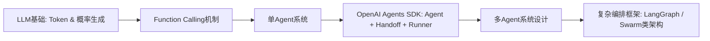
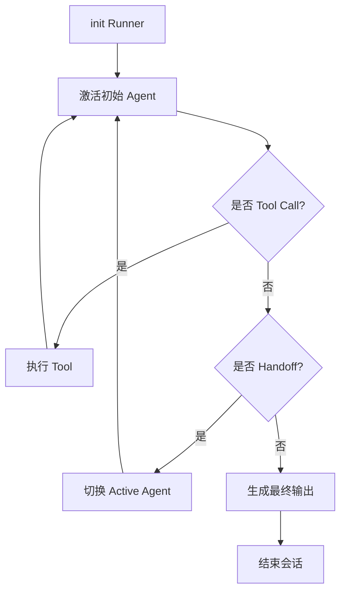
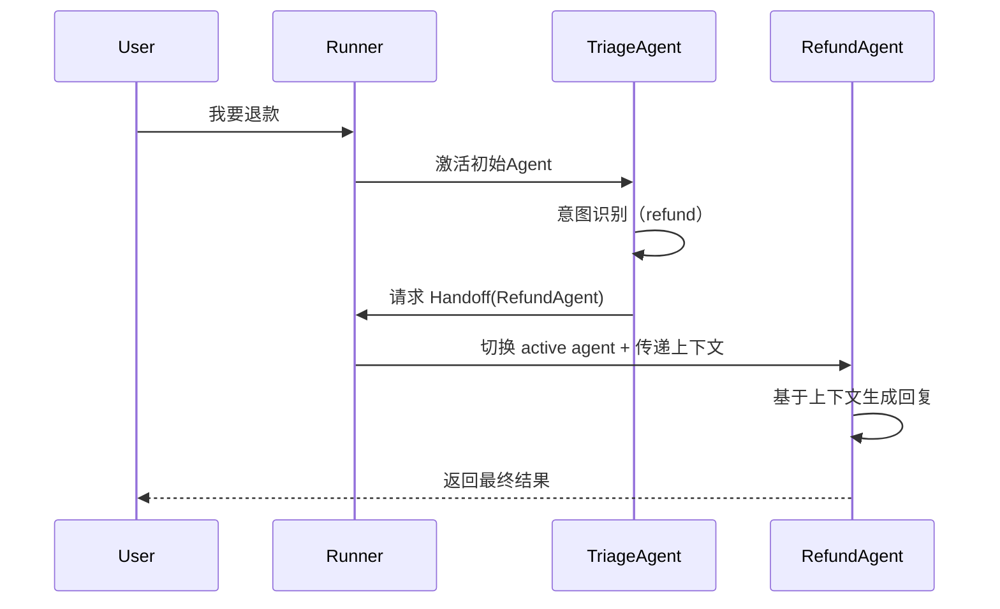
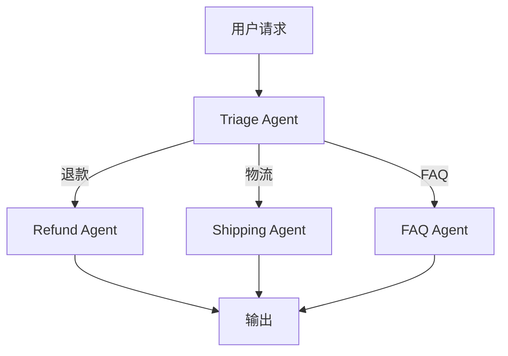
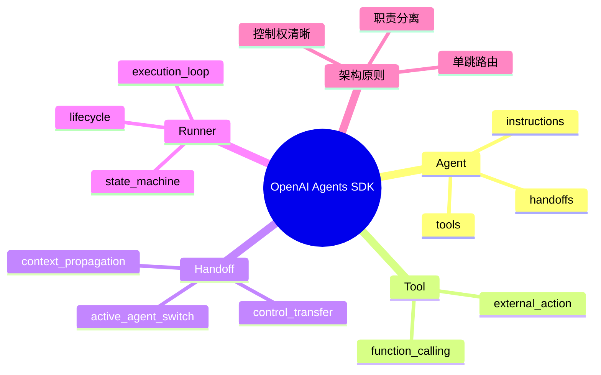

<!--
Chapter: 72
Node: KN-F-000005
Score: 88
Status: ✅ APPROVED
Attempt: 1
Round: 2
Generated: 2026-06-21 10:44:28
-->

# 第72章 OpenAI Agents SDK [L1-L2]

---

## Part 1：为什么要学这个？[认知冲突先行]

很多人第一次做客服分流系统时，会写出一种“看起来很合理”的设计：

Triage Agent 负责判断用户意图，一旦识别到“退款”，就把请求交给 Refund Agent，然后继续回来处理后续对话。

你甚至会在脑海里构建一个清晰模型：

> A 调用 B → B 执行完 → 返回 A → 继续下一步

问题在上线之后才暴露出来：用户说“我要退款”，系统确实转到了退款 Agent，但后续所有对话都不再回到 Triage Agent，甚至上下文语气也完全变了。

真正的冲突在这里：

你以为这是“函数调用流程”，但实际运行的是“控制权接管系统”。

在 OpenAI Agents SDK 中：

> Handoff 不是调用，而是接管（ownership transfer）

一旦发生 Handoff：

* 当前 Agent 停止参与决策
* 新 Agent 成为唯一 active agent
* 后续所有 token 生成都由新 Agent 控制

就像银行前台把你带到理财专员后，前台不会再插手你的业务——甚至不会“旁观”。

本章要解决的核心问题是：

> 在多 Agent 系统中，“谁在说话”，到底是如何被切换与持续维护的？

---

## Part 2：学习路径定位

OpenAI Agents SDK 不是独立系统，而是建立在 function calling 之上的控制流抽象层。



在 L0→L4 学习路径中，它的位置如下：

* L0：理解 Token 与生成机制
* L1：掌握 Function Calling
* L2：理解 Agent + Handoff + Runner（本章）
* L3：多 Agent 编排与状态图系统
* L4：分布式 Agent 网络与调度系统

它的本质不是“更强模型”，而是：

> 用更清晰的控制模型替代复杂的手写 orchestration

---

## Part 3：用生活理解它

把 OpenAI Agents SDK 想象成医院分诊系统。

一个患者进来，说：“我肚子疼。”

* 分诊护士（Triage Agent）先判断症状
* 发现可能是胃病
* 直接说：“去消化科医生那里”

患者被带走后：

* 消化科医生（Specialist Agent）接管全部信息
* 分诊护士不会再参与后续诊断

但这里有一个关键细节：

患者的病历是“随人转移”的，而不是重新生成的。

我们用一个具体状态变化来看：

| 阶段      | Agent  | 状态               |
| ------- | ------ | ---------------- |
| 输入      | Triage | 收集完整对话           |
| 判断      | Triage | 识别 refund intent |
| Handoff | 系统     | 切换 active agent  |
| 接管      | Refund | 继续使用同一上下文        |
| 输出      | Refund | 生成最终回复           |

**类比的边界：**

* 医生是“物理切换”，系统不是
* 系统只是 active agent 指针变化
* 上下文并没有重新初始化，而是继续传递

---

## Part 4：AI如何映射到传统概念

如果你来自后端开发，可以这样理解：

| OpenAI Agents SDK | 传统系统                   | 本质     |
| ----------------- | ---------------------- | ------ |
| Agent             | 微服务 / Controller       | 决策单元   |
| Tool              | Service Method         | 外部能力调用 |
| Handoff           | 路由转发 / 服务接管            | 控制权迁移  |
| Runner            | Event Loop / Scheduler | 执行状态机  |

关键差异是：

传统系统是：

> 调用 → 返回 → 继续原流程

Agent 系统是：

> 控制权切换 → 当前执行主体改变

---

## Part 5：技术本质深讲

OpenAI Agents SDK 的核心不是 Agent，而是一个状态机：

> 当前 active agent 是谁？

### Runner 生命周期模型

Runner 是整个系统的执行内核，它的生命周期可以简化为：



### 核心组件

* Agent：定义行为（instructions + tools + handoffs）
* Tool：扩展能力（function calling）
* Handoff：控制权转移规则
* Runner：状态机执行器

---

### 执行流程（sequence）



---

### 关键机制拆解

#### 1. Agent 是“解释器”，不是执行器

Agent 做三件事：

* 解释上下文
* 决定 tool or handoff
* 生成回复

---

#### 2. Handoff 是指针切换，而不是函数调用

错误理解：

> Handoff = return + callback

正确理解：

> Handoff = Runner.active_agent = RefundAgent

一旦发生切换：

* 原 Agent 停止参与
* 新 Agent 接管上下文
* 后续 token 完全由新 Agent 决定

---

#### 3. Tool vs Handoff 本质区别

* Tool Call：执行 → 返回 → 继续当前 Agent
* Handoff：切换 Agent → 改变解释上下文的主体

---

#### 4. Runner 是唯一“有状态”的存在

Runner 负责：

* 当前 active agent
* tool execution
* handoff switch
* conversation state

---

### 5. 生命周期边界（关键补充）

Runner 生命周期不是无限循环，而是：

* init
* active agent execution
* tool loop / handoff loop
* termination

一旦进入 termination：

> 当前 active agent 不再可切换

---

## Part 6：动手Demo（可运行代码）

下面是一个最小可运行的客服分流系统（Triage → Refund）。

注意：不同 SDK 版本可能 API 名称略有差异，本例只使用稳定抽象结构（Agent + Runner + handoffs）。

```python
from agents import Agent, Runner

# Refund Agent：只处理退款
refund_agent = Agent(
    name="RefundAgent",
    instructions="""
你是退款专员，只处理退款问题。
用户进入你这里后，只需输出退款流程，不再转交任何Agent。
"""
)

# Triage Agent：分流入口
triage_agent = Agent(
    name="TriageAgent",
    instructions="""
你是客服分诊员。
如果用户提到退款，就转交 RefundAgent。
否则直接回答问题。
""",
    handoffs=[refund_agent]  # 声明可转交对象
)

# 运行 Runner（同步执行模型）
result = Runner.run(
    triage_agent,
    input="我要退款"
)

print(result.final_output)
```

### 关键点逐行解释

* `refund_agent`：单一职责，只负责退款解释
* `triage_agent`：负责判断是否需要 Handoff
* `handoffs=[refund_agent]`：声明“可转交控制权的对象”
* `Runner.run()`：同步执行整个状态机

---

### 运行结果你会看到什么？

输出不会回到 Triage：

> RefundAgent 直接生成最终回复

说明：

* Triage 已经退出 active 状态
* RefundAgent 成为唯一执行主体

---

## Part 7：真实项目场景

在一个电商系统中，多 Agent 架构通常用于客服分流：

* FAQ（常见问题）
* Refund（退款）
* Shipping（物流）

### 请求规模

* 日均请求：80万+
* 峰值并发：数千级

---

### 架构设计



---

### 设计原则

* Triage 只做分类，不做业务执行
* Worker Agent 只做单一任务
* 禁止多层 Handoff

---

### 生产经验

最常见失败模式：

> Triage 既做判断，又做业务执行

结果：

* prompt 膨胀
* 决策不稳定
* 难以维护

---

## Part 8：这里容易踩坑

### ❌ 坑 1：Handoff 链过深

错误结构：

```python
Triage → Refund → Policy → Audit → Supervisor
```

问题：

* 上下文持续累积
* token 爆炸
* 后续 Agent 被污染

正确结构：

```python
Triage → Worker
```

---

### ❌ 坑 2：把所有 tools 放在 Triage

错误代码：

```python
triage_agent = Agent(
    name="Triage",
    tools=[refund_tool, shipping_tool, faq_tool]
)
```

问题：

* Triage 变成“上帝 Agent”
* 决策质量下降
* 职责不清晰

---

### ❌ 坑 3：误解 Handoff 为“返回调用”

错误理解：

> Refund 完成 → 回 Triage

正确理解：

> 除非再次 Handoff，否则不会返回

---

## Part 9：面试怎么答

### L1

**Q：Agent / Tool / Handoff 是什么？**

* Agent：决策单元
* Tool：外部函数能力
* Handoff：控制权切换

---

### L2

**Q：Tool 和 Handoff 区别？**

核心：

* Tool：不改变 agent
* Handoff：改变 active agent

---

### L3

**Q：如何设计稳定多 Agent 系统？**

要点：

* Triage 单跳
* 避免链式 Handoff
* 控制 context size
* 限制循环次数

---

## Part 10：考点速查

**1. Handoff 是控制权转移**

* 不是函数调用

**2. Runner 是状态机**

* 控制 active agent

**3. Tool 不改变 Agent**

* 只是能力扩展

**4. Agent = 决策单元**

* 不等于执行器

**5. Triage 应保持轻量**

* 只负责路由

---

## Part 11：必背金句

* Handoff不是调用，是接管
* Agent不是执行器，是决策体
* Tool改变能力，Handoff改变身份
* 控制权比执行能力更重要
* Triage越复杂，系统越脆弱

---

## Part 12：快速参考表

| 概念           | 作用    | 示例             |
| ------------ | ----- | -------------- |
| Agent        | 决策单元  | RefundAgent    |
| Tool         | 外部能力  | refund_order() |
| Handoff      | 控制权切换 | → RefundAgent  |
| Runner       | 状态机   | Runner.run()   |
| instructions | 行为定义  | system prompt  |

---

## Part 13：思维导图



---

## Part 14：本章小结

OpenAI Agents SDK 的核心不是多 Agent，而是控制权切换模型。

Agent 之间不是调用关系，而是接管关系。

Runner 决定“谁在说话”，而不是“谁在执行”。

理解这一点，就完成了从函数调用思维到控制流思维的跃迁。

---

## Part 15：下一章预告

我们已经解决了：

> Agent 如何切换控制权（Handoff）

但新的问题出现了：

* 如果流程需要分支与回滚怎么办？
* 如果多个 Agent 需要共享状态怎么办？
* 如果不是线性 Handoff，而是图结构怎么办？

下一章将进入：

> 多 Agent 图编排（Graph Orchestration）

你将看到：

* 为什么 Handoff 不够用
* 为什么需要状态图
* 为什么控制流必须显式化