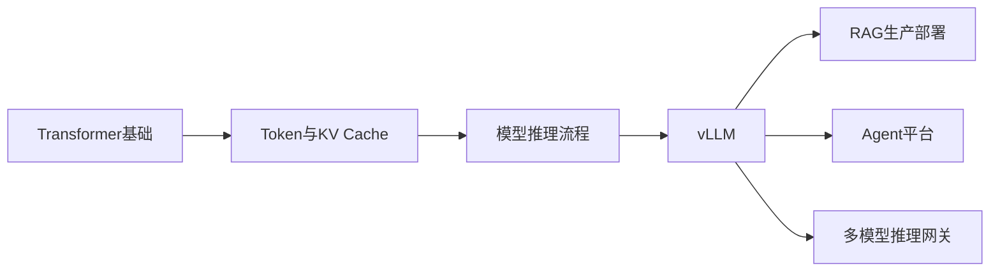
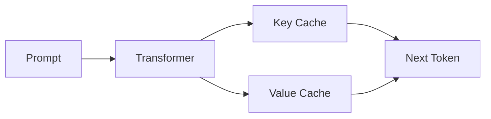
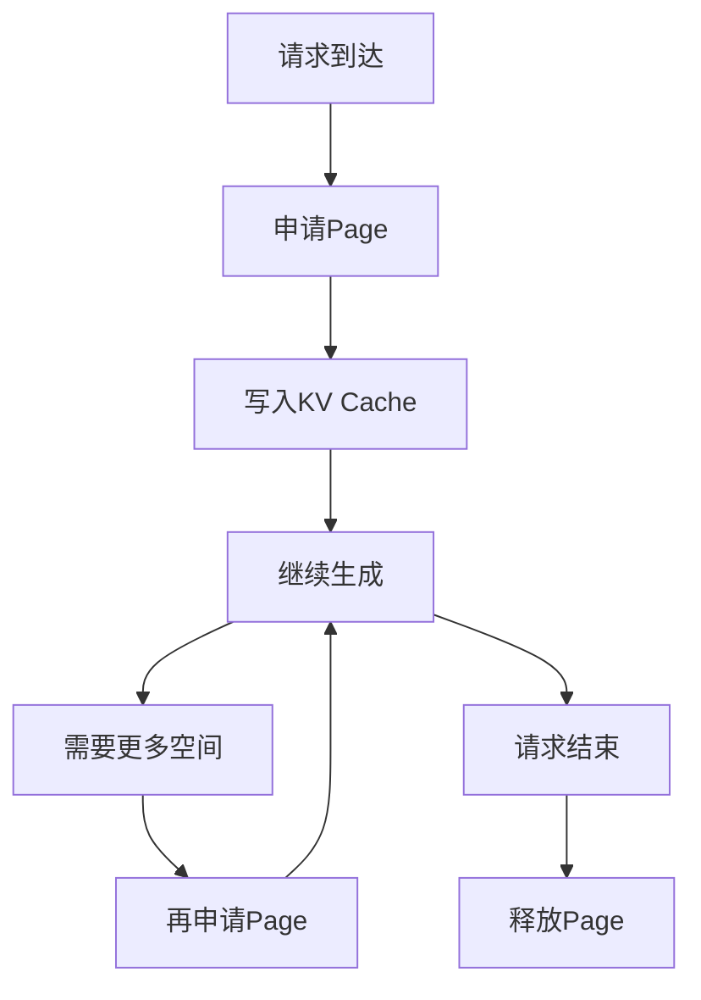
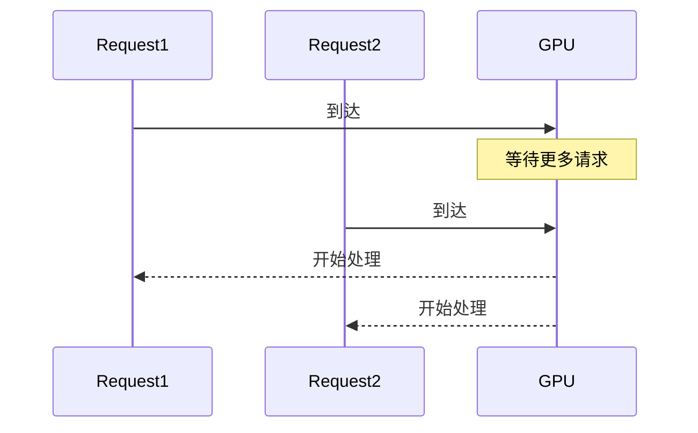
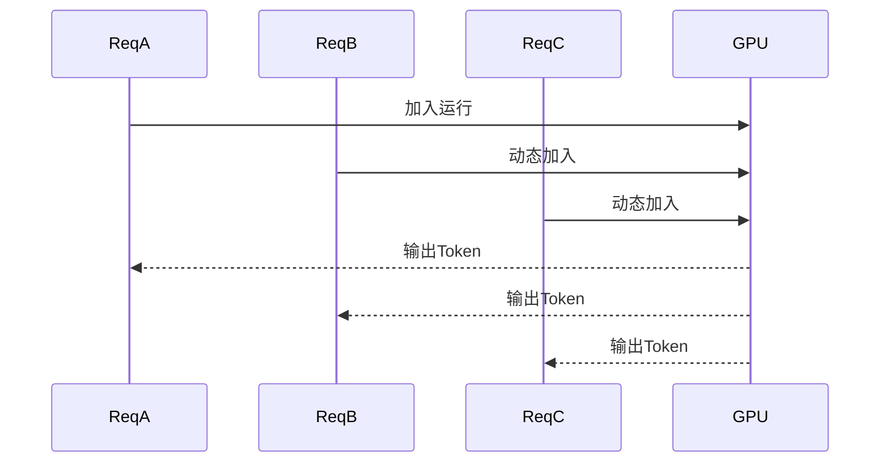
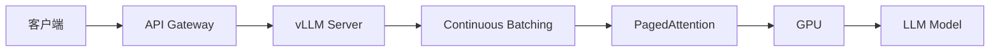
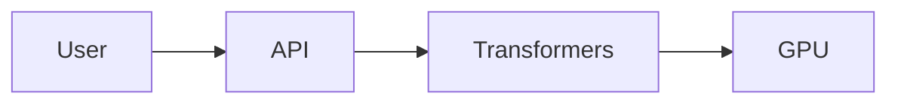
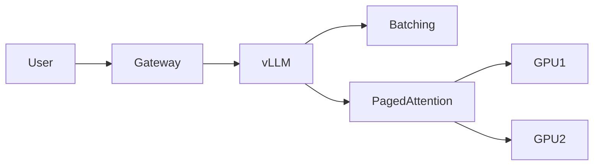
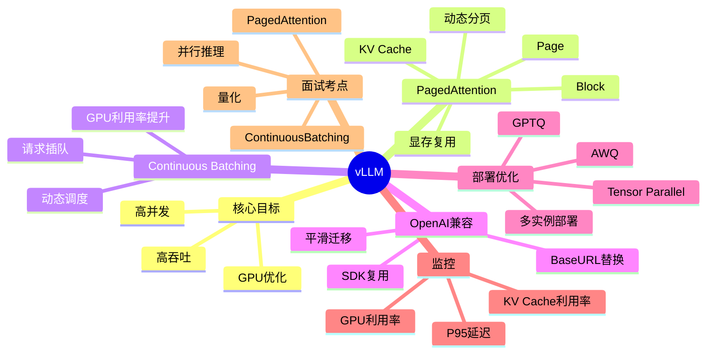

<!--
Chapter: 73
Node: KN-T-000001
Score: 90
Status: ✅ APPROVED
Attempt: 1
Round: 2
Generated: 2026-06-21 11:29:25
-->

# 第73章 vLLM（高吞吐 LLM 推理引擎） [L3]

## Part 1：为什么要学这个？[认知冲突先行]

某 AI 团队正在做大模型客服系统压测。

他们部署了一套 70B 级别模型，运行在 80GB 的 A100 GPU 上。

测试开始后，一切正常。

并发 10。

正常。

并发 20。

正常。

并发 50。

OOM。

GPU 显存耗尽。

团队立刻得出结论：

> 模型太大了，换 H100。

于是采购了更贵的显卡。

结果上线后发现：

并发稍微提高一点，还是 OOM。

甚至因为请求波动，高峰期更加不稳定。

问题出在哪？

很多工程师会认为：

> LLM 推理瓶颈来自模型参数量。

实际上，高并发场景下真正吃掉显存的往往不是模型权重，而是 KV Cache。

更准确地说：

> 不是 KV Cache 太大，而是 KV Cache 管理得太差。

传统推理框架会为每个请求提前预留最大长度对应的 KV Cache。

即使用户只输入几十个 Token，也会占着一大块显存不释放。

结果：

* GPU 利用率很低
* 显存碎片越来越严重
* 并发稍高就 OOM
* GPU 资源大量浪费

这就是很多团队陷入的误区：

> 以为需要升级硬件，其实需要升级推理引擎。

而 vLLM 的出现，正是为了解决这个问题。

本章将回答几个核心问题：

* 为什么同样一张 GPU，vLLM 能跑出 3~10 倍吞吐？
* 什么是 PagedAttention？
* KV Cache 为什么会浪费 80% 显存？
* Continuous Batching 为什么能降低延迟？
* 为什么很多企业把 OpenAI API 服务迁移到 vLLM？

理解这些问题，你才能真正进入 LLM 生产部署领域。

---

## Part 2：学习路径定位

vLLM 不属于模型训练领域。

它属于：

> LLM Production Serving（模型生产推理服务）

这是 AI Native 工程师从模型使用者走向平台工程师的重要一步。



对应成长路径：

| 层级 | 能力                  |
| -- | ------------------- |
| L0 | 调用 OpenAI API       |
| L1 | 本地运行 Ollama         |
| L2 | 理解 Transformer 推理过程 |
| L3 | 使用 vLLM 构建高并发推理服务   |
| L4 | 构建企业级推理平台           |

本章位于：

> 从「会用模型」进入「会运营模型服务」的关键节点。

学习完本章后，你会理解：

* 推理服务为什么会 OOM
* GPU 为什么利用率低
* 如何设计高并发推理架构

这些都是 AI 平台工程师的核心技能。

---

## Part 3：用生活理解它

想象一家酒店。

传统推理框架的管理方式是：

每来一个客人，直接预留总统套房。

哪怕客人只是睡一晚。

房间被锁定后，其他客人无法使用。

很快酒店就满了。

而 vLLM 的方式不同。

它把酒店拆成很多小房间。

客人需要多少空间就分配多少。

离开后立即回收。

新的客人继续使用。

因此：

同样一栋酒店。

传统方式只能住 100 人。

vLLM 可能住 500 人。

这就是 PagedAttention 的核心思想。

### 类比的边界

这个类比只能帮助理解内存管理。

现实中的酒店房间是独立空间。

而 KV Cache 需要参与 Attention 计算。

因此：

PagedAttention 不只是“动态分配”。

还必须保证计算访问效率。

这部分依赖其底层 Page Table 机制。

---

## Part 4：AI如何映射到传统概念

很多传统后端工程师第一次接触 vLLM 时会感觉陌生。

实际上它与操作系统有大量相似之处。

| 传统系统           | AI 推理系统               |
| -------------- | --------------------- |
| CPU进程          | 推理请求                  |
| 虚拟内存           | KV Cache              |
| 页(Page)        | KV Cache Block        |
| 页表(Page Table) | Block Mapping         |
| 内存管理器          | PagedAttention        |
| 线程调度器          | Continuous Batching   |
| Nginx          | OpenAI Compatible API |
| JVM堆优化         | GPU显存优化               |
| Kubernetes Pod | vLLM实例                |
| 数据库连接池         | Request Queue         |

如果你有操作系统背景。

那么可以把 vLLM 理解成：

> GPU 上运行的虚拟内存管理系统。

区别只是：

传统 OS 管理 RAM。

vLLM 管理 KV Cache。

很多工程师学习 vLLM 时陷入困难。

原因就在于：

他们把它当作推理框架。

实际上：

> vLLM 更像 GPU 上的操作系统。

---

## Part 5：技术本质深讲

### 为什么 KV Cache 会成为瓶颈

Transformer 推理过程中。

每生成一个 Token。

都会产生：

* Key
* Value

后续计算必须反复访问这些历史数据。

因此需要缓存。

这就是 KV Cache。



问题来了。

假设系统允许：

```text
max_model_len = 4096
```

用户 A：

```text
实际长度 = 200 Token
```

用户 B：

```text
实际长度 = 300 Token
```

传统框架通常会直接分配：

```text
4096 Token
4096 Token
```

即：

```text
请求长度 << 预留长度
```

大量显存被浪费。

很多生产环境中：

KV Cache 利用率只有：

```text
20%~30%
```

剩余显存全部闲置。

---

### PagedAttention 的核心思想

vLLM 借鉴了操作系统分页机制。

它把 KV Cache 切成固定大小的小块。

例如：

```text
Block 1
Block 2
Block 3
...
```

请求只在需要时申请新的 Block。



优势非常明显：

* 不再预分配最大长度
* 避免内存碎片
* 显存动态复用
* 提高并发能力

实际生产中：

| 指标          | 传统框架    | vLLM  |
| ----------- | ------- | ----- |
| KV Cache利用率 | 20%~30% | 90%+  |
| GPU利用率      | 较低      | 较高    |
| 并发能力        | 基线      | 3~10倍 |
| OOM概率       | 高       | 低     |

---

### Continuous Batching

传统 Batch 机制：

```text
等10个请求
组成Batch
统一执行
```

问题：

如果只来了 9 个请求。

GPU 就在等待。

产生额外延迟。



vLLM 使用 Continuous Batching。

核心思想：

> GPU 不停机，请求随时加入。



这样带来的效果：

* GPU 更忙
* 请求等待更少
* 尾延迟下降
* 吞吐提高

---

### OpenAI API 兼容

vLLM 在工程上最受欢迎的原因之一：

> OpenAI API 完全兼容。

原来的代码：

```python
from openai import OpenAI

client = OpenAI(
    api_key="xxx"
)
```

迁移后：

```python
from openai import OpenAI

client = OpenAI(
    api_key="EMPTY",
    base_url="http://localhost:8000/v1"
)
```

业务代码几乎不用修改。

对于企业而言：

这意味着：

* 降低迁移成本
* 降低供应商锁定
* 支持私有部署
* 支持国产模型替换

---

### vLLM 的完整架构



记住本章最重要的一句话：

> KV Cache 不难，难的是别让它“按最大房间白占床”。

这正是 vLLM 能把同一张 GPU 的服务能力提升数倍的根本原因。

## Part 6：动手 Demo（可运行代码）

理解 vLLM 最简单的方法，不是直接研究源码。

而是亲手启动一个 OpenAI 兼容服务。

假设你的机器已经安装：

* Python 3.10+
* CUDA
* vLLM

安装：

```bash
pip install vllm openai
```

启动服务：

```bash
python -m vllm.entrypoints.openai.api_server \
  --model TinyLlama/TinyLlama-1.1B-Chat-v1.0 \
  --port 8000
```

客户端调用代码：

```python
from openai import OpenAI

client = OpenAI(
    api_key="EMPTY",
    base_url="http://localhost:8000/v1"
)

response = client.chat.completions.create(
    model="TinyLlama/TinyLlama-1.1B-Chat-v1.0",
    messages=[
        {
            "role": "user",
            "content": "什么是PagedAttention？"
        }
    ],
    temperature=0.7,
    max_tokens=100
)

print(response.choices[0].message.content)
```

### 关键代码解析

```python
client = OpenAI(
    api_key="EMPTY",
    base_url="http://localhost:8000/v1"
)
```

告诉 OpenAI SDK：

不要访问 OpenAI 云端。

改为访问本地 vLLM。

---

```python
model="TinyLlama/TinyLlama-1.1B-Chat-v1.0"
```

指定已经被 vLLM 加载的模型。

---

```python
temperature=0.7
```

控制随机性。

与 OpenAI API 完全一致。

---

```python
max_tokens=100
```

限制输出长度。

避免无意义生成。

### 运行后你会看到什么

控制台输出类似：

```text
PagedAttention是一种用于优化KV Cache管理的技术。
它将缓存拆分为固定大小页面，
通过动态分配减少显存浪费，
从而提升推理吞吐量。
```

同时在服务端日志中可以观察到：

```text
INFO Engine initialized
INFO Running OpenAI compatible server
INFO GPU KV cache created
```

这说明：

* 模型加载成功
* KV Cache 初始化完成
* OpenAI API 已经兼容运行

---

## Part 7：真实项目场景

### 电商客服大模型平台

某头部电商平台部署 Llama 类模型。

主要业务：

* 商品咨询
* 物流查询
* 售后问答
* 退款解释

日均请求量：

```text
1200万+
```

---

### 第一版架构



技术栈：

* HuggingFace Transformers
* 静态 Batch
* 单卡推理

结果：

| 指标    | 数值        |
| ----- | --------- |
| GPU   | A100 80GB |
| QPS   | 15        |
| P95延迟 | 3.2s      |
| KV利用率 | 22%       |
| 并发40+ | OOM       |

问题越来越严重。

GPU 明明没满。

显存却不断耗尽。

---

### 优化方案

团队引入：

* vLLM
* PagedAttention
* Continuous Batching
* Tensor Parallel
* AWQ量化

新架构：



部署参数：

```text
tensor_parallel_size = 2

gpu_memory_utilization = 0.9

quantization = awq
```

---

### 上线结果

| 指标    | 优化前  | 优化后   |
| ----- | ---- | ----- |
| GPU数量 | 8    | 2     |
| 单卡QPS | 15   | 65    |
| P95延迟 | 3.2s | 420ms |
| KV利用率 | 22%  | 87%   |
| OOM   | 高频   | 基本消失  |

核心收益不是模型更聪明。

而是：

> 同样 GPU，服务更多用户。

这正是 vLLM 的价值所在。

---

## Part 8：这里容易踩坑

### 坑1：把 vLLM 理解成“更快的推理框架”

错误理解：

```text
模型慢
↓
换vLLM
↓
速度变快
```

正确理解：

```text
KV Cache浪费
↓
PagedAttention优化
↓
并发提升
↓
吞吐提升
```

错误关注点：

```python
# 一直研究模型参数量
model_size = "70B"
```

正确关注点：

```python
max_model_len = 4096
gpu_memory_utilization = 0.9
```

真正决定吞吐的往往是：

* KV Cache
* Batch策略
* 显存利用率

而不是模型名字。

---

### 坑2：gpu-memory-utilization 设置为 1.0

错误配置：

```bash
--gpu-memory-utilization 1.0
```

看起来：

```text
100%利用GPU
```

实际上：

```text
PyTorch无缓冲
CUDA无缓冲
```

轻微流量波动：

```text
OOM
服务崩溃
```

正确配置：

```bash
--gpu-memory-utilization 0.9
```

生产建议：

```text
0.85 ~ 0.92
```

---

### 坑3：无限增大上下文长度

错误配置：

```bash
--max-model-len 32768
```

用户实际平均：

```text
800 Token
```

结果：

```text
KV Cache暴涨
并发下降
```

正确方式：

```text
根据业务统计设置
```

例如：

```bash
--max-model-len 4096
```

即可满足大部分客服系统。

---

## Part 9：面试怎么答

### L1：vLLM 相比 Transformers 最大优化点是什么？

回答框架：

```text
1. KV Cache是推理瓶颈
2. Transformers预分配缓存
3. vLLM采用PagedAttention
4. 利用率20%→90%+
5. 吞吐提升3~10倍
```

面试官关注：

是否理解：

> 提升来自内存管理，而非模型本身。

---

### L2：Continuous Batching 与 Static Batching 区别是什么？

回答框架：

```text
Static Batch
↓
等请求凑满

Continuous Batch
↓
动态加入请求
```

核心收益：

```text
提高GPU利用率
降低尾延迟
增加吞吐
```

面试官通常会继续追问：

```text
为什么尾延迟下降？
```

答案：

```text
不需要等待批次填满
```

---

### L3：单卡40GB如何支撑高并发？

回答框架：

```text
PagedAttention
+
AWQ量化
+
控制max_model_len
+
Tensor Parallel
+
多实例路由
```

完整答案：

```text
1. 启用PagedAttention
2. 使用AWQ/GPTQ量化
3. 限制上下文长度
4. 多实例部署
5. nginx负载均衡
6. 监控KV Cache利用率
```

这是典型高级工程师题目。

---

## Part 10：考点速查

### **PagedAttention**

KV Cache 分页管理机制。

利用率从约 20% 提升到 90%+。

---

### **Continuous Batching**

动态批处理。

请求无需等待批次凑满。

---

### **OpenAI Compatible API**

替换 base_url 即可迁移。

业务代码几乎不变。

---

### **AWQ/GPTQ**

模型量化技术。

显存占用大幅下降。

---

### **Tensor Parallel**

模型跨多 GPU 推理。

适合超大模型部署。

---

## Part 11：必背金句

**[KV Cache]：显存浪费往往比模型参数更致命。**

**[PagedAttention]：核心不是更快计算，而是更聪明地管理显存。**

**[Continuous Batching]：GPU 不应该等待请求，请求应该追赶 GPU。**

**[OpenAI兼容]：迁移成本最低的私有化部署方案之一。**

**[生产部署]：显存利用率不是越高越好，稳定性优先。**

---

## Part 12：快速参考表

| 概念                     | 作用           | 示例值                  |
| ---------------------- | ------------ | -------------------- |
| PagedAttention         | KV Cache分页管理 | 开启                   |
| Continuous Batching    | 动态批处理        | 默认启用                 |
| gpu_memory_utilization | GPU显存占用比例    | 0.9                  |
| max_model_len          | 最大上下文长度      | 4096                 |
| Tensor Parallel        | 多GPU推理       | 2                    |
| AWQ                    | 模型量化         | 开启                   |
| GPTQ                   | 模型量化         | 开启                   |
| OpenAI API             | 接口兼容层        | /v1/chat/completions |
| KV Cache               | 历史上下文缓存      | 自动管理                 |
| QPS                    | 吞吐指标         | 65+                  |

---

## Part 13：思维导图



---

## Part 14：本章小结

很多人以为 LLM 推理瓶颈来自模型参数规模，实际上高并发场景下更大的问题往往是 KV Cache 管理方式。

vLLM 通过 PagedAttention 将 KV Cache 从静态预分配改为动态分页管理，使显存利用率从约 20% 提升到 90% 以上，并通过 Continuous Batching 进一步提升吞吐能力。

从成长路径来看：

```text
L0：调用云端API
↓
L1：本地运行模型
↓
L2：理解推理过程
↓
L3：掌握vLLM生产部署
↓
L4：构建企业级推理平台
```

如果你能够解释：

* PagedAttention原理
* Continuous Batching机制
* KV Cache优化思路

那么你已经具备 AI 推理平台工程师的核心能力。

---

## Part 15：下一章预告

本章解决了一个问题：

> 如何让同样 GPU 服务更多用户？

但新的问题马上出现。

即使推理吞吐提高了。

模型回答质量依然可能不满足业务要求。

例如：

* 医疗问答不够专业
* 法律回答不够准确
* 企业知识无法掌握
* 输出格式不稳定

这时候靠 Prompt 已经不够。

需要让模型真正学会新的知识和行为模式。

下一章将进入：

**Fine-tuning（微调）**

你将学习：

* 为什么企业要微调模型
* LoRA 为什么成为主流方案
* 全量微调与参数高效微调区别
* 微调后的模型如何部署到 vLLM
* 企业级 Fine-tuning 生产流程

当你掌握微调与 vLLM 结合部署之后，就真正打通了：

```text
训练
↓
微调
↓
部署
↓
推理服务
↓
生产落地
```

这也是 AI Native 工程体系中的下一块核心拼图。