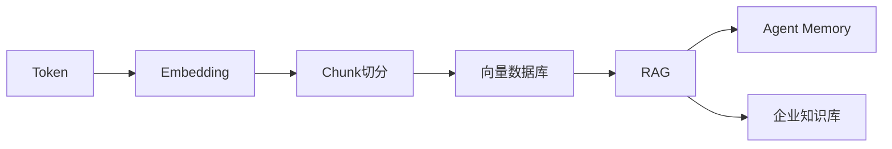
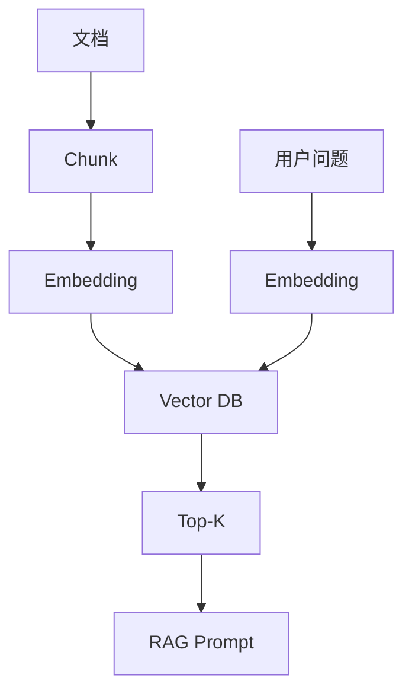
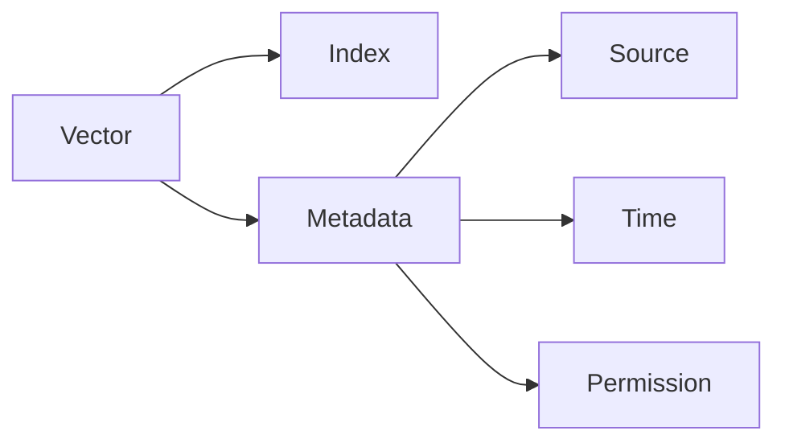
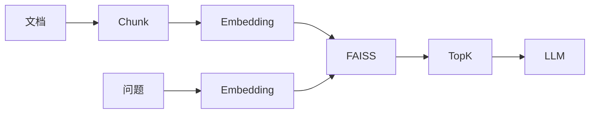
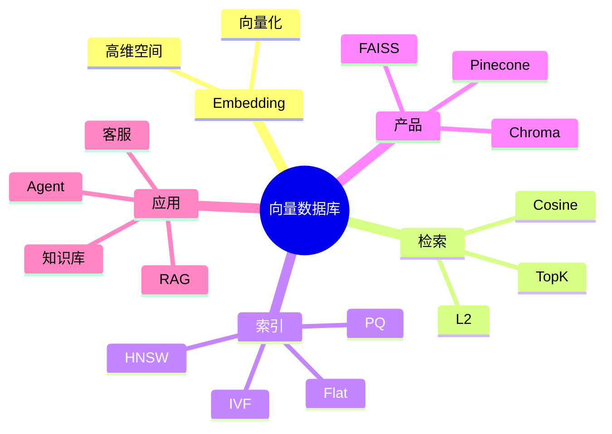

<!--
Chapter: 74
Node: KN-T-000002
Score: 92
Status: ✅ APPROVED
Attempt: 1
Round: 2
Generated: 2026-06-21 11:44:39
-->

# 第74章 向量数据库（FAISS / Chroma / Pinecone） [L1-L2]

## Part 1：为什么要学这个？

某工程师给企业做知识库搜索。

他非常自信：

> “搜索还能有多复杂？MySQL 加一个 LIKE 不就行了？”

于是系统上线。

用户搜索：

* AI 如何学习
* 人工智能训练机制
* 模型是怎么训练的

结果全部返回：

> 未找到结果。

但知识库里明明有一篇文档：

> 《机器学习原理》

为什么？

因为：

* AI ≠ 机器学习
* 人工智能 ≠ AI
* 训练机制 ≠ 学习原理

字符串不同，但意思相同。

于是团队开始意识到：

> 搜索不是找相同的字，而是找相同的意义。

后来他们接入向量数据库。

再次搜索：

> 人工智能训练机制

《机器学习原理》排在第一位。

这时候很多人才第一次理解：

> 传统数据库保存数据。
>
> 向量数据库保存语义。

而今天几乎所有 RAG 系统：

* 企业知识库
* ChatPDF
* 智能客服
* AI 搜索
* Agent 长期记忆

背后都有一个共同组件：

**向量数据库。**

本章要回答三个问题：

1. 为什么 MySQL 做不了语义搜索？
2. 向量数据库如何找到“意思相近”的文档？
3. FAISS、Chroma、Pinecone 应该怎么选？

---

## Part 2：学习路径定位



能力层级：

| 层级 | 能力               |
| -- | ---------------- |
| L0 | 知道 Embedding     |
| L1 | 能使用 FAISS/Chroma |
| L2 | 能设计向量检索系统        |
| L3 | 能优化召回率和索引        |
| L4 | 能设计大规模检索架构       |

本章目标：

> 从“会用 API”进阶到“理解向量检索原理”。

---

## Part 3：用生活理解它

假设你第一次去东京。

你想找一家：

> 安静、能工作、有 WiFi 的咖啡馆。

你并不知道店名。

地图会给你推荐很多你从未去过的店。

因为地图不是在匹配名字。

而是在匹配：

> 特征。

向量数据库也是一样。

用户问：

> AI 如何学习？

系统并不会寻找包含“AI”和“学习”的文章。

它会寻找：

> 语义上最接近的问题。

### 类比的边界

现实地图：

* 二维坐标。

向量空间：

* 384维
* 768维
* 1536维

因此：

> 向量坐标不是物理位置，而是语义位置。

---

## Part 4：AI如何映射到传统概念

| 传统概念                  | AI概念             |
| --------------------- | ---------------- |
| 主键查询                  | 向量查询             |
| WHERE条件               | Top-K搜索          |
| B+Tree                | ANN索引            |
| LIKE                  | 语义匹配             |
| 数据行                   | 向量点              |
| 表字段                   | Metadata         |
| Elasticsearch Keyword | Embedding Search |

传统 SQL：

```sql
SELECT *
FROM docs
WHERE title LIKE '%AI%';
```

向量搜索：

```python
results = vector_db.similarity_search(
    query="人工智能训练机制",
    k=5
)
```

区别：

| MySQL   | 向量数据库 |
| ------- | ----- |
| 精确匹配    | 相似匹配  |
| 字符串比较   | 距离比较  |
| O(logN) | ANN搜索 |
| 结构化数据   | 语义数据  |

一句话：

> MySQL 回答“是不是”，向量数据库回答“像不像”。

---

## Part 5：技术本质深讲

### Step1：Embedding

```text
"什么是机器学习"
↓
[-0.12,0.83,...,0.56]
```

文字变成向量。

向量越近。

语义越近。

---

### 整体流程



---

### 为什么能搜索语义？

核心：

#### 余弦相似度

```text
cos(A,B)
```

取值：

```text
[-1,1]
```

值越大。

语义越近。

---

### 欧氏距离与余弦相似度

很多工程师以为：

> FAISS 默认就是余弦相似度。

这是错误的。

FAISS 最常用的是：

```text
IndexFlatL2
```

它计算的是：

> 欧氏距离（L2 Distance）

如果想让 L2 等价于余弦相似度，需要满足一个条件：

> 所有向量先进行 L2 Normalization。

即：

```text
|v| = 1
```

归一化之后：

```text
最小L2距离
≈
最大余弦相似度
```

因此很多生产系统会这样做：

```python
faiss.normalize_L2(vectors)
```

然后：

```python
IndexFlatIP
```

或者：

```python
IndexFlatL2
```

都能够实现余弦相似度检索。

---

### 工程上的影响

| 距离度量          | 特点     |
| ------------- | ------ |
| Cosine        | 关注方向   |
| L2            | 关注距离   |
| Inner Product | 推荐系统常用 |

文本 Embedding：

> 大多数场景优先 Cosine。

推荐系统：

> 更喜欢 Inner Product。

---

### 为什么不能暴力搜索？

1000万文档：

1536维。

一次查询：

```text
1000万 × 1536
```

成本巨大。

因此需要：

> ANN（Approximate Nearest Neighbor）

---

### 常见索引

| 算法   | 特点   |
| ---- | ---- |
| Flat | 最准确  |
| IVF  | 聚类   |
| HNSW | 工业标准 |
| PQ   | 压缩   |

---

### 存储结构



Metadata 非常重要。

因为生产系统经常需要：

* 权限过滤
* 时间过滤
* 来源过滤

---

### 三大向量数据库

#### FAISS

特点：

* Facebook 开源
* 单机性能强
* 极快

适合：

* 实验
* 本地研究

#### Chroma

特点：

* 轻量
* 易用
* 持久化方便

适合：

* 开发
* Demo

#### Pinecone

特点：

* 全托管
* 自动扩容
* 高可用

适合：

* 企业生产

---

### 最佳实践

| 参数          | 推荐值      |
| ----------- | -------- |
| Chunk Size  | 300-500  |
| Overlap     | 10%-20%  |
| Top-K       | 3-10     |
| Embedding维度 | 768-1536 |
| 索引          | HNSW     |

记住一句话：

> 向量是坐标，距离越近，语义越像。

---

## Part 6：动手Demo（可运行代码）

```python
import numpy as np

documents = [
    "机器学习原理",
    "Python基础",
    "人工智能发展史",
    "数据库设计"
]

vectors = np.array([
    [0.91, 0.83, 0.77],
    [0.10, 0.20, 0.15],
    [0.88, 0.81, 0.80],
    [0.20, 0.30, 0.25]
], dtype=np.float32)

query = np.array([0.90, 0.80, 0.78], dtype=np.float32)


def normalize(v):
    return v / np.linalg.norm(v)


vectors = np.array([normalize(v) for v in vectors])
query = normalize(query)


def cosine(a, b):
    return np.dot(a, b)


scores = []

for doc, vec in zip(documents, vectors):
    score = cosine(query, vec)
    scores.append((doc, score))

scores.sort(key=lambda x: x[1], reverse=True)

for doc, score in scores:
    print(f"{doc}: {score:.4f}")
```

运行后：

```text
机器学习原理
人工智能发展史
数据库设计
Python基础
```

你会发现：

用户没有输入“机器学习”。

系统仍然找到了最相关的文档。

---

## Part 7：真实项目场景

某电商公司拥有：

* 50万历史工单
* 商品文档
* FAQ

目标：

建设智能客服。

第一版：

Elasticsearch 关键词搜索。

效果很差。

查询：

> 快递一直没更新。

搜不到：

> 物流延迟说明。

于是改成：



参数：

* Chunk：400 tokens
* Overlap：15%
* Embedding：1536维
* 索引：HNSW

结果：

| 指标       | 改造前  | 改造后   |
| -------- | ---- | ----- |
| 延迟       | 2.1s | 180ms |
| Top10召回率 | 0.58 | 0.86  |
| 自动回复命中率  | -    | +32%  |

---

## Part 8：这里容易踩坑

### 坑1：整篇文档一个向量

错误：

```python
embedding = embed(document)
```

正确：

```python
chunks = split(
    text,
    chunk_size=400,
    overlap=60
)
```

---

### 坑2：Chunk 太小

错误：

```python
chunk_size = 20
```

结果：

语义丢失。

正确：

```python
chunk_size = 400
```

---

### 坑3：FAISS 不持久化

错误：

```python
index = faiss.IndexFlatL2(1536)
```

重启：

全部丢失。

正确：

```python
faiss.write_index(index, "docs.index")
```

---

## Part 9：面试怎么答

### L1

问：

向量数据库和 MySQL 的区别？

答题框架：

* 字符串 vs 语义
* 精确匹配 vs 相似匹配
* SQL vs ANN

---

### L2

问：

FAISS、Chroma、Pinecone 如何选？

答题框架：

* FAISS：实验
* Chroma：开发
* Pinecone：生产

---

### L3

问：

为什么 Chunk Size 和 Embedding 升级影响巨大？

答题框架：

* Chunk影响语义粒度
* 模型升级导致向量空间变化
* 必须重建索引

---

## Part 10：考点速查

**向量数据库的核心是语义搜索。**

**ANN 是性能关键。**

**Chunk Size 推荐 300-500。**

**Embedding 升级必须重建索引。**

**FAISS 的 L2 与 Cosine 并不天然等价，需要向量归一化。**

---

## Part 11：必背金句

【语义搜索】：找的是意义，不是文字。

【向量空间】：距离越近，语义越像。

【Chunk】：粒度决定召回质量。

【ANN】：用极小精度损失换巨大性能收益。

【Embedding升级】：换模型必须重建索引。

---

## Part 12：快速参考表

| 概念        | 作用    | 示例         |
| --------- | ----- | ---------- |
| Embedding | 文本向量化 | 1536维      |
| Top-K     | 返回数量  | 5          |
| Chunk     | 文档切分  | 400 tokens |
| Overlap   | 上下文连续 | 15%        |
| Cosine    | 相似度   | 0.92       |
| HNSW      | 索引    | 图搜索        |
| FAISS     | 本地高性能 | 单机         |
| Chroma    | 开发调试  | 本地持久化      |
| Pinecone  | 云服务   | 托管         |

---

## Part 13：思维导图



---

## Part 14：本章小结

向量数据库解决的是：

> 如何找到语义最接近的知识。

它把文本变成坐标。

再利用距离搜索完成检索。

成长路径：

```text
理解Embedding
→ 使用FAISS
→ 搭建RAG
→ 优化召回
→ 设计生产系统
```

---

## Part 15：下一章预告

这一章回答了：

* 知识放在哪里；
* 如何找到知识；
* 如何选择向量数据库。

但还有一个问题：

> 知识应该切成什么样？

为什么同一个知识库：

* 有人效果很好；
* 有人效果极差？

下一章：

**Chunking 策略与 RAG 检索优化——为什么切错文档，最强模型也答不好问题。**