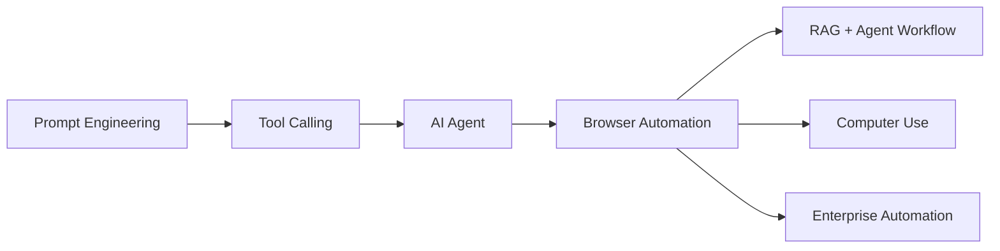
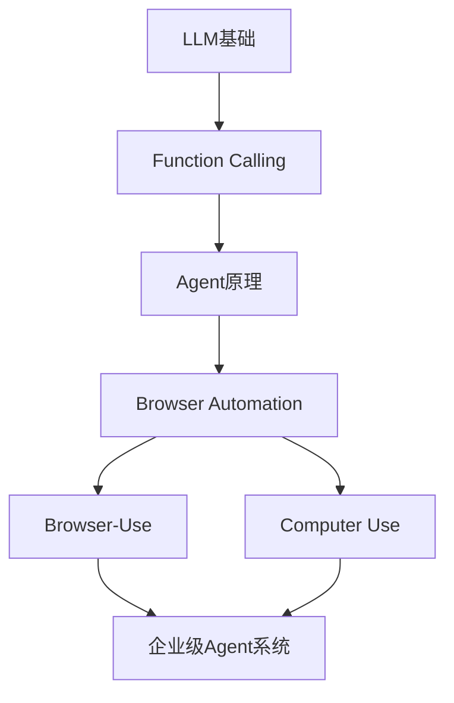
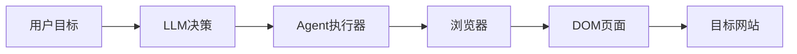
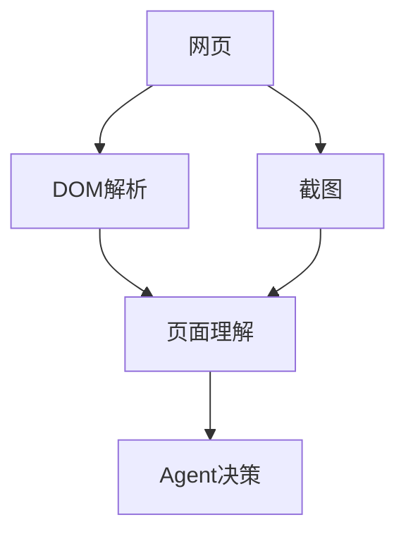
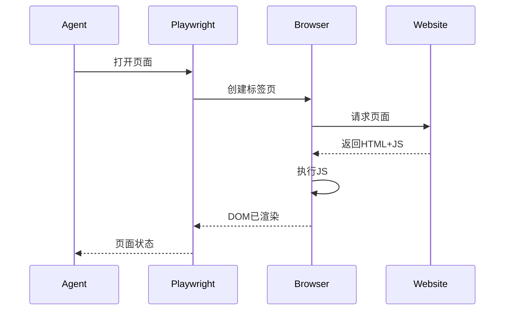
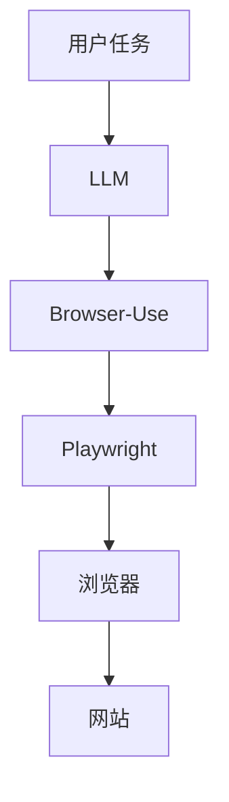
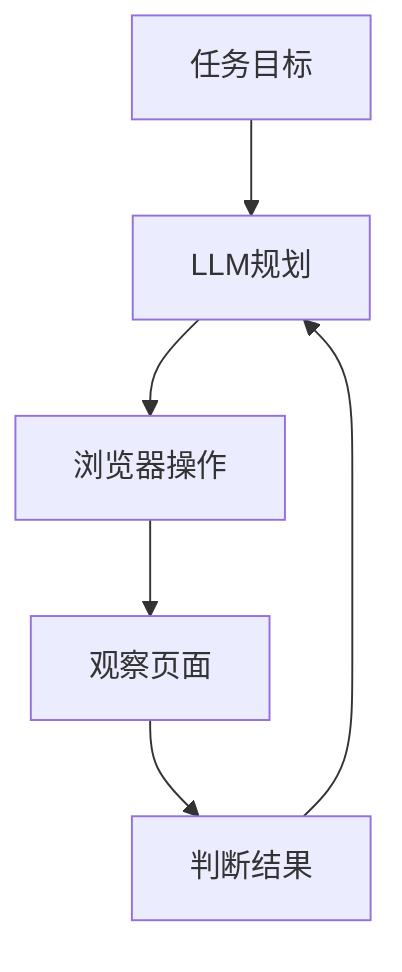
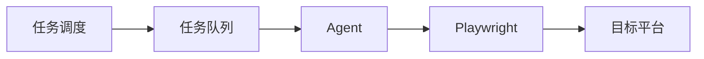
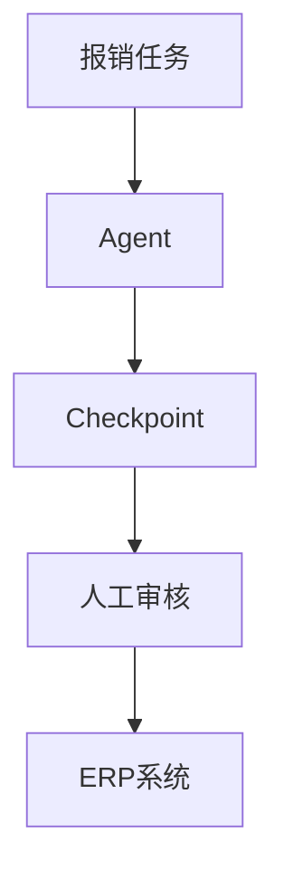
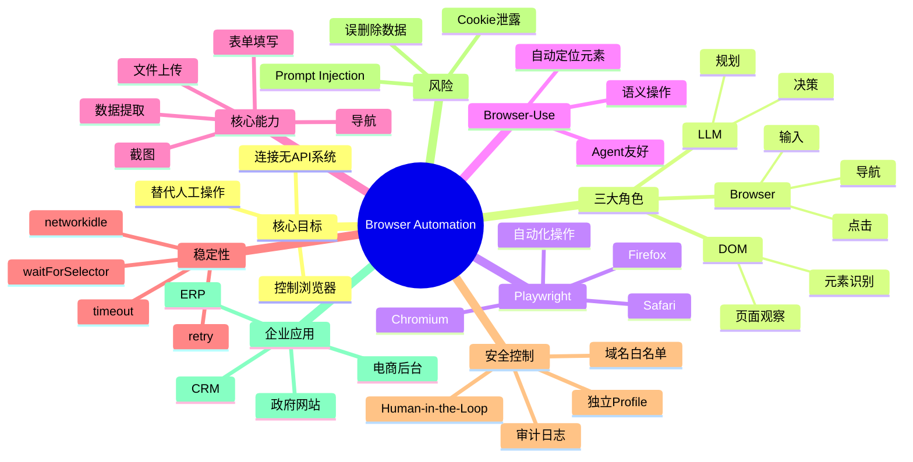

<!--
Chapter: 75
Node: KN-T-000003
Score: 91
Status: ✅ APPROVED
Attempt: 1
Round: 2
Generated: 2026-06-21 12:15:41
-->

# 第75章 Browser Automation（Playwright / Browser-Use） [L2-L3]

## Part 1：为什么要学这个？[认知冲突先行]

一名工程师接到一个需求：

> 自动查询供应商后台库存，并同步到公司系统。

他很自信。

“这不就是爬虫吗？”

于是：

* requests 发请求
* BeautifulSoup 解析页面
* F12 抓接口
* Cookie 模拟登录

结果一周过去了。

问题一个接一个：

* 登录后页面是 React 渲染
* 表格内容不是 HTML，而是 JS 动态生成
* 每次刷新 token 都变化
* 库存接口只有登录后浏览器环境才能访问
* 页面还有滑动验证码

代码越来越复杂，成功率越来越低。

后来团队换了一种思路：

不再模拟浏览器。

直接启动浏览器。

使用 Playwright：

* 打开真实页面
* 输入账号密码
* 等待页面渲染完成
* 提取库存表格
* 截图保存结果

整个流程一次跑通。

问题来了：

为什么传统爬虫越来越难？

为什么 AI Agent 时代 Browser Automation 几乎成为标配能力？

很多人以为：

> Web 自动化 = HTTP 请求

实际上：

> 现代 Web 系统本质是运行在浏览器中的应用程序。

今天的大量系统：

* ERP
* CRM
* OA
* 政府平台
* 电商后台
* SaaS 管理系统

根本没有开放 API。

如果 AI 想操作这些系统，就必须学会像人一样：

* 看页面
* 找按钮
* 输入内容
* 点击提交

这正是 Browser Automation 的核心价值。

本章要解决的核心问题：

> 如何给 AI 装上一双眼睛和一双手，让它能够操作真实浏览器完成任务？

---

## Part 2：学习路径定位

Browser Automation 位于 Agent 工具层的重要位置。

它不是模型能力。

而是 Agent 执行能力的延伸。

没有 Browser Automation：

* AI 只能告诉你怎么做

有 Browser Automation：

* AI 可以替你完成操作

学习路径如下：



知识依赖关系：



你需要提前掌握：

| 前置知识             | 为什么需要                 |
| ---------------- | --------------------- |
| LLM基础            | 理解 Agent 如何决策         |
| Function Calling | 理解工具调用机制              |
| Agent            | 理解规划与执行流程             |
| Web基础            | 理解 DOM、Cookie、Session |

学完后可以继续学习：

| 后续知识            | 价值         |
| --------------- | ---------- |
| Browser-Use     | AI友好的浏览器控制 |
| Computer Use    | 控制整个桌面     |
| Multi-Agent     | 多Agent协作执行 |
| Workflow Engine | 企业流程自动化    |

---

## Part 3：用生活理解它

想象一个场景。

你打电话给一家餐厅：

“我要点餐。”

对方说：

“抱歉，我们只接受店内自助点餐机下单。”

于是你发现：

打电话（HTTP请求）根本没用。

你必须：

* 走进餐厅
* 站到点餐机前
* 点击菜单
* 输入信息
* 完成支付

Browser Automation 就像派一个机器人替你走进餐厅操作点餐机。

它不是和后台直接沟通。

而是在模拟真实用户行为。

类比成立的部分：

* 点餐机 ≈ Web 页面
* 点击按钮 ≈ DOM 操作
* 输入信息 ≈ 表单填写

类比不成立的部分：

* 浏览器远比点餐机复杂
* 页面会动态变化
* JavaScript 会实时修改界面
* AI 还需要理解页面语义并做决策

因此 Browser Automation 不只是自动点击，而是“理解页面后再操作”。

---

## Part 4：AI如何映射到传统概念

很多传统开发者第一次接触 Agent 时会困惑：

“这不就是 Selenium 自动化测试吗？”

答案是：

像，但不完全一样。

传统自动化：

* 人写死流程

AI 自动化：

* AI 自己决定流程

对应关系如下：

| 传统软件概念         | AI Agent 世界        |
| -------------- | ------------------ |
| Selenium 自动化测试 | Browser Automation |
| HTTP Client    | Browser Context    |
| 测试脚本           | Agent Plan         |
| DOM Selector   | 页面语义理解             |
| API 调用         | Tool Calling       |
| 状态机            | Agent Memory       |
| 人工操作系统         | AI 执行工作流           |
| 测试工程师          | LLM 决策引擎           |

传统方式：

```python
click("#login")
fill("#username", "admin")
fill("#password", "123456")
click("#submit")
```

AI Agent 方式：

```text
登录系统
找到库存页面
提取所有缺货商品
导出Excel
```

中间具体怎么点击。

由 Agent 自己决定。

这就是 Browser-Use 出现的原因。

它把“操作细节”抽象掉了。

---

## Part 5：技术本质深讲

### Browser Automation 的本质

一句话：

> Browser Automation = Agent 控制真实浏览器执行任务。

核心结构：



这里有三个核心角色：

### 大脑（LLM）

负责理解目标。

例如：

```text
查询最近30天销售额
```

LLM 不负责点击。

它负责规划。

例如：

```text
1. 登录ERP
2. 打开报表中心
3. 设置时间范围
4. 导出数据
```

---

### 眼睛（页面观察）

Agent 必须知道当前页面长什么样。

获取方式包括：

* DOM树
* 页面文本
* 元素属性
* 截图

例如：

```html
<button id="submit">
  提交订单
</button>
```

Agent 可以看到：

```text
按钮：提交订单
```

从而决定下一步操作。

观察流程：



---

### 手（浏览器操作）

常见动作：

| 动作         | 说明    |
| ---------- | ----- |
| goto       | 打开网页  |
| click      | 点击元素  |
| fill       | 输入文本  |
| select     | 下拉框选择 |
| upload     | 上传文件  |
| screenshot | 截图    |
| extract    | 提取内容  |

例如：

```python
page.goto("https://example.com")
page.fill("#username", "admin")
page.click("#submit")
```

---

### Playwright 工作原理

Playwright 控制真实浏览器。

执行过程：



与 requests 最大区别：

requests：

```text
只获取服务器返回内容
```

Playwright：

```text
获取浏览器最终渲染结果
```

这就是为什么 React、Vue、Angular 页面能够正常处理。

---

### Browser-Use 工作原理

Playwright 很强。

但对 Agent 不够友好。

例如：

```python
page.click("#inventory-table > tbody > tr:nth-child(3)")
```

LLM 很难写出稳定选择器。

Browser-Use 在上层增加语义抽象。

Agent 输入：

```text
找到库存表格
点击导出按钮
```

Browser-Use 自动：

* 分析页面
* 定位元素
* 执行点击
* 返回结果

架构如下：



---

### Browser Automation 的四大能力

#### 导航能力

```text
打开页面
前进
后退
刷新
跳转URL
```

#### 交互能力

```text
点击
输入
上传
选择
拖拽
```

#### 提取能力

```text
获取文本
提取表格
抓取截图
下载文件
```

#### 等待能力

```text
等待元素出现
等待网络完成
等待页面渲染
```

等待机制极其重要。

例如：

```python
page.wait_for_load_state("networkidle")
```

否则 Agent 可能在页面还没加载完时就开始点击。

---

### Browser Automation 与 Agent 的关系

Browser Automation 本身不具备智能。

它只是工具。

真正的决策链路如下：



这就是 Agent 的经典循环：

Observe → Think → Act

而 Browser Automation 正是在其中承担：

* Observe（看）
* Act（做）

两个关键能力。

因此可以记住本章最重要的一句话：

> Browser Automation = 给 AI 一双眼睛（看 DOM）+ 一双手（操作页面）+ 但必须戴安全手套（隔离环境与人工确认）。

## Part 6：动手Demo（可运行代码）

下面用 Playwright 演示最小可运行示例。

功能：

* 启动浏览器
* 打开网页
* 获取页面标题
* 截图保存

安装依赖：

```bash
pip install playwright
playwright install
```

示例代码：

```python
from playwright.sync_api import sync_playwright

with sync_playwright() as p:
    browser = p.chromium.launch(
        headless=False
    )

    page = browser.new_page()

    page.goto(
        "https://example.com",
        wait_until="networkidle"
    )

    title = page.title()

    print("Page Title:", title)

    page.screenshot(
        path="homepage.png"
    )

    browser.close()
```

关键代码说明：

| 代码                       | 作用              |
| ------------------------ | --------------- |
| sync_playwright()        | 启动 Playwright   |
| chromium.launch()        | 创建 Chromium 浏览器 |
| page.goto()              | 打开网页            |
| wait_until="networkidle" | 等待网络请求完成        |
| page.title()             | 获取页面标题          |
| screenshot()             | 页面截图            |
| browser.close()          | 关闭浏览器           |

进一步演示表单填写：

```python
from playwright.sync_api import sync_playwright

with sync_playwright() as p:
    browser = p.chromium.launch(
        headless=False
    )

    page = browser.new_page()

    page.goto("https://example.com/login")

    page.fill("#username", "admin")

    page.fill("#password", "123456")

    page.click("#submit")

    page.wait_for_load_state("networkidle")

    print(page.url)

    browser.close()
```

运行后你会看到：

* 浏览器自动打开
* 自动填写表单
* 自动点击登录
* 页面跳转完成
* 输出当前 URL

这就是 Browser Automation 的基础能力。

---

## Part 7：真实项目场景

### 电商价格与库存同步系统

某电商公司运营多个销售平台：

* 自营商城
* 第三方平台A
* 第三方平台B
* 海外平台

每天需要同步：

* 商品价格
* 商品库存
* 上下架状态

总量约：

* 2万商品/天

### 初始方案

团队采用：

```text
requests
+
BeautifulSoup
+
接口逆向
```

问题不断出现：

* 页面依赖 React
* 登录态频繁失效
* 动态 Token
* JS 渲染表格
* 页面结构经常变化

最终统计：

| 指标   | 数值     |
| ---- | ------ |
| 成功率  | 58%    |
| 平均耗时 | 18秒/商品 |
| 人工维护 | 很高     |

---

### 升级方案

技术栈：

```text
LLM Agent
+
Browser-Use
+
Playwright
+
Redis Queue
```

架构：



---

### 核心实现

独立 Browser Profile：

```text
每个平台单独账号
每个平台独立Cookie
隔离浏览器环境
```

显式等待：

```python
page.wait_for_selector(
    ".inventory-table"
)
```

网络空闲等待：

```python
page.wait_for_load_state(
    "networkidle"
)
```

结构化提取：

```python
rows = page.locator(
    ".inventory-row"
)
```

避免：

```python
//*[@id='table']/tbody/tr[7]/td[3]
```

这种脆弱 XPath。

---

### 项目结果

| 指标   | 改造前  | 改造后  |
| ---- | ---- | ---- |
| 成功率  | 58%  | 96%  |
| 平均耗时 | 18秒  | 4.2秒 |
| 维护成本 | 高    | 低    |
| 人工工时 | 100% | 30%  |

每月节省约：

```text
120人小时
```

这也是 Browser Automation 在企业场景快速普及的重要原因。

---

## Part 8：这里容易踩坑

### 坑一：复用用户真实浏览器会话

错误做法：

```python
browser = playwright.chromium.launch_persistent_context(
    user_data_dir="C:/Users/Admin"
)
```

看起来方便。

实际上极度危险。

因为 Agent 获得了：

* Cookie
* 登录态
* 已授权系统

如果被 Prompt Injection 利用：

可能：

* 删除订单
* 导出客户数据
* 提交错误申请

正确做法：

```python
browser = playwright.chromium.launch()

context = browser.new_context()
```

或者：

```text
专用账号
+
专用Browser Profile
+
最小权限原则
```

---

### 坑二：不设置等待机制

错误代码：

```python
page.goto(url)

page.click("#submit")
```

很多页面此时还没加载完成。

结果：

```text
Element not found
```

正确写法：

```python
page.goto(url)

page.wait_for_selector(
    "#submit"
)

page.click("#submit")
```

或者：

```python
page.wait_for_load_state(
    "networkidle"
)
```

---

### 坑三：无限等待

错误代码：

```python
page.wait_for_selector(
    "#result"
)
```

如果页面异常：

任务永远挂住。

正确代码：

```python
page.wait_for_selector(
    "#result",
    timeout=10000
)
```

配合重试：

```python
for _ in range(3):
    try:
        ...
        break
    except Exception:
        pass
```

---

### 坑四：所有操作全自动

错误流程：

```text
发现订单
立即删除
```

正确流程：

```text
发现订单
↓
截图
↓
人工确认
↓
执行删除
```

不可逆操作必须增加 Human-in-the-Loop。

包括：

* 删除
* 支付
* 提交
* 发邮件
* 批量修改

---

## Part 9：面试怎么答

### L1：Playwright 相比传统 requests + 爬虫最大的区别是什么？

考察重点：

* JS 渲染
* 浏览器环境
* 登录态管理

回答框架：

```text
传统爬虫获取的是服务器返回内容。

Playwright控制真实浏览器。

能够执行JavaScript、
维护登录状态、
处理动态页面、
模拟真实用户交互。

因此适合现代前端框架构建的网站。
```

---

### L2：为什么不能让 Agent 使用用户真实浏览器会话？

考察重点：

* 安全隔离
* Prompt Injection
* 权限继承

回答框架：

```text
真实会话包含Cookie和登录权限。

Agent一旦误操作，
或被恶意网页进行Prompt Injection，

可能：

删除数据
提交订单
泄露信息

因此生产环境必须：

独立Browser Profile
最小权限账号
权限隔离
```

---

### L3：设计一个自动报销 Agent，如何做安全控制和故障恢复？

回答框架：

```text
安全控制：

1. 域名白名单
2. 独立账号
3. 操作审计
4. Human-in-the-Loop
5. 截图存档

恢复机制：

1. Step Checkpoint
2. 状态持久化
3. Retry机制
4. Timeout控制
5. 幂等设计
```

架构图：



---

## Part 10：考点速查

### **Browser Automation 的本质**

控制真实浏览器，而不是直接发送 HTTP 请求。

### **Playwright 的价值**

支持 Chromium、Firefox、Safari 自动化。

### **Browser-Use 的价值**

为 Agent 提供更友好的浏览器操作抽象。

### **Human-in-the-Loop**

不可逆操作必须人工确认。

### **独立 Browser Profile**

绝不能直接使用用户真实浏览器环境。

### **显式等待**

waitForSelector 和 networkidle 是生产环境标配。

---

## Part 11：必背金句

**[原则1]：现代网站本质是运行在浏览器里的应用，而不是静态网页。**

**[原则2]：Browser Automation 操作的是浏览器，不是 HTTP 请求。**

**[原则3]：给 AI 装眼睛和手之前，必须先戴上安全手套。**

**[原则4]：删除、支付、提交等不可逆操作必须人工确认。**

**[原则5]：等待机制决定稳定性，超时机制决定可恢复性。**

---

## Part 12：快速参考表

| 概念                | 作用         | 示例值               |
| ----------------- | ---------- | ----------------- |
| Playwright        | 浏览器自动化框架   | Chromium          |
| Browser-Use       | Agent浏览器封装 | Browser Agent     |
| Browser Profile   | 浏览器环境隔离    | 独立账号              |
| DOM               | 页面结构树      | div/button        |
| click             | 点击元素       | page.click()      |
| fill              | 输入内容       | page.fill()       |
| screenshot        | 页面截图       | page.screenshot() |
| waitForSelector   | 等待元素       | #submit           |
| networkidle       | 等待网络空闲     | networkidle       |
| timeout           | 超时控制       | 10000ms           |
| Human-in-the-Loop | 人工确认       | 删除审批              |
| Domain Whitelist  | 域名限制       | company.com       |
| Prompt Injection  | 指令注入攻击     | 恶意网页              |
| Checkpoint        | 恢复点        | Step 3            |
| Audit Log         | 审计日志       | 操作记录              |

---

## Part 13：思维导图



---

## Part 14：本章小结

Browser Automation 解决的问题不是“抓网页”，而是“让 AI 像人一样操作网页”。

Playwright 提供真实浏览器控制能力，Browser-Use 在此基础上提供面向 Agent 的语义化抽象。

企业级落地时，稳定性来自等待与恢复机制，安全性来自隔离环境、权限控制与人工审核。

成长路径：

```text
L0：知道浏览器自动化是什么

↓

L1：能用 Playwright 编写自动化脚本

↓

L2：能将 Browser Automation 集成到 Agent

↓

L3：设计企业级 Browser Agent 平台
```

---

## Part 15：下一章预告

这一章解决了一个关键问题：

> AI 如何操作浏览器中的系统？

但新的问题出现了：

如果任务不在浏览器里呢？

例如：

* 打开 Excel
* 操作本地软件
* 控制桌面应用
* 点击系统弹窗
* 管理整个操作系统

Browser Automation 的能力边界就在这里。

它主要控制浏览器。

下一章将进入更强大的能力层：

**Computer Use（计算机使用）**

届时 AI 不再只是浏览器操作员。

而是能够直接控制整台计算机的数字员工。

从：

```text
Browser Agent
```

进化到：

```text
Computer Agent
```

真正实现：

> 看见整个桌面、理解整个系统、操作整个计算机。