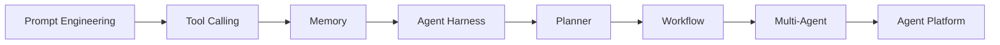
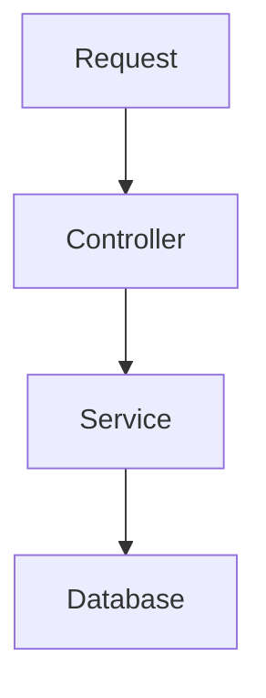
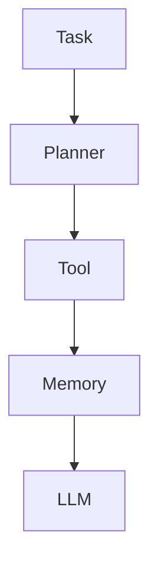
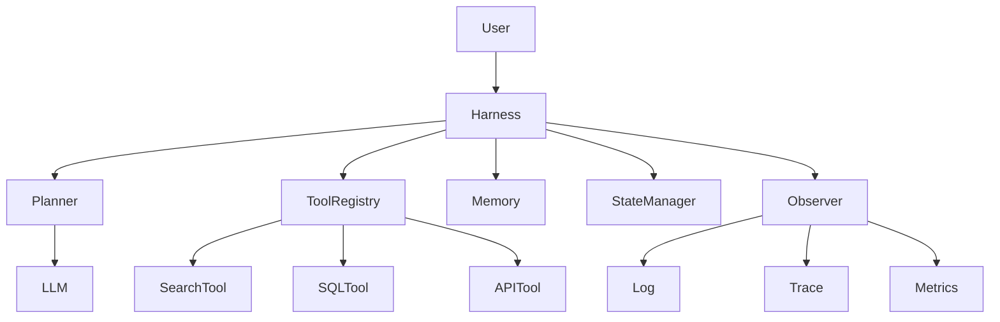
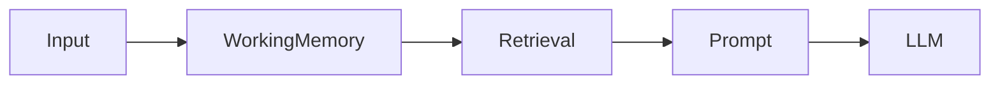
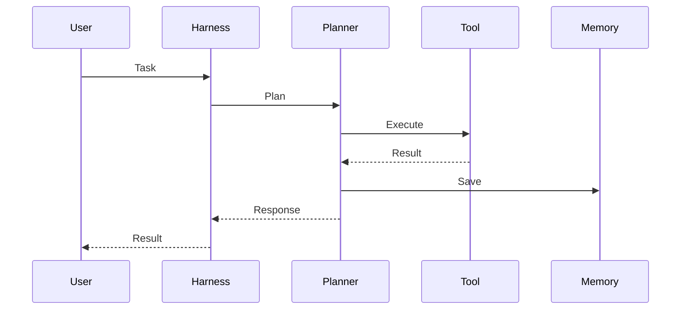
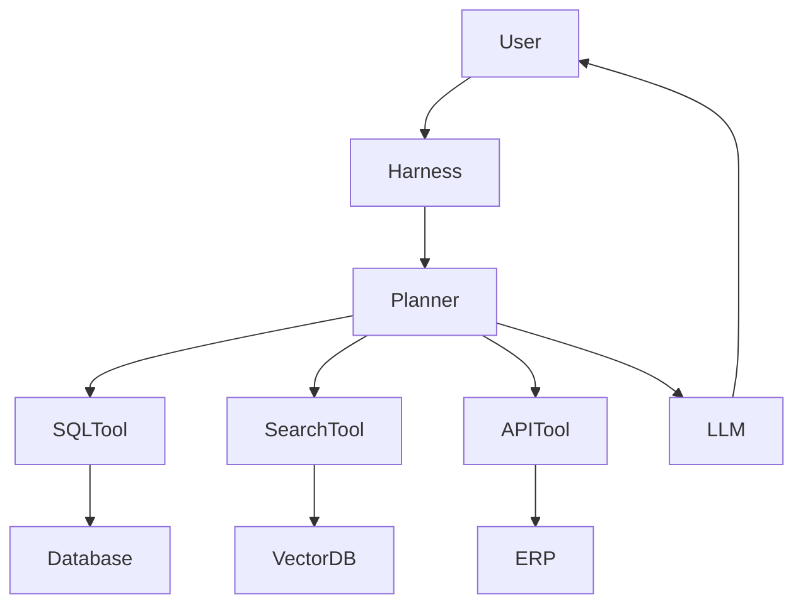
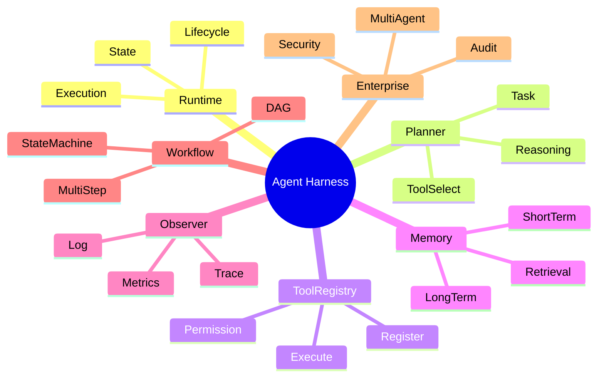

<!--
Chapter: 76
Node: KN-A-000001
Score: 89
Status: ✅ APPROVED
Attempt: 2
Round: 2
Generated: 2026-06-21 12:31:23
-->

# 第76章 Agent Harness（Agent 工程脚手架）[L2-L3]

## Part 1：为什么要学这个？

你可能已经做过这样的项目：

* 一个 Prompt
* 两三个 Tool
* 一个 LLM API

运行成功后，你会觉得：

> Agent 已经完成了。

但当项目进入生产环境后，问题开始出现：

* Tool 越来越多
* Prompt 版本越来越多
* Agent 状态越来越复杂
* 调试越来越困难
* 多 Agent 协作开始失控

很多团队以为自己缺的是更强的模型。

实际上缺的是运行时基础设施。

当一个 Agent 要管理：

* Tool
* Memory
* State
* Workflow
* Trace
* Retry
* Permission

它已经不是一个 Prompt，而是一套软件系统。

本章要解决的问题：

* Agent Harness 到底解决什么问题？
* 为什么 Agent 项目必须有工程脚手架？
* Harness 的核心组件有哪些？
* 如何设计一个可扩展的 Agent Runtime？

---

## Part 2：学习路径定位

Agent Harness 位于 Agent Engineering 的运行时层。



知识层级：

| 层级 | 内容                |
| -- | ----------------- |
| L0 | 会调用模型             |
| L1 | 会构建 Tool Agent    |
| L2 | 理解 Harness        |
| L3 | 设计 Agent Runtime  |
| L4 | 构建 Agent Platform |

前置知识：

* Prompt Engineering
* Tool Calling
* Context Management

后续知识：

* Planner
* Workflow Engine
* Multi-Agent Coordination

---

## Part 3：用生活理解它

把 Agent 看成一家外卖平台。

骑手负责配送。

但平台真正运行还需要：

* 订单系统
* 调度系统
* 路线规划
* 风控系统
* 客服系统

骑手只是执行层。

Agent 中：

* LLM 是骑手
* Harness 是整个平台

没有 Harness：

每个能力独立运行。

有 Harness：

所有能力统一调度。

### 类比边界

现实骑手能力固定。

Agent 的能力可以动态扩展：

* 增加 Tool
* 更换模型
* 调整 Workflow
* 引入新 Memory

因此 Agent Harness 的灵活性远超传统调度系统。

---

## Part 4：AI如何映射到传统概念

| 传统软件架构          | Agent架构           |
| --------------- | ----------------- |
| Spring Boot     | Agent Harness     |
| Controller      | Agent Entry       |
| Service         | Tool              |
| Session         | Memory            |
| Workflow Engine | Planner           |
| Middleware      | Hook              |
| State Machine   | Agent State       |
| Log System      | Trace System      |
| IOC Container   | Runtime Container |

传统应用：



Agent应用：



Harness 的角色类似于 Spring Boot + Runtime Container。

---

## Part 5：技术本质深讲

### Harness 的本质

Agent Harness 本质是一套：

Agent Runtime Management Framework。

它负责统一管理：

* Tool
* Memory
* State
* Planner
* Workflow
* Observability

核心思想：

Agent 不直接管理这些组件。

所有能力通过 Harness 接入。

### 核心架构



### Tool Registry

职责：

* 注册
* 发现
* 调用
* 权限控制

统一入口：

```python
registry.register("search", search_tool)
```

### Memory Layer

职责：

* 短期记忆
* 长期记忆
* Context组装



### State Manager

负责状态生命周期。


stateDiagram-v2
[*] --> IDLE
IDLE --> PLANNING
PLANNING --> RUNNING
RUNNING --> COMPLETED
RUNNING --> FAILED


### Planner

职责：

* 任务分解
* Tool选择
* 推理规划

注意：

本章 Demo 实现的是 Harness Core Skeleton。

Planner 仅采用简单 Rule-Based 方式模拟。

完整 Planner 设计将在后续章节深入讲解。

### Observer

负责：

* Log
* Trace
* Metrics

解决 Agent 黑盒问题。

### 生命周期



---

## Part 6：动手Demo（可运行代码）

```python
from dataclasses import dataclass


class ToolRegistry:
    def __init__(self):
        self.tools = {}

    def register(self, name, func):
        self.tools[name] = func

    def execute(self, name, query):
        if name not in self.tools:
            return f"ERROR: tool '{name}' not found"
        return self.tools[name](query)


class Memory:
    def __init__(self):
        self.records = []

    def add(self, item):
        self.records.append(item)

    def get_all(self):
        return self.records


class Planner:
    def plan(self, query):
        query = query.lower()

        if "weather" in query:
            return "weather"

        return "search"


@dataclass
class AgentState:
    status: str = "IDLE"


class AgentHarness:
    def __init__(self):
        self.registry = ToolRegistry()
        self.memory = Memory()
        self.planner = Planner()
        self.state = AgentState()

    def run(self, query):
        self.state.status = "PLANNING"

        tool_name = self.planner.plan(query)

        self.state.status = "RUNNING"

        result = self.registry.execute(tool_name, query)

        self.memory.add(
            {
                "query": query,
                "tool": tool_name,
                "result": result,
            }
        )

        self.state.status = "COMPLETED"

        return result


def search_tool(query):
    return f"Search Result => {query}"


def weather_tool(query):
    return "Weather Result => Sunny"


harness = AgentHarness()

harness.registry.register("search", search_tool)
harness.registry.register("weather", weather_tool)

print(harness.run("search agent harness"))
print(harness.run("weather in tokyo"))

print(harness.state.status)
print(harness.memory.get_all())
```

### 关键代码解析

Planner：

根据规则选择 Tool。

ToolRegistry：

增加工具不存在时的容错处理。

State：

体现 PLANNING → RUNNING → COMPLETED 生命周期。

Memory：

记录执行历史。

### 运行后会看到什么

输出包含：

* Search Tool结果
* Weather Tool结果
* COMPLETED状态
* Memory历史记录

这已经具备真实 Harness 的基础骨架。

---

## Part 7：真实项目场景

### 企业知识助手

背景：

* 数百万文档
* 数十个业务系统
* 数千名员工

用户提问：

“今年华东区域销售额是多少？”

Harness 执行：

1. Planner分析问题
2. 选择SQL Tool
3. 查询数据库
4. Memory记录过程
5. LLM生成答案
6. Trace记录全链路

架构：



实现收益：

* Tool可插拔
* Agent可扩展
* Trace可追踪

---

## Part 8：这里容易踩坑

### 坑一：绕过 Registry

错误：

```python
result = weather_tool(city)
```

正确：

```python
result = registry.execute("weather", city)
```

问题：

失去统一日志和监控。

---

### 坑二：状态散落

错误：

```python
agent.running = True
agent.done = False
```

正确：

```python
state.status = "RUNNING"
```

问题：

状态不可维护。

---

### 坑三：没有异常处理

错误：

```python
registry.execute("unknown", query)
```

直接抛异常。

正确：

```python
if name not in self.tools:
    return "tool not found"
```

问题：

生产环境容易导致 Agent 崩溃。

---

## Part 9：面试怎么答

### L1

什么是 Agent Harness？

回答框架：

* Agent运行时框架
* 管理Tool
* 管理Memory
* 管理State

---

### L2

Harness 和 Framework 的区别？

回答框架：

* Framework偏开发
* Harness偏运行
* Harness关注Runtime治理

---

### L3

企业级 Harness 应该包含哪些模块？

回答框架：

* Planner
* Tool Registry
* Memory
* State Machine
* Trace
* Security
* Workflow

---

## Part 10：考点速查

**Tool Registry**

统一管理工具生命周期。

**Planner**

负责任务拆解与工具选择。

**Memory Layer**

负责上下文管理。

**State Machine**

管理执行状态。

**Observability**

实现日志、追踪与指标监控。

---

## Part 11：必背金句

[统一入口]：所有能力都应通过 Harness 管理。

[状态集中]：状态必须统一维护。

[工具解耦]：Agent 不应依赖具体 Tool 实现。

[可观测优先]：无法观测就无法维护。

[运行时治理]：生产问题大多发生在 Runtime。

---

## Part 12：快速参考表

| 概念            | 作用     | 示例值           |
| ------------- | ------ | ------------- |
| Harness       | 运行容器   | AgentRuntime  |
| Planner       | 任务规划   | ReAct         |
| Tool Registry | 工具管理   | SearchTool    |
| Memory        | 上下文管理  | Redis         |
| State         | 生命周期管理 | RUNNING       |
| Trace         | 调试链路   | Span ID       |
| Workflow      | 流程编排   | LangGraph     |
| Observer      | 监控系统   | OpenTelemetry |

---

## Part 13：思维导图



---

## Part 14：本章小结

Agent Harness 解决的是 Agent 工程化问题，而不是模型能力问题。

它通过统一管理 Tool、Memory、State 和 Planner，把零散能力变成可维护系统。

从会调用模型到设计 Agent Runtime，Harness 是迈向企业级 Agent 平台的重要一步。

---

## Part 15：下一章预告

本章构建了 Agent 的运行底座。

但 Harness 只负责管理执行。

真正决定：

* 任务怎么拆
* Tool 怎么选
* 步骤怎么规划

的是 Planner。

下一章将进入 Agent 的决策核心：

**Planner（规划器）——Agent 如何思考、推理并制定执行路径。**