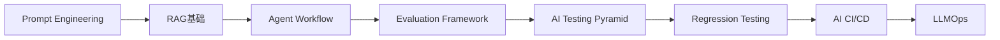
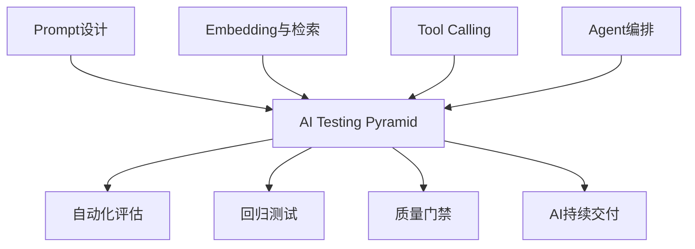
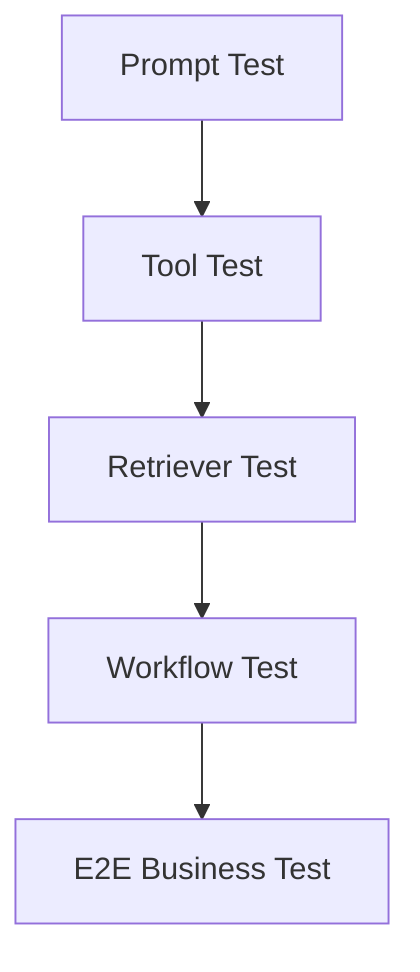
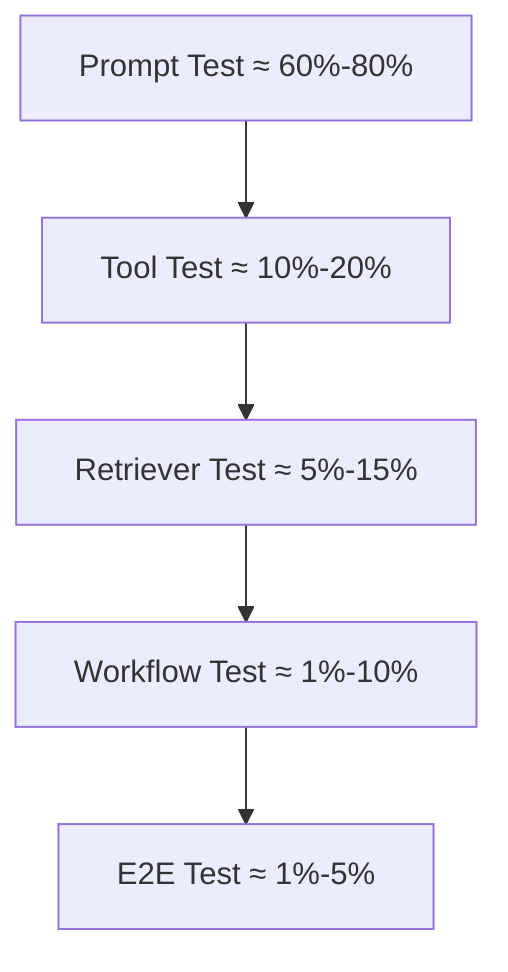
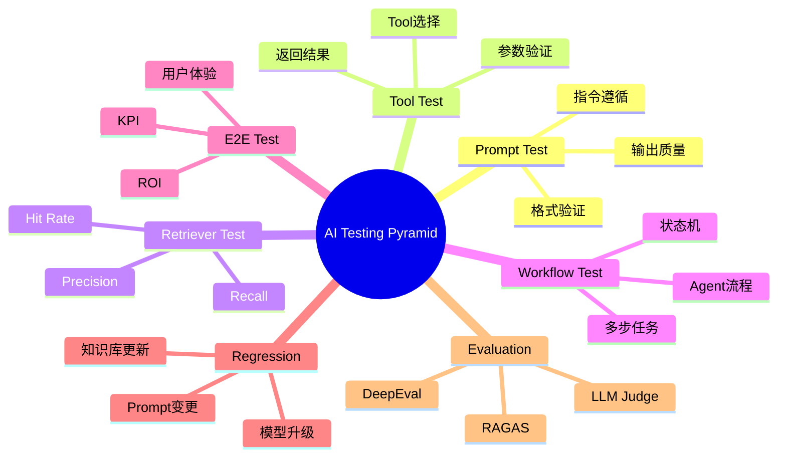

<!--
Chapter: 77
Node: KN-A-000002
Score: 92
Status: ✅ APPROVED
Attempt: 2
Round: 2
Generated: 2026-06-21 12:47:35
-->

# 第77章：AI Testing Pyramid — 测试分层设计（AI 测试金字塔）[L2-L3]

## Part 1：为什么要学这个？[认知冲突先行]

很多工程师第一次接触 AI 应用测试时，都会产生一种错觉。

他们认为：

* 单元测试覆盖率已经很高
* API 接口全部通过
* Agent 流程能够跑通
* Demo 演示效果很好

于是理所当然地认为：

> 系统已经具备上线条件。

结果上线后却出现各种问题：

* 用户问法稍微变化就答错
* 模型升级后历史能力消失
* RAG召回正常但答案质量下降
* Prompt优化修复一个问题却引入三个新问题

此时团队往往会陷入困惑。

因为按照传统软件工程的逻辑：

```text
代码通过测试 = 系统可靠
```

但在 AI 系统中：

```text
代码通过测试 ≠ AI能力稳定
```

这里出现了一个本质区别。

传统系统测试的是：

```text
确定性逻辑
```

AI系统测试的是：

```text
概率性行为
```

很多人因此得出错误结论：

> AI无法像传统软件那样测试。

事实上，Google、OpenAI、Anthropic、大型金融机构以及成熟 AI 产品团队都在大规模进行 AI 测试。

区别在于：

他们使用的是专门针对 AI 系统设计的测试体系。

这套体系的核心思想是：

> 将最便宜、最快速、最容易定位问题的测试放在底层，将昂贵但最接近真实用户的测试放在顶层。

这就是 AI Testing Pyramid。

本章将解决一个关键问题：

> 面对概率性输出的 AI 系统，如何构建一套既高效又可扩展的质量保障体系？

---

## Part 2：学习路径定位

AI Testing Pyramid 并不是 AI 入门阶段的知识。

它属于 AI 工程化体系中的质量保障层。

在掌握模型调用之前讨论测试体系意义不大。

而在系统即将进入生产环境时，没有测试体系则风险极高。

知识路径如下：



前置与后续知识关系：



学完本章后，你应该能够：

* 设计 AI 测试架构
* 规划测试分层策略
* 建立回归测试体系
* 将 Eval 集成到 CI/CD
* 为 RAG 和 Agent 构建质量门禁

---

## Part 3：用生活理解它

假设你经营一家物流公司。

每次货车出发前，如果都安排总经理亲自跟车检查整个运输过程，当然能够发现问题，但成本极高。

更合理的方法是：

* 仓库检查货物是否装对
* 调度检查路线是否正确
* 区域负责人抽查运输过程
* 客户评价最终服务质量

绝大部分问题会在前两层被发现。

AI Testing Pyramid 也是同样的逻辑。

便宜、快速、频繁的测试放在底层。

昂贵、真实、全面的测试放在顶层。

### 类比的边界

物流系统中的货物状态是确定性的。

AI 输出具有随机性。

因此 AI 测试关注的是：

* 质量区间
* 能力边界
* 稳定性趋势

而不是每次输出完全一致。

---

## Part 4：AI如何映射到传统概念

对于传统软件开发者，可以将 AI Testing Pyramid 理解为测试体系的扩展版本。

| 传统软件工程           | AI工程                    |
| ---------------- | ----------------------- |
| Unit Test        | Prompt Test             |
| Function Test    | Tool Test               |
| Service Test     | Retriever Test          |
| Integration Test | Workflow Test           |
| E2E Test         | Scenario Test           |
| Code Coverage    | Dataset Coverage        |
| Regression Test  | Eval Regression         |
| Error Detection  | Hallucination Detection |
| Performance Test | Quality + Latency Test  |
| CI Pipeline      | AI Evaluation Pipeline  |

传统系统关注：

```text
功能是否正确
```

AI系统关注：

```text
功能是否正确
回答是否可信
知识是否准确
能力是否退化
```

因此测试维度发生了扩展。

从：

```text
代码质量
```

扩展为：

```text
代码质量
+
模型质量
+
数据质量
+
推理质量
```

---

## Part 5：技术本质深讲

AI Testing Pyramid 的核心思想是：

> 测试越靠近底层，数量越多、速度越快、成本越低。

整体结构如下：



### 第一层：Prompt Test

这一层验证 Prompt 本身是否满足要求。

关注：

* 输出格式
* 指令遵循
* 内容约束
* 安全限制

例如：

```text
输入：
请输出JSON

期望：
合法JSON结构
```

Prompt Test 是成本最低的一层。

通常数量最多。

---

### 第二层：Tool Test

Agent 经常依赖外部工具。

例如：

* 数据库查询
* 天气查询
* CRM系统
* 搜索引擎

这一层验证：

* 是否调用正确工具
* 参数是否正确
* 返回结果是否正确

例如：

```text
查询北京天气

期望：
调用weather_tool
参数=Beijing
```

---

### 第三层：Retriever Test

RAG系统中特别重要的一层。

很多团队误以为：

```text
答案错误 = 模型问题
```

实际上大量问题来自：

```text
知识没有被召回
```

Retriever Test 关注：

* Recall
* Precision
* Hit Rate
* MRR
* NDCG

例如：

```text
用户问题：
退款规则是什么

Top3文档中是否包含标准退款政策
```

---

### 第四层：Workflow Test

这一层测试 Agent 或 Workflow。

验证：

* 状态转换
* 多步推理
* Tool链路
* Agent协作

例如：

```text
用户申请贷款
↓
身份验证
↓
征信查询
↓
额度评估
↓
审批结果
```

这里的问题通常已经涉及多个模块。

定位成本明显提高。

---

### 第五层：E2E Test

最接近真实用户的一层。

关注：

* 用户体验
* 业务指标
* KPI
* ROI

例如：

```text
客服机器人
解决率是否提升
```

或者：

```text
销售助手
转化率是否增长
```

---

### 金字塔设计原则

很多资料会给出类似下面的经验分布：



这里需要特别注意：

> 这不是行业标准，更不是固定规范。

它只是经验参考。

不同系统会出现巨大差异。

例如：

RAG系统：

```text
Prompt Test 较多
Retriever Test 占比很高
Workflow Test 较少
```

Agent系统：

```text
Workflow Test 大幅增加
Tool Test 显著增加
```

复杂 Multi-Agent 系统：

```text
Workflow Test 甚至可能成为主要测试层
```

真正重要的不是比例本身。

而是遵循一个原则：

> 能在低层发现的问题，就不要推到高层解决。

这样才能获得最高测试效率。

---

## Part 6：动手Demo（可运行代码）

下面实现一个简化版 Prompt Regression Test。

```python
from dataclasses import dataclass

@dataclass
class TestCase:
    name: str
    expected_keyword: str
    response: str

def run_prompt_test(case: TestCase) -> bool:
    return case.expected_keyword.lower() in case.response.lower()

test_cases = [
    TestCase(
        name="Python定义",
        expected_keyword="解释型",
        response="Python是一种解释型编程语言"
    ),
    TestCase(
        name="AI定义",
        expected_keyword="机器学习",
        response="人工智能包含机器学习和深度学习"
    ),
    TestCase(
        name="错误案例",
        expected_keyword="数据库",
        response="这是一个缓存系统"
    )
]

passed = 0

for case in test_cases:
    result = run_prompt_test(case)

    status = "PASS" if result else "FAIL"

    print(f"{case.name}: {status}")

    if result:
        passed += 1

total = len(test_cases)

print("-" * 30)
print(f"Passed: {passed}")
print(f"Failed: {total - passed}")
print(f"Success Rate: {passed / total:.2%}")
```

### 关键代码说明

`TestCase`

定义测试样本。

`expected_keyword`

定义验收条件。

`run_prompt_test`

检查输出是否满足条件。

循环执行测试。

统计通过率。

### 运行后你会看到什么

```text
Python定义: PASS
AI定义: PASS
错误案例: FAIL
------------------------------
Passed: 2
Failed: 1
Success Rate: 66.67%
```

这只是最简单的字符串验证。

真实项目通常还会引入：

* Embedding Similarity
* LLM-as-Judge
* Rule-based Evaluator
* RAGAS
* DeepEval

需要特别说明的是：

很多示例中会出现类似：

```text
semantic_similarity > 0.8
```

这样的判断条件。

但这并不是 Python 内置能力。

它通常依赖：

* Embedding模型
* 向量相似度计算
* 专门评估框架

例如：

```text
OpenAI Embedding
BGE Embedding
Sentence Transformers
RAGAS
DeepEval
```

实际工程中需要先生成向量，再计算余弦相似度或其他语义指标。

---

## Part 7：真实项目场景

### 场景：大型银行智能客服

业务背景：

某银行建设 RAG 客服系统。

覆盖：

* 信用卡
* 贷款
* 理财
* 保险

每天请求量超过百万。

模型升级频率极高。

包括：

* Prompt优化
* 模型版本升级
* 知识库更新

任何一次变更都可能影响业务。

---

### 测试体系设计

Prompt Layer：

```text
5000+
标准问答
```

Tool Layer：

```text
账户查询
额度查询
交易查询
```

Retriever Layer：

```text
Top5 Recall
Top10 Recall
MRR
```

Workflow Layer：

```text
贷款申请
身份认证
理赔流程
```

Business Layer：

```text
真实用户场景
```

---

### 质量门禁

CI阶段：

```text
Prompt Test
Tool Test
Retriever Test
```

预发布阶段：

```text
Workflow Test
```

灰度阶段：

```text
E2E KPI
```

形成完整质量闭环。

---

### 最终收益

上线事故下降：

```text
70%+
```

回归测试时间：

```text
3天
↓
30分钟
```

模型迭代频率：

```text
每月一次
↓
每周多次
```

---

## Part 8：这里容易踩坑

### 坑1：只有E2E测试

错误思路：

```text
人工验收所有场景
```

问题：

* 速度慢
* 成本高
* 无法定位问题

错误代码：

```python
def test_everything():
    pass
```

正确做法：

```python
def test_prompt():
    pass

def test_tool():
    pass

def test_retriever():
    pass

def test_workflow():
    pass
```

原因：

问题越早发现越便宜。

---

### 坑2：要求完全一致

错误代码：

```python
expected = "北京"
assert response == expected
```

模型输出：

```text
中国的首都是北京。
```

测试失败。

但答案实际上正确。

正确做法：

```python
assert "北京" in response
```

或者：

```python
score >= 0.8
```

其中 score 通常来自：

* Embedding相似度
* LLM Judge评分
* 专门评测框架

原因：

AI测试关注语义正确。

不是字符一致。

---

### 坑3：没有回归测试

错误流程：

```text
修改Prompt
直接上线
```

正确流程：

```text
修改Prompt
↓
运行Eval
↓
运行Regression
↓
上线
```

原因：

Prompt本质上也是代码资产。

任何修改都可能引入能力退化。

---

## Part 9：面试怎么答

### L1题目

什么是 AI Testing Pyramid？

回答框架：

* 分层测试思想
* 底层多顶层少
* 控制成本与覆盖率

---

### L2题目

为什么不能只做 E2E 测试？

回答框架：

* 成本高
* 执行慢
* 定位困难
* 无法高频运行

引出测试左移思想。

---

### L3题目

如何设计一个 RAG 系统测试体系？

回答框架：

分四层：

* Retriever Layer
* Generator Layer
* Workflow Layer
* Business Layer

关注指标：

* Recall
* Precision
* Faithfulness
* Relevancy
* Latency

接入 CI/CD。

形成自动质量门禁。

---

## Part 10：考点速查

* **Prompt Test**：验证提示词能力与格式要求。
* **Tool Test**：验证工具选择与参数正确性。
* **Retriever Test**：验证知识召回质量。
* **Workflow Test**：验证Agent执行链路。
* **E2E Test**：验证真实业务价值。

---

## Part 11：必背金句

**[分层原则]：测试越靠近底层，成本越低。**

**[左移原则]：问题越早发现，修复越便宜。**

**[语义原则]：AI测试关注语义正确而非字符一致。**

**[回归原则]：Prompt变更必须触发回归测试。**

**[业务原则]：最终质量由业务指标决定。**

---

## Part 12：快速参考表

| 概念             | 作用     | 示例值        |
| -------------- | ------ | ---------- |
| Prompt Test    | 验证输出质量 | 5000样本     |
| Tool Test      | 验证工具调用 | API调用      |
| Retriever Test | 验证召回效果 | Recall=92% |
| Workflow Test  | 验证流程   | Agent任务链   |
| E2E Test       | 验证业务价值 | 转化率提升      |
| Regression     | 防止退化   | 每日执行       |
| LLM Judge      | 自动评分   | GPT Judge  |
| Coverage       | 覆盖率统计  | 80%+       |

---

## Part 13：思维导图



---

## Part 14：本章小结

AI 系统并不是不能测试，而是不能完全照搬传统软件测试方法。

AI Testing Pyramid 的本质是在成本、速度、覆盖率之间找到最佳平衡点，把更多测试放在低成本层，把少量验证放在业务层。

从手工验证到自动化评估，从单点测试到分层测试，再到 AI CI/CD 和持续质量保障，这就是 AI 工程成熟度演进路径。

---

## Part 15：下一章预告

本章解决了：

> AI系统应该如何测试。

但新的问题马上出现。

测试体系已经有了。

测试数据从哪里来？

如何构建：

* 高质量评测集
* 高覆盖率数据集
* 长期有效的数据资产

以及：

* 如何发现盲区？
* 如何量化覆盖率？
* 如何持续扩充数据集？

下一章将进入：

**Eval Dataset Engineering（评测数据集工程）**

深入理解 AI 质量体系中最重要的资产——评测数据集。