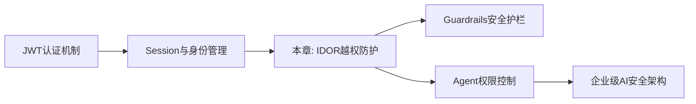
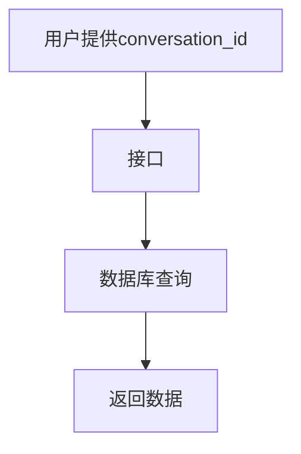
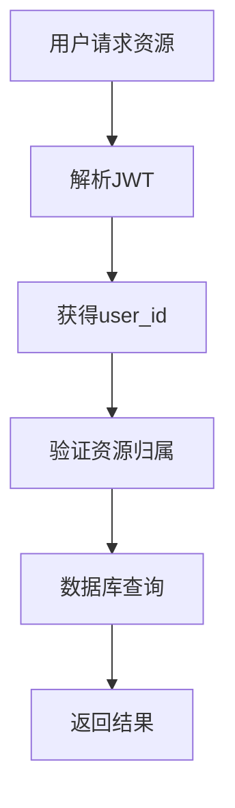
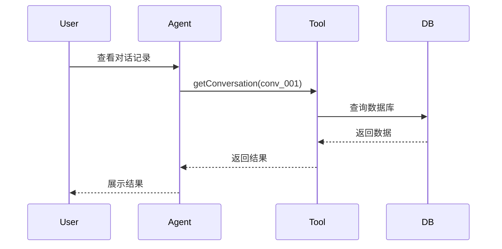
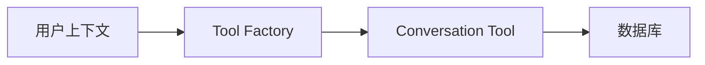
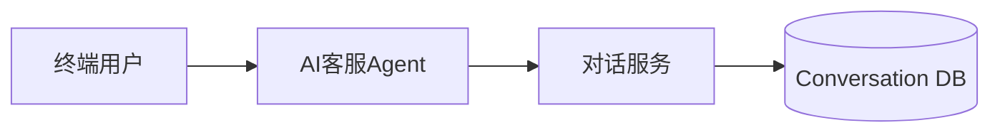
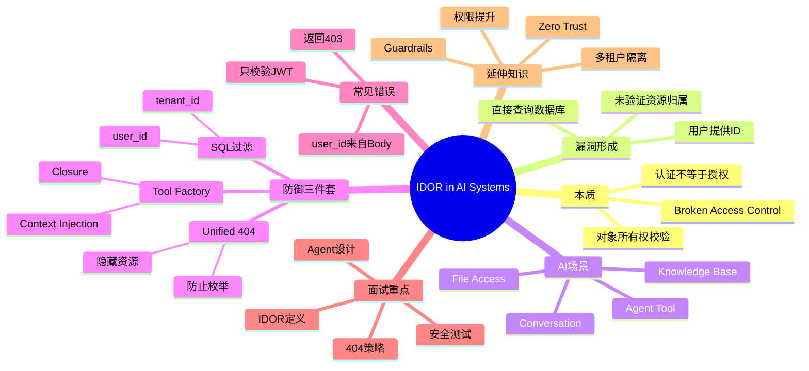

<!--
Chapter: 79
Node: KN-X-000002
Score: 92
Status: ✅ APPROVED
Attempt: 1
Round: 2
Generated: 2026-06-21 13:42:00
-->

# 第79章 IDOR in AI Systems（越权访问反模式） [L2]

## Part 1：为什么要学这个？[认知冲突先行]

某 AI 客服系统已经完成了 JWT 登录鉴权。

用户 A 登录成功。

用户 B 也登录成功。

开发团队认为：

> “接口都要登录才能访问，已经很安全了。”

结果一次安全测试中，测试人员发现：

用户 B 请求自己的会话：

```http
GET /api/conversations/conv_999
```

返回正常。

随后他把 URL 改成：

```http
GET /api/conversations/conv_001
```

系统居然返回了用户 A 的完整聊天记录。

里面甚至包含：

* 工单内容
* 用户联系方式
* 手机号脱敏前数据
* 内部客服备注

整个团队震惊了：

> 明明 JWT 验证已经通过了，为什么还能泄露别人的数据？

很多工程师第一次接触这个问题时，都会有一个错误认知：

> 只要完成登录认证（Authentication），系统就安全了。

实际上：

登录成功只说明：

> “你是谁。”

但系统还必须验证：

> “你能访问什么。”

这两个问题完全不同。

在安全领域：

* Authentication（认证）解决身份问题
* Authorization（授权）解决权限问题

而 IDOR（Insecure Direct Object Reference）恰恰发生在：

> 系统验证了“你是谁”，却忘记验证“这个资源是不是你的”。

在传统 Web 系统中，IDOR 已经是经典漏洞。

在 AI Agent 系统里，这类问题反而更加危险：

* Agent 自动调用工具
* LLM 自动拼接参数
* 多租户 SaaS 数据混存
* 对话历史、知识库、工单、文件统一管理

一旦权限设计错误：

Agent 很可能成为攻击者的自动化数据窃取工具。

本章要解决的核心问题是：

> 为什么 AI 系统特别容易出现 IDOR？以及如何通过数据库约束、工具封装和统一错误响应彻底消灭这类越权访问漏洞。

---

## Part 2：学习路径定位

IDOR 属于 AI 应用安全体系中的核心能力。

它不是 Prompt Engineering 问题。

也不是模型能力问题。

它属于：

> AI Native 工程中的访问控制设计能力。

学习位置如下：



如果把 AI 工程能力划分为 L0-L4：

| 层级 | 能力           |
| -- | ------------ |
| L0 | 调用大模型        |
| L1 | 构建 Agent     |
| L2 | 构建安全可靠 Agent |
| L3 | 企业级权限体系      |
| L4 | 多租户 AI 平台架构  |

本章位于：

> L2 → L3 的关键过渡点

因为从这一章开始：

你不再只是让 Agent 能工作。

而是让 Agent：

> 只能做它被允许做的事情。

前置知识：

* JWT
* API 设计
* Agent Tool Calling
* 数据库基础查询

后续知识：

* Guardrails
* Agent Privilege Escalation
* 多租户隔离
* 企业级权限模型（RBAC/ABAC）

---

## Part 3：用生活理解它

想象一个大型住宅小区。

进入小区需要门禁卡。

很多开发者认为：

> 有门禁卡的人就已经通过验证了。

于是发生了荒唐的事情：

任何进入小区的人，

只要知道房号：

```text
1栋101
```

就能直接打开别人家门。

显然这是灾难。

正确设计应该是：

* 门禁卡验证是否能进小区
* 房门钥匙验证是否能进具体房间

两层验证缺一不可。

对应到系统：

| 现实世界 | 软件系统           |
| ---- | -------------- |
| 门禁卡  | JWT认证          |
| 房号   | Resource ID    |
| 房门钥匙 | 权限校验           |
| 住户   | Resource Owner |

因此：

> 登录成功不等于拥有所有资源权限。

### 类比的边界

现实中的房门通常是物理隔离。

数据库里的数据并没有天然隔离。

所有数据可能都在同一张表里：

```sql
conversation
```

因此系统必须主动实现权限检查。

数据库不会自动帮你完成。

---

## Part 4：AI如何映射到传统概念

很多传统开发者认为：

> IDOR 不就是 Web API 的问题吗？

实际上 AI Agent 会放大这个问题。

因为 Agent 本质上也是 API 消费者。

对应关系如下：

| 传统系统           | AI系统            |
| -------------- | --------------- |
| 用户访问接口         | Agent调用工具       |
| URL参数          | Tool参数          |
| Resource ID    | conversation_id |
| Session        | User Context    |
| Controller权限检查 | Tool权限检查        |
| SQL过滤条件        | Tool内部过滤条件      |
| Web越权          | Agent越权         |

举个例子。

传统 Web：

```http
GET /orders/order_001
```

AI Agent：

```python
get_order("order_001")
```

本质完全一样。

如果后端代码是：

```python
db.get(order_id)
```

那就存在 IDOR 风险。

很多团队误以为：

> Agent 是自己写的，所以可信。

这是危险认知。

因为 Agent 参数最终来源于：

* 用户输入
* Prompt Injection
* 工具链推理结果
* 外部系统数据

任何一环被污染：

Agent 都可能带着恶意 ID 发起查询。

所以：

> 不可信的不是 Agent 本身，而是 Agent 所处理的数据。

这正是零信任思想（Zero Trust）在 AI 系统中的体现。

---

## Part 5：技术本质深讲

### 什么是 IDOR

IDOR（Insecure Direct Object Reference）指：

系统直接使用用户提供的对象 ID 操作资源，

却没有验证：

> 当前用户是否拥有该资源的访问权。

错误流程：



这里缺少关键步骤：

```text
Ownership Check
```

正确流程：



---

### 错误示例

危险代码：

```python
def get_conversation(conversation_id):
    return db.query(
        "SELECT * FROM conversations WHERE id=?",
        [conversation_id]
    )
```

开发者以为：

```text
JWT已经校验过了
```

所以省略权限判断。

实际上：

任何人知道 ID 都能访问。

---

### 正确做法：数据库层强制过滤

正确写法：

```python
def get_conversation(conversation_id, user_id):
    return db.query(
        """
        SELECT *
        FROM conversations
        WHERE id=?
        AND user_id=?
        """,
        [conversation_id, user_id]
    )
```

核心原则：

```text
WHERE id=? AND user_id=?
```

缺一不可。

如果是多租户系统：

```sql
WHERE id=?
AND tenant_id=?
AND user_id=?
```

这样即使：

* API漏检
* Agent出错
* 参数被篡改

数据库仍然会拒绝返回数据。

这属于：

> Defense in Depth（纵深防御）

---

### AI Agent 为什么更容易出现 IDOR

传统系统中：

```text
用户 → API → 数据库
```

链路较短。

AI 系统中：



问题来了。

很多团队设计工具时：

```python
get_conversation(
    conversation_id,
    user_id
)
```

然后允许 LLM 填充两个参数。

看起来很合理。

实际上极度危险。

因为模型可能生成：

```python
user_id="admin"
```

或者：

```python
user_id="user_A"
```

从而产生越权。

---

### Agent 工具的正确设计：工厂函数模式

错误设计：

```python
get_conversation(
    conversation_id,
    user_id
)
```

LLM 可以控制：

```text
conversation_id
user_id
```

正确设计：

```python
tool = create_conversation_tool(
    current_user_id
)
```

内部结构：



此时：

```python
tool.get_conversation(
    conversation_id
)
```

用户 ID 已经被封装进闭包。

LLM 根本接触不到。

这就是：

> 工厂函数封装权限上下文

也是企业级 Agent 最常见的设计模式。

---

### 为什么返回 404 而不是 403

很多开发者写：

```http
403 Forbidden
```

看起来合理。

实际上会泄露信息。

例如：

```text
conv_001 → 403
conv_002 → 403
conv_003 → 403
```

攻击者立刻知道：

```text
这些ID真实存在
```

只是不允许访问。

于是就能持续枚举。

正确设计：

```http
404 Not Found
```

无论：

* 资源不存在
* 资源存在但无权限

统一返回：

```http
404
```

攻击者无法判断：

```text
到底不存在
还是没权限
```

从而隐藏资源存在性。

这属于：

> Security Through Non-Disclosure（隐藏攻击面）

---

### IDOR 的一句话记忆法

很多人误以为：

> IDOR 是查错了 ID。

实际上恰恰相反。

IDOR 的本质是：

> 查对了 ID，却忘了查是不是你能查。

这也是整章最重要的一句话。

## Part 6：动手 Demo（可运行代码）

下面模拟一个最小版 AI 对话系统。

先看危险实现。

攻击者只要知道 conversation_id，就能读取任何人的数据。

```python
conversations = {
    "conv_001": {
        "user_id": "user_a",
        "content": "用户A的私人对话"
    },
    "conv_002": {
        "user_id": "user_b",
        "content": "用户B的私人对话"
    }
}


def vulnerable_get_conversation(conversation_id):
    return conversations.get(conversation_id)


def secure_get_conversation(conversation_id, current_user_id):
    conversation = conversations.get(conversation_id)

    if not conversation:
        return None

    if conversation["user_id"] != current_user_id:
        return None

    return conversation


print("=== 漏洞版本 ===")
print(
    vulnerable_get_conversation("conv_001")
)

print("\n=== 安全版本 ===")
print(
    secure_get_conversation(
        "conv_001",
        "user_b"
    )
)
```

### 关键代码解析

危险代码：

```python
return conversations.get(conversation_id)
```

系统只根据 ID 查询。

完全不校验所有权。

安全代码：

```python
if conversation["user_id"] != current_user_id:
    return None
```

增加资源归属验证。

只有资源拥有者才能访问。

### 运行后你会看到什么

漏洞版本：

```text
{
  'user_id': 'user_a',
  'content': '用户A的私人对话'
}
```

用户 B 可以直接看到用户 A 数据。

安全版本：

```text
None
```

访问被拒绝。

---

再看 Agent 工具层的推荐设计。

```python
def create_conversation_tool(current_user_id):

    def get_conversation(conversation_id):

        conversation = conversations.get(
            conversation_id
        )

        if not conversation:
            return None

        if conversation["user_id"] != current_user_id:
            return None

        return conversation

    return get_conversation


tool = create_conversation_tool("user_b")

print(
    tool("conv_001")
)
```

这里最重要的设计是：

```python
current_user_id
```

被封装进闭包。

LLM 无法修改。

---

## Part 7：真实项目场景

### 项目背景

某 AI 客服 SaaS 平台服务数千家企业客户。

系统架构：



所有企业的数据都存在同一个数据库中。

表结构简化如下：

```sql
conversations
-------------
id
tenant_id
user_id
content
created_at
```

### 出现的问题

开发团队认为：

```text
JWT已经认证
```

因此接口代码如下：

```sql
SELECT *
FROM conversations
WHERE id = ?
```

上线数月后安全审计发现：

攻击者通过遍历：

```text
conv_000001
conv_000002
conv_000003
...
```

成功获取大量其他企业客服数据。

属于典型 IDOR。

---

### 修复方案

第一层：

数据库强制过滤。

```sql
SELECT *
FROM conversations
WHERE id = ?
AND tenant_id = ?
AND user_id = ?
```

第二层：

工具工厂模式。

```python
tool = create_conversation_tool(
    current_user_context
)
```

第三层：

统一错误返回。

```http
404 Not Found
```

不暴露资源存在性。

---

### 修复结果

安全团队统计：

* IDOR 漏洞数量：12 → 0
* 接口扫描成功率：18% → 0.2%
* 数据泄露事件：归零
* 数据库无效查询下降约 35%

这说明：

> 安全设计不仅减少风险，也会提升系统效率。

---

## Part 8：这里容易踩坑

### 坑一：只做登录校验

错误代码：

```python
def get_conversation(
    conversation_id
):
    return db.query(
        "SELECT * FROM conversations WHERE id=?",
        [conversation_id]
    )
```

开发者思路：

```text
用户已经登录
```

实际问题：

```text
认证成功 ≠ 有权限访问资源
```

正确代码：

```python
def get_conversation(
    conversation_id,
    user_id
):
    return db.query(
        """
        SELECT *
        FROM conversations
        WHERE id=?
        AND user_id=?
        """,
        [conversation_id, user_id]
    )
```

---

### 坑二：user_id 从请求体获取

错误代码：

```python
user_id = request.json["user_id"]
```

攻击者：

```json
{
  "user_id": "admin"
}
```

系统直接相信。

发生越权。

正确代码：

```python
user_id = jwt_payload["user_id"]
```

或者：

```python
user_id = session.user_id
```

永远相信服务端身份源。

不要相信客户端输入。

---

### 坑三：返回 403

错误代码：

```python
if not has_permission:
    return 403
```

攻击者会得到：

```text
资源存在
但没有权限
```

正确代码：

```python
if not has_permission:
    return 404
```

统一隐藏资源存在性。

---

### 为什么团队经常犯这些错误

因为大家把注意力放在：

```text
身份认证(Authentication)
```

而忽略：

```text
对象授权(Authorization)
```

实际上：

大多数数据泄露事故都发生在授权层。

不是认证层。

---

## Part 9：面试怎么答

### L1：什么是 IDOR？举一个接口设计中的例子。

#### 回答框架

1. IDOR 全称是什么
2. 核心问题是什么
3. 举例说明
4. 给出修复方案

#### 要点

* Insecure Direct Object Reference
* 用户提供对象 ID
* 系统未验证资源归属
* 使用 WHERE id=? AND user_id=?

---

### L2：如果 AI Agent 可以调用数据库工具，你如何避免 IDOR？

#### 回答框架

1. 不信任 LLM 参数
2. user_id 不允许模型传入
3. 工具工厂模式
4. 数据库二次校验

#### 要点

* user_id 从上下文获取
* 工厂函数封装权限
* SQL 强制 tenant_id/user_id
* 多层防御

示例回答思路：

```text
Agent只传conversation_id，
user_id由服务端注入。
数据库层再次校验资源归属。
即使Prompt Injection成功，
也无法绕过权限检查。
```

---

### L3：为什么返回 404 而不是 403？

#### 回答框架

1. 枚举攻击是什么
2. 403会泄露什么
3. 404隐藏什么
4. AI系统中的价值

#### 要点

* 隐藏资源存在性
* 防止ID枚举
* 降低攻击面
* 统一错误响应策略

延伸讨论：

* 模糊错误信息
* 安全日志审计
* 统一异常处理
* 零信任架构

---

## Part 10：考点速查

### **IDOR 的定义**

根据用户提供的资源 ID 访问对象，却没有验证资源所有权。

### **数据库层必须二次校验**

即使应用层验证过，SQL 仍必须包含 user_id 或 tenant_id 条件。

### **user_id 来源**

必须来自 JWT、Session 或服务端上下文。

绝不能来自客户端请求体。

### **Agent 防御模式**

工厂函数封装 user_id。

禁止 LLM 控制权限参数。

### **404 优于 403**

隐藏资源存在性。

避免攻击者枚举有效资源。

---

## Part 11：必背金句

**[认证不是授权]：知道你是谁，不代表知道你能访问什么。**

**[资源归属必须验证]：每次访问对象都要检查所有权。**

**[权限下沉数据库]：安全校验不能只放在业务层。**

**[LLM 不管理权限]：模型负责推理，权限由系统控制。**

**[统一返回404]：隐藏资源存在性比暴露权限错误更安全。**

---

## Part 12：快速参考表

| 概念              | 作用      | 示例值                      |
| --------------- | ------- | ------------------------ |
| IDOR            | 防止越权访问  | conversation_id          |
| Resource Owner  | 资源拥有者   | user_a                   |
| tenant_id       | 租户隔离    | company_001              |
| user_id         | 用户隔离    | user_123                 |
| JWT             | 身份来源    | Bearer Token             |
| Tool Factory    | 权限封装    | create_tool()            |
| Ownership Check | 所有权验证   | owner == current_user    |
| 404策略           | 隐藏资源存在性 | Not Found                |
| SQL过滤           | 数据层授权   | WHERE id=? AND user_id=? |
| Zero Trust      | 默认不信任   | Always Verify            |

---

## Part 13：思维导图



---

## Part 14：本章小结

很多团队认为：

> 登录成功之后，访问控制问题就已经解决了。

实际上真正危险的地方恰恰在这里。

IDOR 的核心不是：

```text
查错了ID
```

而是：

```text
查对了ID
却忘了验证是不是你的
```

从能力成长路径看：

* L0：会调用 AI
* L1：会构建 Agent
* L2：能识别并修复 IDOR
* L3：能设计完整权限体系

掌握本章之后，你已经进入：

> AI 应用安全工程师的思维模式。

---

## Part 15：下一章预告

本章解决了一个关键问题：

> 用户是否能访问某个资源。

但还有一个更危险的问题没有解决：

> 用户访问的是自己的资源，可 Agent 会不会执行它本不该执行的操作？

例如：

* 删除数据库
* 访问敏感文件
* 调用高危工具
* 执行管理员操作

这已经不属于资源所有权问题。

而属于：

```text
权限边界问题
```

下一章将进入 AI 安全体系中的另一个高频风险：

> Agent Privilege Escalation（Agent 权限提升）

你将看到：

* Agent 为什么会获得超额权限
* Prompt Injection 如何触发权限滥用
* 最小权限原则如何落地
* 企业级 Agent 沙箱如何设计

从“谁能访问数据”进一步走向：

> “谁能执行什么操作”。