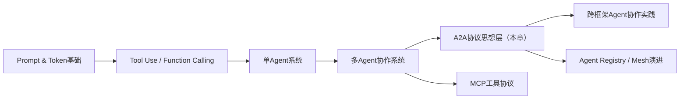
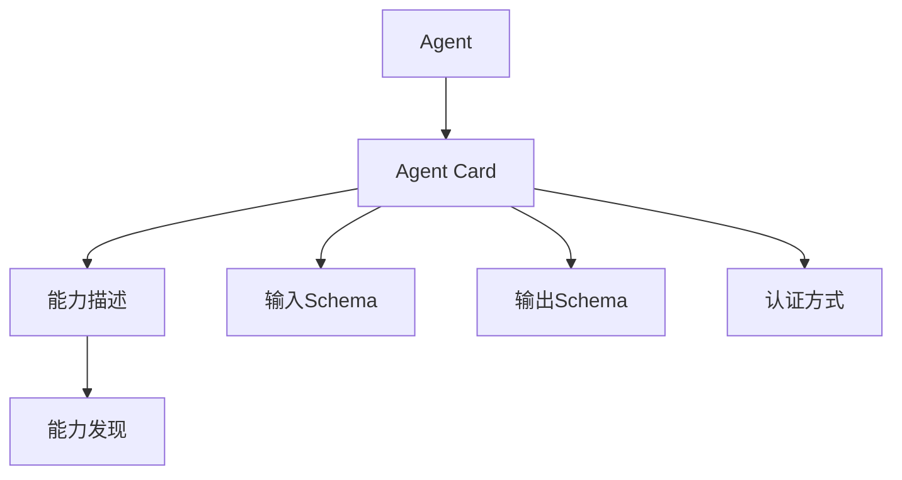
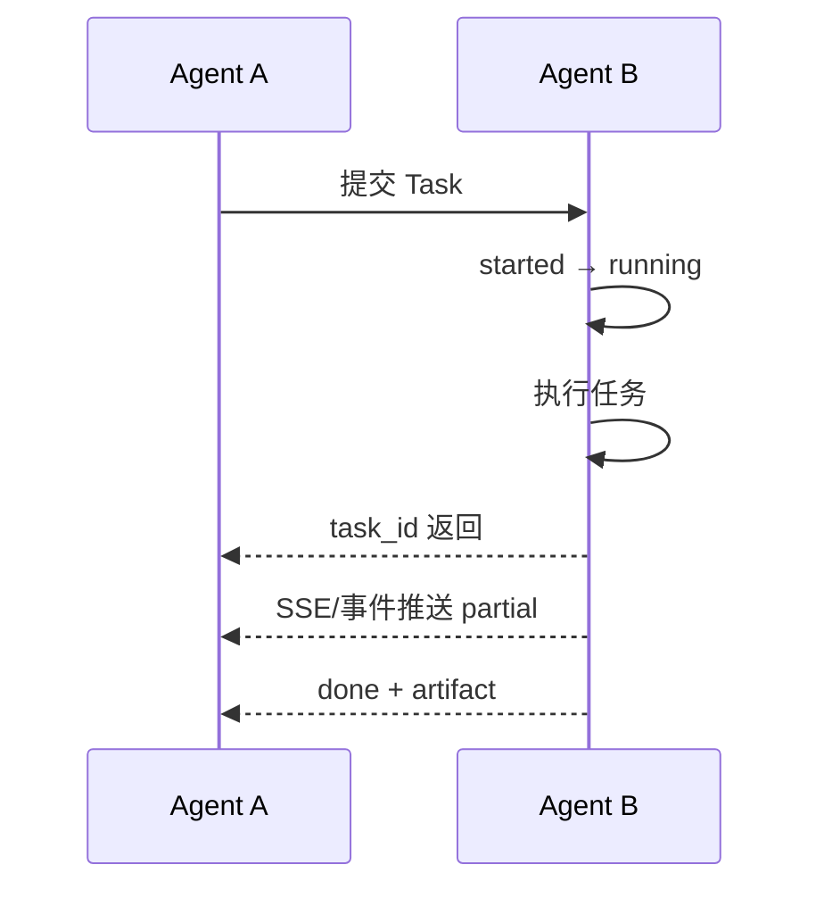
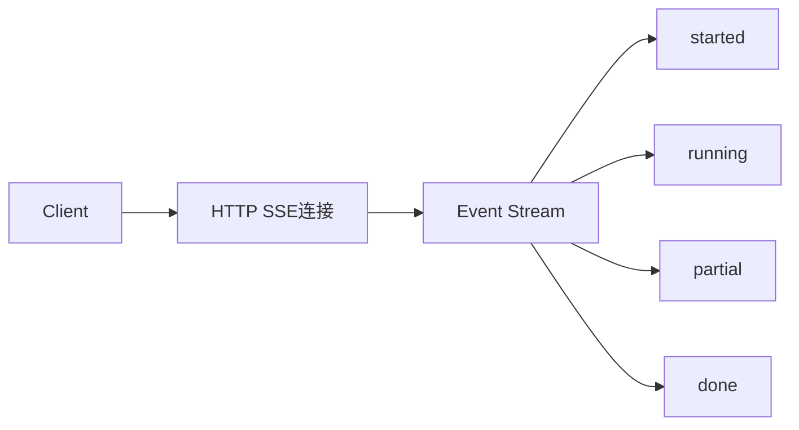
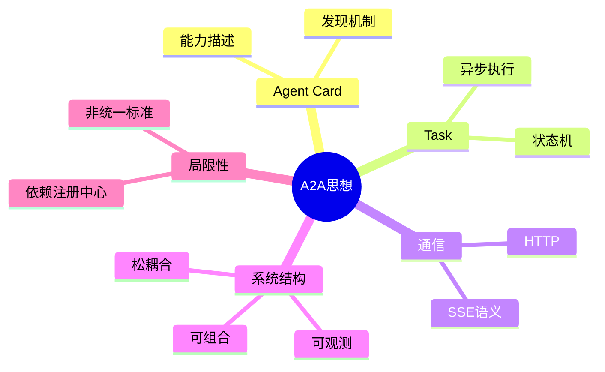

<!--
Chapter: 81
Node: KN-B-000001
Score: 90
Status: ✅ APPROVED
Attempt: 1
Round: 2
Generated: 2026-06-21 14:04:17
-->

# 第81章 Prompt Version Control（提示词版本控制） [L1-L2]

## Part 1：为什么要学这个？[认知冲突先行]

很多人第一次接触 A2A（Agent-to-Agent）时，会自然地把它理解成“Agent 之间互相调 HTTP API”。

这个理解看起来完全合理：
既然微服务之间是 REST API，那么 Agent 之间也用 REST API，不是顺理成章吗？

于是系统就这样设计了：

* 订单 Agent 提供 `/createOrder`
* 风控 Agent 提供 `/checkRisk`
* 库存 Agent 提供 `/reserveStock`

一切看起来都“工程化正确”。

直到系统开始扩展。

某电商团队从 3 个 Agent（订单 / 风控 / 库存）扩展到 8 个 Agent 后，接口数量从 12 条膨胀到 50+。更严重的是：任何一个 Agent 改动，都可能导致多条链路失效。排查一次跨 Agent 问题平均 2～3 小时，而且问题经常不是 bug，而是“调用关系失控”。

真正的灾难点在这里：

> 你以为你在做系统集成，实际上你在构建“接口蜘蛛网”。

关键误区是：

> Agent 之间通信 ≠ 普通 HTTP 调用

A2A 想解决的不是“怎么发请求”，而是：

* 不同框架 Agent（LangGraph / AutoGen / CrewAI）如何互相发现
* 如何描述能力，而不是硬编码接口
* 如何把“调用关系”变成“可组合的任务系统”

所以问题变成了：

> 是否能有一种方式，让 Agent 不需要“认识彼此”，也能协作完成任务？

A2A 的答案是：用协议思想重构协作方式，而不是增加 API 调用数量。

---

## Part 2：学习路径定位

需要先纠正一个关键认知：

A2A 目前并不是一个“统一成熟标准协议栈”，而更接近一种**协议设计范式 + 生态实践方向**。不同框架的实现方式并不完全一致。

它的价值在于：

> 提供“Agent 如何协作”的抽象标准，而不是规定唯一实现。

### 技术路径位置



### 层级定位（修正认知）

* L0：Token / Prompt
* L1：Function Calling
* L2：单 Agent 系统
* L2-L3：多 Agent 协作系统
* L3：A2A 协议思想层（非统一标准）
* L3+：Agent Mesh / 企业级编排系统

### 前置与后置

前置：

* LLM Function Calling
* HTTP / REST / JSON
* 基础 Agent 架构

后置：

* Agent Registry（发现系统）
* Agent Orchestration（编排系统）
* 分布式 Agent Mesh

---

## Part 3：用生活理解它

你可以把 A2A 想象成“城市交通规则的统一化过程”。

以前每个路口都有自己的规则：

* 有的红灯停 3 秒
* 有的红灯停 5 秒
* 有的甚至靠人工指挥

结果就是混乱。

后来统一了交通规则：

* 红灯停、绿灯行
* 所有人按同一套规则运行

A2A 做的事情类似：

* 每个 Agent 不再自己定义“怎么调用别人”
* 而是遵循统一的协作方式

但边界很重要：

### 类比不成立的地方

* 交通规则是强制标准
* A2A 不是强制标准，而是“可选协议思想”
* 不同系统可以部分实现 A2A，而不是必须完全一致

---

## Part 4：AI如何映射到传统概念

| 传统软件系统           | Agent/A2A系统      |
| ---------------- | ---------------- |
| REST API 服务      | Agent            |
| OpenAPI          | Agent Card（能力描述） |
| Request/Response | Task             |
| Webhook          | Push Event       |
| WebSocket        | SSE 流式事件         |
| 服务注册中心           | Agent Discovery  |
| 后台任务队列           | Task Queue       |

核心区别：

* REST API：关注“调用函数”
* A2A思想：关注“完成任务”

---

## Part 5：技术本质深讲

A2A 的本质可以拆成三个核心结构：

### 1. Agent Card（能力声明）

Agent Card 更像“能力说明书”，而不是 API 文档。



它解决的问题是：

> 你不用知道我是谁，只要知道我“能做什么”。

---

### 2. Task（任务模型）

A2A 不强调函数调用，而强调任务生命周期。



Task 是：

* 状态容器
* 执行上下文
* 可恢复单元

---

### 3. 长任务与 SSE（修正认知）

原来常见误解是：

> SSE = Queue + while True

这是错误的工程模拟方式。

更真实的理解是：

* SSE 是基于 HTTP 的**单向流式传输语义**
* 允许服务端持续推送事件
* 客户端通过连接保持接收
* 支持断线重连（Last-Event-ID）



关键点：

> SSE 是“流式通信语义”，不是队列模拟。

---

### 本质总结（修正版本）

A2A 的本质不是统一协议标准，而是一种：

> 面向 Agent 协作的任务化通信设计范式

它尝试解决：

* 从接口调用 → 任务流转
* 从强耦合 API → 松耦合能力发现
* 从同步执行 → 异步可观测系统

但注意：

> N×N → N×1 只是理想模型，实际仍依赖 Registry 和 Routing 系统。

---

## Part 6：动手Demo（可运行代码）

下面是一个**教学级 A2A 模拟系统**。

⚠️ 说明：该实现仅用于理解概念
生产环境应使用 FastAPI StreamingResponse / WebSocket / SSE 标准实现

```python
import uuid
import time
import threading
from queue import Queue

# Agent Card（能力声明）
agent_card = {
    "name": "OrderAgent",
    "capabilities": ["create_order"],
}

# Task 存储中心
tasks = {}

# 模拟事件流（教学用途）
event_stream = Queue()


def create_task(input_data):
    task_id = str(uuid.uuid4())
    tasks[task_id] = {
        "status": "started",
        "input": input_data,
        "output": None
    }
    return task_id


def execute_task(task_id):
    tasks[task_id]["status"] = "running"
    event_stream.put({"task": task_id, "event": "running"})

    time.sleep(1)
    event_stream.put({"task": task_id, "event": "partial"})

    time.sleep(1)
    tasks[task_id]["output"] = {"order_id": 999}
    tasks[task_id]["status"] = "done"
    event_stream.put({"task": task_id, "event": "done"})


def run_agent(input_data):
    task_id = create_task(input_data)

    t = threading.Thread(target=execute_task, args=(task_id,))
    t.start()

    return task_id


task_id = run_agent({"item": "laptop"})
print("Task Created:", task_id)

# 模拟事件消费（教学简化版）
while True:
    event = event_stream.get()
    print("EVENT:", event)
    if event["event"] == "done":
        break
```

运行结果特点：

* 立即返回 task_id（非阻塞）
* 后台异步执行
* 持续事件推送状态

---

## Part 7：真实项目场景

在真实系统中，A2A 常用于“多 Agent 编排层”。

例如电商推荐系统：

* 推荐 Agent：生成候选商品
* 库存 Agent：检查可用性
* 价格 Agent：动态优化价格
* 解释 Agent：生成推荐理由

### 执行链路

用户请求：

> “推荐一台办公电脑”

系统行为：

1. 推荐 Agent → Task A
2. 库存 Agent → Task B（并行）
3. 价格 Agent → Task C（并行）
4. 合并 Agent → 汇总 Artifact

### 技术架构

* Task Queue（Redis / MQ）
* Agent Registry（服务发现）
* Event Stream（SSE / WebSocket）
* Stateless Agent Execution

---

## Part 8：这里容易踩坑

### 坑1：误用同步调用模型

❌ 错误：

```python
result = requests.post("/agent").text
```

问题：

* 阻塞长任务
* 无法获取中间状态

✅ 正确：

```python
task_id = submit_task()
return task_id
```

---

### 坑2：忽略 Agent Card

❌ 错误：

* 直接写死 API 地址

后果：

* 无法动态发现 Agent
* 系统不可扩展

---

### 坑3：错误理解 SSE

❌ 错误：

* 用 Queue 模拟 SSE = 完整实现

问题：

* 没有断线恢复
* 没有 HTTP stream semantics

---

## Part 9：面试怎么答

### L1

A2A 是什么？

要点：

* Agent 间通信思想
* Task 化执行模型

---

### L2

A2A vs 普通 REST？

要点：

* REST：请求/响应
* A2A：任务/事件流
* A2A 更偏异步系统

---

### L3

如何设计长任务系统？

要点：

* Task 状态机
* SSE/WebSocket
* Registry + Routing
* 幂等设计

---

## Part 10：考点速查

* **Agent Card**：能力描述结构
* **Task 模型**：执行单元
* **SSE 语义**：流式事件机制
* **非 N×N 设计**：减少耦合复杂度（但非完全消除）
* **异步执行模型**：核心基础

---

## Part 11：必背金句

* A2A 不是协议标准，而是协作范式
* Agent 不调用函数，Agent 执行任务
* Card 是身份，Task 是行为
* SSE 是流，不是队列
* 复杂度不会消失，只会被重构

---

## Part 12：快速参考表

| 概念         | 作用      | 示例                      |
| ---------- | ------- | ----------------------- |
| Agent Card | 能力描述    | /.well-known/agent.json |
| Task       | 执行单元    | UUID                    |
| Artifact   | 输出结果    | JSON                    |
| SSE        | 流式事件    | partial update          |
| Registry   | Agent发现 | 服务注册                    |

---

## Part 13：思维导图



---

## Part 14：本章小结

A2A 并不是严格统一的协议标准，而是一种正在演进的 Agent 协作设计思想。它通过 Task 模型替代函数调用，通过 Agent Card 实现能力发现，通过 SSE 实现状态流式反馈。

从单 Agent 到多 Agent 系统，它提供了一种更结构化的协作方式，但实际复杂度仍依赖注册与路由体系。

---

## Part 15：下一章预告

A2A 解决的是：

> Agent 如何协作

但新的问题是：

> Agent 如何使用外部工具？

数据库、搜索引擎、代码执行器……

如果每个 Agent 都各自对接工具系统，就会重新回到 N×N 复杂度。

下一章我们将进入：

> MCP（Model Context Protocol）

它解决的是：

* Agent ↔ Tool 的标准化连接
* 工具能力的统一暴露
* AI 系统的“USB接口层”