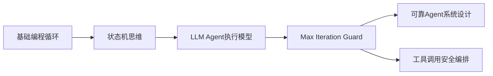
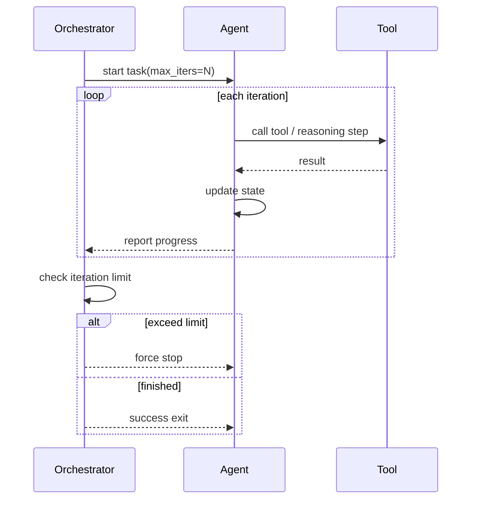
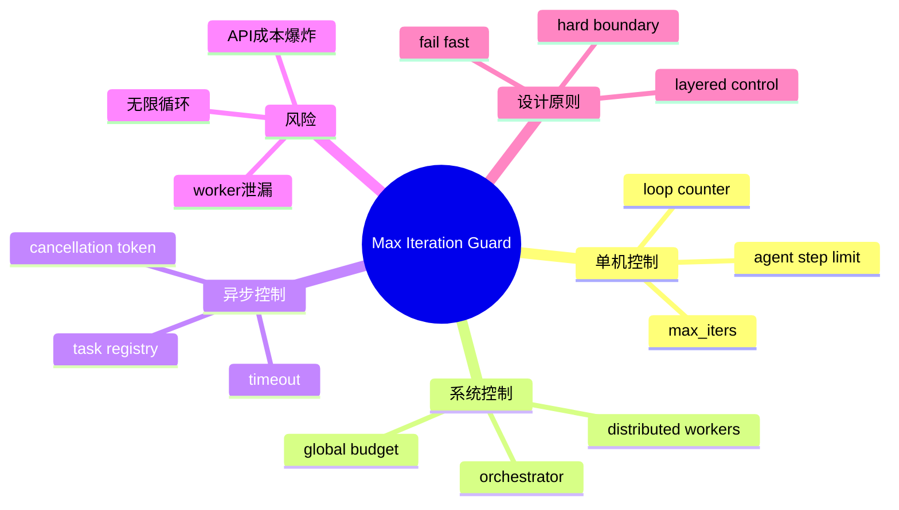

<!--
Chapter: 82
Node: KN-B-000002
Score: 93
Status: ✅ APPROVED
Attempt: 2
Round: 2
Generated: 2026-06-21 19:54:23
-->

# 第82章 Max Iteration Guard（最大迭代守卫） [L1-L2]

## Part 1：为什么要学这个？[L1-L2]

很多人第一次做 Agent 系统，会觉得“循环控制很简单”。

代码里写了 `for i in range(10)`，再加一个 `done=True` 的退出条件，于是心理上默认：
**系统不会无限运行。**

但现实会在上线那一刻打脸。

日志开始出现一种典型现象：

* 同一个任务重复调用工具
* 每一步都“看起来更接近答案”
* 但永远没有真正结束
* CPU 和 API 调用费用持续上涨

更诡异的是，你检查代码后发现：**每一层都有退出条件**。

问题不在“有没有写退出逻辑”，而在于：

> 在不可信执行环境里，“逻辑退出”永远不等于“系统终止”。

Max Iteration Guard（最大迭代守卫）要解决的，就是这种“逻辑看似正确但系统仍然失控”的问题。

本章核心问题：

**如何在 LLM Agent / Tool System 中建立一个“不可被绕过的强制终止边界”？**

---

## Part 2：学习路径定位 [L1-L2]

Max Iteration Guard 属于 Agent 系统的“执行安全层”，它不是优化逻辑，而是约束执行空间。



前置知识：

* for / while 循环机制
* 函数调用与递归
* Agent / Tool Calling 基本流程

后置能力：

* 可控 Agent 架构设计
* 防失控执行系统
* 多 Agent 协同安全控制

---

## Part 3：用生活理解它

你可以把它想象成“问路系统”。

你在一个陌生城市找出口，每一层楼都有人告诉你下一步怎么走。

正常逻辑是：

* 3～5 次询问应该能找到出口

但如果没有限制：

* 每一层的人都会给你“下一层更合理的线索”
* 你会不断继续问下去
* 直到资源耗尽也不会停

Max Iteration Guard 的作用是：

> 不管有没有找到出口，最多只能问 5 次，必须停止。

类比边界：

* ❌ 不保证找到正确答案
* ❌ 不优化路径质量
* ✅ 只负责“强制停止”

---

## Part 4：AI如何映射到传统概念

| 传统软件概念              | AI Agent 对应          |
| ------------------- | -------------------- |
| while(true)         | agent loop           |
| watchdog            | iteration guard      |
| timeout             | 时间限制                 |
| loop counter        | max_iters            |
| deadlock protection | tool loop protection |

传统系统的循环是确定性的，而 LLM 系统的循环是：

* 概率驱动
* 状态不稳定
* 工具调用可能“绕逻辑”

所以必须引入“硬约束”。

---

## Part 5：技术本质深讲

Max Iteration Guard 的本质不是“限制循环”，而是：

> 在不可信执行系统中引入不可协商的执行上限（execution boundary）



关键组件：

* max_iters：硬性上限
* current_iter：执行计数器
* stop_condition：业务成功条件
* force_stop：系统级终止信号

核心原则：

> 成功条件可以变化，但失败边界必须固定。

---

## Part 6：动手Demo（可运行代码）

这里展示一个更贴近生产的结构：**外层 Orchestrator 控制 max_iters，Agent 只负责执行单步逻辑。**

```python
# 模拟：外层调度器（Orchestrator）控制迭代上限
# Agent 本身不负责“是否停止”，只负责“执行一步”

def agent_step(state):
    # 模拟 agent 推理过程
    # 前2步失败，第3步成功
    if state["progress"] < 2:
        return {"done": False, "output": "thinking..."}
    return {"done": True, "output": "final answer"}

def orchestrator(task, max_iters=5):
    state = {"progress": 0}

    for i in range(max_iters):  # ← 关键：外层强制上限
        state["progress"] = i

        result = agent_step(state)

        print(f"[orchestrator] iter={i}, output={result['output']}")

        if result["done"]:
            print("任务完成，正常退出")
            return result

    # 强制兜底终止
    print("Max Iteration Guard 触发：强制终止任务")
    return {"done": False, "output": "force stopped"}

orchestrator("demo-task")
```

关键点：

* agent_step：只做“单步推理”
* orchestrator：负责“是否继续执行”
* max_iters 永远在外层，而不是 agent 内部

运行结果：

* iter=0,1：thinking...
* iter=2：final answer
* 或达到上限强制终止

---

## Part 7：真实项目场景

Max Iteration Guard 在生产环境里通常不是“单一循环限制”，而是**系统级安全策略的一部分**。

### 1. Tool Calling Agent（搜索 / 代码执行）

典型问题：

* agent 反复 search 同一问题
* rewrite query → search → fail → rewrite 无限循环

工程补充：

* orchestrator 设置 global max_steps
* 每个 tool call 计入 step budget
* 防止 API cost 爆炸

---

### 2. 分布式 Worker 系统（关键补充）

在多 worker 架构中：

* 单 worker 有 max_iters
* 但系统仍可能整体失控

因此需要：

* **global step budget（全局步数上限）**
* Redis / queue 记录全局 iteration count

否则会出现：

> 每个 worker 都“没超限”，但系统整体超限

---

### 3. Cancellation Token（异步任务取消）

生产系统中常见设计：

* 用户取消任务
* 超时触发
* 系统负载过高

实现方式：

* cancellation_token = shared state
* 每一轮 iteration 检查 token

---

### 4. Retry vs Iteration Guard（重要区分）

很多工程师会混淆：

* retry = “同一步失败重试”
* iteration guard = “整体执行次数上限”

错误模式：

* retry 无限嵌套 loop
* 外层没有 guard
* 结果仍然无限执行

---

## Part 8：这里容易踩坑

### 坑1：把 retry 当 guard

❌ 错误：

```python
while True:
    try:
        result = call_tool()
        break
    except:
        continue
```

问题：

* 永远不会停
* retry 没上限

✔ 正确：

```python
for i in range(3):
    try:
        result = call_tool()
        break
    except:
        if i == 2:
            raise
```

---

### 坑2：只限制 agent，不限制 orchestrator

❌

* agent 有 max_iters
* 外层 workflow 没限制

✔

* 必须“双层 guard”

  * local guard（agent）
  * global guard（system）

---

### 坑3：忽略 async 任务泄漏

错误模式：

* task timeout 了
* 但 worker 仍在后台跑

解决：

* cancellation token
* task registry cleanup

---

## Part 9：面试怎么答

### L1：Max Iteration Guard 是什么？

* 控制循环执行次数的安全机制
* 防止无限执行

---

### L2：为什么 Agent 系统必须要它？

* LLM 输出不可预测
* tool calling 可能循环
* 逻辑条件不可靠

---

### L3：生产级如何设计？

* orchestrator 控制 max_iters
* global + local 双层限制
* cancellation token 支持
* retry 与 iteration 分离
* distributed global budget

---

## Part 10：考点速查

* **Iteration Guard**：限制执行次数的硬边界机制
* **Orchestrator Control**：由调度器控制执行流
* **Global Step Budget**：分布式系统统一限制
* **Retry vs Loop Control**：重试不等于迭代控制

---

## Part 11：必背金句

* 没有上限的循环，本质就是生产事故
* LLM 不负责停止，系统必须负责停止
* retry 是局部恢复，guard 是全局约束
* 逻辑正确不等于执行安全
* 所有 Agent 都必须被“外部控制”

---

## Part 12：快速参考表

| 概念                 | 作用     | 示例值        |
| ------------------ | ------ | ---------- |
| max_iters          | 单任务上限  | 5 / 10     |
| global_budget      | 系统上限   | 1000 steps |
| cancellation_token | 取消信号   | true/false |
| retry_limit        | 工具失败重试 | 3          |

---

## Part 13：思维导图



---

## Part 14：本章小结

Max Iteration Guard 的核心不是限制“循环”，而是限制“不可控执行”。

在 LLM Agent 系统中，任何逻辑都可能失效，因此必须依赖外部强约束。

成长路径：

* L0：写循环逻辑
* L1：意识到可能失控
* L2：引入 max_iters
* L3：构建 orchestrator + global budget + cancellation system

---

## Part 15：下一章预告

本章解决的是“执行次数不能无限”。

但还有一个更隐蔽的问题：

> 即使不无限执行，如果每一步都太慢，系统仍然会“悄悄崩溃”。

下一章将进入：

**Timeout Guard（超时守卫）与执行时间预算系统**

它解决的是：
不是“会不会停”，而是“什么时候必须停”。