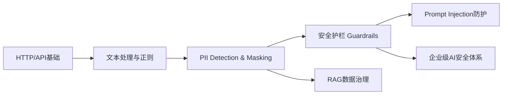
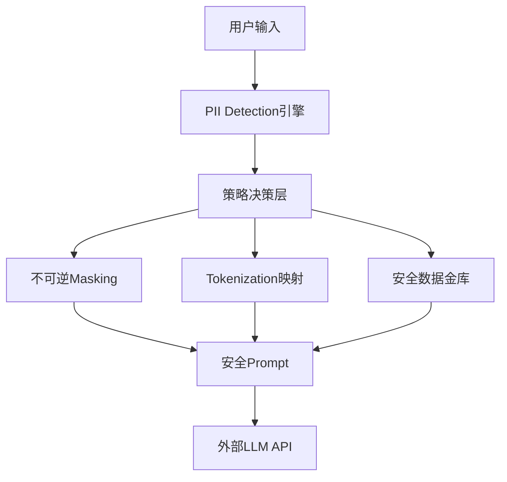
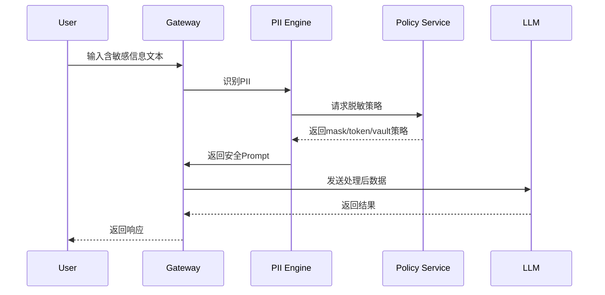
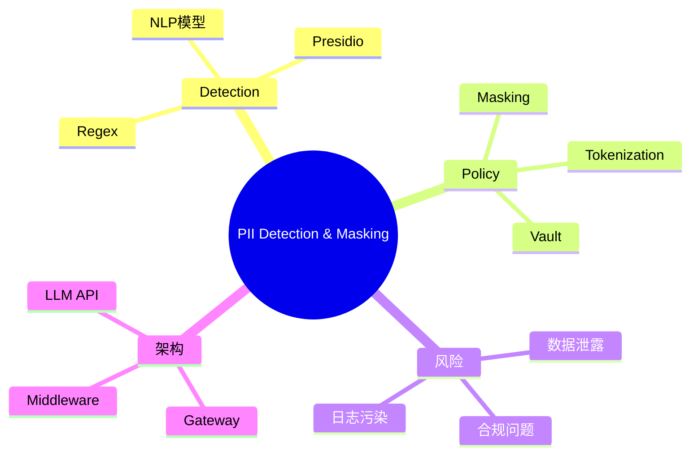

<!--
Chapter: 83
Node: KN-B-000003
Score: 91
Status: ✅ APPROVED
Attempt: 1
Round: 2
Generated: 2026-06-21 14:39:03
-->

# 第83章 PII Detection & Masking（个人信息检测与脱敏） [L2-L3]

---

## Part 1：为什么要学这个？[认知冲突先行]

很多人第一次做AI应用时都有一种“理所当然”的安全感：

只要在用户输入进来之后，先做一次正则过滤，再把敏感字段替换掉，最后再丢给LLM——系统就安全了。

看起来很合理。

直到某天你在审计日志里看到一行记录：

> “用户输入：身份证110101199001011234，已发送至第三方API”

你才意识到问题根本不在“有没有脱敏”，而在于——**你以为你在控制数据，但实际上数据早就离开你的系统边界了。**

更隐蔽的是：
很多泄露不是发生在“输出”，而是发生在：

* API调用链路日志
* tracing系统
* LLM服务商的请求记录
* 甚至向量化前的embedding缓存

所以真正的问题不是“有没有打码”，而是：

> 你是否在数据出域之前，就完成了控制？

本章要解决的核心问题是：

> 如何在任何外部模型调用之前，构建一个可靠的PII数据出域控制系统？

---

## Part 2：学习路径定位

PII脱敏不是孤立模块，而是AI安全链路的第一道闸门。



你当前的位置：

* L0：调用API即可
* L1：理解输入输出结构
* L2（本章）：理解“数据不能直接出域”
* L3：构建完整AI安全与合规系统

前置知识：

* 正则表达式
* HTTP请求流程
* 基础文本处理

后置能力：

* 企业级数据治理
* Prompt Injection防护体系
* AI合规架构设计

---

## Part 3：用生活理解它

可以把PII脱敏理解成机场安检。

你不能把真实护照信息“交给后面所有人”，你只能：

* 在入口检查身份
* 用一个“编号标签”替代真实身份
* 后续所有流程只使用编号

但这个类比有边界：

* 安检是可追溯的
* PII脱敏理想状态是不可逆的（不是隐藏，是替换）

也就是说：

> 安检是“你知道你是谁”，脱敏是“系统不需要知道你是谁”

---

## Part 4：AI如何映射到传统概念

如果你有后端经验，PII系统本质是“出域前的数据防火墙”。

| 传统系统概念  | AI系统中的对应                    |
| ------- | --------------------------- |
| WAF     | Prompt输入过滤                  |
| SQL注入防护 | Prompt Injection防护          |
| 日志脱敏    | LLM输入PII Masking            |
| DTO字段过滤 | Prompt Payload Sanitization |
| 数据审计    | PII类型统计                     |

关键差异：

传统系统：

> 数据泄露发生在数据库或接口层

AI系统：

> 数据泄露发生在“调用外部模型的一瞬间”

---

## Part 5：技术本质深讲

PII Detection & Masking 的本质不是“识别字符串”，而是一个**数据出域控制系统**。

但在企业级实践中，它远比“替换文本”复杂。

### 一个关键现实：脱敏并不总是不可逆

在高合规场景中，存在多种策略：

* **不可逆masking**：直接替换（安全优先）
* **tokenization（可控映射）**：原始值→token，可在授权时回溯
* **vault-based masking**：敏感数据存储在安全库，通过权限换取原值

这意味着：

> 脱敏不是一种操作，而是一种“数据治理策略选择”

---

### 系统结构



---

### Detection Engine

通常是混合系统：

* 正则（手机号/邮箱）
* 规则系统（银行卡BIN）
* NLP模型识别（地址/姓名）
* 组件化库：Microsoft Presidio

---

### Policy Layer（关键）

这里才是“智能”的核心：

* 金融数据 → tokenization
* 医疗数据 → vault隔离
* 普通PII → mask
* 内部可信数据 → passthrough

---

### Sequence流程



---

### 一个重要修正认知

❌ 错误理解：

> 数据进入LLM就完全不可控

✔ 正确理解：

> 数据进入第三方模型服务后，通常无法完全依赖应用层控制其在日志、监控、训练侧的使用方式，需要结合服务商数据政策与企业合规配置共同定义边界

---

## Part 6：动手Demo（可运行代码）

构建一个“策略型PII系统”（mask + token + vault模拟）

```python
import re
import hashlib

# 模拟vault存储
VAULT = {}

PHONE_PATTERN = r"1[3-9]\d{9}"
EMAIL_PATTERN = r"[a-zA-Z0-9_.+-]+@[a-zA-Z0-9-]+\.[a-zA-Z0-9-.]+"

def hash_token(value: str) -> str:
    return hashlib.sha256(value.encode()).hexdigest()[:12]

def mask_phone(text: str):
    return re.sub(PHONE_PATTERN, "[PHONE]", text)

def mask_email(text: str):
    return re.sub(EMAIL_PATTERN, "[EMAIL]", text)

def vault_store(value: str):
    token = hash_token(value)
    VAULT[token] = value
    return f"[VAULT:{token}]"

def process(text: str):
    # 1. 处理邮箱
    text = mask_email(text)

    # 2. 处理手机号（支持tokenization示例）
    phones = re.findall(PHONE_PATTERN, text)
    for p in phones:
        text = text.replace(p, vault_store(p))

    # 3. 兜底mask
    text = mask_phone(text)

    return text


raw = "联系人13812345678，邮箱test@mail.com"

safe = process(raw)

print("原始输入:", raw)
print("处理后:", safe)
print("Vault内容:", VAULT)
```

---

运行结果你会看到：

* 邮箱 → 直接mask
* 手机号 → token化存储
* 原始值进入vault，而不是LLM

核心意义：

> 你不只是“替换数据”，而是在“分流数据命运”

---

## Part 7：真实项目场景

在一个跨境电商客服系统中，每天处理超过 20 万条用户对话。

### 初始架构（错误）

```python
User → Prompt → LLM → Response
```

问题：

* 用户地址进入第三方模型日志
* 客服系统无法审计数据流向
* GDPR与PIPL双重风险

---

### 改造后架构

```python
User
 ↓
Gateway
 ↓
PII Detection Layer
 ↓
Policy Engine
 ↓
Masked / Tokenized Prompt
 ↓
LLM（外部服务）
 ↓
Response
```

---

### 工程现实补充

需要注意：

* LLM服务通常有自己的日志策略
* tracing系统可能记录prompt
* embedding服务可能缓存原文片段

因此系统设计原则是：

> 不依赖外部服务“不会记录”，而是默认“它可能记录”

---

### 技术选型

* 规则层：regex
* NLP层：Microsoft Presidio
* token系统：hash + vault
* 存储：Redis / secure DB
* 审计：只记录“类型”，不记录“内容”

---

## Part 8：这里容易踩坑

### 坑1：只做输出脱敏

❌ 错误：

```python
response = llm(prompt)
safe = mask_pii(response)
```

问题：

* 输入阶段已经泄露

---

### 坑2：日志记录原文

❌ 错误：

```python
logger.info(user_input)
```

✔ 正确：

```python
logger.info("PII detected: phone=1, email=1")
```

---

### 坑3：规则思维过度依赖

❌ 错误：

* “只过滤身份证关键词”

问题：

* 数字序列仍然泄露

---

## Part 9：面试怎么答

### L1：什么是PII？

* 可识别个人身份的信息
* 包括直接/间接标识

---

### L2：为什么必须在LLM前处理？

* 数据进入外部API后不可完全控制
* 日志与trace可能记录原文

---

### L3：如何设计企业级PII系统？

要点：

* detection + policy分离
* mask + token + vault三模式
* 全链路审计（只记录类型）
* RAG数据同样需要处理

---

## Part 10：考点速查

**PII分类体系**
→ 身份/金融/医疗/行为数据

**处理时机**
→ 必须在API Gateway之前

**策略分层**
→ mask / token / vault

**日志治理**
→ 禁止记录原文PII

**第三方风险**
→ 不假设外部服务不记录数据

---

## Part 11：必背金句

[PII不出域原则]：数据在进入外部系统前必须处理完毕
[脱敏不是删除，是重构]：数据语义保留但身份消失
[日志即风险源]：调试系统也是攻击面
[策略优于规则]：系统必须支持多种脱敏方式
[边界意识]：安全从“信任最小化”开始

---

## Part 12：快速参考表

| 概念            | 作用    | 示例            |
| ------------- | ----- | ------------- |
| Masking       | 不可逆替换 | [PHONE]       |
| Tokenization  | 可回溯映射 | VAULT:abc123  |
| Vault         | 安全存储  | 原始数据隔离        |
| Detection     | PII识别 | regex / NLP   |
| Policy Engine | 决策层   | mask vs token |

---

## Part 13：思维导图



---

## Part 14：本章小结

PII系统不是“过滤器”，而是数据流控制系统。

它决定数据在进入AI系统之前的命运。

成长路径：

* L0：直接调用LLM
* L1：简单正则过滤
* L2：理解出域控制
* L3：构建策略化数据治理系统

---

## Part 15：下一章预告

我们已经控制了“什么数据可以进入模型”。

但新的问题出现了：

> 如果输入本身被精心构造，用来“操控模型行为”怎么办？

下一章：

**Prompt Injection（提示词注入攻击）**

你会看到：

* 输入如何变成“攻击载体”
* 为什么系统提示词并不安全
* AI系统如何被“反向操控”