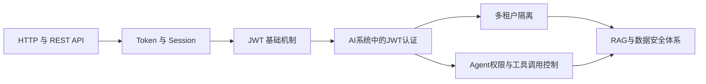
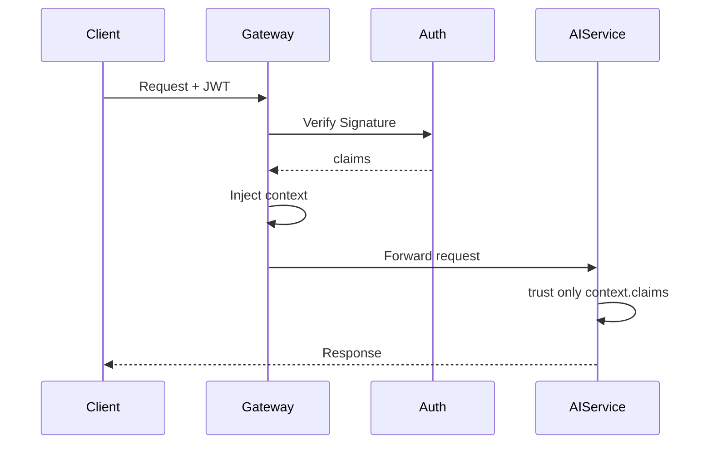
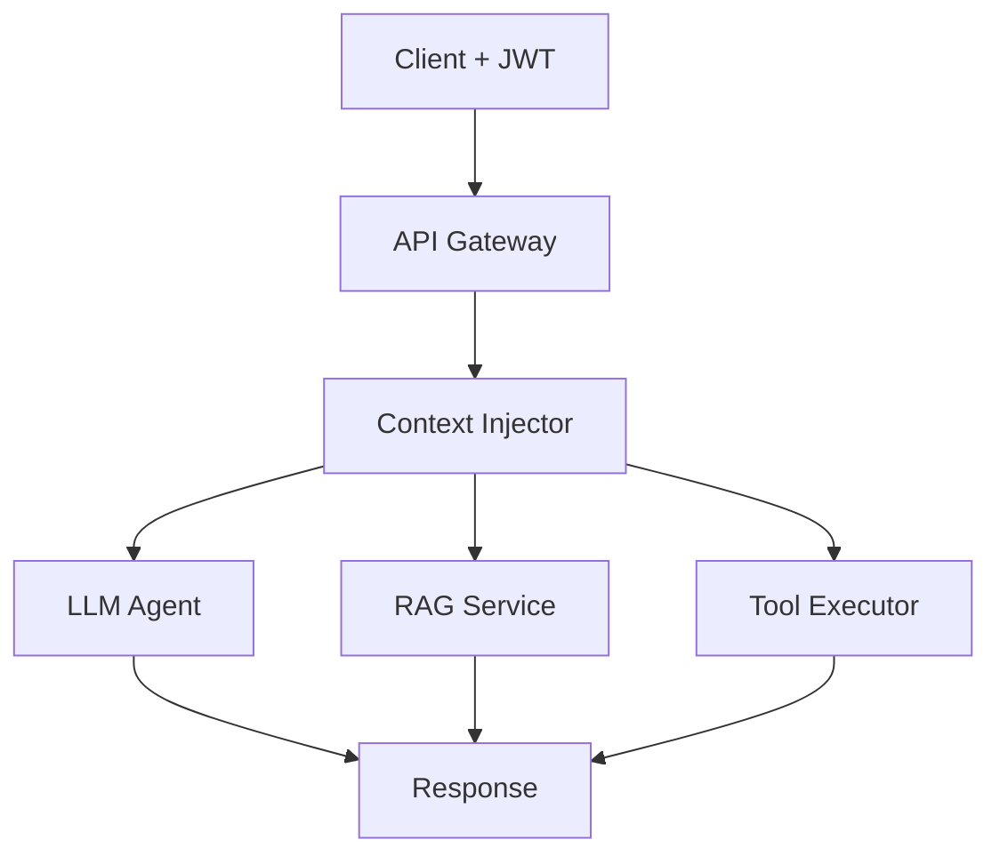
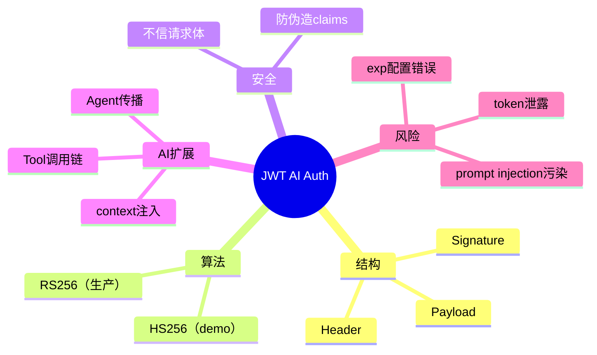

<!--
Chapter: 84
Node: KN-B-000004
Score: 92
Status: ✅ APPROVED
Attempt: 1
Round: 2
Generated: 2026-06-21 14:42:59
-->

# 第84章 JWT Auth in AI Systems（AI 系统的 JWT 认证） [L2]

## Part 1：为什么要学这个？认知冲突先行 [L2]

很多 AI 系统在做权限设计时，会出现一种“看起来很专业”的写法：

```python
user_id = request.body["user_id"]
tenant_id = request.body["tenant_id"]
```

然后工程师补上一句心理安慰：

> “反正前端会带 JWT，我们只是顺手做个兼容。”

系统上线后运行稳定，日志干净，接口响应正常，甚至压测表现优秀。

直到某一天，一个低权限用户发起请求：

```json
{
  "user_id": 123,
  "tenant_id": "tenant_B"
}
```

但他的 JWT 实际是：

```json
{
  "user_id": 123,
  "tenant_id": "tenant_A"
}
```

系统仍然“正常工作”，只是数据开始错位：

* tenant_A 用户访问到 tenant_B 数据
* embedding 向量被跨租户污染
* Agent 工具调用记录混杂

问题的本质不是“有没有鉴权”，而是：

> 系统同时存在两套身份来源，而你信错了那一套。

在 AI 系统中，这个错误会被放大，因为：

* 一次请求可能跨 5~10 个服务
* Agent 会携带上下文继续传播
* tool calling 会继承“错误身份”

所以本章要解决的核心问题是：

> 如何确保 AI 系统中“唯一可信身份源”只能来自 JWT claims，而不是任何请求输入或上下文污染？

---

## Part 2：学习路径定位

JWT 在 AI 系统中是“身份传播中枢”，而不是单点登录机制。



学习路径定位：

* L0：HTTP 基础
* L1：Session / Token
* **L2：JWT 在 AI 系统中的工程化落地（本章）**
* L3：Agent 权限与工具链控制
* L4：AI 安全体系（Policy + Guardrails）

前置知识：

* HTTP 请求生命周期
* 基础认证机制

后置知识：

* Tool Calling 安全
* RAG 数据隔离
* Agent 权限控制系统

---

## Part 3：用生活理解它

JWT 可以理解成“不可伪造的身份证 + 权限说明书”。

你去医院挂号：

* 你递交身份证（JWT）
* 系统不听你口头说“我是VIP”
* 系统只读取身份证上的信息

但关键点是：

> 医院不会相信你写在纸上的自我介绍，只相信身份证。

### 类比边界

* ❌ 身份证内容是加密的
  → JWT 默认只是 Base64 编码
* ❌ 医护人员知道你是谁
  → 服务端必须先验签才信任
* ❌ 你可以改身份证内容
  → JWT 一旦篡改签名即失效

---

## Part 4：AI如何映射到传统概念

JWT 在 AI 系统中替代的是“Session + 权限查询 + 上下文传递”的组合。

| 维度   | 传统 Web 系统  | AI / Agent 系统    | Agent/Tool Chain 场景 |
| ---- | ---------- | ---------------- | ------------------- |
| 身份存储 | Session DB | JWT claims       | identity 在多服务间传播    |
| 权限判断 | RBAC 查询    | token 内嵌 roles   | tool 权限继承           |
| 请求处理 | 单服务调用      | 多服务链路            | context injection   |
| 状态管理 | 服务端状态      | 无状态 JWT          | 跨工具状态传播             |
| 数据隔离 | DB filter  | tenant_id filter | context 贯穿全链路       |

AI 系统的关键变化：

> 身份不再局限于请求入口，而是会“沿着 Agent 链路传播”。

---

## Part 5：技术本质深讲

JWT 在 AI 系统中的本质不是“登录凭证”，而是：

> 一个可验证的“分布式身份与权限载体”。

结构：

* Header：算法（HS256 / RS256）
* Payload：claims（user_id / tenant_id / quota / roles）
* Signature：防篡改

### HS256 vs RS256（关键修正点）

在 AI 系统设计中：

* HS256：对称加密（适合 demo / 单体系统）
* RS256：非对称加密（适合生产 / 分布式系统）

⚠️ 关键澄清：

> 本章 Demo 使用 HS256 只是为了简化运行环境，不代表生产推荐。

生产环境必须使用 RS256，因为：

* 公钥可分发到多个服务
* 私钥集中保护（Auth Server）
* 避免跨服务泄露风险

---

### JWT 验证流程（AI视角）



---

### exp 验证机制（重要修正）

很多人误以为：

> “JWT 自动会检查 exp”

这是**不完全正确的理解**。

在 PyJWT 中：

* `exp` 是否验证取决于 `options`
* 默认情况下（PyJWT ≥ 2.x）：

  * `verify_exp = True`（默认开启）
* 但如果开发者手动关闭 options，就可能失效

示例：

```python
jwt.decode(token, key, algorithms=["RS256"])
```

默认会验证 exp。

但如果：

```python
jwt.decode(token, key, algorithms=["RS256"], options={"verify_exp": False})
```

则会绕过过期检查。

> 结论：exp 不是“天然安全”，而是“默认启用的规则”，可以被关闭。

---

### AI系统关键字段

* user_id：用户身份
* tenant_id：租户隔离核心
* quota：成本控制
* roles：工具权限控制
* exp：生命周期控制

---

## Part 6：动手Demo（可运行代码）

这个 Demo 分两部分：

* HS256：简化版本（用于本地演示）
* RS256：生产等价思路说明

### HS256 Demo（简化版）

```python
import jwt
import datetime

SECRET = "demo-secret"

def create_token(user_id, tenant_id):
    payload = {
        "user_id": user_id,
        "tenant_id": tenant_id,
        "exp": datetime.datetime.utcnow() + datetime.timedelta(minutes=30)
    }
    return jwt.encode(payload, SECRET, algorithm="HS256")


def verify(token):
    # 默认会验证 exp（除非显式关闭）
    return jwt.decode(token, SECRET, algorithms=["HS256"])


DB = {
    "tenant_A": "DATA_A",
    "tenant_B": "DATA_B"
}


def ai_request(request):
    claims = verify(request["token"])

    # ❗只信 JWT
    tenant_id = claims["tenant_id"]

    return DB.get(tenant_id)


token = create_token("u1", "tenant_A")

fake_request = {
    "token": token,
    "tenant_id": "tenant_B"
}

print(ai_request(fake_request))
```

运行结果：

```python
DATA_A
```

---

### RS256 在生产中的意义（概念说明）

生产结构：

* Auth Server：签名（私钥）
* AI Service：验签（公钥）

优势：

* 公钥泄露无风险
* 多服务共享验证能力
* 更适合微服务 + Agent 架构

---

## Part 7：真实项目场景

### 企业 AI Agent 平台

系统结构：

* Chat API
* RAG 检索服务
* Tool Execution Service
* Billing 服务

JWT 承载：

* tenant_id（隔离）
* quota（计费）
* roles（工具权限）



关键设计原则：

* JWT 只在 Gateway 解一次
* 下游禁止解析原始请求身份字段
* context 贯穿全链路

---

## Part 8：这里容易踩坑

### 错误1：信任请求体身份

```python
tenant_id = request.body["tenant_id"]
```

正确：

```python
tenant_id = context.claims["tenant_id"]
```

---

### 错误2：JWT 永不过期

```json
{ "exp": 9999999999 }
```

风险：

* token 泄露永久有效
* 无法强制下线

---

### 错误3：JWT 存敏感信息

```json
{ "password": "123456" }
```

错误原因：

> JWT 不是加密，只是可解码结构

---

### 错误4（AI特有）：Prompt Injection 污染 claims 使用链

攻击方式：

* prompt injection 修改 tool 参数
* tool 将参数写入 context.claims cache
* 下游服务误信“伪 claims”

示例风险：

```python
# ❌危险模式
context["tenant_id"] = tool_output["tenant_id"]
```

攻击路径：

* LLM 被 prompt injection
* tool 返回伪造 tenant_id
* context 被污染
* 后续服务越权访问

正确做法：

> JWT claims 只能来自验签结果，不能来自任何 tool/LLM 输出

---

## Part 9：面试怎么答

### L1：JWT结构

* Header / Payload / Signature

---

### L2：为什么不能信 request.user_id

核心：

* 可伪造
* JWT 已签名可信

---

### L3：AI系统如何设计JWT体系

要点：

* RS256 + 公私钥分离
* Gateway统一验签
* context传播
* 短TTL + refresh token
* roles/quota 内嵌

---

## Part 10：考点速查

* JWT不是登录，是身份载体
* tenant_id 必须来自 claims
* exp 默认验证但可被关闭
* HS256 vs RS256 本质区别
* AI系统中JWT负责跨服务传播

---

## Part 11：必背金句

* 不信请求体，只信签名
* JWT不是数据加密，是声明结构
* AI系统的身份是跨服务传播的
* 一次错误信任会污染整个链路
* claims 是唯一可信上下文来源

---

## Part 12：快速参考表

| 概念        | 作用   | 示例    |
| --------- | ---- | ----- |
| user_id   | 用户标识 | 123   |
| tenant_id | 租户隔离 | A     |
| roles     | 权限控制 | admin |
| quota     | 成本限制 | 1000  |
| exp       | 生命周期 | 3600s |

---

## Part 13：思维导图



---

## Part 14：本章小结

JWT 在 AI 系统中是跨服务身份载体，而不是登录工具。

系统安全的核心不是“有没有 token”，而是“信不信 token”。

当身份进入 Agent 链路，它就从认证问题变成系统设计问题。

---

## Part 15：下一章预告

JWT 解决的是“你是谁”。

但 AI Agent 还有更危险的问题：

> “你能做什么？”

下一章：

**Agent Privilege Escalation（AI Agent 权限提升与最小权限控制）**