<!--
Chapter: 85
Node: KN-B-000005
Score: 91
Status: ✅ APPROVED
Attempt: 1
Round: 2
Generated: 2026-06-21 15:11:42
-->

# 第85章 Secret Management（密钥安全管理） [L1-L2]

## Part 1：为什么要学这个？[认知冲突先行]

某 AI 工程师认为自己已经掌握了安全配置。

他的做法看起来也很合理：

* OpenAI API Key 放在 `.env`
* `.env` 放在 GitHub 私有仓库
* 仓库只有团队成员可访问

于是他认为：

> “这已经足够安全了。”

三个月后，公司财务发现异常。

API 费用从每天一百多美元突然飙升到数千美元。

安全团队调查发现：

* API Key 曾经进入 Git 提交历史
* GitHub 安全扫描机器人已经检测到该密钥
* 某些自动化爬虫获取了历史提交中的 Secret
* 攻击者正在持续调用 API

最让人震惊的是：

即使开发者后来删除了 `.env` 文件，

**Git 历史里仍然保留着完整的 Key。**

这暴露了很多工程师的一个误区：

> 私有仓库 ≠ 安全仓库

很多人以为：

* 不公开仓库就没问题
* 不把密码写进代码就没问题
* .env 文件天然安全
* 环境变量天然安全

实际上：

Secret 的攻击面远远不只是代码文件。

它可能出现在：

* Git 历史
* CI/CD 日志
* Docker 镜像
* Agent Prompt
* LLM 调用日志
* 错误堆栈
* 前端源码
* 浏览器 Network 面板

对于 AI 系统而言，这个风险甚至更大。

因为 AI 应用往往连接：

* OpenAI API
* Anthropic API
* 向量数据库
* 用户数据库
* 第三方 SaaS

一旦 Secret 泄露，损失不仅是费用。

还可能包括：

* 用户数据泄露
* 服务停机
* Key 被封禁
* 合规风险

本章要解决的问题是：

> Secret 到底应该放在哪里？
>
> 为什么 .env 只是开发阶段方案？
>
> 生产环境如何做到“服务能拿到 Key，但开发者看不到 Key”？

---

## Part 2：学习路径定位

很多开发者学习 AI 时关注：

* Prompt
* RAG
* Agent

却忽略了真正导致生产事故最多的问题：

> Secret 管理。

从能力成长路径看，它位于工程化能力的核心位置。

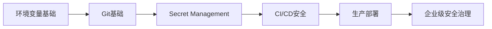

### L0 → L4 成长路径

| 层级 | 能力                      |
| -- | ----------------------- |
| L0 | API Key直接写代码            |
| L1 | 使用.env管理配置              |
| L2 | 区分开发/测试/生产Secret        |
| L3 | 使用Vault或Secrets Manager |
| L4 | 实现自动轮换与审计体系             |

### 前置知识

需要掌握：

* Git 基础
* 环境变量
* Python 配置读取
* Docker 基础

### 后续知识

掌握 Secret Management 后，会继续学习：

* CI/CD Security
* Guardrails
* IAM 权限管理
* Agent Privilege Escalation
* 企业级安全架构

Secret Management 是很多后续安全能力的基础设施。

如果 Secret 管理失败，

后面所有安全设计都会失去意义。

---

## Part 3：用生活理解它

想象你把银行卡密码记在手机备忘录里。

你觉得：

> “手机有密码，很安全。”

但你忘了一件事。

备忘录被同步到了：

* 平板
* 云端
* 电脑
* 浏览器插件

只要其中任何一个设备被攻破，

所有银行卡都会暴露。

Secret 也是一样。

API Key 一旦进入：

* Git
* 日志
* 镜像
* 配置文件

它就会开始不断复制和传播。

你已经无法确认到底谁拿到了它。

### 类比的边界

银行卡密码通常由人主动输入。

Secret 则经常由程序自动读取。

因此 Secret 管理不仅是存储问题，

更是：

* 权限控制问题
* 自动认证问题
* 审计问题
* 生命周期管理问题

这也是为什么企业最终会使用 Vault 或 Secrets Manager。

---

## Part 4：AI如何映射到传统概念

很多 AI 工程师觉得 Secret Management 是新东西。

其实不是。

它本质上是传统安全工程在 AI 时代的延续。

### 对应关系

| 传统软件    | AI系统             |
| ------- | ---------------- |
| 数据库密码   | OpenAI API Key   |
| SSH私钥   | Agent Tool Token |
| LDAP账号  | 向量数据库凭证          |
| JWT签名密钥 | LLM访问令牌          |
| 配置中心    | Secrets Manager  |
| 用户权限系统  | IAM Role         |

### 传统架构

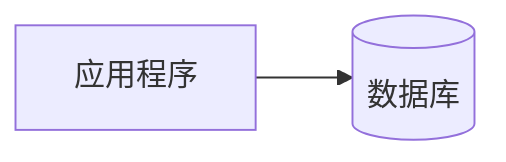

开发者通常只需要保护数据库密码。

### AI架构

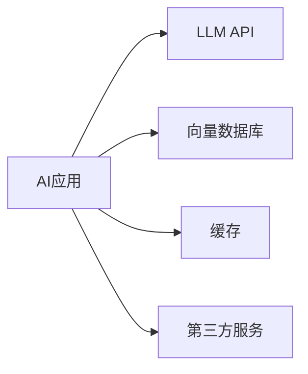

一个 AI 应用可能同时持有：

* 5个以上 API Key
* 多套数据库密码
* 多个第三方 Token

攻击面比传统系统大得多。

因此 Secret Management 从“可选能力”变成了“必备能力”。

---

## Part 5：技术本质深讲

### 什么是 Secret

Secret 指的是：

> 一旦泄露，就可能造成经济损失或安全风险的信息。

常见 Secret 包括：

| 类型      | 示例                  |
| ------- | ------------------- |
| LLM Key | OpenAI API Key      |
| 数据库密码   | PostgreSQL Password |
| Token   | GitHub Token        |
| JWT私钥   | RSA Private Key     |
| 加密密钥    | AES Key             |
| 云服务凭证   | AWS Access Key      |

核心原则只有一句：

> Secret 不进代码库。

研究员素材中的记忆锚点值得直接背下来：

> 进入代码库的 Secret，都假设已经公开。

---

### Secret 生命周期

一个 Secret 会经历完整生命周期。

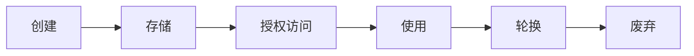

很多团队只关注创建和使用。

真正成熟的团队会关注：

* 谁访问过
* 什么时候访问
* 是否需要轮换
* 是否已经泄露

---

### 三层存储模型

### 第一层：开发环境

开发机通常使用：

```text
.env
```

示例：

```text
OPENAI_API_KEY=xxxx
DATABASE_PASSWORD=xxxx
```

但必须满足：

```text
.gitignore
```

包含：

```text
.env
```

否则就会进入 Git 历史。

---

### 第二层：CI/CD环境

GitHub Actions：

* GitHub Secrets

GitLab：

* CI Variables

Jenkins：

* Credentials Store

原理如下：

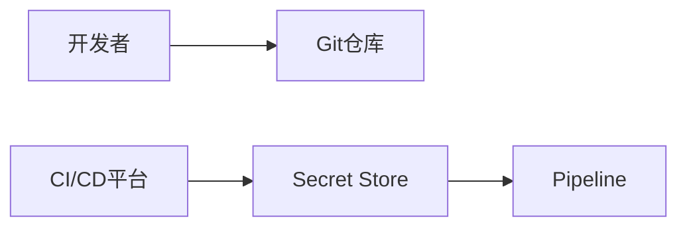

流水线运行时动态注入 Secret。

代码仓库中不保存明文。

---

### 第三层：生产环境

企业级系统通常使用：

* AWS Secrets Manager
* HashiCorp Vault

架构如下：

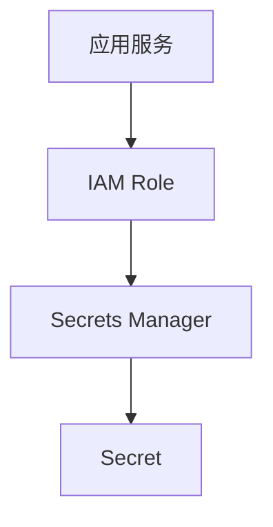

这里最重要的思想是：

> 服务不保存密码。

服务只保存身份。

例如：

* ECS Task Role
* EC2 Role
* Kubernetes Service Account

服务启动时：

1. 使用 IAM 身份认证
2. 请求 Secrets Manager
3. 获取 Secret
4. 加载到内存

整个过程没有硬编码密码。

---

### 为什么生产环境不推荐纯环境变量

很多团队会说：

> 我已经用环境变量了。

问题在于：

环境变量缺少：

* 集中管理
* 自动轮换
* 审计日志
* 权限控制

例如：

你很难回答：

* 谁读取了这个 Key？
* 什么时候读取的？
* 是否被轮换？
* 哪个服务正在使用？

Secrets Manager 可以回答这些问题。

环境变量通常做不到。

---

### 最小权限原则

Secret Management 与权限控制密不可分。

错误设计：

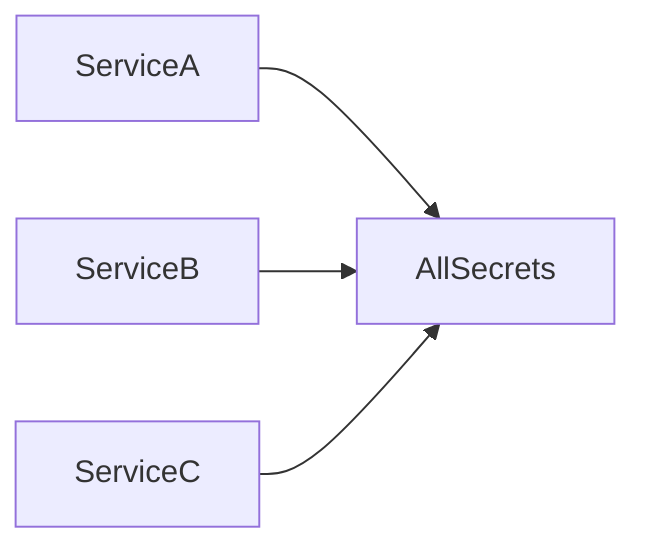

任何服务被攻破，

全部 Secret 都暴露。

正确设计：

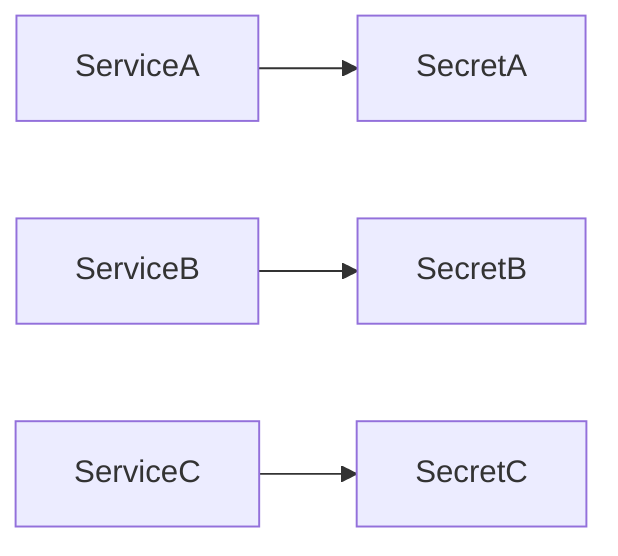

每个服务只能访问自己的 Secret。

即使单个服务失陷，

影响范围也被限制。

---

### 密钥轮换（Rotation）

很多团队泄露 Key 后直接删除旧 Key。

这是危险操作。

正确流程：

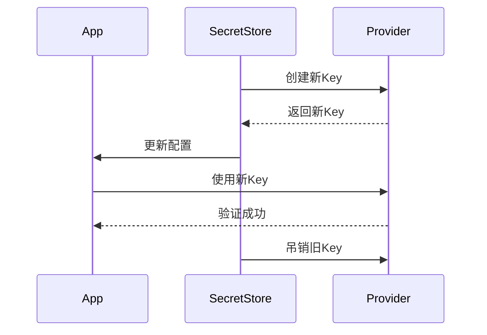

这样可以避免：

* 服务中断
* 大规模故障
* 回滚失败

---

### 本章核心公式

Secret Management 不只是保存密码。

真正的公式是：

> Secret Management = 安全存储 + 权限控制 + 自动认证 + 审计追踪 + 密钥轮换

当团队能够做到：

* 开发用 `.env`
* `.env` 不提交 Git
* CI 使用 Secret Store
* 生产使用 Vault/Secrets Manager
* 服务通过 IAM Role 自动取钥

就已经具备了现代 AI 系统的基础安全能力。

## Part 6：动手Demo（可运行代码）

理论都懂了，但很多人的代码仍然是这样的：

```python
OPENAI_API_KEY = "sk-xxxxxxxxxxxxxxxx"
```

问题不在于能不能运行。

问题在于：

它已经违反了 Secret Management 的第一原则。

下面演示正确做法。

### 项目结构

```text
project/
├── app.py
├── .env
└── .gitignore
```

### .env

```text
OPENAI_API_KEY=sk-demo-secret-key
```

### .gitignore

```text
.env
```

### app.py

```python
import os
from pathlib import Path

def load_env(filepath=".env"):
    env_file = Path(filepath)

    if not env_file.exists():
        raise FileNotFoundError(".env file not found")

    for line in env_file.read_text().splitlines():
        line = line.strip()

        if not line or line.startswith("#"):
            continue

        key, value = line.split("=", 1)
        os.environ[key] = value

def get_secret(name):
    value = os.getenv(name)

    if not value:
        raise ValueError(f"Missing secret: {name}")

    return value

load_env()

api_key = get_secret("OPENAI_API_KEY")

masked = api_key[:5] + "..." + api_key[-4:]

print("Secret loaded successfully")
print("API Key:", masked)
```

### 关键代码解析

```python
load_env()
```

加载 `.env` 文件。

---

```python
os.environ[key] = value
```

将配置写入环境变量。

---

```python
api_key = get_secret("OPENAI_API_KEY")
```

读取 Secret。

---

```python
masked = api_key[:5] + "..." + api_key[-4:]
```

日志中永远不要打印完整 Secret。

---

### 运行后你会看到什么

```text
Secret loaded successfully
API Key: sk-de...-key
```

输出中不会暴露完整密钥。

这就是日志脱敏（Masking）的基础实践。

---

## Part 7：真实项目场景

### AI SaaS 平台的密钥泄露事故

某 AI SaaS 创业公司提供：

* AI 文档生成
* AI 客服
* AI 搜索

架构如下：

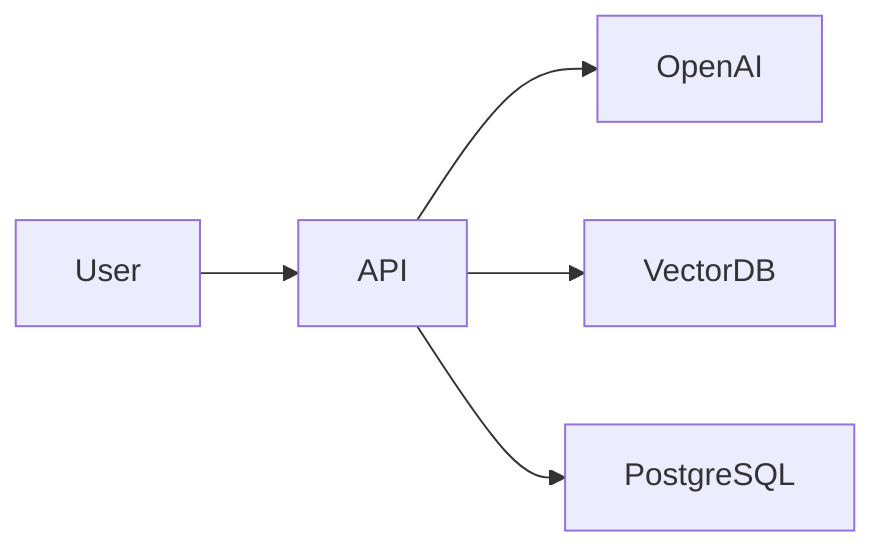

### 初始设计

开发团队为了方便部署：

* 所有服务共用一个 OpenAI Key
* Key 放在 GitHub 仓库 `.env`
* CI/CD 直接读取配置文件

他们认为：

> 仓库是私有的，所以没问题。

---

### 事故发生

一次代码扫描中：

* Secret 被识别
* Git 历史中存在旧版本 Key
* 攻击者获取 Key

结果：

* 日请求量从 120 万 Token
* 暴涨到 1.1 亿 Token

费用变化：

| 时间  | 费用      |
| --- | ------- |
| 正常  | $120/天  |
| 泄露后 | $8400/天 |

---

### 应急响应

团队在 1 小时内完成：

#### 第一步：轮换密钥

旧 Key：

```text
立即废弃
```

新 Key：

```text
重新生成
```

---

#### 第二步：迁移到 AWS Secrets Manager

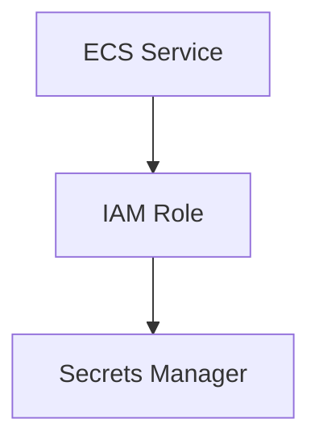

---

#### 第三步：启用访问限制

配置：

* IP 白名单
* 请求速率限制
* 独立环境 Key

---

#### 第四步：加入 Secret 扫描

CI 增加：

```text
git-secrets
```

提交前自动扫描：

* OpenAI Key
* AWS Key
* GitHub Token

---

### 最终效果

24小时内：

* 攻击停止
* 成本恢复

后续半年：

* Secret 泄露事件下降 90%+
* Key 轮换时间缩短到几分钟

这也是现代 AI 公司最常见的安全改造路径。

---

## Part 8：这里容易踩坑

### 错误一：硬编码 API Key

错误代码：

```python
OPENAI_API_KEY = "sk-prod-xxxxxxxx"
```

正确代码：

```python
import os

OPENAI_API_KEY = os.getenv("OPENAI_API_KEY")
```

### 为什么会犯错

开发阶段图省事。

结果：

* Git提交
* 截图传播
* 日志泄露

风险无限放大。

---

### 错误二：提交 .env

错误做法：

```text
git add .
git commit -m "update config"
```

结果：

```text
.env 被提交
```

正确做法：

```text
# .gitignore

.env
```

### 为什么会犯错

很多新人误以为：

> 删除文件就等于删除历史。

实际上：

Git 历史仍然存在。

---

### 错误三：所有环境共用同一个 Key

错误架构：

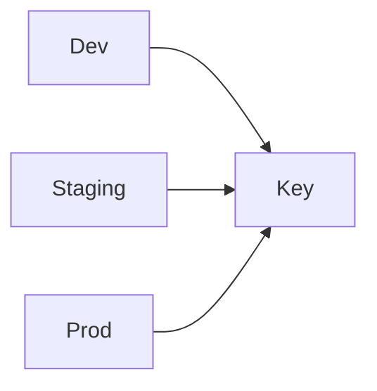

正确架构：

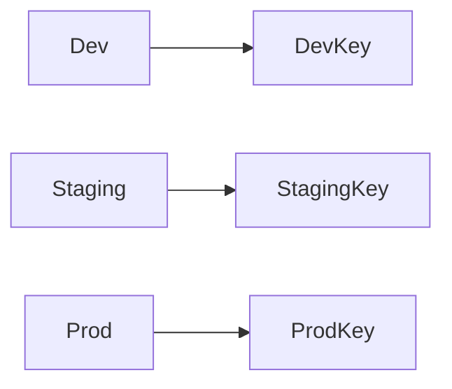

### 为什么会犯错

团队初期追求简单。

后期会发现：

* 无法隔离风险
* 无法单独轮换
* 无法审计来源

这是很多公司成长过程中必须补的课。

---

## Part 9：面试怎么答

### L1：为什么不能把 API Key 写在代码里？

#### 回答框架

* 代码会进入 Git
* Git 历史无法彻底删除
* 日志和截图也会传播
* 应使用环境变量或 .env

面试官关注：

是否理解泄露路径。

---

### L2：为什么生产环境推荐 Secrets Manager 或 Vault？

#### 回答框架

环境变量只能存储。

Secrets Manager 提供：

* 加密
* 审计
* 权限控制
* 自动轮换

因此更适合生产。

面试官关注：

是否理解企业级需求。

---

### L3：发现 Key 泄露怎么办？

#### 回答框架

立即措施：

* 吊销旧 Key
* 创建新 Key
* 分析访问日志

短期措施：

* 限制 IP
* 限制速率

长期措施：

* Secret 扫描
* 自动轮换
* IAM 最小权限

面试官关注：

是否具备事故响应思维。

---

## Part 10：考点速查

### **Secret绝不进入代码库**

进入 Git 的 Secret 默认视为已公开。

---

### **.env 不提交 Git**

提交 `.env.example`。

不要提交真实 `.env`。

---

### **生产使用 Secrets Manager/Vault**

不要依赖手工维护环境变量。

---

### **IAM Role 自动认证**

服务凭身份取钥。

不是凭密码取钥。

---

### **密钥轮换是常态**

轮换能力比密钥本身更重要。

---

## Part 11：必背金句

### [原则]：Secret不进代码库

进入代码库的 Secret 都假设已经公开。

---

### [原则]：最小权限优先

服务只能访问自己需要的 Secret。

---

### [原则]：身份代替密码

使用 IAM Role，不使用硬编码凭证。

---

### [原则]：默认会泄露

设计时假设 Secret 终将泄露。

---

### [原则]：轮换比隐藏更重要

无法快速轮换的 Secret 本身就是风险。

---

## Part 12：快速参考表

| 概念                  | 作用       | 示例值               |
| ------------------- | -------- | ----------------- |
| Secret              | 敏感配置     | OpenAI API Key    |
| .env                | 本地开发存储   | OPENAI_API_KEY    |
| .gitignore          | 防止提交     | .env              |
| GitHub Secrets      | CI/CD存储  | Repository Secret |
| AWS Secrets Manager | 生产级管理    | prod/openai/key   |
| Vault               | 企业级密钥中心  | kv/openai/prod    |
| IAM Role            | 自动认证     | ECS Task Role     |
| Rotation            | 密钥轮换     | 每90天              |
| Masking             | 日志脱敏     | sk-abc...xyz      |
| git-secrets         | Secret扫描 | Commit Hook       |

---

## Part 13：思维导图

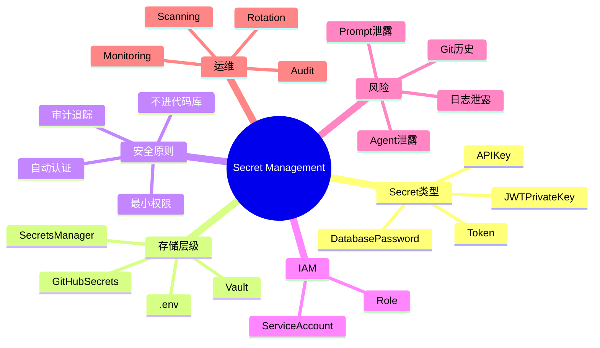

---

## Part 14：本章小结

很多工程师认为 Secret 管理只是把密码放进 `.env`。

真正的 Secret Management 涉及：

* 存储
* 权限
* 审计
* 自动认证
* 密钥轮换

成长路径如下：

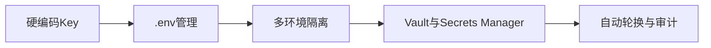

如果你已经理解：

* 为什么 Secret 不能进 Git
* 为什么生产使用 Secrets Manager
* 为什么服务依赖 IAM Role

那么你已经具备 AI 工程体系中的基础安全能力。

---

## Part 15：下一章预告

本章解决了一个关键问题：

> 如何安全存储 Secret？

但新的问题随之出现。

即使 Secret 管理正确，

Agent 仍然可能：

* 调用不该调用的工具
* 访问不该访问的数据
* 获得超出职责范围的权限

换句话说：

Secret 安全了，

权限真的安全吗？

下一章将进入：

**Agent Privilege Escalation（Agent 权限提升）**

你将学习：

* 什么是 Excessive Agency
* Agent 为什么会越权
* Prompt Injection 如何触发权限提升
* 最小权限原则如何落地
* 企业级 Agent 权限隔离架构

从成长路径看：

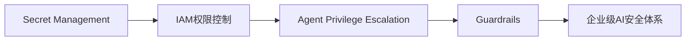

当你掌握 Agent 权限控制之后，才真正开始进入 AI 安全工程的核心领域。